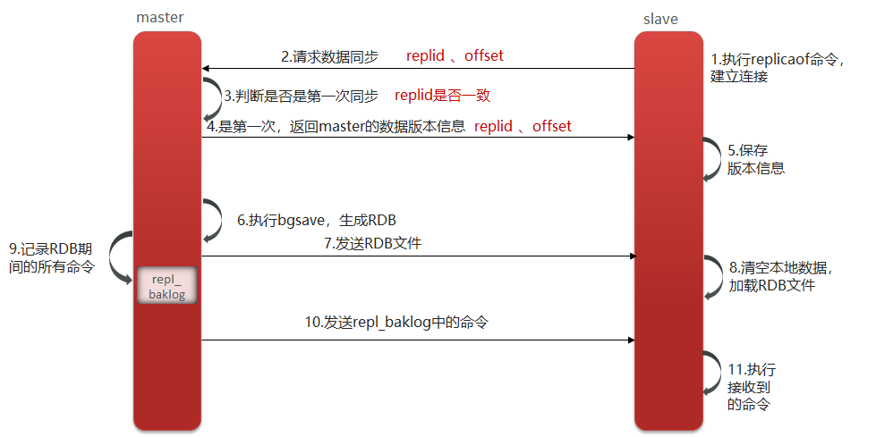
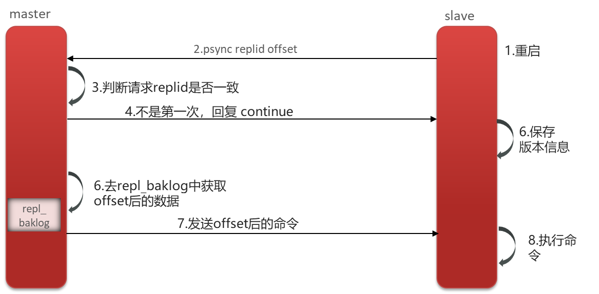

# 图解：Redis主从同步与同步流程

> 原创 已于 2025-06-15 09:54:06 修改 · 公开 · 947 阅读 · 23 · 14 · CC 4.0 BY-SA版权 版权声明：本文为博主原创文章，遵循 CC 4.0 BY-SA 版权协议，转载请附上原文出处链接和本声明。
> 文章链接：https://blog.csdn.net/lyh2004_08/article/details/148666417

**目录**

[TOC]

## 一、Redis的主从同步

> 单节点Redis的并发能力是有上限的，要进一步提高Redis的并发能力，就需要搭建主从集群，实现读写分离。
> 
> 一般都是一主多从，主节点负责写数据，从节点负责读数据。

---

## 二、主从同步数据的流程

###  **1.全量同步** 

> 1. 从节点请求主节点同步数据（replication id、offset）
> 
> 2. 主节点判断是否是第一次请求， **是第一次** 就与从节点同步版本信息（replication id和offset）
> 
> 3. 主节点执行 **bgsave** ，生成 **rdb** 文件后，发送给从节点去执行
> 
> 4.在rdb生成执行期间，主节点会以命令的方式记录到缓冲区（一个日志文件）
> 
> 5.把生成之后的命令日志文件发送给从节点进行同步

#### 图解

 

其中：

> Replication Id：简称replid，是数据集的标记，id一致则说明是同一数据集。每一个master都有唯一的replid，slave则会继承master节点的replid
> 
> offset：偏移量，随着记录在repl_baklog中的数据增多而逐渐增大。slave完成同步时也会记录当前同步的offset。如果slave的offset小于master的offset，说明slave数据落后于master，需要更新

###  **2.增量同步** 

> 1. 从节点请求主节点同步数据，主节点判断 **不是第一次请求** ，就获取从节点的offset值
> 
> 2.主节点从命令日志中获取offset值之后的数据，发送给从节点进行数据同步

#### 图解

 

---

## 三、完整口述

Q： **能说一下，主从同步数据的流程吗？** 

> 主从同步分为了两个阶段，一个是 **全量同步** ，一个是 **增量同步** 。
> 
> 

1. 全量同步是指从节点第一次与主节点建立连接的时候使用全量同步，流程是这样的：
> 
>    1. 第一：从节点请求主节点同步数据，其中从节点会携带自己的replication id和offset偏移量。
> 
>    2. 第二：主节点判断是否是第一次请求，主要判断的依据就是，主节点与从节点是否是同一个replication id，如果不是，就说明是第一次同步，那主节点就会把自己的replication id和offset发送给从节点，让从节点与主节点的信息保持一致。
> 
>    3. 第三：在同时主节点会执行 **`BGSAVE`** ，生成 **RDB** 文件后，发送给从节点去执行，从节点先把自己的数据清空，然后执行主节点发送过来的 **RDB** 文件，这样就保持了一致。
> 
>    4. 当然，如果在 **RDB** 生成执行期间，依然有请求到了主节点，而主节点会以命令的方式记录到缓冲区，缓冲区是一个日志文件，最后把这个日志文件发送给从节点，这样就能保证主节点与从节点完全一致了，后期再同步数据的时候，都是依赖于这个日志文件，这个就是全量同步。
> 
> 

2. 增量同步指的是，当从节点服务重启之后，数据就不一致了，所以这个时候，从节点会请求主节点同步数据，主节点还是判断不是第一次请求，不是第一次就获取从节点的offset值，然后主节点从命令日志中获取offset值之后的数据，发送给从节点进行数据同步。

参考：有关 **RDB** 、 **BGSAVE** ： [Redis的数据持久化](https://blog.csdn.net/lyh2004_08/article/details/148606461) 