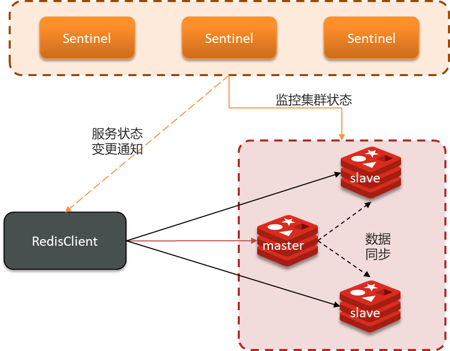
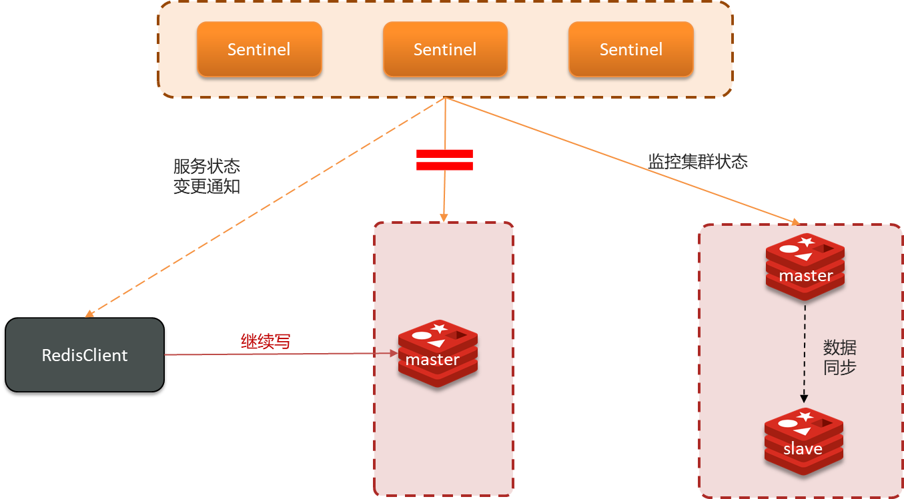

# Redis的哨兵模式与集群脑裂问题

> 原创 已于 2025-06-16 11:25:45 修改 · 公开 · 1k 阅读 · 25 · 8 · CC 4.0 BY-SA版权 版权声明：本文为博主原创文章，遵循 CC 4.0 BY-SA 版权协议，转载请附上原文出处链接和本声明。
> 文章链接：https://blog.csdn.net/lyh2004_08/article/details/148685956

**目录**

[TOC]

##  **一、保证Redis的高并发、高可用的方式** 

1. 搭建主从集群（回顾）： [Redis主从集群及其同步](https://blog.csdn.net/lyh2004_08/article/details/148666417) 

- 实现 **读写分离** ，提高 **并发** 能力

- 提供数据备份

> 2. 引入Redis中的 **哨兵模式** 
> 
> 

- 在主从集群基础上，引入哨兵系统实现 **自动化** 的高可用。

-  **“哨兵”服务** ：独立的进程，负责：
> 
>   -  **监控** ：持续检查主从节点状态。
> 
>   -  **自动故障转移** ：Master宕机时，自动将Slave提升为新的Master。
> 
>   -  **通知** ：将集群状态变化通知客户端。
> 
>   -  **服务发现** ：客户端通过哨兵获取Master地址。
> 
> 

-  **解决问题** ：弥补主从模式下Master故障需要手动干预的不足。

---

## 二、图解哨兵模式

### 1. 哨兵模式解决的问题

虽然 **主从** 复制解决了读写分离和数据备份的问题，但是当 **主节点发生故障** 时，整个系统就无法进行 **写** 操作了，需要手动将一个从节点提升为主节点，这个过程是 **非自动** 的，而且客户端需要知道新的主节点地址才能继续工作。

哨兵模式就是为了解决这个问题而诞生的。它在主从复制的基础上，引入了一个 **哨兵** 系统，来 **自动监控** 主从节点的状态，并在主节点发生故障时， **自动完成故障转移** ，将一个 **从节点提升为新的主节点** ，并通知客户端连接新的主节点。

 

### 2. 哨兵模式的工作流程（简化版）

> 

1. Sentinel基于心跳机制监测服务状态，每隔1秒向集群的每个实例发送PING命令：
> 
>    •主观下线：如果某sentinel节点发现某实例未在规定时间响应，则认为该实例 **主观下线** 。
>    •客观下线：若超过指定数量（quorum，可以自定义）的sentinel都认为该实例主观下线，则该实例 **客观下线** 。quorum值最好超过Sentinel实例数量的一半。
> 

2.  **选举新领导者** ：在客观下线后，哨兵集群会选举出一个领导者Sentinel，由它来负责执行故障转移。

3.  **哨兵选主规则** 
> 
>    1. 首先判断主与从节点断开时间长短，如超过指定值就排该从节点
> 
>    2. 然后判断从节点的slave-priority值，越小优先级越高
> 
>    3. 如果slave-prority一样，则判断slave节点的offset值，越大优先级越高（这里提到的 **`offset`** ，就是我们在之前主从同步流程中提到的 **偏移量（offset））** 
> 
>    4. 最后是判断slave节点的运行id大小，越小优先级越高。
> 
> 

4.  **故障转移** ：
> 
>    - 向新的Master发送命令，使其成为独立的主节点。
> 
>    - 向其他Slave节点发送命令， **让它们复制新的Master** 。
> 
>    - 更新Sentinel自身的配置信息。
> 
> 

5.  **通知客户端** ：Sentinel通知连接它的客户端，Master节点已经切换到新的地址。

6.  **恢复** ：如果原Master节点恢复，它会成为新Master的Slave节点。（但是可能带来 **脑裂** 问题，见下文）

---

## 三、哨兵模式的挑战：脑裂问题及其解决

###  **1.问题描述** 

-  **脑裂** ：由于网络分区等原因，Master节点和Slave节点、Sentinel节点处于不同的网络，导致：

  - Sentinel无法感知到原Master， **选举并提升了一个Slave为新的Master** 。

  - 原Master仍然认为自己是Master，继续接收客户端的写入请求。

  - 客户端可能连接到旧的Master写入数据，新的Master无法同步这些数据。

  - 当网络恢复后，Sentinel会将旧Master降为Slave，并从新Master同步数据，导致旧Master上期间写入的数据丢失。

 

<u>*如上图所示，集群中出现了两个主节点，后续旧主节点会从新主节点同步数据，可能导致其数据丢失*</u> 

---

###  **2.解决方案（缓解** 脑裂带来的数据丢失问题 **）** 

**设置最少的从节点数量** ：设置 **`min-replicas-to-write <number>，`** 表示最少的salve节点为number个

> 解释：
> 
> 

- 在正常的哨兵模式下，Master 连接着多个 Slave 进行数据同步。

- 当发生网络分区导致脑裂时， **旧 Master 可能与大部分或所有 Slave 断开连接** 。

- 如果我们将 **`min-replicas-to-write`** 设置为一个大于 0 的值（例如设置为 1），那么当旧 Master 与 Slave 断开连接后，它连接的 Slave 数量就会少于设定的阈值。

- 此时，旧 Master 会 **拒绝** 客户端的写入请求。

- 这样一来，即使客户端仍然连接到旧 Master，写入操作也会失败，从而 **避免了数据写入到了的旧 Master 上，后续再在主从复制中丢失数据的问题** 。

**缩短主从数据同步的延迟时间** ：设置 **`min-replicas-max-lag <seconds>，`** 表示数据复制和同步的延迟不能超过seconds秒

> 解释：
> 
> 

- 在脑裂期间，旧 Master 可能仍然连接着少数 Slave，但由于网络问题，数据同步会非常慢，导致 Slave 的复制延迟（即从节点落后于主节点的数据量，参考 **主从同步相关** ）会非常大。

- 如果我们将 **`min-replicas-max-lag`** 设置为一个较小的值（例如 10 秒），那么当 Slave 的复制延迟超过这个阈值时，Master 会认为这些 Slave 是不健康的。

- 结合 **`min-replicas-to-write`** 参数，如果连接的健康 Slave 数量（即延迟在阈值内的 Slave 数量）少于 **`min-replicas-to-write`** ， **旧 Master 就会拒绝写入** 。

- 这也 **阻止了在数据同步延迟很高的情况下，旧 Master 仍然接收写入** ，从而减少了数据丢失的风险。

**最终目的** ：通过限制写入，减少在脑裂期间旧Master上写入的数据量，从而降低数据丢失的风险。