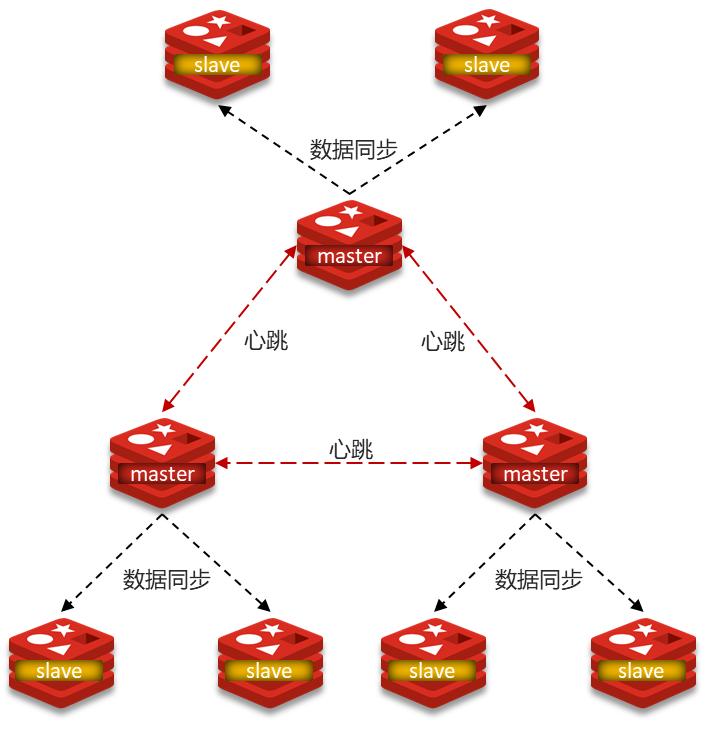
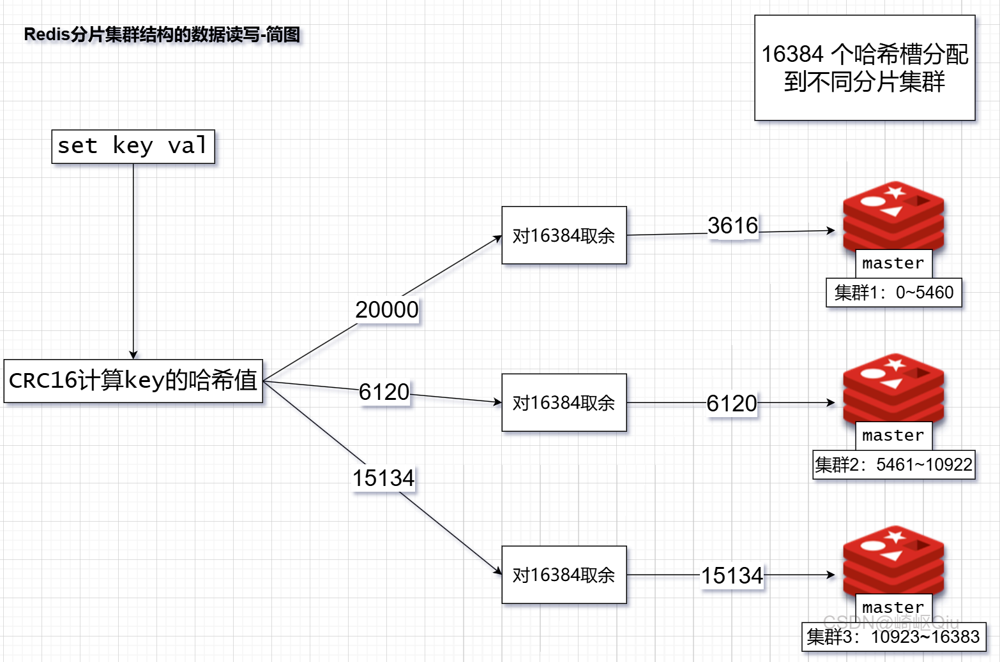

# Redis分片集群、数据读写规则

> 原创 于 2025-06-16 19:00:00 发布 · 公开 · 1.1k 阅读 · 25 · 9 · CC 4.0 BY-SA版权 版权声明：本文为博主原创文章，遵循 CC 4.0 BY-SA 版权协议，转载请附上原文出处链接和本声明。
> 文章链接：https://blog.csdn.net/lyh2004_08/article/details/148689264

**目录**

[TOC]

## 一、分片集群解决的问题

> 尽管 [主从复制](https://blog.csdn.net/lyh2004_08/article/details/148666417) 和 [哨兵模式](https://blog.csdn.net/lyh2004_08/article/details/148685956) 解决了Redis的 **高可用** 和 **高并发读** 的问题，但它们仍然存在两个主要限制：
> 
> 

-  **海量数据存储问题** ：所有数据都存储在一个 Master 节点上，单个节点的内存容量是有限的。当数据量非常大时，一个 Master 节点无法承载。

-  **高并发写的问题** ：所有的写操作都集中在 Master 节点上，单个 Master 节点的写能力是有限的。当写请求非常多时，Master 节点可能会成为瓶颈。

**分片集群** 就是为了正是为了突破解决 **高并发写** 和 **海量数据存储** 上的瓶颈。

---

## 二、分片集群图解

### 分片集群特征

> 

- 集群中有 **多个** **master** ，每个master保存不同数据（每个分片数据是不同的，分片内主从数据是相同的）

- （分片内）每个master都可以有 **多个** **slave** 节点

- （不同分片间）master之间通过ping监测彼此健康状态

- 客户端请求可以访问集群任意节点，最终都会被转发到正确节点

 

### 如何解决的上述问题？（与哨兵模式对比）

| 特征 | 分片集群 | 哨兵模式 |
|:---:|:---:|:---:|
|  **数据分布**  | 数据分散在 **多个 Master 节点** （数据分片） | 所有数据在 **一个 Master 节点** （全量复制） |
|  **解决问题**  |  **海量数据存储、高并发写**  | 高可用、高并发读 |
|  **高可用实现**  | 集群 **内部 Master 节点互相** 协商故障转移 |  **外部独立 Sentinel 集群** 负责故障转移 |
|  **健康监测**  | Master 节点之间互相监测 | Sentinel 监测 Master/Slave |
|  **节点间通信**  | Master 之间通过集群总线，Master 与 Slave 数据同步 | Sentinel 与 Redis 节点，Sentinel 之间 |
|  **客户端连接**  | 连接任意节点，通过重定向找到正确节点 | 通过 Sentinel 获取 Master 地址，直接连接 Master |
|  **复杂性**  | 相对复杂（数据分片、槽管理、数据迁移等） | 相对简单 |

### 使用场景

> 例如，在 **电商、在线课程** 等类型项目中，如果课程数量、用户数量或活动数据量非常庞大，单个 Redis 实例无法承载时，可以考虑使用 **分片集群** ：
> 
> 

-  **存储海量课程信息** ：将不同的课程信息分散到不同的 Master 节点上，例如按照课程ID的哈希值进行分片。

-  **处理高并发的写操作** ：例如在大型促销活动中，用户频繁修改个人信息、购物车等，这些写操作可以分散到不同的 Master 节点上处理，提高整体的处理能力。

---

## 三、分片集群下的数据读写

**面试官** ：你提到分片集群解决了海量数据存储和高并发写的问题，那么它是 **如何决定一个key应该存储在哪个Master节点上的呢** ？

> 答：Redis 分片集群采用 **哈希槽 (Hash Slot)** 的方式来管理数据。整个集群共有 16384 个哈希槽。每个 key 在存储时，会根据其 key 的哈希值计算出一个槽号（通常是 `CRC16(key) % 16384` ）。
> 
>  **集群中的每个 Master 节点负责管理一部分哈希槽。** 客户端根据 key 计算出槽号后，就知道应该去哪个 Master 节点操作这个 key。

### 图示key的存储过程

 

---

## 四、总结及缺点

**分片集群（Redis Cluster）** ：是一种分布式解决方案，它通过将数据分散存储在多个 Master 节点上，来解决 **海量数据存储** 和 **高并发写** 的问题。每个 Master 节点负责一部分数据（通过哈希槽分配），并且可以有自己的 Slave 节点来保证高可用。

>  **缺点和局限性：** 
> 
> 

1.  **集群间通信开销** ：集群之间的心跳检测和数据通信会消耗大量的网络带宽

2.  **对 Lua 脚本和事务支持有限** ：Redis 的 Lua 脚本和事务通常要求操作的 key 都在同一个节点上；在分片集群中，如果一个 Lua 脚本或事务需要操作分布在不同 Master 节点上的 key，将无法执行

3. 维护复杂

4. 数据迁移复杂

5. 客户端复杂

