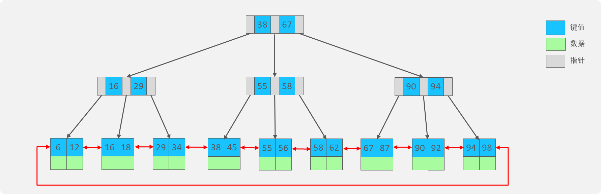
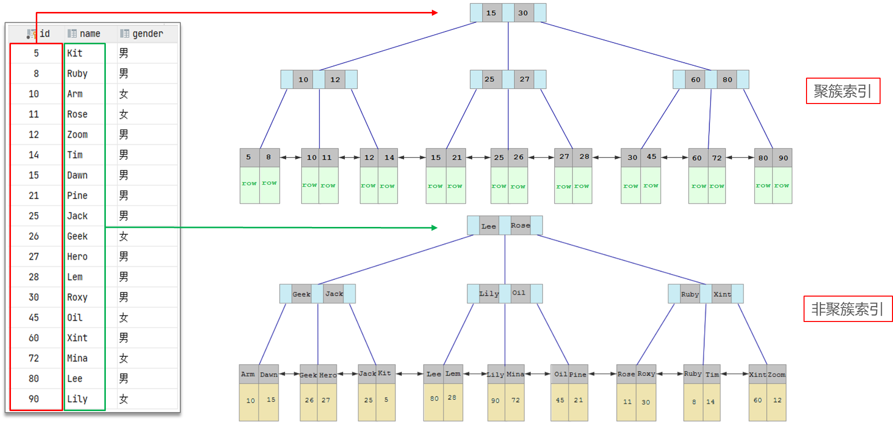
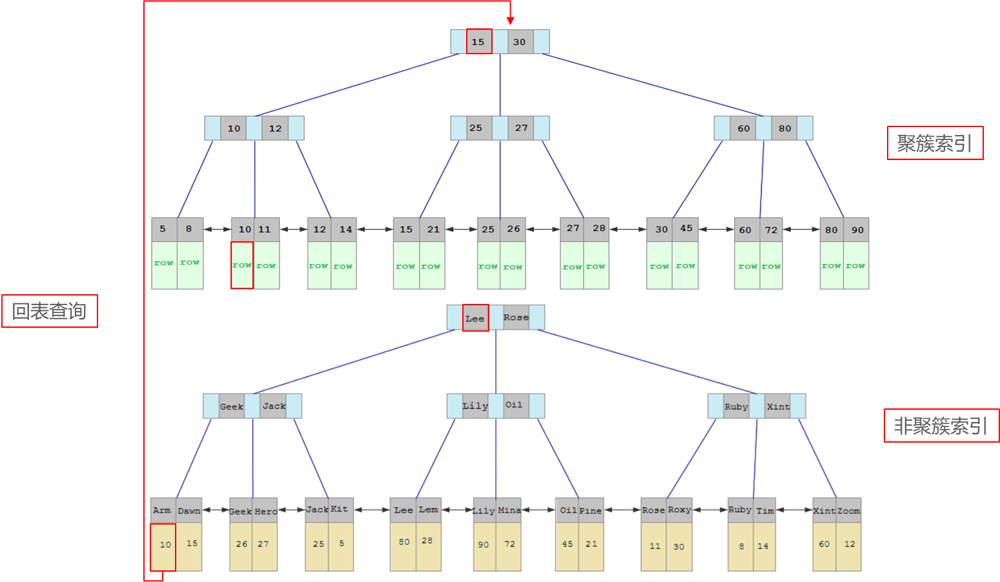

# 【MySQL篇01】：聚簇索引、非聚簇索引必会详解

> 原创 已于 2025-06-19 19:17:15 修改 · 公开 · 1.7k 阅读 · 73 · 14 · CC 4.0 BY-SA版权 版权声明：本文为博主原创文章，遵循 CC 4.0 BY-SA 版权协议，转载请附上原文出处链接和本声明。
> 文章链接：https://blog.csdn.net/lyh2004_08/article/details/148699659

**目录**

[TOC]


## 1. 什么是索引？（高频）

**核心概念：** 索引是一种 **数据结构** ，用于帮助数据库系统高效地查找和检索数据。可以把它想象成书本的目录，通过目录可以快速定位到书本中你需要的内容，而不需要从头到尾翻遍整本书。

>  **作用：** 
> 
> 

-  **提高数据检索效率：** 通过索引，数据库可以避免全表扫描，大大减少查找数据的时间。

-  **降低数据库的 I/O 成本：** 查找数据时，如果使用索引，数据库只需要读取索引数据和少量的数据页，减少了磁盘 I/O 次数。

-  **降低数据排序成本：** 如果查询需要对结果进行排序，而排序字段正好有索引，数据库可以直接使用索引的有序性，避免额外的排序操作。

-  **减少 CPU 消耗：** 排序和查找操作都会消耗 CPU 资源，使用索引可以减少这些操作，降低 CPU 消耗。

---

## 2. 索引的底层数据结构？（高频）

**核心概念：** MySQL的 InnoDB 存储引擎默认使用 **B+ 树（特点是高度低，矮胖）** 作为索引的底层数据结构。

>  **为什么选择 B+ 树？** 
> 
> 

-  **更少的磁盘 I/O：** B+ 树的非叶子节点只存储键值和指向子节点的指针，数据都存储在叶子节点。这样，每个节点可以存储更多的键值，从而降低了树的高度，减少了磁盘 I/O 次数。

-  **更适合范围查询：** B+ 树的 **叶子节点之间通过双向链表连接** ，可以非常方便地进行范围查询和扫描。

-  **查询效率更稳定：** 所有查询都需要从根节点出发，最终到达叶子节点获取数据，所以查询路径长度基本相同，查询效率相对稳定。

-  **非叶子节点不存储数据：** 这使得非叶子节点可以存储更多的索引项，进一步降低树的高度。

- B+ 树概念图：```sql
>          [Key1,  Key2]
>          /          \
>      [Key3]       [Key4]
>       /  \          /  \
>   [Data1][Data2][Data3][Data4] (叶子节点，双向链表连接)
>   ```
> 
> 

-  
> 
> 

**拓展：与 B 树对比** 
> 
> 
> 
> | 特征 | B+ 树 | B 树 |
> |:---:|:---:|:---:|
> | 数据存储位置 | 数据只存储在叶子节点 | 非叶子节点和叶子节点都存储数据 |
> |  **非叶子节点**  | 只存储键值和指针 | 存储键值和数据 |
> |  **叶子节点**  | 存储键值和数据，通过 **双向链表** 连接 | 存储键值和数据，无双向链表连接 |
> | 范围查询效率 | 较高，通过叶子节点的双向链表直接扫描 | 相对较低，需要通过非叶子节点查找数据 |
> | 查询效率 | 稳定，所有查询都到叶子节点 | 不稳定，数据可能在非叶子节点或叶子节点 |

---

## 3. 什么是聚簇索引和非聚簇索引？（核心概念，高频）

聚簇索引和非聚簇索引是根据索引和数据存储方式的不同来划分的。

> ###  **聚簇索引** 

-  **特点：** 数据与索引存储在一起。B+ 树的叶子节点直接存储了 **整行数据** 。

-  **数量：** 一个表必须 **有，且只能有一个** 聚簇索引。

-  **构成：** 通常是表的主键。如果表没有主键，InnoDB 会选择一个唯一的非空索引作为聚簇索引。如果也没有这样的索引，InnoDB 会隐式地生成一个隐藏的聚簇索引。

###  **非聚簇索引** 

-  **特点：** 数据与索引分开存储。B+ 树的叶子节点存储的是索引列的值和对应记录的 **主键值** 。

-  **数量：** 一个表可以有多个非聚簇索引。

-  **构成：** 除了主键之外的其他索引，例如普通索引、唯一索引、联合索引等。

###  **概念图** 

```sql
1.聚簇索引：
       [主键1, 主键2]
       /          \
    [主键3]        [主键4]
    /  \           /  \
[数据1][数据2] [数据3] [数据4] (叶子节点，存储整行数据)
 
2.非聚簇索引：
       [索引值A, 索引值B]
       /              \
    [索引值C]        [索引值D]
    /  \              /  \
[主键1][主键2]    [主键3] [主键4] (叶子节点，存储索引值和对应主键值)
```

###  **示例图** 

>  **对主键id建立聚簇索引，叶子结点为一行数据；对姓名name建立非聚簇索引，叶子节点为对应的行的主键值（即id）** 

 

---

## 4. 什么是回表查询？（高频）

**核心概念：** 回表查询是指通过 **非聚簇索引** 查找到对应记录的 **主键值** 后，再利用这个主键值去聚簇索引中查找整行数据的过程。

**发生场景：** 当使用非聚簇索引进行查询，并且需要 **获取除了索引列和主键列之外的其他列** 数据时，就会发生回表查询。

>  **例如** ：在执行sql语句：
> 
> ```sql
> select * from user where name = "Arm";
> ```
> 
> 的时候，由于对姓名这一列建立了 **非聚簇索引（它的叶子结点不是存储整行数据，而是存储本行的主键值）** ，先从非聚簇索引中按照姓名，获取到Arm的主键，然后再到聚簇索引中 **根据主键** 访问 **叶子结点** ，拿到 **一整行数据** ，该查询过程称为“ **回表查询** ”。

 

>  **过程总述：** 
> 
> 

1. 数据库通过非聚簇索引的 B+ 树，根据查询条件查找到匹配的叶子节点。

2. 叶子节点存储了索引列的值和对应记录的 **主键值** 。

3. 数据库获取到主键值后，再 **通过主键值去聚簇索引的 B+ 树中查找对应的叶子节点** 。

4. 聚簇索引的叶子节点存储了整行数据，数据库获取到完整数据并返回。

---

## 5. 深度拓展，举一反三

**Q：** 你刚才提到了聚簇索引和非聚簇索引，能详细解释一下为什么一个表只能有一个聚簇索引，而可以有多个非聚簇索引吗？

>  **答：** 好的。聚簇索引的特点是数据和索引存储在一起，它的叶子节点存储的是整行数据。数据在磁盘上的物理存储顺序是按照聚簇索引的顺序来排列的。如果一个表有多个聚簇索引，那么 **数据就需要按照多个不同的顺序存储** ， **这是不可能实现的** 。数据只能有一种 **物理存储顺序** 。
> 
> 而非聚簇索引的叶子节点存储的是索引值和主键值。它只是一个 **指向数据行的“指针”** （通过主键值），数据本身并不存储在非聚簇索引的叶子节点中。因此，我们可以根据不同的列创建多个非聚簇索引，每个非聚簇索引都指向同一份数据，而不会影响数据的物理存储顺序。

**Q：** 在什么情况下，即使使用了非聚簇索引，查询也不需要回表呢？

>  **答：** 这种情况发生在使用了 **覆盖索引** 的时候。覆盖索引是指一个 **非聚簇索引包含了查询语句中所有需要查询的列** 。在这种情况下，数据库可以直接从非聚簇索引的叶子节点中获取到所有需要的字段值，而无需再通过主键去聚簇索引中查找整行数据，从而避免了回表查询。
> 
> 例如，如果我在 `user` 表的 `phone` 和 `name` 字段上创建了一个联合索引 `(phone, name)` 。当我的查询语句是 `SELECT phone, name FROM user WHERE phone = 'xxx'` 时，数据库就可以直接通过 `(phone, name)` 这个联合索引获取到 `phone` 和 `name` 的值， **无需回表** 。

---

##  **6. 其他索引类型** 

>  **补充： [索引体系简单总结](https://blog.csdn.net/lyh2004_08/article/details/148773260)** 