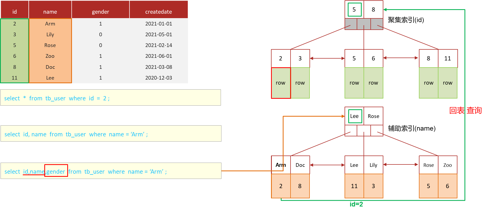

# 【MySQL篇02】超大分页优化：利用覆盖索引子查询

> 原创 已于 2025-06-17 14:46:38 修改 · 公开 · 267 阅读 · 5 · 3 · CC 4.0 BY-SA版权 版权声明：本文为博主原创文章，遵循 CC 4.0 BY-SA 版权协议，转载请附上原文出处链接和本声明。
> 文章链接：https://blog.csdn.net/lyh2004_08/article/details/148710927

**目录**

[TOC]


*前置知识： [索引（聚簇索引、非聚簇索引 以及回表查询）](https://blog.csdn.net/lyh2004_08/article/details/148699659)* 

## 1.覆盖索引

> 

-  **覆盖索引** 是指 查询使用了索引，并且需要返回的列，在该索引中已经全部能够找到 。

-  **覆盖索引不是一种独立的索引类型，而是一种利用现有索引的** 现象 **或** 查询优化<span style="color:#fe2c24">策略</span> **。** 

### <span style="color:#262626">场景图例</span>

 

> ●由于根据 id 的 **聚簇索引** ，可以在叶子结点查到一整行数据，也就是“ **select *** ”，所以这条SQL会触发 **覆盖索引** ：
> 
> ```sql
> select * from tb_user where id = 2 ;
> ```
> 
> ●由于根据 name 的 **非聚簇索引** ，可以查到姓名本身和叶子结点所存储的 **主键值** ，在这里就是id，所以也会触发 **覆盖索引** ：
> ```sql
> select  id, name  from  tb_user  where  name = "Arm" ;
> ```
> 
> ●但是这条 SQL 中的 **gender** ，在 name 的非聚簇索引的叶子结点中 **不存在** ，所以会拿到主键值，根据聚簇索引进一步查询整行数据，从而得到 gender （该过程也称为 **回表查询** ）:
> 
> ```sql
> select  id, name, gender  from  tb_user  where  name = "Arm" ;
> ```

---

## 2. 优化超大分页查询

###  **超大分页查询** 

> ```sql
> select * from tb limit 9000000, 10;
> ```
> 
> 当在进行分页查询时，如果执行 **<span style="color:black">limit 9000000,10</span>** <span style="color:black">，此时需要</span><span style="color:black">MySQL</span><span style="color:black">排序前</span> **<span style="color:black">9000010</span>** <span style="color:black">记录，仅仅返回</span><span style="color:black">9000000 - 9000010</span>的记录，其他记录丢弃， **查询排序** 的代价非常大

###  **<span style="color:#262626">优化思路</span>** 

> <span style="color:#262626">一般分页查询时，通过创建</span><span style="color:#c00000">覆盖索引</span><span style="color:#262626">能够比较好地提高性能，可以通过</span><span style="color:#c00000">覆盖索引</span><span style="color:#262626">加</span><span style="color:#c00000">子查询</span><span style="color:#262626">形式进行优化</span>
> 
> ```sql
> select *
> from tb t,
>      (select id from tb order by id limit 9000000,10) a
> where t.id = a.id;
> ```
> 
> 其中： **<span style="color:#0033b3">select</span><span style="color:#871094">id</span><span style="color:#0033b3">from</span><span style="color:black">tb_sku</span><span style="color:#0033b3">order by</span><span style="color:#871094">id</span><span style="color:#0033b3">limit</span><span style="color:#1750eb">9</span><span style="color:#1750eb">000000</span><span style="color:#080808">,</span><span style="color:#1750eb">10</span>** 子查询实现了 **覆盖索引** （排序条件是id，返回字段也是id），大大提高了查询排序的效率