# 【MySQL篇04】：SQL优化核心知识体系

> 原创 于 2025-06-18 09:00:00 发布 · 公开 · 680 阅读 · 23 · 22 · CC 4.0 BY-SA版权 版权声明：本文为博主原创文章，遵循 CC 4.0 BY-SA 版权协议，转载请附上原文出处链接和本声明。
> 文章链接：https://blog.csdn.net/lyh2004_08/article/details/148724923

**文章目录**

[TOC]

## 一、建表优化

|  **原则**  |  **示例/解释**  |
|:---:|:---:|
|  **字段类型最小化**  |  `TINYINT` 存状态值， `INT` 存ID， `BIGINT` 存订单号 |
|  **字符类型精确化**  |  `CHAR(11)` 存手机号， `VARCHAR(100)` 存地址 |
|  **大字段分离**  | 主表存核心字段， `TEXT/BLOB` 存扩展表 |

*参考《嵩山版》开发手册* 

---

## 二、索引优化（附原理图解）

**重点：** 

1.  **最左前缀原则** 
    `INDEX(a,b,c)` 可优化 `WHERE a=?` 、 `WHERE a=? AND b=?` ，但无法优化 `WHERE b=?` 

2.  **覆盖索引优势** 
   查询列全在索引中 → 无需回表（如 `SELECT id,name FROM users WHERE age>18` 对 `(age,name)` 索引）

3.  **索引失效场景** 

   - 对索引列计算： `WHERE YEAR(create_time)=2023` 

   - 隐式类型转换： `WHERE phone=13800138000` （phone为字符串）

---

## 三、SQL语句优化

|  **优化点**  |  **正确写法**  |  **错误写法**  |  **原理**  |
|:---:|:---:|:---:|:---:|
|  **避免SELECT ***  |  `SELECT id,name`  |  `SELECT *`  | 减少网络传输，避免回表 |
|  **UNION ALL替代UNION**  |  `SELECT ... UNION ALL SELECT ...`  |  `UNION`  | 省去去重开销 |
|  **[LIMIT超大分页优化](https://blog.csdn.net/lyh2004_08/article/details/148710927)**  |  `WHERE id>10000 LIMIT 10`  |  `LIMIT 10000,10`  | 避免全表扫描 |
|  **连接查询驱动表**  |  **小表驱动大表** （简析见下文） | 大表驱动小表 | 减少外层循环次数 |

---

## 简析：为什么小表驱动大表更快？

> 

1.  **减少扫描行数** ：
>    数据库执行 `JOIN` 时，需要遍历驱动表的每一行，然后去被驱动表查找匹配行。小表行数少，遍历开销小。

- 公式简化：查询成本 ≈ 驱动表扫描成本 + (驱动表行数 × 被驱动表查找成本)。

- 示例：小表100行，大表10,000行。小表驱动：成本 ≈ 100次扫描 + 100 × (大表单次查找)。大表驱动：成本 ≈ 10,000次扫描 + 10,000 × (小表单次查找)——后者成本高得多。

1.  **利用索引加速** ：
>    如果被驱动表（大表）的连接字段有索引，数据库能快速定位匹配行（O(log n) 时间）。小表驱动时，每次查找都高效；反之，如果大表驱动，扫描次数多，即使小表有索引，也浪费在重复扫描上。

2.  **减少内存和I/O开销** ：
>    小表更容易放入内存（如MySQL的join buffer），减少磁盘I/O。大表驱动可能导致频繁磁盘访问。

3.  **优化器自动选择** ：
>    现代数据库（如MySQL）的优化器会基于统计信息自动选择驱动表（小表优先），但开发者应手动优化SQL以确保性能（如用小表写在 `JOIN` 左侧）。

---

## 四、架构级优化

|  **方案**  |  **适用场景**  |
|:---:|:---:|
|  **主从复制、读写分离**  | 读多写少（如资讯类应用） |
|  **分库分表**  | 单表超千万数据（如订单表） |

---

## 五、 总结

-  **SQL优化经验概览** 

  > 

  -  **建表优化** ：选择合适字段类型（如数值型用TINYINT/INT，字符串用VARCHAR）。

  -  **索引优化** ：基于查询频率创建索引，避免索引失效。

  -  **SQL语句优化** ：避免 `SELECT *` ，优先用 `UNION ALL` 代替 `UNION` ，表关联时优先 `INNER JOIN` 并小表驱动。

  -  **架构优化** ：数据量大时用主从复制、读写分离或分库分表。

-  **建表优化细节** 

  > 参考《嵩山版》开发手册：
  > 
  > 

  - 数值字段选最小适用类型（如年龄用TINYINT，ID用BIGINT）。

  - 字符串字段用VARCHAR节省空间，避免TEXT除非必要。

  - 添加注释和约束（如NOT NULL）提高可读性和性能。

-  **索引优化原则** 

  > 

  - 只为高频查询字段建索引。

  - 用复合索引覆盖查询（避免回表）。

  - 避免在索引字段上计算或函数操作（如 `WHERE YEAR(date) = 2023` 会失效）。

  - 限制索引数量（过多索引降低写性能）。

-  **SQL语句优化实践** 

  > 

  - 显式指定字段名（ `SELECT id, name` 而非 `SELECT *` ）。

  - 避免索引失效写法（如 `LIKE '%prefix'` 或类型不匹配）。

  - 聚合查询用 `UNION ALL` （省去去重开销）。
  >   ame `而非` SELECT *`）。

  - 避免索引失效写法（如 `LIKE '%prefix'` 或类型不匹配）。

  - 聚合查询用 `UNION ALL` （省去去重开销）。

  - 表关联时：优先 `INNER JOIN` ，并以 **小表作为驱动表** 提升性能。

