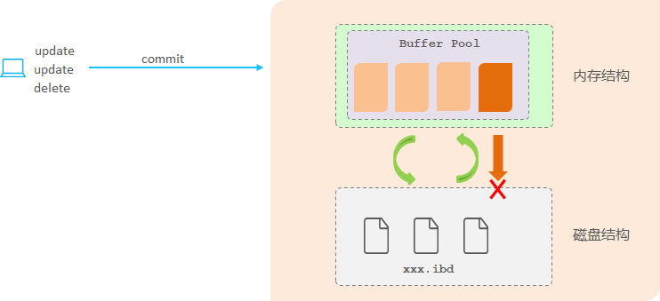

# 【MySQL篇07】：redo log日志与buffer pool详解

> 原创 于 2025-06-20 14:39:27 发布 · 公开 · 1.2k 阅读 · 30 · 22 · CC 4.0 BY-SA版权 版权声明：本文为博主原创文章，遵循 CC 4.0 BY-SA 版权协议，转载请附上原文出处链接和本声明。
> 文章链接：https://blog.csdn.net/lyh2004_08/article/details/148792052

**文章目录**

[TOC]


## 1. Buffer Pool 缓冲池

首先，需要理解一个核心问题： **数据库的更新操作，直接写到磁盘是非常慢的。** 磁盘是机械设备，读写速度远低于内存。如果每次更新都直接写盘，数据库的性能会非常差。

为了解决这个问题，数据库引入了 **内存缓存** 的概念，也就是图中的 **Buffer Pool (缓冲池)** 。
 

可以把 Buffer Pool 想象成一个高速缓存区，它存储了数据库中经常访问的数据页（数据在磁盘上是以“页”为单位存储的）。

-  **读取数据时：** 如果要读取的数据页已经在 Buffer Pool 中，就直接从内存读取，速度非常快。如果不在，就需要从磁盘加载到 Buffer Pool 中，然后再从 Buffer Pool 中读取。

-  **更新数据时：** 数据库并不会直接将更新后的数据写回磁盘，而是先将更新操作应用到 Buffer Pool 中的数据页上。

## 2. redo log (重做日志)

现在问题来了，如果数据只更新到了 Buffer Pool，还没有写回磁盘，这个时候 **数据库突然崩溃了** ，怎么办？内存中的数据就会丢失，导致数据不一致。

这就是 **redo log (重做日志)** 的作用。

> 可以把 redo log 想象成一个 **操作日志本** ，它记录了数据库的 **所有更新操作** 。
> 
> 

- 当你执行一个更新操作时，InnoDB 存储引擎会先将这个更新操作记录到 **redo log buffer (重做日志缓存)** 中。

- 然后，再将更新应用到 **Buffer Pool** 中的数据页。

 

**这个过程非常重要：先写日志，再更新内存。** 这就是所谓的 **WAL (Write-Ahead Logging，先写日志) 技术** 。

### redo log 的作用：

redo log 的主要作用是 **保证事务的持久性** 。即使数据库崩溃，只要 redo log 中的数据没有丢失，就可以通过回放 redo log 来恢复崩溃前的数据状态。

我们结合图来看整个流程：

```
[应用程序] 
   │
   │ UPDATE user SET balance=200 WHERE id=1
   ▼
[InnoDB引擎]
   ├── 1. 从磁盘加载数据页到 → [Buffer Pool]（内存缓冲区）
   ├── 2. 修改Buffer Pool中的数据（产生脏页）
   ├── 3. 记录物理修改到 → [redo log buffer]（内存）
   └── 4. 提交事务时将redo log刷盘 → [ib_logfile]（磁盘）
        │
        └── 后台线程异步将脏页刷回磁盘数据文件
```

1. 磁盘加载数据放入缓冲池 ：当你需要读取或修改某个数据时，如果它不在 Buffer Pool 中，会先从磁盘加载到 Buffer Pool 中。

2. 直接更新缓存数据 ：更新操作会直接作用于 Buffer Pool 中的数据页。

3. 记录更新信息：同时，这个更新操作的信息会被记录到 `redo log buffer` 中。

4. 清空 `redo log buffer` 刷盘到 redo 日志中： `redo log buffer` 中的内容会定期或在特定时机（比如事务提交时）被刷写到磁盘上的 `redo log` 文件中。

### 为什么需要 redo log buffer？

`redo log buffer` 就像一个临时的缓冲区，用于存放最近的 redo log 记录。先写到 buffer 中比直接写到磁盘更快。当 buffer 满了或者满足其他条件时，才会将 buffer 中的内容批量刷写到磁盘，减少了磁盘 I/O 的次数。

### 什么时候刷盘呢？

redo log buffer 刷盘到磁盘的时机有很多种，包括：

-  **事务提交时：** 这是最常见的刷盘时机，保证了事务的 **持久性** 。

-  **当 redo log buffer 空间不足时：** 如果 redo log buffer 快满了，会强制刷盘。

-  **后台线程定时刷盘：** InnoDB 有 **后台线程** 会定期将 redo log buffer 中的内容刷盘。

-  **正常关闭数据库时：** 关闭数据库之前，会把 redo log buffer 中的内容刷盘。

---

## 3. 总结一下 redo log 和 Buffer Pool 在更新数据时的协同工作

1. 更新操作先写到 `redo log buffer` 。

2. 更新操作应用到 Buffer Pool 中的数据页。

3. redo log buffer 中的内容在合适的时机刷写到磁盘上的 `redo log` 文件。

4. Buffer Pool 中的脏页（被修改过但还没写回磁盘的数据页）会在合适的时机（比如后台线程、Buffer Pool 空间不足等） **刷写到磁盘上** 的数据文件。

通过这种方式，数据库可以在保证数据持久性的同时，提高更新操作的性能，因为大部分更新操作都先在内存中完成。即使发生崩溃，也可以通过 redo log 来恢复数据。

### 关键组件关系图

```
+-------------------+    1.记录操作     +-------------------+
| redo log buffer   | <--------------  | 事务更新请求       |
| (内存日志缓存)    |                   |                   |
+-------------------+                  +--------+----------+
       | 2.刷日志(保证持久性)                     | 3.修改内存数据
       V                                        V
+-------------------+                +----------------------+
| 磁盘 redo log文件  |               | Buffer Pool          |
| (安全存储的操作记录)|               | (内存数据页)          |
+-------------------+                |                      |
       ^                             | 4.标记为脏页          |
       |                             +----------------------+
       |                                        |
       | 5.推进检查点(释放日志空间)               | 6.触发刷盘条件
       |----------------------------------------+
       V                                        V
+-------------------+                +----------------------+
| 磁盘数据文件       | <------------- | 后台线程刷脏页        |
| (最终持久化数据)   |  7.覆盖写数据   | (将脏页内容写入磁盘)  |
+-------------------+                +----------------------+
```

### 刷盘完成后

-  **脏页变干净** ：Buffer Pool 中该页标记为「非脏页」（与磁盘一致）

- 推进检查点 (Checkpoint)

  - 系统记录：「此脏页数据已落盘，其对应的 redo log 记录可被覆盖」

  -  **磁盘 redo log 文件** ：释放旧日志空间（循环复用）
    磁盘一致）

- 推进检查点 (Checkpoint)

  - 系统记录：「此脏页数据已落盘，其对应的 redo log 记录可被覆盖」

  -  **磁盘 redo log 文件** ：释放旧日志空间（循环复用）

