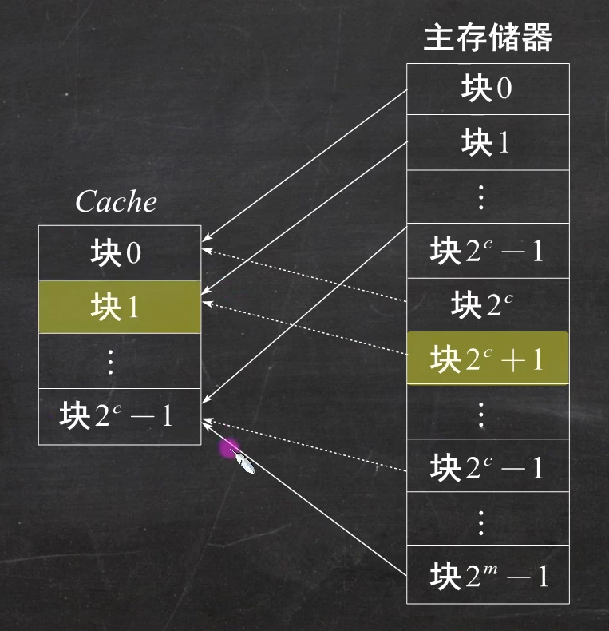
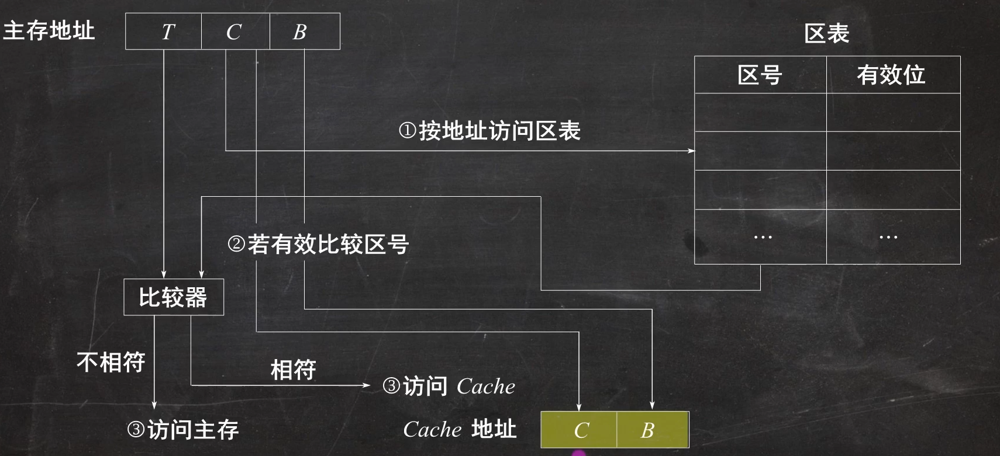
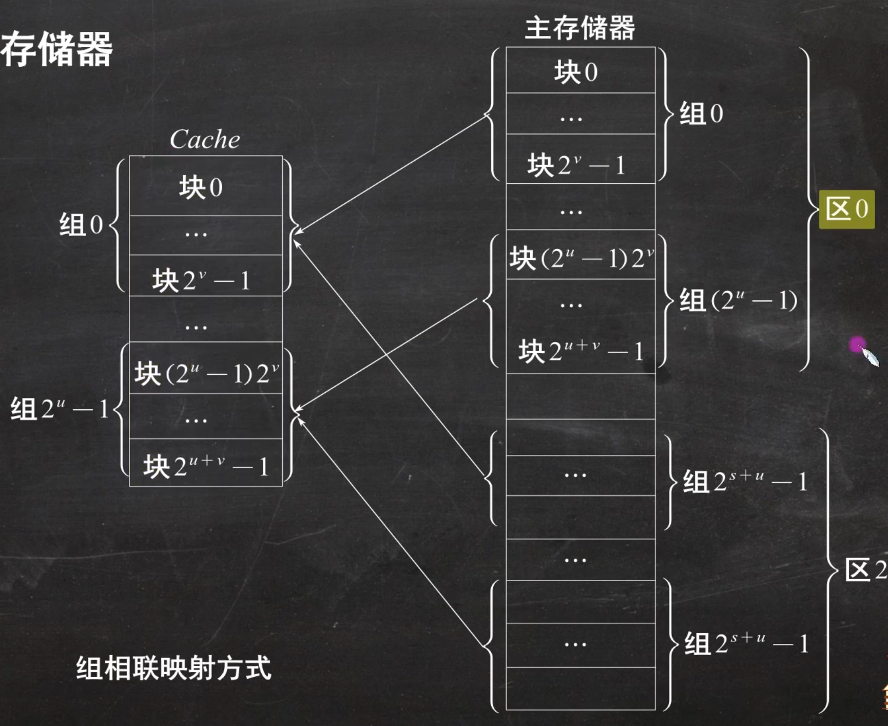
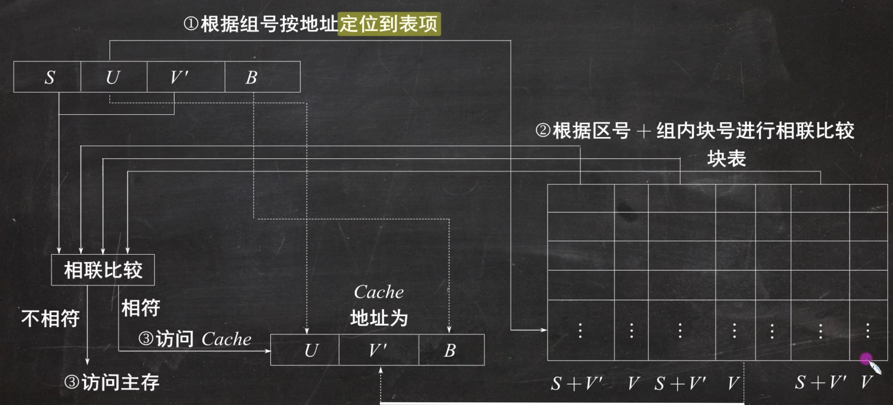
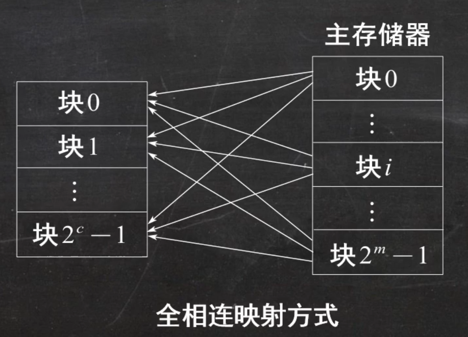
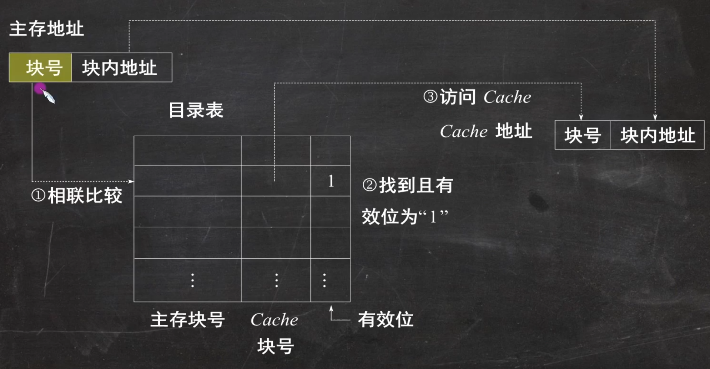

# 【计算机组成原理01】：主存与Cache的地址映射

> 原创 于 2025-06-24 18:05:53 发布 · 公开 · 1k 阅读 · 19 · 10 · CC 4.0 BY-SA版权 版权声明：本文为博主原创文章，遵循 CC 4.0 BY-SA 版权协议，转载请附上原文出处链接和本声明。
> 文章链接：https://blog.csdn.net/lyh2004_08/article/details/148876216

**目录**

[TOC]

**主存** 与 **Cache** 的地址映射方式：全相联映射、直接映射、组相联映射

## 一、直接相联映射及其地址变换

直接地址映射是指主存中的块只能映射到 Cache 中某个固定的块中，主存和 Cache 块的对应关系可用如下公式表示： $$
j = i \mod 2^c
$$（一种类似 **哈希** 的做法）

###  **图示** 

 

### 原理

> 在直接地址映射方式下，主存地址由三部分组成：区号（t 位）、区内块号（c 位）和块内地址（b 位），其中， $$
> m = t + c
> $$。通常用区表来保存主存块与 Cache 块的映射关系。区表中的每个存储字主要包括两个部分；主存区号和有效位。有效位表示区表中的主存块是否已经装入 Cache 中。区表中共有 $$
> 2^c
> $$个存储字。区表通常存放在一个小容量高速存储器中，按地址进行访问。

###  **CPU访问流程** 

 

---

## 二、组相联映射及其地址变换

组相联映射 = 全相联映射 + 直接相联映射。如下图所示，主存和 Cache 的块先进行分组，（主存和 Cache 每组块数相同），在地址映射时，组间为直接相联映射，组内为全相联映射。

### 图示

 

### 原理

> 在上图中，Cache 被分为 $$
> 2 ^ u
> $$组，每组 $$
> 2^v
> $$块；主存中共有 $$
> 2 ^s
> $$个区，每个区有 $$
> 2 ^ u
> $$个组，即共有 $$
> 2^{s + u}
> $$个组。主存中的每个区的第 i 组都只能映射到 Cache 中的第 **i** 组，在组内块采用全相联方式，即每个块都可以映射到 Cache 的第 i 组的任一块。CPU发出的访存地址被分解为：区号 S，组号 U，组内块号 V' 和块内地址 \(B\) 四个部分。而 Cache 的地址可分解为：组号 U，组内块号 V 和块内地址 B 三个部分。下图给出了组相联地址变换方式。

注： **n** 路组相联是指：每组有 n 块。

### CPU访问流程

 

---

## 三、全相联映射及其地址变换

全相联地址映射是指主存中的每一块都可以映射到 Cache 中的任意块，如下图所示。这种映射方法是最灵活的，也是 Cache 利用率最高的一种方式，但同时也是成本最高的一种方式。

### 图示

 

### 原理

> 在全相联映射方式下，主存地址被分为两个部分：高m位表示主存块地址，低b位表示块内地址。同样，Cache的地址也分为两个部分：高c位表示Cache块地址，低b位表示块内地址。通常采用目录表记录主存块之间的映射关系，并将目录表存放在一个相联存储器中。目录表中的每个存储字主要包括三个部分：主存块号、Cache块号和有效位。有效位表示目录表中主存块号和Cache块号建立的映射关系是否有效。目录表共有 $$
> 2^c
> $$个存储字，即 Cache 中每个块对应一个存储字。

### CPU访问流程

 

---

## 四、三种映射方式的对比

三种映射方式中，直接映射的每个主存块只能映射到 Cache 中的某一固定行；全相联映射可以映射到所有 Cache 行；N 路组相联映射可以映射到 N 行。当 Cache 大小、主存块大小一定时：

> ①直接映射的命中率最低，全相联映射的命中率最高。
> 
> ②直接映射的判断开销最小、所需时间最短，全相联映射的判断开销最大、所需时间最长。
> 
> ③直接映射标记所占的额外空间开销最少，全相联映射标记所占的额外空间开销最大。