# 【SpringAI篇01】：5分钟教会你使用SpringAI （1.0.0稳定版）

> 原创 已于 2025-06-26 18:22:15 修改 · 公开 · 1.9k 阅读 · 42 · 38 · CC 4.0 BY-SA版权 版权声明：本文为博主原创文章，遵循 CC 4.0 BY-SA 版权协议，转载请附上原文出处链接和本声明。
> 文章链接：https://blog.csdn.net/lyh2004_08/article/details/148925217

后端开发之 **SpringAI 使用篇01** ：从创建 SpringAI 项目开始，到快速入门实现调用大模型API 实现对话功能（较低代码量+精简教程）。

**目录**

[TOC]


## 1. 创建项目

如下图所示即可，在自己的目录创建 Maven 项目， **JDK 版本最低要使用<span style="color:#be191c">17</span>** 

 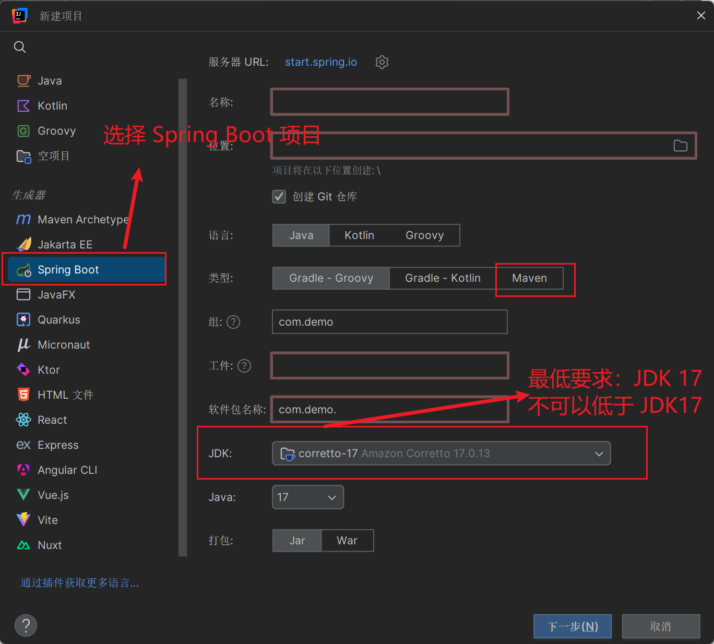

依赖选择：

 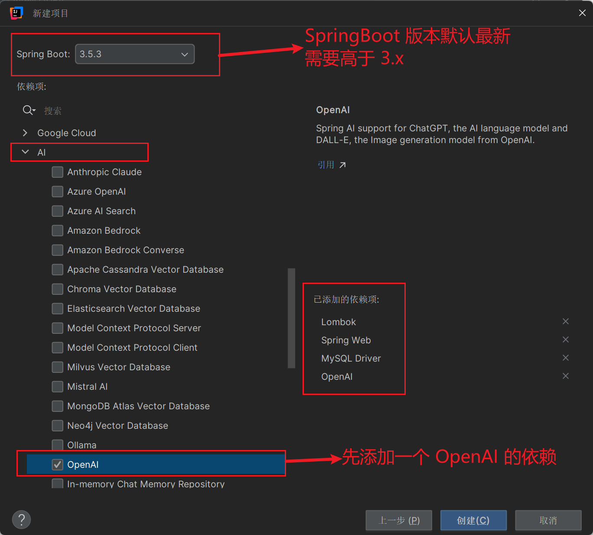

项目自动创建好后，在 pom.xml 中会有这些依赖：

<dependencyManagment>下

```XML
<dependencyManagement>
    <dependencies>
        <!-- 统一管理 SpringAI 相关依赖的版本 -->
        <dependency>
            <groupId>org.springframework.ai</groupId>
            <artifactId>spring-ai-bom</artifactId>
            <version>${spring-ai.version}</version>
            <type>pom</type>
            <scope>import</scope>
        </dependency>
    </dependencies>
</dependencyManagement>
```

<dependencies> 下

```XML
<!-- SpringBoot Web 起步依赖 -->
<dependency>
    <groupId>org.springframework.boot</groupId>
    <artifactId>spring-boot-starter-web</artifactId>
</dependency>
 
…………
 
<!-- OpenAI 模型的启动器依赖 -->
<dependency>
    <groupId>org.springframework.ai</groupId>
    <artifactId>spring-ai-starter-model-openai</artifactId>
</dependency>
```

---

## 2. API Key的准备

在继续之前，我们需要先获取一个兼容 OpenAI 的平台的 ApiKey，这里推荐大家使用阿里的 **百炼** 平台，因为不仅模型众多，还没有繁琐的申请与开通流程，注册账号、认证之后就可以直接使用：[大模型服务平台百炼控制台](https://bailian.console.aliyun.com/#/home) 

先生成个人的 ApiKey，然后打开模型广场，随便选择一个模型，查看详情：

 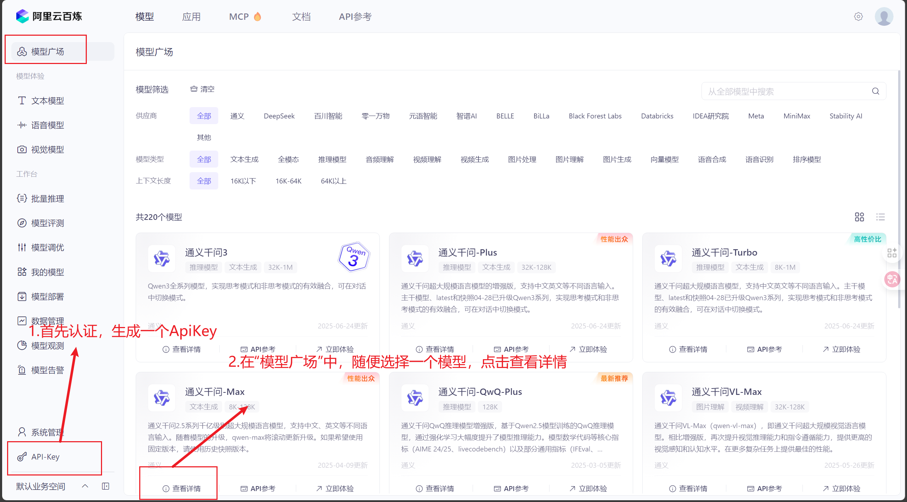

可以看到，每个模型都是自动有免费额度的，在 Code 栏随便复制一个模型名称，如： **qwen-max** 

 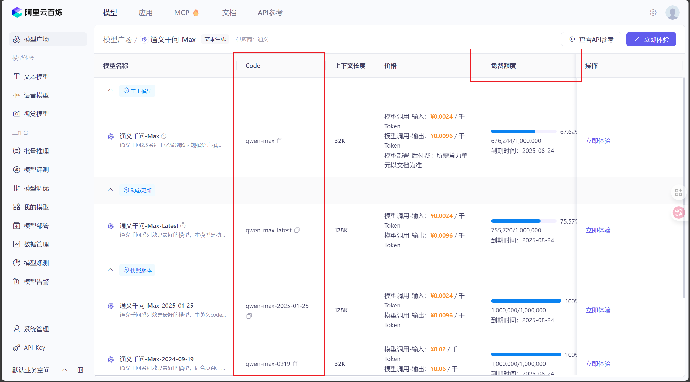

在文档界面，可以看到百炼平台的模型是支持 OpenAI 接口规范的，所以我们之前导入的 OpenAI 的依赖是通用的。

复制文档中的 **base_url 和** 之前的模型名，下面进行 **application.yaml** （或application.properties）的配置

 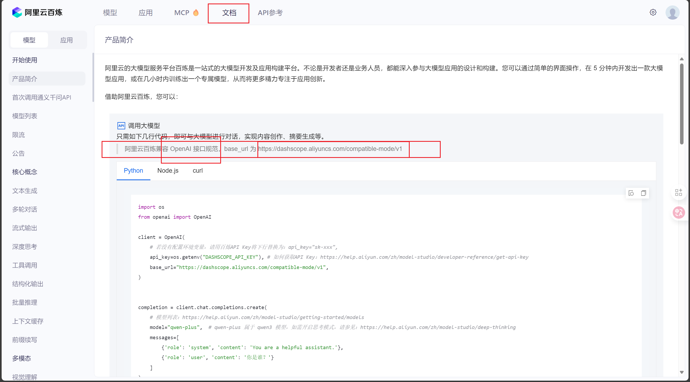

---

## 3. 必要的配置

application.yaml的配置，在 **spring** 的下一级，键入一个 **<span style="color:#be191c">ai</span>** 就可以弹出许多相关的配置：

 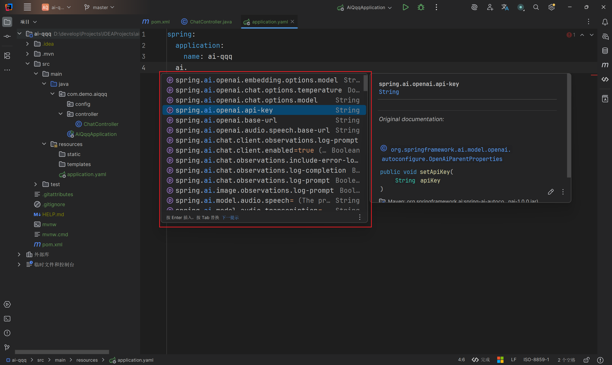

做一些基本的配置 ，最终代码如下：

 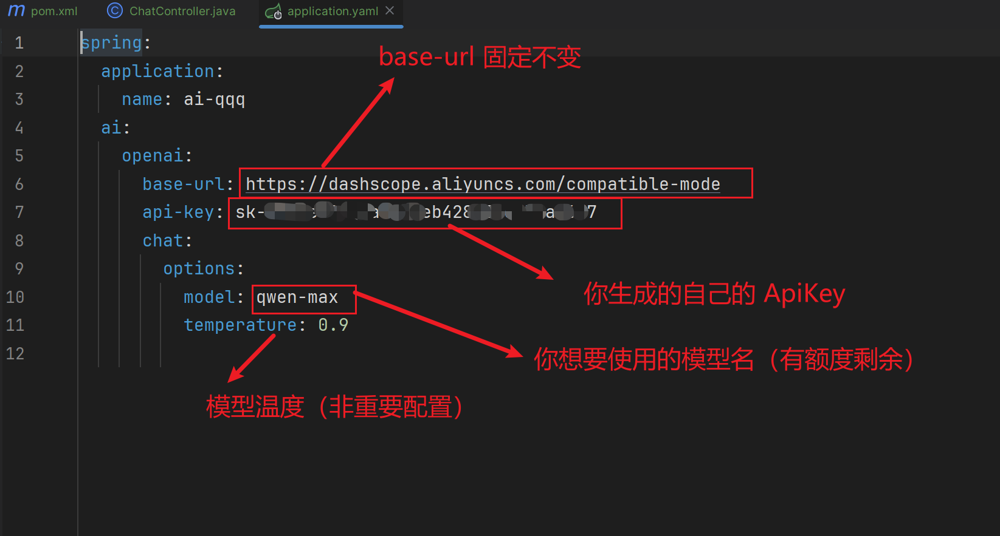

> 当然，若是不想把 ApiKey 直接配置在 yaml 配置文件中，也可以这样，配置在 **环境变量** 中，只需要两步即可：
> 
>  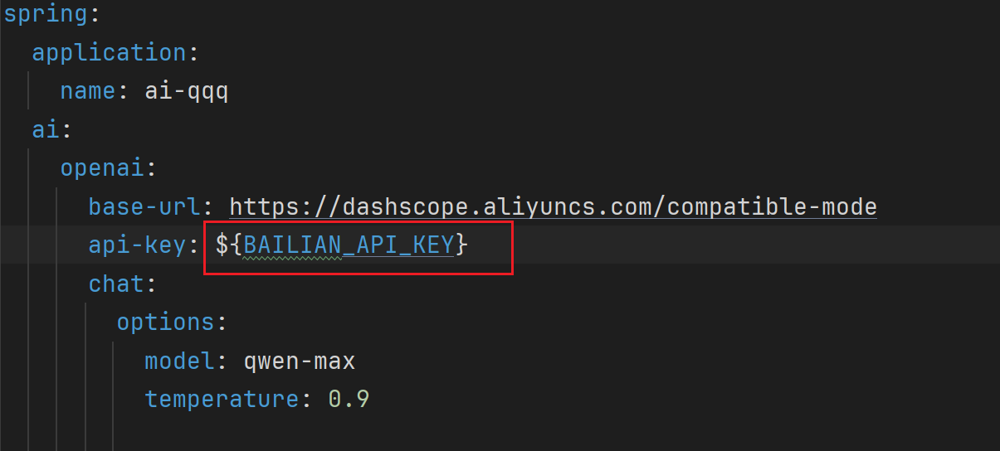

> 
>  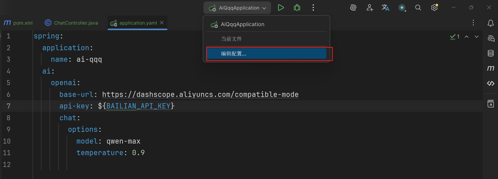

 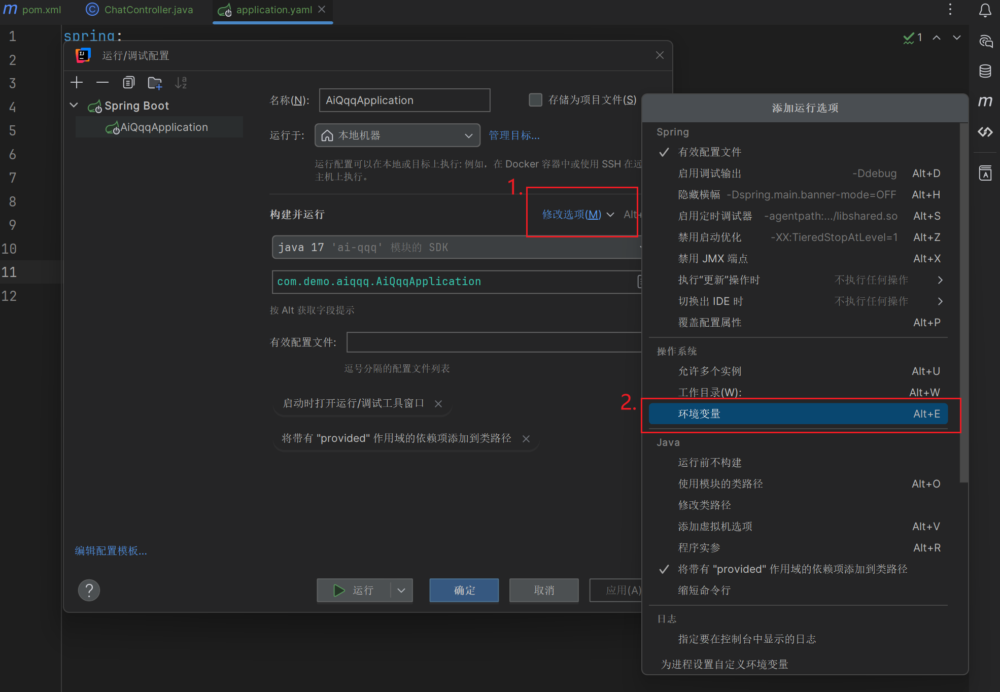

> 
> 然后再弹出的“ **环境变量** ”输入框中，格式为之前在yaml中，使用 **$** 符引用的变量名=ApiKey，将 ApiKey 输入，应用即可
> 
>  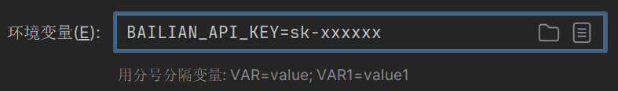

---

## 4. 开始写代码

### 4.1. 配置Bean

我们在项目下建一个config包，创建这样一个配置类，初始化使用指定模型的 **ChatClient** ：

```java
package com.demo.aiqqq.config;
 
import lombok.extern.slf4j.Slf4j;
import org.springframework.ai.chat.client.ChatClient;
import org.springframework.ai.openai.OpenAiChatModel;
import org.springframework.context.annotation.Bean;
import org.springframework.context.annotation.Configuration;
 
/**
 * @Author: qiquqiu
 * @Date: 2025/6/26 15:27
 */
@Slf4j
@Configuration
public class ChatConfig {
 
    /**
     * 普通对话聊天功能的模型
     * @param model 用百炼的qwen-max模型，需要在yaml中做必要配置
     */
    @Bean
    public ChatClient chatClient(OpenAiChatModel model) {
        log.debug("初始化ChatClient...");
        // ChatClient chatClient = ChatClient.create(model); // 简单创建实例
        // 或使用builder创建更高级控制
        return ChatClient
                .builder(model) // 也可以使用ChatClient.Builder，利用build获取ChatClient对象
                .defaultSystem("你是一个和蔼可亲的传统文化文学大师，精通诗词歌赋、琴棋书画，需要帮助用户创作")
                .build();
    }
}
```

其中： **defaultSystem()** 方法，用来设置 **SystemPrompt（系统提示词）** ，一般用来指定大模型的身份，使用限制，范围等等方面

>  **ChatClient** 是一个非常重要的 Bean，后续由它调用大模型；ChatClient 的创建有多种方式，上述代码的注释中给出了一些例子，但是一般均使用 builder 创建更好，能指定更多的高级设置（后面会讲到）

更多拓展可查看 SpringAI 关于这块的 **官方文档** ：[聊天客户端 API ：： Spring AI 参考](https://docs.spring.io/spring-ai/reference/api/chatclient.html) 

### 4.2 使用 ChatClient 向大模型发送请求

创建一个 ChatController，马上就可以实现浏览器的简单访问了：

```java
package com.demo.aiqqq.controller;
 
import lombok.RequiredArgsConstructor;
import lombok.extern.slf4j.Slf4j;
import org.springframework.ai.chat.client.ChatClient;
import org.springframework.web.bind.annotation.PostMapping;
import org.springframework.web.bind.annotation.RequestMapping;
import org.springframework.web.bind.annotation.RestController;
import reactor.core.publisher.Flux;
 
@Slf4j
@RestController
@RequestMapping("/ai")
@RequiredArgsConstructor
public class ChatController {
 
    // 注入上文配置好的 ChatClient
    private final ChatClient chatClient;
 
    /*@RequestMapping("/chat")
    public String chat(String prompt) {
        return chatClient.prompt()
                .user(prompt)
                .call() // 非流式响应
                .content();
    }*/
 
    // produces属性：指定响应的Content-Type和字符集，解析默认的流结果的乱码
    @RequestMapping(value = "/chat", produces = "text/html;charset=utf-8")
    public Flux<String> chat(String prompt) {
        log.debug("用户说：{}", prompt);
        return chatClient.prompt()
                .user(prompt) // 用户输入
                .stream() // 流式响应
                .content();
    }
}
```

注意，这两种方法，一个调用 **call()** ，返回 String，不支持流式响应，一个调用 **stream()** ，返回 Flux<String>，支持流式响应。显然为了达到大模型 **流式输出** 的效果，我们选择后者，如果选择了后者，要添加 **produces = "text/html;charset=utf-8"** 属性，不然响应会是 **乱码** （call()方法调用不需要加）

然后，启动项目，打开浏览器，输入如下地址： **<u>localhost:8080/ai/chat?prompt=你的提问内容</u>** ，回车即可实现请求

### 4.3 效果展示

 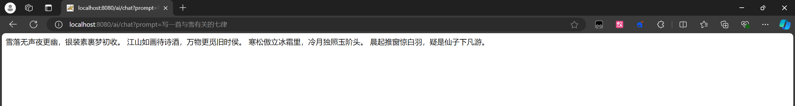

 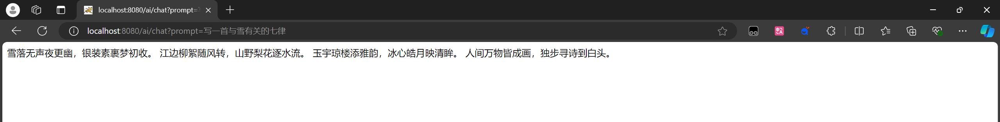

响应过程是 **流式输出** ，说明案例成功了！

---

## 5. [【SpringAI篇02】：对话功能与对话记忆功能](https://blog.csdn.net/lyh2004_08/article/details/148928827) 

