# 【SpringAI篇02】：实现连续对话（上下文记忆功能+会话隔离）

> 原创 已于 2025-06-27 16:40:17 修改 · 公开 · 1.4k 阅读 · 17 · 17 · CC 4.0 BY-SA版权 版权声明：本文为博主原创文章，遵循 CC 4.0 BY-SA 版权协议，转载请附上原文出处链接和本声明。
> 文章链接：https://blog.csdn.net/lyh2004_08/article/details/148928827

 [上一篇【SpringAI篇01】](https://blog.csdn.net/lyh2004_08/article/details/148925217) 我们实现了一个简单的基于直接发送请求的问答功能，但是只能够实现一问一答，没有记忆功能，接下来添加 **上下文对话记忆** 的支持

**目录**

[TOC]


## 1. ChatMemory 的配置

SpringAI 基于 ChatMemory 实现对话的“记忆”，也就是上下文内容的存储、发送请求时候附带

> 

-  `ChatMemory` 表示聊天对话记忆的存储，它提供添加消息到对话、从对话中检索消息以及清除对话历史的方法

- 目前有一个内置实现：MessageWindowChatMemory，它维护一个最多可达到指定最大大小的消息窗口（默认20条消息），当消息数量超过这个限制时，较旧的消息会被移除

- Spring AI 提供了 `ChatMemoryRepository` 的实例用于存储聊天上下文，默认使用 `InMemoryChatMemoryRepository ` 类型实现，将对话直接存储在 **内存** 中

新建一个配置类，用来配置 **ChatMemory** （不想配置也 **可以直接注入使用** ，跳过本段，见下文）：

```java
package com.demo.aiqqq.config;
 
import org.springframework.ai.chat.memory.ChatMemory;
import org.springframework.ai.chat.memory.InMemoryChatMemoryRepository;
import org.springframework.ai.chat.memory.MessageWindowChatMemory;
import org.springframework.context.annotation.Bean;
import org.springframework.context.annotation.Configuration;
 
/**
 * @Author: qiquqiu
 * @Date: 2025/6/26 16:45
 */
@Configuration
public class MemConfig {
 
    /**
     * ChatMemory 聊天对话记忆的存储
     */
    @Bean
    public ChatMemory chatMemory() {
        // 当前版本的 MessageWindowChatMemory 是 ChatMemory 的唯一默认实现类
        // 并且构造器已经私有化，只提供Builder模式来创建实例；这点与之前的版本不一样
        return MessageWindowChatMemory.builder()
                // 对话存储的repository存储库层的实现方式，如果不配置，默认也是 Spring 提供的 InMemoryChatMemoryRepository
                .chatMemoryRepository(new InMemoryChatMemoryRepository()) // 有默认
                .maxMessages(20) // 最大消息数
                .build();
    }
}
```

**`MessageWindowChatMemory`** 的实例同样只能通过 **builder()** 获取，并且需要添加 **`ChatMemoryRepository`** 实现（本例中所有实例化的 bean 都在 SpringAI 有默认实现，可以直接注入）

详细资料可参考：[Chat Memory :: Spring AI Reference --- Chat Memory :: Spring AI Reference](https://docs.spring.io/spring-ai/reference/api/chat-memory.html) 

**`ChatMemoryRepository`** 的其他实现（ **持久化存储** ）

[Chat Memory :: Spring AI Reference --- Chat Memory :: Spring AI Reference](https://docs.spring.io/spring-ai/reference/api/chat-memory.html#_jdbcchatmemoryrepository) 

> * **ChatMemory** 甚至可以不用手动配置该类，直接注入使用即可（SpringAI 有封装默认实现）：
> 
>  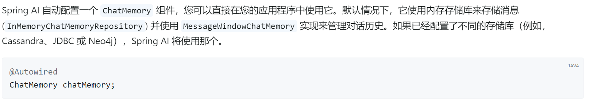

---

## 2. 添加上述配置进入 ChatClient（基于AOP的Advisor机制）

在之前的 ChatConfig 配置类 中，对于默认的 ChatClient 进行更多高级设置，要实现对话记忆功能，就得通过 **SpringAI** 的 **Advisor（顾问）** 机制（底层是基于 **AOP** 实现一个环绕增强的逻辑，这里我们会用即可）

 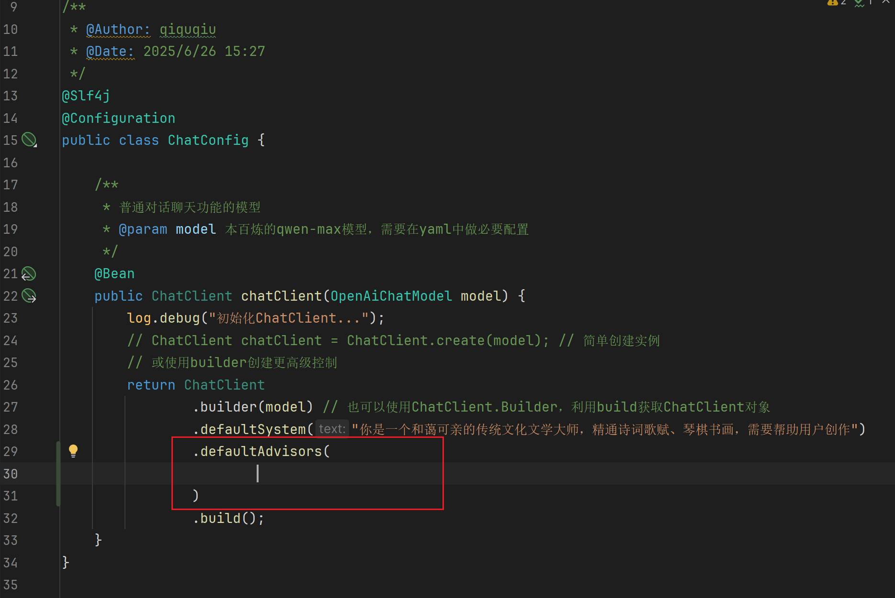

具体的完整代码如下：

```java
package com.demo.aiqqq.config;
 
import lombok.extern.slf4j.Slf4j;
import org.springframework.ai.chat.client.ChatClient;
import org.springframework.ai.chat.client.advisor.MessageChatMemoryAdvisor;
import org.springframework.ai.chat.client.advisor.SimpleLoggerAdvisor;
import org.springframework.ai.chat.memory.ChatMemory;
import org.springframework.ai.openai.OpenAiChatModel;
import org.springframework.context.annotation.Bean;
import org.springframework.context.annotation.Configuration;
 
/**
 * @Author: qiquqiu
 * @Date: 2025/6/26 15:27
 */
@Slf4j
@Configuration
public class ChatConfig {
 
    /**
     * 普通对话聊天功能的模型
     * @param model 百炼的qwen-max模型，需要在yaml中做必要配置
     * @param chatMemory 聊天记忆支持
     */
    @Bean
    public ChatClient chatClient(OpenAiChatModel model, ChatMemory chatMemory) {
        log.debug("初始化ChatClient...");
        return ChatClient
                .builder(model)
                .defaultSystem("你是一个和蔼可亲的传统文化文学大师，精通诗词歌赋、琴棋书画，需要帮助用户创作")
                .defaultAdvisors(
                        new SimpleLoggerAdvisor(), // 添加advisor增强环绕通知：日志记录器
                        MessageChatMemoryAdvisor.builder(chatMemory).build() // 添加聊天记录记忆的环绕增强器
                )
                .build();
    }
}
```

这里添加了两个 Advisor，一个事是用于记录对大模型的请求、响应的详细日志 **SimpleLoggerAdvisor** ，一个就是将我们之前配置的 ChatMemory 聊天记忆添加进去创建 **MessageChatMemoryAdvisor** ，这里同样只能使用 builder 创建实例

注意，这里配置了 **SimpleLoggerAdvisor** 之后，还需要在 yaml 配置文件中修改该类对应的日志级别，不然还是看不见日志效果， **新增** 配置：

 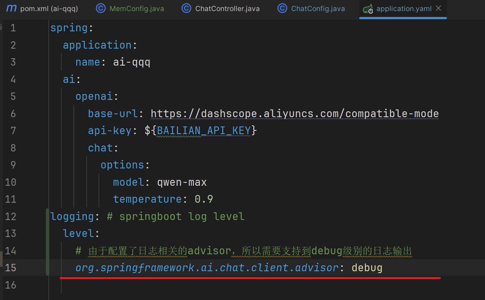

现在，实现会话记忆的功能就实现了 **90%** ，我们可以先启动程序，测试一下

---

## 3. 初步测试和根据会话id区分对话

### 3.1 当前效果演示

项目启动后，我们提问两次，两次提问带有明显的上下文条件，测试结果结果是否生效：

 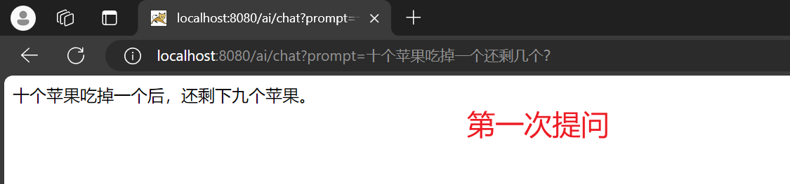

 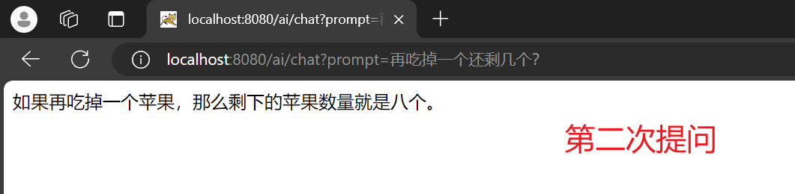

可以明显发现，第二次回答中，大模型是明显附带有最初的“十个苹果”的上下文，所以对话记忆功能已 **基本** 实现（后有改进），并且我们也可以通过控制台日志，看到 **SimpleLoggerAdvisor** 的相关日志输出 **：** 

 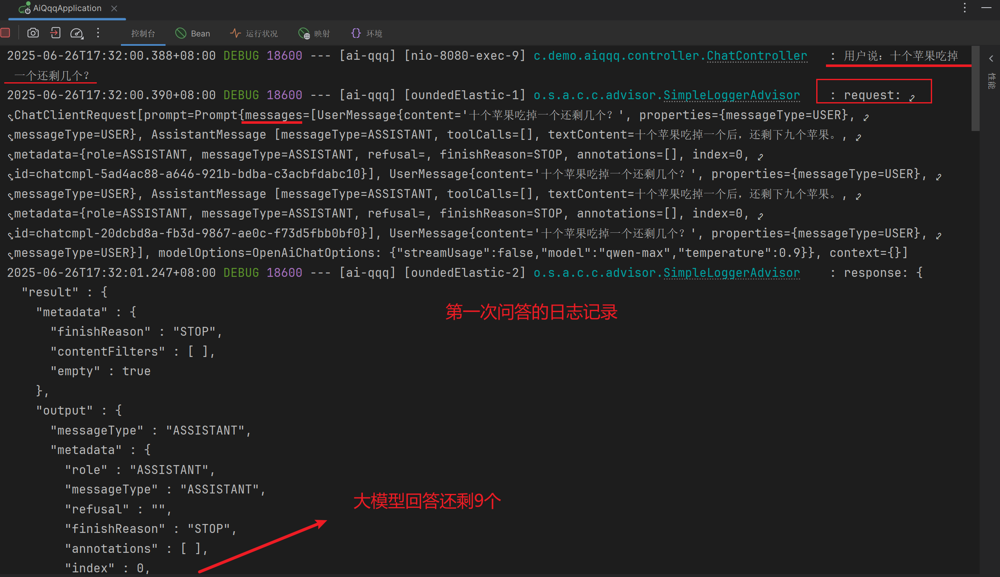

 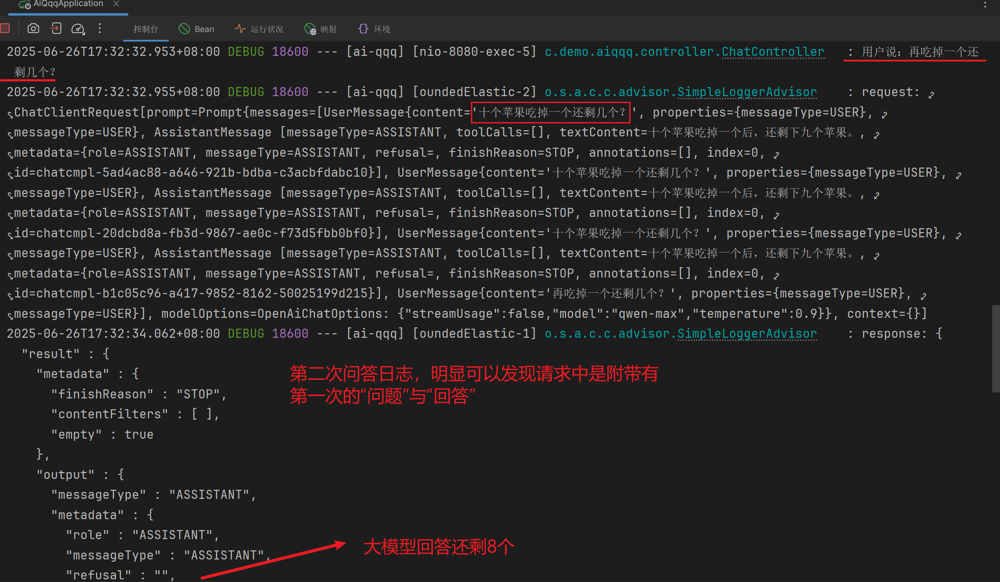

 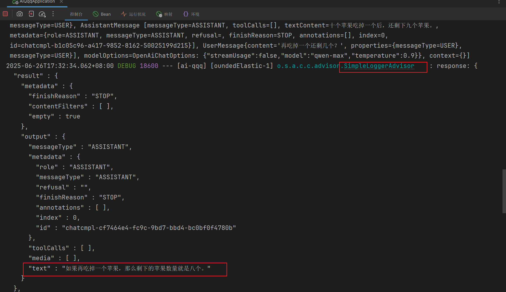

由此可以发现 **SimpleLoggerAdvisor** 的大致原理就是通过 **AOP** 机制，对 SpringAI 与大模型的请求和响应结果做了增强， **将之前的对话内容追加进入，从而实现对话的记忆功能** 

### 3.2 存在的问题及解决

当前初步实现了对话的上下文记忆功能，但是还存在一个严重问题：无法区分对话。

比如，我们在当前已经进行了两次交流的对话的基础上，再开一个浏览器，再进行一次请求：

 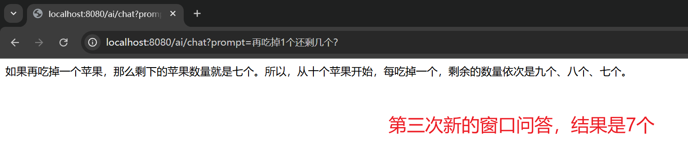

可以看到，即便开启了一个新的浏览器请求还是保留有 **唯一** 的上下文，不能根据 **会话id** 做用户会话的区分

在请求发送前，调用 **advisor()** 方法配置一个 **Consumer** ：

 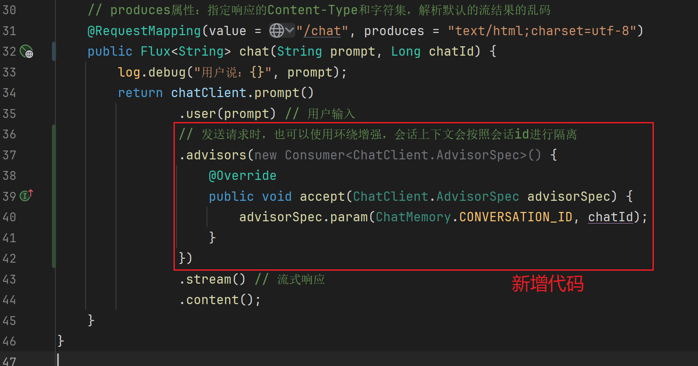

其中 **chatId** 一般为前端传入的唯一的对话id；上述代码整理，以 lambda 表达式简化：

```java
package com.demo.aiqqq.controller;
 
import ……
 
@Slf4j
@RestController
@RequestMapping("/ai")
@RequiredArgsConstructor
public class ChatController {
 
    private final ChatClient chatClient;
 
    // produces属性：指定响应的Content-Type和字符集，解析默认的流结果的乱码
    @RequestMapping(value = "/chat", produces = "text/html;charset=utf-8")
    public Flux<String> chat(String prompt, Long chatId) {
        log.debug("用户说：{}", prompt);
        return chatClient.prompt()
                .user(prompt) // 用户输入
                .advisors(a -> a.param(ChatMemory.CONVERSATION_ID, chatId))
                .stream() // 流式响应
                .content();
    }
}
```

再重新启动项目测试结果如下：

 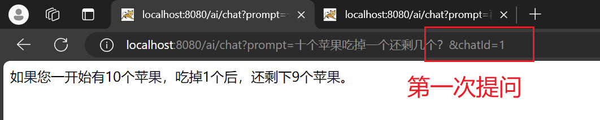

 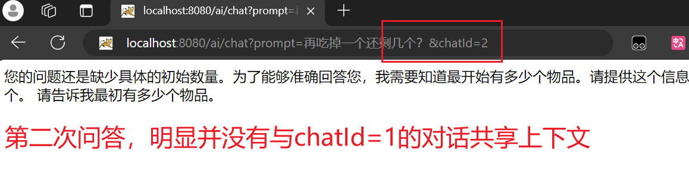

---

## 4. 拓展：持久化

当前所有的聊天记忆全部存储在jvm的内存中，下面提供持久化的简单实现：[【SpringAI篇03】：聊天记录持久化（仍保留上下文）-CSDN博客](https://blog.csdn.net/lyh2004_08/article/details/148951699)