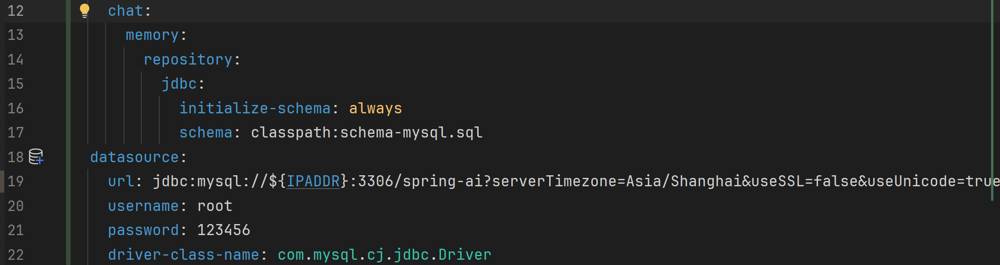

# 【SpringAI篇03】：聊天记录持久化（仍保留上下文）

> 原创 于 2025-06-27 16:35:05 发布 · 公开 · 1.2k 阅读 · 26 · 25 · CC 4.0 BY-SA版权 版权声明：本文为博主原创文章，遵循 CC 4.0 BY-SA 版权协议，转载请附上原文出处链接和本声明。
> 文章链接：https://blog.csdn.net/lyh2004_08/article/details/148951699

上文 [【SpringAI篇02】](https://blog.csdn.net/lyh2004_08/article/details/148928827) ，我们实现了连续对话的上下文记忆功能以及会话隔离，现在我们进一步完善，增加 **<span style="color:#be191c">持久化等</span>** 功能

**目录**

[TOC]


## 1. 默认内存存储方案的分析

我们之前在初始化ChatMemory 的时候，使用的 ChatMemoryRepository 是框架提供的一个基于内存存储的 **InMemoryChatMemroyRepository** （底层是基于 ConcurrentHashMap 实现），虽然实现了上下文，但是不支持持久化：

 

对话数据全部存储在内存中不太好，且 ChatMemory 的默认唯一实现 **MessageWindowChatMemory** 对于消息数量做了一定的限制，一旦在单次会话中消息数量超过限制，就会 **移除旧消息，保留新消息** ，导致未持久化的旧消息丢失：

 

 

> 可以通过下面表格捋清上述提到的类、接口关系（默认使用的实现类）：

|  |  `ChatMemory` (接口) |  `MessageWindowChatMemory` (实现类) |  `ChatMemoryRepository` (接口) |  `InMemoryChatMemoryRepository` (实现类) |
|:---:|:---:|:---:|:---:|:---:|
|  **核心作用**  | 定义了聊天记忆的基本行为，如记住消息、获取消息等。是 **最高层次的抽象** 。 | 实现了 `ChatMemory` 接口，管理聊天记忆，并 **引入了“消息窗口”的概念，限制记忆的消息数量** 。 | 定义了 **对聊天记忆进行 CRUD** (创建、读取、更新、删除) 操作的契约。是低层次的存储 **抽象** 。 | 实现了 `ChatMemoryRepository` 接口，将聊天记忆存储在内存中，不进行持久化。 |
|  **与上下层的关系**  | 被上层（如 `ChatClient` 或自定义业务逻辑）使用。底层通过 `ChatMemoryRepository` 实现。 | 实现了 `ChatMemory` 接口，并依赖于 `ChatMemoryRepository` 来进行实际的数据存储和检索。 | 被 `ChatMemory` 的实现类（如 `MessageWindowChatMemory` ）依赖，提供数据存储服务。可以有多种实现（如数据库、文件等）。 | 实现了 `ChatMemoryRepository` 接口，是 `MessageWindowChatMemory` 默认使用的存储实现。 |
|  **在 SpringAI 中的作用**  | 定义了聊天记忆的抽象，方便不同实现的切换。 | 提供了基于消息窗口的聊天记忆管理策略，是 SpringAI 默认的聊天记忆实现。 | 定义了聊天记忆数据的存储和检索方式，是聊天记忆持久化的基础。 | 提供了最简单的聊天记忆存储方式，适用于开发、测试或不需要持久化的场景。 |


---

## 2. 引入持久化的方式

SpringAI 提供了多种持久化的方式，这里演示 关系型数据库MySQL的操作（也可以自己实现 ChatMemory 持久化到 Redis 中）

### 2.1 依赖项、数据库配置

#### 2.1.1 导入依赖：

```XML
<dependency>
    <groupId>org.springframework.ai</groupId>
    <artifactId>spring-ai-starter-model-chat-memory-repository-jdbc</artifactId>
</dependency>
```

#### 2.1.2 创建表 **SPRING_AI_CHAT_MEMORY** 

>  **或者** 创建名为 **schema-mysql.sql** 的 **.sql** 文件（与后面配置有关），并且放在项目资源目录下，后续通过配置指定自动初始化也可以

```sql
CREATE TABLE IF NOT EXISTS SPRING_AI_CHAT_MEMORY
(
    conversation_id VARCHAR(36) NOT NULL,
    content         TEXT        NOT NULL,
    type            VARCHAR(10) NOT NULL,
    `timestamp`     TIMESTAMP   NOT NULL,
    CONSTRAINT TYPE_CHECK CHECK (type IN ('USER', 'ASSISTANT', 'SYSTEM', 'TOOL'))
);
```

 

> 注意：这一步的 **前提是先配置MySQL<span style="color:#be191c">数据源</span>的四项（自行完成）** 

####  **2.1.3 配置 application.yaml** 

新增yaml部分：

 

**完整** applitcation.yaml：

```sql
spring:
  application:
    name: 你的服务名称
  ai:
    openai:
      base-url: https://dashscope.aliyuncs.com/compatible-mode
      api-key: ${BAILIAN_API_KEY}
      chat:
        options:
          model: qwen-max
          temperature: 0.9
    chat:
      memory:
        repository:
          jdbc:
            initialize-schema: always
            schema: classpath:schema-mysql.sql
  datasource:
    url: jdbc:mysql://${IPADDR}:3306/spring-ai?serverTimezone=Asia/Shanghai&useSSL=false&useUnicode=true&characterEncoding=utf-8&zeroDateTimeBehavior=convertToNull&transformedBitIsBoolean=true&tinyInt1isBit=false&allowPublicKeyRetrieval=true&allowMultiQueries=true&useServerPrepStmts=false
    username: root
    password: 123456
    driver-class-name: com.mysql.cj.jdbc.Driver
logging: # springboot log level
  level:
    org.springframework.ai.chat.client.advisor: debug
    com.demo.aiqqq: debug
```

### 2.2 注入使用 `JdbcChatMemoryRepository` 

Spring AI 为 `JdbcChatMemoryRepository` 提供了 **自动配置** ，可以直接注入使用，也可以手动创建、自行探索，详见：[Chat Memory :: Spring AI Reference --- Chat Memory :: Spring AI Reference](https://docs.spring.io/spring-ai/reference/api/chat-memory.html#_jdbcchatmemoryrepository) 所以直接修改我们配置 ChatMemory 的代码，将之 **注入** ，并且配置到 **chatMemoryRepository** 中即可：

```java
package com.demo.aiqqq.config;
 
import lombok.RequiredArgsConstructor;
import lombok.extern.slf4j.Slf4j;
import org.springframework.ai.chat.memory.ChatMemory;
import org.springframework.ai.chat.memory.MessageWindowChatMemory;
import org.springframework.ai.chat.memory.repository.jdbc.JdbcChatMemoryRepository;
import org.springframework.context.annotation.Bean;
import org.springframework.context.annotation.Configuration;
 
/**
 * 与 配置各种其他组件，如聊天记忆，记忆管理方式的配置类
 * @Author: qiquqiu
 * @Date: 2025/6/26 16:45
 */
@Slf4j
@Configuration
@RequiredArgsConstructor
public class CommonConfig {
 
    /**
     * ChatMemory 聊天对话记忆的存储
     * @param jdbcChatMemoryRepository 操作数据库存储聊天记忆
     */
    @Bean
    public ChatMemory chatMemory(JdbcChatMemoryRepository jdbcChatMemoryRepository) {
        log.debug("ChatMemory 初始化...");
        return MessageWindowChatMemory.builder()
                .chatMemoryRepository(jdbcChatMemoryRepository) // 改动之处
                .maxMessages(20)
                .build();
    }
}
```

---

## 3. 效果展示

启动项目，在之前的数据库中会自动创建出一个表： **SPRING_AI_CHAT_MEMORY** 

我们开始对话并且测试两次启动项目，对话是否能实现持久化：

 

 

我们查看数据库的 **SPRING_AI_CHAT_MEMORY** 表，可以发现上面两个对话的 chatId、对话内容、 对话类型、 时间戳都保存进来了（两次一问一答）：

 

> 现在，我们 **重启项目** ，再次接续 chatId=1 和 chatId=2 的对话继续

 

 

显然，既能够识别出水果数量也能识别出不同对话的水果种类，通过日志我们也可以清晰看到，在新的两次对话中，之前的对话都作为附带信息封装在请求中，说明 **数据库的持久化与重启项目的读取聊天记录** 都实现了：

 

