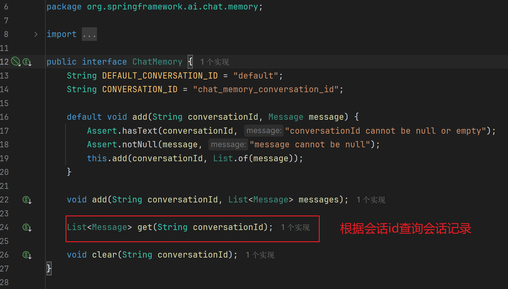
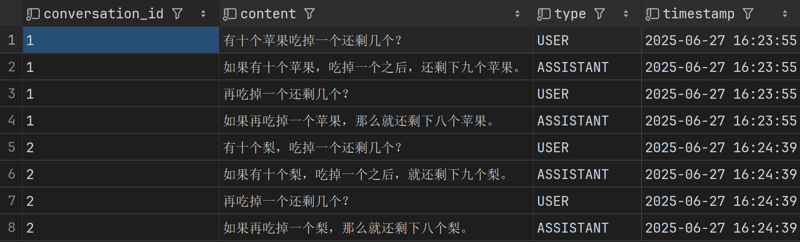
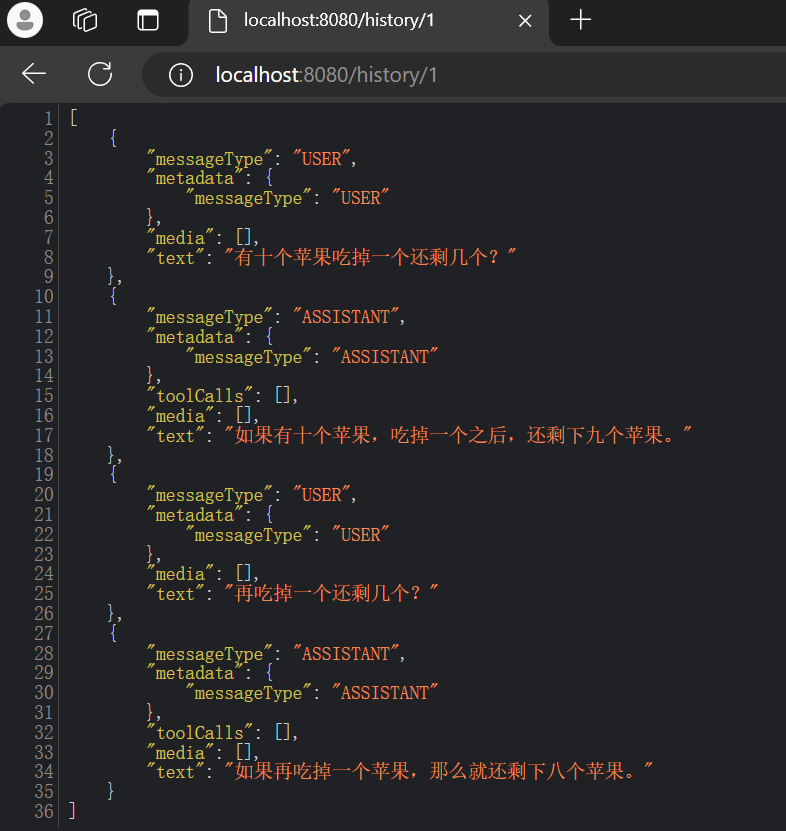
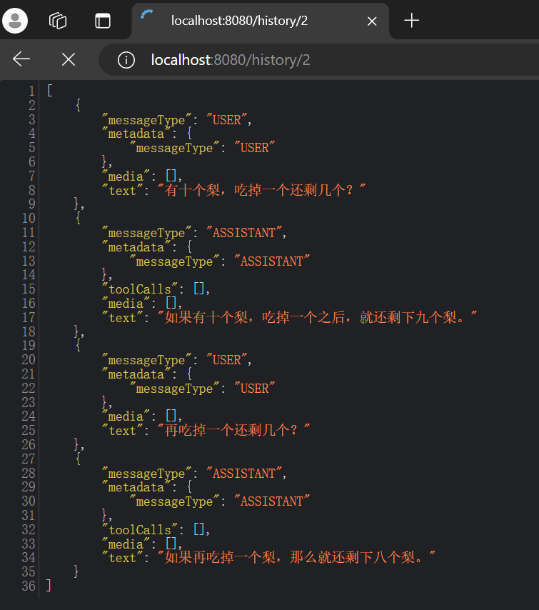

# 【SpringAI篇04】：基于 ChatMemory 查询聊天记录

> 原创 已于 2025-06-27 16:54:05 修改 · 公开 · 249 阅读 · 9 · 3 · CC 4.0 BY-SA版权 版权声明：本文为博主原创文章，遵循 CC 4.0 BY-SA 版权协议，转载请附上原文出处链接和本声明。
> 文章链接：https://blog.csdn.net/lyh2004_08/article/details/148956396

聊天记录都是基于 ChatMemory 存储的，而 **ChatMemory** 接口提供了如下方法用于聊天记录的查询：

 

**所以我们只需要注入 ChatMemory，拿到对话id，调用该方法即可：** 

```java
package com.demo.aiqqq.controller;
 
import lombok.RequiredArgsConstructor;
import lombok.extern.slf4j.Slf4j;
import org.springframework.ai.chat.memory.ChatMemory;
import org.springframework.ai.chat.messages.Message;
import org.springframework.web.bind.annotation.GetMapping;
import org.springframework.web.bind.annotation.PathVariable;
import org.springframework.web.bind.annotation.RequestMapping;
import org.springframework.web.bind.annotation.RestController;
 
import java.util.List;
 
@Slf4j
@RestController
@RequestMapping("/history")
@RequiredArgsConstructor
public class HistoryController {
 
    private final ChatMemory chatMemory;
 
    @GetMapping("/{chatId}")
    public List<Message> queryHistrotyByChatId(@PathVariable Long chatId) {
        log.debug("查询会话 chatId={} 的历史记录", chatId);
        return chatMemory.get(String.valueOf(chatId));
    }
}
```

> 注意，该方法返回值为 **Message （** package org.springframework.ai.chat.messages **）** 的集合，其中 MessageType，Text，Metadata 等信息，可以自己根据需求二次封装或者抽取属性

目前数据库中已经存在一些对话了（已经在上文中 [持久化](https://blog.csdn.net/lyh2004_08/article/details/148951699) 的）：

 

测试结果：

 

 

> 从返回json结果也能清晰看到 Message 的字段