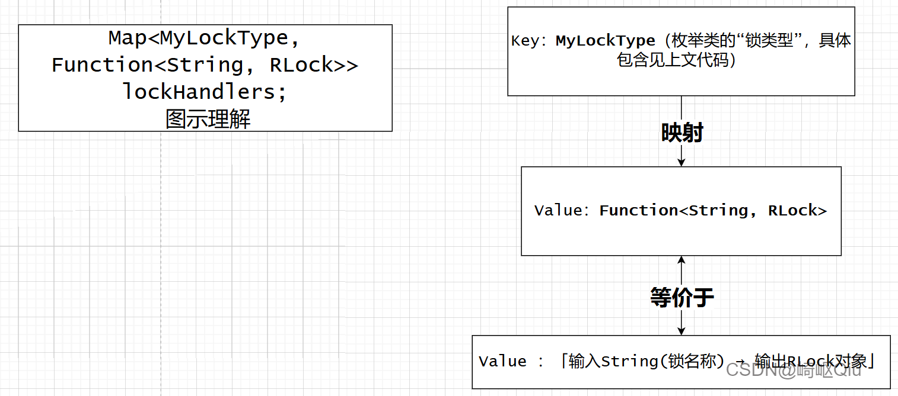
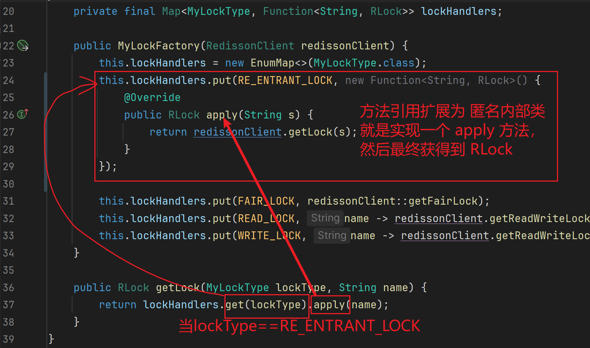

# 深度剖析：基于AOP、自定义注解与设计模式构建高度可定制的分布式锁解决方案

> 原创 已于 2025-07-01 11:23:17 修改 · 公开 · 1.8k 阅读 · 69 · 11 · CC 4.0 BY-SA版权 版权声明：本文为博主原创文章，遵循 CC 4.0 BY-SA 版权协议，转载请附上原文出处链接和本声明。
> 文章链接：https://blog.csdn.net/lyh2004_08/article/details/149042600

**文章目录**

[TOC]


## 一、前言

在分布式系统中，并发控制是一个绕不开的难题。为了保证数据的一致性和系统的稳定性，我们常常需要引入分布式锁。传统的分布式锁实现方式可能存在代码侵入性强、不够灵活等问题。

本文将深入剖析一种基于 **Spring AOP** 、 **自定义注解** 以及 **多种设计模式** 构建的 **高度可定制** 的 **分布式锁** 解决方案。通过这种方式，我们可以优雅地在业务代码中声明式地使用分布式锁，并且能够灵活配置锁的类型、获取策略等，极大地提升了开发效率和代码的可维护性。

## 二、项目背景

本文的实现来源于 [仿MOOC在线学习平台] 项目中的实践。在处理高并发场景下的资源竞争时，设计并实现了这套自定义分布式锁注解，以解决项目中分布式锁的统一管理和灵活应用问题。

### 为什么需要自定义分布式锁注解？

在没有自定义注解之前，我们可能会直接在业务代码中使用分布式锁客户端（例如 `Redisson` ）的API来获取和释放锁：

```java
// 示例：传统方式使用Redisson锁
RLock lock = redissonClient.getLock("myLockName");
try {
    boolean isLocked = lock.tryLock(1, 10, TimeUnit.SECONDS); // 尝试获取锁
    if (isLocked) {
        // 执行业务逻辑
        // ...
    } else {
        // 获取锁失败处理
        // ...
    }
} finally {
    if (lock.isLocked() && lock.isHeldByCurrentThread()) { // 释放锁前检查
        lock.unlock();
    }
}
```

这种方式存在以下问题：

> 

-  **代码侵入性强：** 业务逻辑中充斥着锁相关的代码，使得业务代码不够纯粹，难以阅读和维护。

-  **重复代码多：** 每个需要加锁的地方都需要重复编写获取锁、释放锁的逻辑，容易出错。

-  **不够灵活：** 如果需要修改锁的类型、等待时间、释放时间等，需要在每个使用锁的地方进行修改。

-  **可读性差：** 业务开发者需要关注锁的细节，降低了代码的可读性。

自定义分布式锁注解可以很好地解决这些问题，通过将锁的逻辑与业务逻辑分离，实现声明式编程。

---

## 三、核心技术概览

本方案的核心技术包括：

> 

-  **Spring AOP (面向切面编程):** 用于拦截带有特定注解的方法，并在方法执行前后织入锁的逻辑。

-  **自定义注解 ( `@MyLock` ):** 用于标记需要加分布式锁的方法，并提供丰富的配置选项。

-  **Redisson:** 一个基于Redis的分布式Java对象和服务框架，提供了强大的分布式锁实现。

-  **设计模式:** 

-  **策略模式:** 用于封装不同的锁获取策略（例如，快速失败、有限重试等）。

-  **工厂模式:** 用于根据注解配置创建不同类型的锁实例。

-  **SPEL (Spring Expression Language):** 用于动态解析锁的名称，支持从方法参数中获取值作为锁名称的一部分。

---

### 1. 自定义注解 `@MyLock` 设计与实现

`@MyLock` 注解是整个方案的入口点，它定义了分布式锁的各种配置项。

```java
package com.mooc.promotion.anotation;

import com.mooc.promotion.enums.MyLockType;
import com.mooc.promotion.util.MyLockStrategy;

import java.lang.annotation.ElementType;
import java.lang.annotation.Retention;
import java.lang.annotation.RetentionPolicy;
import java.lang.annotation.Target;
import java.util.concurrent.TimeUnit;

/**
 * 自定义Redisson锁的注解
 */
@Retention(RetentionPolicy.RUNTIME) // 运行时保留注解信息，AOP才能获取到
@Target(ElementType.METHOD) // 只能应用于方法上
public @interface MyLock {
    // 锁名称，支持SPEL表达式
    String name();

    // tryLock等方法的参数，三个同理
    long waitTime() default 1; // 等待获取锁的时间

    // 默认为-1，表示开启看门狗机制
    long leaseTime() default -1; // 锁的持有时间，-1表示开启看门狗

    TimeUnit unit() default TimeUnit.SECONDS; // 时间单位

    // 默认锁类型是：可重入锁
    MyLockType lockType() default MyLockType.RE_ENTRANT_LOCK; // 锁的类型

    // 默认获取锁失败策略是：有限重试后抛出异常
    MyLockStrategy lockStrategy() default MyLockStrategy.FAIL_AFTER_RETRY_TIMEOUT; // 获取锁失败的策略
}
```

**设计考量：** 

-  **`name()` :** 锁的名称是分布式锁的关键标识。为了支持更灵活的命名，例如基于方法参数动态生成锁名称，我们支持在 `name()` 中使用 SPEL 表达式。

-  **`waitTime()` , `leaseTime()` , `unit()` :** 这些参数直接映射到 Redisson `tryLock` 方法的参数，用于控制锁的获取行为和持有时间。 `leaseTime` 默认为 -1，开启 Redisson 的看门狗机制，避免死锁。

-  **`lockType()` :** 定义了锁的类型，通过枚举 `MyLockType` 提供多种 Redisson 锁的支持（可重入锁、公平锁、读写锁）。

-  **`lockStrategy()` :** 定义了获取锁失败后的处理策略，通过枚举 `MyLockStrategy` 提供多种策略选项。这是策略模式的应用，极大地提高了锁获取行为的可定制性。

---

### 2. 锁类型枚举 `MyLockType` 

`MyLockType` 枚举定义了我们支持的 Redisson 锁类型。

```java
package com.mooc.promotion.enums;

/**
 * Redisson的锁类型的枚举
 */
public enum MyLockType {
    RE_ENTRANT_LOCK, // 可重入锁，默认锁
    FAIR_LOCK, // 公平锁
    READ_LOCK, // 读锁
    WRITE_LOCK, // 写锁
    ;
}
```

**设计考量：** 

- 不同的业务场景需要不同类型的锁。例如，在读多写少的场景下，使用读写锁可以提高并发性能。通过枚举，我们可以清晰地表达支持的锁类型，并在后续的工厂模式中根据枚举值创建相应的锁实例。

---

### 3. 锁获取策略枚举 `MyLockStrategy` 与策略模式

`MyLockStrategy` 枚举是策略模式的应用，它定义了获取锁失败后的不同处理方式，并封装了相应的 `tryLock` 逻辑。

```java
package com.mooc.promotion.util;

import com.mooc.common.exceptions.BizIllegalException;
import com.mooc.promotion.anotation.MyLock;
import org.redisson.api.RLock;

import java.util.concurrent.TimeUnit;

/**
 * 行为枚举类，做策略工厂模式
 * 每个枚举项都需要实现本类的抽象方法
 * 对应执行tryLock或者lock的五种策略
 */
public enum MyLockStrategy {
    // 不重试、直接结束
    SKIP_FAST() {
        @Override
        public boolean tryLock(RLock lock, MyLock prop) throws InterruptedException {
            // 尝试获取锁，等待时间为0，即不等待
            return lock.tryLock(0, prop.leaseTime(), prop.unit());
        }
    },
    // 不重试、抛出异常
    FAIL_FAST() {
        @Override
        public boolean tryLock(RLock lock, MyLock prop) throws InterruptedException {
            // 尝试获取锁，等待时间为0，即不等待
            boolean isLock = lock.tryLock(0, prop.leaseTime(), prop.unit());
            if (!isLock) {
                // 获取锁失败，抛出业务异常
                throw new BizIllegalException("请求太频繁");
            }
            return true; // 获取锁成功
        }
    },
    // 无限重试
    KEEP_TRYING() {
        @Override
        public boolean tryLock(RLock lock, MyLock prop) throws InterruptedException {
            // 使用 lock() 方法，会一直阻塞直到获取到锁
            lock.lock(prop.leaseTime(), prop.unit());
            return true; // 获取锁成功
        }
    },
    // 有限重试后直接结束
    SKIP_AFTER_RETRY_TIMEOUT() {
        @Override
        public boolean tryLock(RLock lock, MyLock prop) throws InterruptedException {
            // 尝试获取锁，等待指定时间
            return lock.tryLock(prop.waitTime(), prop.leaseTime(), prop.unit());
        }
    },
    // 有限重试后抛出异常
    FAIL_AFTER_RETRY_TIMEOUT() {
        @Override
        public boolean tryLock(RLock lock, MyLock prop) throws InterruptedException {
            // 尝试获取锁，等待指定时间
            boolean isLock = lock.tryLock(prop.waitTime(), prop.leaseTime(), prop.unit());
            if (!isLock) {
                // 获取锁失败，抛出业务异常
                throw new BizIllegalException("请求太频繁");
            }
            return true; // 获取锁成功
        }
    },
    ; // 枚举项结束

    /**
     * 抽象方法，定义了获取锁的行为
     * @param lock Redisson锁对象
     * @param prop MyLock注解属性
     * @return 是否成功获取到锁
     * @throws InterruptedException 线程中断异常
     */
    public abstract boolean tryLock(RLock lock, MyLock prop) throws InterruptedException;
}
```

**设计考量：** 

-  **策略模式的应用：** `MyLockStrategy` 枚举的每个枚举项都代表一种获取锁的策略，并实现了抽象方法 `tryLock()` 。在 AOP 中，我们只需要根据 `@MyLock` 注解中指定的策略来调用相应的 `tryLock()` 方法，实现了行为的解耦和可替换。

-  **丰富的策略选项：** 提供了多种常用的锁获取策略，涵盖了快速失败、无限重试、有限重试等场景，满足了不同业务需求。

-  **与注解属性关联：** `tryLock()` 方法接收 `MyLock` 注解作为参数，使得策略的执行可以根据注解的配置进行调整。

---

### 4. 锁工厂 `MyLockFactory` 与工厂模式

`MyLockFactory` 负责根据 `@MyLock` 注解中指定的锁类型创建相应的 Redisson 锁实例。

```java
package com.mooc.promotion.util;

import com.mooc.promotion.enums.MyLockType;
import lombok.RequiredArgsConstructor;
import org.redisson.api.RLock;
import org.redisson.api.RedissonClient;
import org.springframework.stereotype.Component;

/**
 * Redisson锁的工厂类
 */
@Component
@RequiredArgsConstructor // Lombok注解，生成包含final字段的构造函数
public class MyLockFactory {

    private final RedissonClient redissonClient;

    /**
     * 根据锁类型创建锁对象
     * @param lockType 锁类型
     * @param lockName 锁名称
     * @return RLock锁对象
     */
    public RLock getLock(MyLockType lockType, String lockName) {
        switch (lockType) {
            case FAIR_LOCK:
                return redissonClient.getFairLock(lockName);
            case READ_LOCK:
                return redissonClient.getReadWriteLock(lockName).readLock();
            case WRITE_LOCK:
                return redissonClient.getReadWriteLock(lockName).writeLock();
            case RE_ENTRANT_LOCK:
            default:
                return redissonClient.getLock(lockName);
        }
    }
}
```

**设计考量：** 

-  **工厂模式的应用：** `MyLockFactory` 隐藏了 Redisson 锁创建的复杂性，客户端（AOP 切面）只需要通过 `getLock()` 方法传入锁类型和名称即可获取到相应的锁实例。

-  **与 `MyLockType` 枚举关联：** 工厂方法根据 `MyLockType` 枚举值来判断需要创建哪种类型的锁。

-  **解耦：** 将锁的创建逻辑从 AOP 切面中分离出来，使得切面代码更加简洁。

#### 优化方案

可进一步优化方案：注意到，该工厂中存在 **大量的 if-else** （或者switch）判断，所以我们可以使用 `Map` 来进一步优化

```java
/**
* 锁类型工厂，根据锁类型封装对应的「获取对应锁」的「函数式接口」
*/
@Component
public class MyLockFactory {

   // 注意：这里的value可以认为就是一个「根据锁名获取锁的方法」
   private final Map<MyLockType, Function<String, RLock>> lockHandlers;

   public MyLockFactory(RedissonClient redissonClient) { // 通过方法注入
       this.lockHandlers = new EnumMap<>(MyLockType.class); // 使用EnumMap，性能更好且线程安全

       // 初始化Map，将不同的锁类型映射到对应的获取锁的函数式接口
       this.lockHandlers.put(RE_ENTRANT_LOCK, redissonClient::getLock);
       this.lockHandlers.put(FAIR_LOCK, redissonClient::getFairLock);
       // 对于读写锁，需要先获取读写锁对象，再获取读锁或写锁
       this.lockHandlers.put(READ_LOCK, name -> redissonClient.getReadWriteLock(name).readLock());
       this.lockHandlers.put(WRITE_LOCK, name -> redissonClient.getReadWriteLock(name).writeLock());
   }

   /**
    * 根据锁类型和锁名称获取锁对象
    * @param lockType 锁类型
    * @param name 锁名称
    * @return RLock锁对象
    */
   public RLock getLock(MyLockType lockType, String name) {
       // 从Map中根据锁类型获取对应的函数式接口，然后调用apply方法执行获取锁的逻辑
       Function<String, RLock> handler = lockHandlers.get(lockType);
       if (handler == null) {
           // 处理未知锁类型的情况，可以抛出异常或返回默认锁
           throw new IllegalArgumentException("Unsupported lock type: " + lockType);
       }
       return handler.apply(name);
   }
}
```

> 这样，省去了大量对于 **锁的类型** 的 **if-else** 判断，先使用 **Map** 存储起来，要获取什么类型的锁，直接传入类型，自动取出匹配的类型的 **「根据锁名获取锁的方法」** ，通过将不同的锁类型映射到不同的函数式接口，我们实现了获取锁逻辑的解耦。

#### 图示理解

 

`getLock` 执行流程：
 

---

### 5. AOP 切面 `MyLockAspect` 实现

`MyLockAspect` 是整个方案的核心，它使用 Spring AOP 的环绕通知来拦截带有 `@MyLock` 注解的方法，并在方法执行前后织入锁的逻辑。

```java
package com.mooc.promotion.aspect;

import com.mooc.common.utils.StringUtils;
import com.mooc.promotion.anotation.MyLock;
import com.mooc.promotion.util.MyLockFactory;
import lombok.RequiredArgsConstructor;
import lombok.extern.slf4j.Slf4j;
import org.aspectj.lang.ProceedingJoinPoint;
import org.aspectj.lang.annotation.Around;
import org.aspectj.lang.annotation.Aspect;
import org.aspectj.lang.reflect.MethodSignature;
import org.redisson.api.RLock;
import org.redisson.api.RedissonClient;
import org.springframework.context.expression.MethodBasedEvaluationContext;
import org.springframework.core.DefaultParameterNameDiscoverer;
import org.springframework.core.Ordered;
import org.springframework.core.ParameterNameDiscoverer;
import org.springframework.expression.EvaluationContext;
import org.springframework.expression.Expression;
import org.springframework.expression.ExpressionParser;
import org.springframework.expression.TypedValue;
import org.springframework.expression.spel.standard.SpelExpressionParser;
import org.springframework.stereotype.Component;
import org.springframework.util.ObjectUtils;

import java.lang.reflect.Method;
import java.util.regex.Matcher;
import java.util.regex.Pattern;

@Component // 标记为Spring组件
@Aspect // 标记为AOP切面
@Slf4j // Lombok注解，用于日志记录
@RequiredArgsConstructor // Lombok注解，生成包含final字段的构造函数
public class MyLockAspect implements Ordered {
    // 从最开始的直接抽取切面方法+自定义注解，到最后压根用不上redissonClient
    // 其中最最核心的就是两次工厂模式：一个锁的类型工厂模式，一个行为策略的工厂模式
    // private final RedissonClient redissonClient; // RedissonClient 不再直接在切面中使用，而是通过工厂类
    private final MyLockFactory lockFactory; // 注入锁工厂

    /**
     * SPEL的正则规则
     */
    private static final Pattern pattern = Pattern.compile("\\#\\{([^\\}]*)\\}");
    /**
     * 方法参数解析器，用于解析SPEL表达式
     */
    private static final ParameterNameDiscoverer parameterNameDiscoverer = new DefaultParameterNameDiscoverer();

    /**
     * 结合切点表达式方法和注解的简化写法的环绕通知
     * @param pjp 切入点对象，用于获取方法信息和执行方法
     * @param myLock MyLock注解实例，由Spring AOP自动注入
     * @return 业务方法的返回值
     * @throws Throwable 业务方法可能抛出的异常
     */
    @Around("@annotation(myLock)") // 切点表达式，拦截带有@MyLock注解的方法
    public Object tryLock(ProceedingJoinPoint pjp, MyLock myLock) throws Throwable {
        // 1. 解析锁名称，支持SPEL表达式
        String lockName = getLockName(myLock.name(), pjp);

        // 2. 通过锁工厂创建锁对象，根据注解指定的锁类型
        RLock lock = lockFactory.getLock(myLock.lockType(), lockName);

        // 3. 尝试获取锁，根据注解指定的获取锁策略
        // 这里是策略模式的应用，调用MyLockStrategy枚举项的tryLock方法
        boolean isLock = myLock.lockStrategy().tryLock(lock, myLock);

        // 4. 判断是否成功获取锁
        if (!isLock) {
            log.debug("线程：[{}]获取锁失败，锁尚未被其他线程释放！锁名称：{}", Thread.currentThread().getName(), lockName);
            // 如果获取锁失败，并且策略不是抛出异常（抛异常的策略会在tryLock方法内部抛出），则直接返回null
            // 注意：这里假设业务方法返回null表示处理失败，或者根据实际业务需求进行调整
            return null;
        }

        // 5. 成功获取锁，执行业务方法
        try {
            log.debug("线程：[{}]获取到锁：{}，即将执行业务方法！", Thread.currentThread().getName(), lockName);
            return pjp.proceed(); // 执行被拦截的业务方法
        } finally {
            // 6. 释放锁
            // 在finally块中释放锁，确保锁一定会被释放，避免死锁
            // 检查锁是否被当前线程持有，避免释放其他线程的锁
            if (lock.isLocked() && lock.isHeldByCurrentThread()) {
                log.debug("线程：[{}]已释放锁：{}！", Thread.currentThread().getName(), lockName);
                lock.unlock();
            } else {
                log.warn("线程：[{}]尝试释放未持有的锁：{}！", Thread.currentThread().getName(), lockName);
            }
        }
    }

    /**
     * 解析锁名称（spEL表达式）
     * 支持从方法参数中获取值作为锁名称的一部分
     * @param name 原始锁名称，可能包含SPEL表达式
     * @param pjp 切入点对象
     * @return 解析后的锁名称
     */
    private String getLockName(String name, ProceedingJoinPoint pjp) {
        // 1. 判断是否存在spel表达式
        if (StringUtils.isBlank(name) || !name.contains("#")) {
            // 不存在，直接返回原始名称
            return name;
        }
        // 2. 构建context,也就是SPEL表达式获取参数的上下文环境，这里上下文就是切入点的参数列表
        // MethodBasedEvaluationContext 提供了基于方法的上下文，方便通过参数名访问参数值
        EvaluationContext context = new MethodBasedEvaluationContext(
                TypedValue.NULL, resolveMethod(pjp), pjp.getArgs(), parameterNameDiscoverer);
        // 3. 构建SPEL解析器
        ExpressionParser parser = new SpelExpressionParser();
        // 4. 循环处理，因为表达式中可以包含多个表达式
        Matcher matcher = pattern.matcher(name);
        StringBuffer sb = new StringBuffer(); // 使用StringBuffer来构建解析后的字符串
        while (matcher.find()) {
            // 4.1. 获取表达式，例如 "#{paramName}"
            String fullExpression = matcher.group(); // 完整的表达式，例如 "#{paramName}"
            String expressionContent = matcher.group(1); // 表达式内容，例如 "paramName"
            // 4.2. 这里要判断表达式是否以 T字符开头，这种属于解析静态方法，不走上下文
            // 例如：#{T(java.lang.System).currentTimeMillis()}
            Expression expression = parser.parseExpression(expressionContent.charAt(0) == 'T' ? expressionContent : "#" + expressionContent);
            // 4.3. 解析出表达式对应的值
            Object value = expression.getValue(context);
            // 4.4. 用值替换锁名称中的SPEL表达式
            // 使用Matcher的appendReplacement方法进行替换，更安全高效
            matcher.appendReplacement(sb, ObjectUtils.nullSafeToString(value));
        }
        matcher.appendTail(sb); // 将剩余的字符串追加到StringBuffer
        return sb.toString(); // 返回解析后的锁名称
    }

    /**
     * 解析切入点对应的方法对象
     * @param pjp 切入点对象
     * @return 方法对象
     */
    private Method resolveMethod(ProceedingJoinPoint pjp) {
        // 1. 获取方法签名
        MethodSignature signature = (MethodSignature) pjp.getSignature();
        // 2. 获取目标对象的类
        Class<?> clazz = pjp.getTarget().getClass();
        // 3. 方法名称
        String name = signature.getName();
        // 4. 方法参数列表
        Class<?>[] parameterTypes = signature.getMethod().getParameterTypes();
        // 5. 尝试获取方法对象，考虑父类方法
        return tryGetDeclaredMethod(clazz, name, parameterTypes);
    }

    /**
     * 尝试获取声明的方法对象，包括父类方法
     * @param clazz 类对象
     * @param name 方法名称
     * @param parameterTypes 方法参数类型列表
     * @return 方法对象
     */
    private Method tryGetDeclaredMethod(Class<?> clazz, String name, Class<?>... parameterTypes) {
        try {
            // 尝试获取当前类声明的方法
            return clazz.getDeclaredMethod(name, parameterTypes);
        } catch (NoSuchMethodException e) {
            // 如果当前类没有找到，则尝试从父类寻找
            Class<?> superClass = clazz.getSuperclass();
            if (superClass != null) {
                return tryGetDeclaredMethod(superClass, name, parameterTypes);
            }
        }
        return null; // 未找到方法
    }

    @Override
    public int getOrder() {
        // 实现Ordered接口，设置切面的优先级
        // 数字越小优先级越高，确保锁的逻辑在其他可能的切面（如事务）之前或之后执行，具体取决于业务需求
        // 0 表示较高的优先级
        return 0;
    }
}
```

**设计考量：** 

-  **`@Around("@annotation(myLock)")` :** 使用注解作为切点表达式，简洁明了地指定了需要拦截的目标方法。 `myLock` 参数会自动绑定到被拦截方法上的 `@MyLock` 注解实例。

-  **`ProceedingJoinPoint` :** 在环绕通知中，通过 `ProceedingJoinPoint` 对象可以访问被拦截方法的签名、参数等信息，并控制方法的执行 ( `pjp.proceed()` )。

-  **SPEL 解析 `getLockName()` :** 这个方法是亮点之一。它利用 Spring 的 SPEL 表达式解析能力，结合 `MethodBasedEvaluationContext` ，能够从方法参数中动态获取值，构建更具业务意义的锁名称。例如， `@MyLock(name = "order:#{orderId}")` 可以根据订单ID生成不同的锁名称。

-  **锁的获取与释放：** 

  - 在 `try` 块中执行业务方法 `pjp.proceed()` 。

  - 在 `finally` 块中释放锁，确保即使业务方法抛出异常，锁也能被释放，避免死锁。

  - 在释放锁之前，通过 `lock.isLocked() && lock.isHeldByCurrentThread()` 进行判断，避免释放未持有的锁或非当前线程持有的锁，提高了代码的健壮性。

-  **策略模式的应用：** `myLock.lockStrategy().tryLock(lock, myLock)` 直接调用了 `@MyLock` 注解中指定的策略的 `tryLock` 方法，实现了策略的灵活切换。

-  **工厂模式的应用：** `lockFactory.getLock(myLock.lockType(), lockName)` 通过锁工厂创建锁实例，将锁的创建逻辑与切面逻辑解耦。

-  **`Ordered` 接口：** 实现了 `Ordered` 接口，可以设置切面的执行顺序。在复杂的应用中，可能有多个切面作用于同一个方法，通过设置优先级可以控制它们的执行顺序。

---

## 四、最佳实践与使用示例

**使用示例：** 

在需要加分布式锁的方法上，直接添加 `@MyLock` 注解即可：

```java
@Service
public class OrderService {

    @MyLock(name = "createOrder:#{orderId}", // 锁名称，根据orderId动态生成
            lockType = MyLockType.RE_ENTRANT_LOCK, // 使用可重入锁
            waitTime = 5, // 等待5秒获取锁
            leaseTime = 10, // 锁持有10秒（如果看门狗未开启）
            unit = TimeUnit.SECONDS,
            lockStrategy = MyLockStrategy.FAIL_AFTER_RETRY_TIMEOUT) // 有限重试后抛出异常
    public void createOrder(Long orderId, OrderDTO orderDTO) {
        // 业务逻辑：创建订单
        // ...
        System.out.println("订单 " + orderId + " 创建成功，线程：" + Thread.currentThread().getName());
    }

    @MyLock(name = "updateStock:#{productId}", // 锁名称，根据productId动态生成
            lockType = MyLockType.WRITE_LOCK, // 使用写锁
            lockStrategy = MyLockStrategy.SKIP_FAST) // 不重试，快速跳过
    public void updateStock(Long productId, int quantity) {
        // 业务逻辑：更新库存
        // ...
        System.out.println("商品 " + productId + " 库存更新成功，线程：" + Thread.currentThread().getName());
    }
}
```

**最佳实践：** 

-  **锁名称的规范化：** 建议采用统一的命名规范来定义锁名称，例如 `业务模块:业务标识` ，方便管理和排查问题。

-  **合理选择锁类型：** 根据业务场景选择合适的锁类型（可重入锁、公平锁、读写锁），以提高并发性能。

-  **谨慎设置等待时间和持有时间：** 等待时间过长可能导致线程阻塞，持有时间过短可能导致锁提前释放，持有时间过长可能增加死锁风险。结合 Redisson 的看门狗机制，通常可以将 `leaseTime` 设置为 -1，依赖看门狗自动续期。

-  **选择合适的获取锁策略：** 根据业务对并发的要求选择合适的策略。例如，对实时性要求高的场景可以使用 `FAIL_FAST` 或 `SKIP_FAST` ；对数据一致性要求极高的场景可以使用 `KEEP_TRYING` 或 `FAIL_AFTER_RETRY_TIMEOUT` 。

-  **SPEL 表达式的安全性：** 在使用 SPEL 表达式时，要注意避免注入攻击。确保从可信的来源获取用于表达式解析的数据。

-  **异常处理：** 在业务方法中捕获和处理可能发生的异常，确保锁在异常发生时也能正确释放。虽然 AOP 的 `finally` 块可以保证锁释放，但业务异常的处理仍然重要。

-  **监控与报警：** 对分布式锁的使用情况进行监控，例如锁的竞争情况、平均等待时间等，及时发现和解决潜在问题。

---

### 技术深度追问模拟

**面试官：** 你刚才提到了自定义分布式锁注解，能详细讲讲你是如何实现的吗？特别是如何实现锁名称的动态解析和锁获取策略的灵活配置？

>  **候选人：** 好的，我的实现主要基于 Spring AOP、自定义注解和设计模式。
> 
> 首先，我定义了一个 **`@MyLock`** 注解，用于标记需要加锁的方法。这个注解包含了锁的名称、类型、等待时间、持有时间以及获取锁失败时的策略等属性。
> 
> 为了实现锁名称的动态解析，我在 `@MyLock` 注解的 `name()` 属性中支持 SPEL 表达式。在 AOP 切面中，我通过 Spring 提供的 SPEL 解析工具，结合 `MethodBasedEvaluationContext` ，能够获取到被拦截方法的参数，并根据 SPEL 表达式从参数中提取值，动态地构建出最终的锁名称。例如，如果方法是 `updateOrder(Long orderId, ...)` ，我在注解中可以写 `@MyLock(name = "order:#{orderId}")` ，这样锁的名称就会包含具体的订单ID。
> 
> 为了实现锁获取策略的灵活配置，我使用了策略模式。我定义了一个 `MyLockStrategy` 枚举，每个枚举项代表一种获取锁的策略，并实现了统一的 `tryLock` 方法。在 `@MyLock` 注解中，我通过 `lockStrategy()` 属性指定使用哪种策略。在 AOP 切面中，我直接调用注解中指定的策略的 `tryLock` 方法来尝试获取锁，这样就将锁获取的具体行为与切面逻辑解耦了。
> 
> 此外，我还使用了工厂模式来创建不同类型的 Redisson 锁实例。我定义了一个 `MyLockFactory` 类，根据 `@MyLock` 注解中指定的锁类型 ( `lockType` )，通过 RedissonClient 创建对应的可重入锁、公平锁或读写锁。这使得我在 AOP 切面中不需要关心锁创建的具体细节，只需要通过工厂获取即可。
> 
> 最后，我使用 Spring AOP 的环绕通知来拦截带有 `@MyLock` 注解的方法。在环绕通知中，我首先解析出动态的锁名称，然后通过工厂创建锁对象，接着根据注解指定的策略尝试获取锁。如果获取成功，就执行业务方法；无论业务方法是否抛出异常，都在 `finally` 块中释放锁，确保锁的正确释放。

**面试官：** 你提到了 Redisson 的 **看门狗** 机制，你在实现中是如何处理的？为什么将 `leaseTime` 默认为 -1？

>  **候选人：** Redisson 的看门狗机制是 Redisson 提供的一种自动续期机制，可以避免因为业务方法执行时间过长导致锁过期而被其他线程获取，从而引发数据不一致问题。当 `leaseTime` 设置为 -1 时，Redisson 会开启看门狗，每隔一段时间（默认是锁过期时间的 1/3）就会自动给锁续期，直到业务方法执行完毕并主动释放锁。
> 
> 在我的实现中，我将 `@MyLock` 注解的 `leaseTime` 默认值设置为 -1，就是为了 **默认开启 Redisson 的看门狗机制** 。这样，大多数情况下开发者不需要关心锁的持有时间，Redisson 会自动处理续期，降低了死锁的风险。当然，如果用户有特殊需求，也可以显式地设置 `leaseTime` 为一个正值，关闭看门狗，此时需要自己评估业务方法的执行时间，确保锁不会提前过期。

**面试官：** 你在 `MyLockStrategy` 枚举中实现了不同的获取锁策略，如果用户需要一种新的策略，例如在获取锁失败后执行特定的补偿逻辑，你的设计是否容易扩展？

>  **候选人：** 是的，我的设计具有很好的扩展性。由于我使用了策略模式， `MyLockStrategy` 枚举是开放给用户扩展的。如果用户需要一种新的获取锁策略，他们只需要：
> 
> 

1. 在 `MyLockStrategy` 枚举中添加一个 **新的枚举项** 。

2. 实现该枚举项的抽象方法 `tryLock(RLock lock, MyLock prop)` ，在其中定义新的获取锁逻辑，包括失败后的补偿逻辑。

3. 在 `@MyLock` 注解中使用新添加的策略枚举项即可。

这种 **基于枚举的策略模式** 实现，使得新增策略非常方便，只需要修改枚举类本身，而不需要修改 AOP 切面或其他核心逻辑，符合 **开闭原则** 。
> 
> ---
> 
> 例如，假如要增加一个「 **重试3次后降级** 」的策略
> 
> 在 `MyLockStrategy` 中添加新枚举项：
> 
> ```java
> RETRY_THEN_FALLBACK {
>    public boolean tryLock(RLock lock, MyLock prop) {
>        for(int i=0; i<3; i++){
>            if(lock.tryLock(prop.waitTime(), prop.leaseTime(), prop.unit())) {
>                return true;
>            }
>        }
>        // 执行降级逻辑
>        return false; 
>    }
> }
> ```
> 
> 使用时指定策略：
> 
> ```java
> @MyLock(lockStrategy = MyLockStrategy.RETRY_THEN_FALLBACK)
> ```

**面试官：** 你觉得这套自定义分布式锁方案还有哪些可以改进的地方？

>  **候选人：** 尽管这套方案已经比较完善，但仍有一些可以改进的地方：
> 
> 

1.  **锁粒度的控制：** 目前锁的 **粒度** 是方法级别的。对于一些需要更细粒度控制的场景，例如只锁定方法中的某个代码块，可能需要进一步的扩展，例如结合注解和方法参数来定义更细粒度的锁。

2.  **异常处理的细化：** 目前获取锁失败后的处理策略相对固定（抛异常或跳过）。可以考虑更细化的异常处理，例如允许用户自定义获取锁失败后的回调函数或处理器。

3.  **与业务上下文的集成：** 在某些场景下，锁的获取和释放可能需要与业务上下文（例如事务）更紧密地集成。可以考虑与 Spring 的事务管理机制进行更深入的整合。

4.  **更丰富的锁类型支持：** 除了 Redisson 提供的锁类型，如果需要支持其他类型的分布式锁（例如 ZooKeeper 分布式锁），可能需要修改锁工厂，甚至引入适配器模式来统一不同分布式锁客户端的接口。

5.  **性能优化：** 对于非常高并发的场景，可以进一步优化 SPEL 解析的性能，或者考虑缓存解析结果。

总的来说，这套方案提供了一个良好的基础框架，可以根据具体的业务需求进行进一步的扩展和优化。

---

## 五、方案优势总结

| 设计点 | 传统实现 | 本方案 |
|:---:|:---:|:---:|
|  **扩展性**  | 修改代码 | 新增枚举/策略 |
|  **可读性**  | 业务耦合 | 声明式注解 |
|  **灵活性**  | 硬编码 | SpEL动态锁名 |
|  **健壮性**  | 手动处理 | 策略模式封装 |
|  **维护成本**  | 多处修改 | 集中管理 |


>  **架构启示** ：这种设计是Spring生态的经典实践，类似 `@Transactional` 注解实现机制，体现了「约定优于配置」的设计哲学。