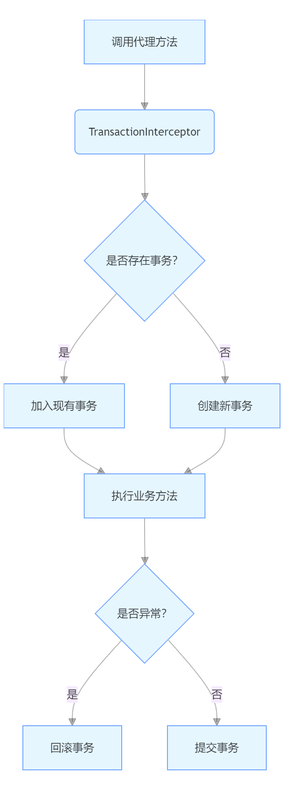

# 【Spring篇02】：AOP与事务实现原理

> 原创 于 2025-07-01 16:49:10 发布 · 公开 · 961 阅读 · 27 · 14 · CC 4.0 BY-SA版权 版权声明：本文为博主原创文章，遵循 CC 4.0 BY-SA 版权协议，转载请附上原文出处链接和本声明。
> 文章链接：https://blog.csdn.net/lyh2004_08/article/details/149050044

**文章目录**

[TOC]


## SpringAOP的环绕通知与切点表达式

### 1. 环绕通知（Around Advice）

-  **核心作用** ：最强大的通知类型， **完全控制目标方法的执行** 。可在方法执行前后插入逻辑，并决定是否执行目标方法。

-  **关键特性** ：

  - 通过 `ProceedingJoinPoint` 参数控制流程：```java
    @Around("pointcutExpression()")
    public Object aroundAdvice(ProceedingJoinPoint pjp) throws Throwable {
        // 1. 前置逻辑（如日志、权限校验）
        System.out.println("Before method: " + pjp.getSignature());
  
        // 2. 决定是否执行目标方法（可修改参数、跳过执行或重试）
        Object result = pjp.proceed(); 
  
        // 3. 后置逻辑（如结果处理、事务提交）
        System.out.println("After method. Result: " + result);
        return result;
    }
    ```

  -  **类比** ：类似电影拍摄的"动作替身"。替身（环绕通知）在演员（目标方法）表演前检查设备（前置逻辑），决定是否亲自上场（ `pjp.proceed()` ），表演后处理伤口（后置逻辑）。

### 2. 切点表达式（Pointcut Expression）

-  **作用** ：定义哪些方法需要被 AOP 拦截（即"切入点"）。

-  **语法结构** （以 `execution` 为例）：

  ```java
  execution([访问修饰符] 返回类型 [包名].类名.方法名(参数类型) [异常类型])
  ```

-  **常用模式** ：

  - 拦截 `UserService` 的所有方法：
     `execution(* com.example.service.UserService.*(..))` 

  - 拦截 `service` 包下所有类的 `public` 方法：
     `execution(public * com.example.service.*.*(..))` 

  - 拦截带 `@Transactional` 注解的方法：
     `@annotation(org.springframework.transaction.annotation.Transactional)` 

-  **通配符** ：

  -  `*` ：匹配任意字符（除包分隔符外）

  -  `..` ：匹配任意子包或任意数量参数

-  **最佳实践** ：优先使用注解匹配（如 `@annotation` ）或 `bean` 表达式（如 `bean(*Service)` ），提升可维护性。

---

## Spring 事务的 AOP 实现原理

### 1. 核心机制

-  **声明式事务** ：通过 `@Transactional` 注解 + AOP 代理实现事务管理。

-  **实现步骤** ：

  1.  **代理创建** ：Spring 容器为被 `@Transactional` 注解的 Bean 创建代理对象（JDK 动态代理或 CGLIB）。

  2.  **拦截逻辑** ：调用代理对象的方法时，被 `TransactionInterceptor` （环绕通知）拦截。

  3.  **事务管理流程** ：
      

---

### 2. 关键代码逻辑

```java
public class TransactionInterceptor extends TransactionAspectSupport {
    @Override
    public Object invoke(MethodInvocation invocation) throws Throwable {
        // 1. 获取事务属性（@Transactional配置）
        TransactionAttribute txAttr = getTransactionAttributeSource().getTransactionAttribute(...);
      
        // 2. 创建/加入事务（根据传播行为）
        TransactionInfo txInfo = createTransactionIfNecessary(txAttr);
      
        try {
            // 3. 执行目标方法（即 pjp.proceed()）
            Object result = invocation.proceed();
          
            // 4. 提交事务（无异常时）
            commitTransactionAfterReturning(txInfo);
            return result;
        } catch (Throwable ex) {
            // 5. 异常回滚（根据 rollbackFor 规则）
            completeTransactionAfterThrowing(txInfo, ex);
            throw ex;
        }
    }
}
```

---

### 3. 生产环境最佳实践

1.  **注解位置** ：

   - 优先加在 **实现类** 而非接口（避免 JDK 代理失效）。

   - 避免在 `private` 方法上使用（AOP 无法代理私有方法）。

2.  **事务传播行为** ：

   - 默认 `REQUIRED` ：存在事务则加入，不存在则新建。

   - 跨服务调用使用 `REQUIRES_NEW` （如日志记录需独立事务）。

3.  **性能优化** ：

   - 只读查询标记 `@Transactional(readOnly = true)` （启用数据库优化）。

   - 避免大事务：事务内不宜包含 RPC/IO 等耗时操作。

4.  **自调用问题** ：

   - 同类内方法互调事务失效（因绕过代理）。

   -  **解决方案** ：通过 `AopContext.currentProxy()` 获取代理对象再调用。

---

## 面试深度追问模拟

**面试官** ：你说事务基于 AOP 实现，那如果事务方法内发生异常，但被 `try-catch` 吞掉，事务还会回滚吗？

> 默认不会回滚！Spring 通过 `TransactionInterceptor` 捕获异常触发回滚。如果业务代码自行捕获且未重新抛出，拦截器无法感知异常，导致事务错误提交。解决方案：
> 
> 

1. 在 `catch` 块中手动设置回滚： `TransactionAspectSupport.currentTransactionStatus().setRollbackOnly()` 

2. 抛出符合 `rollbackFor` 规则的新异常

**面试官** ： `@Transactional` 注解在类和方法上同时存在时，优先级如何？

> 方法级注解优先级高于类级。例如类注解为 `@Transactional(readOnly=true)` ，但某方法注解为 `@Transactional(readOnly=false)` ，该方法会启用读写事务。

**面试官** ：如何确保事务的隔离级别生效？

> 

1. 数据库需支持指定隔离级别（如 MySQL 的 `REPEATABLE_READ` ）。

2. 通过 `@Transactional(isolation = Isolation.SERIALIZABLE)` 显式声明。

3. 注意：Spring 只会在 **新创建事务** 时应用隔离级别（已存在事务则忽略）。

