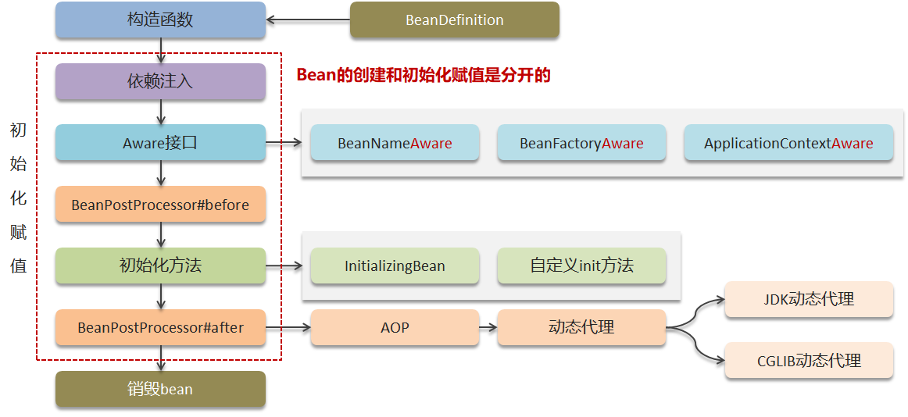

# 【Spring篇04】：Bean的生命周期简析

> 原创 于 2025-07-02 08:45:23 发布 · 公开 · 1k 阅读 · 23 · 23 · CC 4.0 BY-SA版权 版权声明：本文为博主原创文章，遵循 CC 4.0 BY-SA 版权协议，转载请附上原文出处链接和本声明。
> 文章链接：https://blog.csdn.net/lyh2004_08/article/details/149051371

**文章目录**

[TOC]

Spring Bean 生命周期的核心是 **控制反转（IoC）** 和 **依赖注入（DI）** ，通过多个扩展点（如 Aware 接口、BeanPostProcessor）提供高度灵活性。理解这一流程有助于优化 Bean 初始化逻辑、实现自定义增强，以及调试复杂应用。

> 可以把 Spring 容器想象成一个大型的“工厂”，这个工厂专门负责生产和管理各种各样的“零件”——也就是我们的 Bean。一个 Bean 从被“生产”出来到最终被“销毁”，会经历一系列的过程，这就是 Bean 的生命周期。

## 流程图

下图清晰地展示了Bean 生命周期中的几个主要阶段：
 

1.  **BeanDefinition 加载：** 就像工厂在生产零件前需要拿到设计图纸一样，Spring 容器在创建 Bean 之前，首先需要加载 Bean 的定义信息（BeanDefinition）。这些定义信息通常来自XML配置文件、Java 配置类或者注解。BeanDefinition 里包含了 Bean 的类名、属性、依赖关系、作用域等等。

2.  **构造函数实例化：** 有了设计图纸，工厂就可以开始“生产”零件了。Spring 容器会根据 BeanDefinition 中的类名，通过构造函数来创建 Bean 的实例。

3.  **依赖注入：** 零件生产出来后，可能还需要和其他零件组装起来才能完成一个更复杂的功能。在 Spring 中，这就是依赖注入（Dependency Injection）。Spring 会根据 BeanDefinition 中定义的依赖关系，将 Bean 所依赖的其他 Bean 注入到当前 Bean 的属性中。

4.  **Aware 接口回调：** 就像一个新零件生产出来后，需要知道自己的一些基本信息，比如自己的名字、是哪个工厂生产的等等。如果 Bean 实现了特定的 `Aware` 接口（比如 `BeanNameAware` 、 `BeanFactoryAware` 、 `ApplicationContextAware` ），Spring 容器会在此时回调这些接口的方法，将相关的容器信息传递给 Bean。这让 Bean 可以“感知”到自身在容器中的一些信息。

5.  **BeanPostProcessor#before：** 在 Bean 真正进行初始化之前，Spring 提供了一个“拦截器”机制，也就是 `BeanPostProcessor` 。 `BeanPostProcessor` 接口有两个方法： `postProcessBeforeInitialization` 和 `postProcessAfterInitialization` 。 `postProcessBeforeInitialization` 方法会在 Bean 初始化方法执行之前被调用。可以理解为在零件正式组装前，先进行一些预处理或检查。

6.  **初始化方法：** 这是 Bean 生命周期的核心阶段之一。在这里，Bean 会执行真正的初始化逻辑。可以通过以下几种方式指定初始化方法：

   - 实现 `InitializingBean` 接口，并实现 `afterPropertiesSet()` 方法。

   - 在 BeanDefinition 中通过 `init-method` 属性指定一个自定义的初始化方法。

   - 使用 `@PostConstruct` 注解标记一个方法作为初始化方法。
     这个阶段就像零件组装完成后，需要进行一些最后的调试和准备工作，让它能够正常工作。

7.  **BeanPostProcessor#after：** 在 Bean 初始化方法执行之后， `BeanPostProcessor` 的 `postProcessAfterInitialization` 方法会被调用。这个方法非常重要，它经常被用来生成 Bean 的代理对象。比如 AOP (面向切面编程) 的实现，就是在这个阶段通过动态代理来实现的。可以理解为零件完成所有组装和调试后，可能还需要进行一些额外的处理，比如给它套上一个“外壳”（代理对象），以便进行一些额外的功能增强（比如事务、日志等）。

8.  **AOP / 动态代理：** 正如上面提到的，在 `BeanPostProcessor#after` 阶段，如果 Bean 需要被代理（例如因为应用了 AOP 切面），Spring 会在这里生成 Bean 的代理对象。这张图也展示了常用的两种动态代理方式：JDK 动态代理（基于接口）和 CGLIB 动态代理（基于继承）。最终，Spring 容器中实际存储和使用的可能是这个代理对象，而不是原始的 Bean 实例。

9.  **销毁 Bean：** 当 Spring 容器关闭时，Bean 会被销毁。如果 Bean 实现了 `DisposableBean` 接口并实现了 `destroy()` 方法，或者在 BeanDefinition 中通过 `destroy-method` 属性指定了自定义的销毁方法，或者使用了 `@PreDestroy` 注解，那么这些方法会在 Bean 销毁前被调用，用于释放资源等清理工作。这就像工厂里的零件不再需要时，需要进行回收或清理。

---

## 通俗易懂的类比

可以把整个过程想象成 **“建造一栋房子”** ：

-  **BeanDefinition：** 房子的设计图纸，包含了房子的结构、房间布局、使用的材料等等。

-  **构造函数实例化：** 按照设计图纸，开始建造房子的主体框架。

-  **依赖注入：** 把门窗、水电管线等“依赖”安装到房子里。

-  **Aware 接口回调：** 房子建好后，知道自己的地址、属于哪个开发商等等信息。

-  **BeanPostProcessor#before：** 在房子正式装修前，进行一些基础的检查和准备工作（比如检查墙体是否平整）。

-  **初始化方法：** 房子正式开始装修，铺地板、刷墙、安装家具等等，让房子具备居住的功能。

-  **BeanPostProcessor#after：** 装修完成后，可能还需要进行一些额外的处理，比如安装安保系统（AOP），或者给房子拍宣传照（生成代理对象）。

-  **销毁 Bean：** 当房子不再需要时（比如拆迁），进行清理和回收。

---

## 核心要点

- Spring Bean 的创建和初始化是分开的两个阶段。

-  `BeanPostProcessor` 是 Spring 扩展 Bean 生命周期非常重要的机制，可以在 Bean 初始化前后进行干预。

- AOP 和动态代理通常发生在 Bean 初始化之后，通过 `BeanPostProcessor` 实现。
  初始化前后进行干预。

- AOP 和动态代理通常发生在 Bean 初始化之后，通过 `BeanPostProcessor` 实现。

