# 【Spring篇06】：必会SpringBoot自动装配原理解析

> 原创 于 2025-07-02 10:41:31 发布 · 公开 · 720 阅读 · 20 · 8 · CC 4.0 BY-SA版权 版权声明：本文为博主原创文章，遵循 CC 4.0 BY-SA 版权协议，转载请附上原文出处链接和本声明。
> 文章链接：https://blog.csdn.net/lyh2004_08/article/details/149064228

**文章目录**

[TOC]


**Spring Boot自动装配原理解析：从 `@SpringBootApplication` 到条件装配** 

**关键词** ： `@EnableAutoConfiguration` , `spring.factories` , `@ConditionalOnClass` , 运行时类路径

---

## 一、启动类注解： `@SpringBootApplication` 的三层封装

```java
@SpringBootConfiguration    // 本质是@Configuration，标记当前类为配置类
@EnableAutoConfiguration    // 启用自动配置的核心入口
@ComponentScan              // 扫描当前包及其子包的Bean
public @interface SpringBootApplication {}
```

-  **作用** ：启动类上的复合注解，简化配置。

-  **关键** ： `@EnableAutoConfiguration` 是自动装配的触发器。

---

## 二、自动装配核心： `@EnableAutoConfiguration` 的工作流程

通过 `@Import(AutoConfigurationImportSelector.class)` 导入配置选择器：



关键步骤

1.  **扫描范围** ：
   项目 **自身** + 所有 **依赖的** JAR包中的 `META-INF/spring.factories` 文件。

2.  **配置类注册** ：
   解析 `spring.factories` 中 `EnableAutoConfiguration` 键对应的值（配置类）（如 `RedisAutoConfiguration` ）。

3.  **示例** ：
    `spring-boot-autoconfigure` 包中的 `spring.factories` 文件部分内容：

   ```properties
   org.springframework.boot.autoconfigure.EnableAutoConfiguration=\
     org.springframework.boot.autoconfigure.data.redis.RedisAutoConfiguration,\
     org.springframework.boot.autoconfigure.jdbc.DataSourceAutoConfiguration
   ```

---

## 三、条件装配： `@ConditionalOnClass` 的决策逻辑

**问题核心** ：如何判断类是否存在？
**答案** ：通过 **运行时类路径（Runtime Classpath）** 检查。

### 1. 运行时类路径是什么？

-  **定义** ：JVM加载 `.class` 文件的路径集合，包含：

  - 项目编译输出目录（如 `target/classes` ）

  - 依赖的JAR包（如 `spring-data-redis-3.2.0.jar` ）

  - JDK系统库（如 `rt.jar` ）

-  **`@ConditionalOnClass` 的检查本质** ：

  ```java
  // Spring底层尝试加载指定类
  ClassLoader.loadClass("com.example.XXX") 
  // 成功 -> 类存在；失败（ClassNotFoundException）-> 类不存在
  ```

### 2. 条件装配流程

以 `RedisAutoConfiguration` 为例：

```java
@Configuration
@ConditionalOnClass({RedisOperations.class, RedisConnectionFactory.class}) // 关键条件
public class RedisAutoConfiguration {
    @Bean
    public RedisTemplate<String, Object> redisTemplate() {...}
}
```

**执行逻辑** ：

> 

1. Spring尝试加载 `RedisOperations.class` 和 `RedisConnectionFactory.class` ；

2.  **存在** ：

- 这两个类位于 `spring-data-redis` 的JAR包中；

- 若项目依赖了Redis Starter，JAR包在运行时类路径 → 条件满足 → 创建 `RedisTemplate` Bean；

1.  **不存在** ：

- 未依赖Redis Starter → 类不在类路径 → 条件不满足 → 跳过该配置类。

---

## 四、生产环境最佳实践

1.  **自定义Starter** ：

   - 在 `META-INF/spring.factories` 中声明配置类；

   - 使用 `@ConditionalOnClass` 确保依赖存在时才生效。

2.  **避免冗余依赖** ：

   - 通过 `@ConditionalOnClass` 排除不必要的自动配置（如未引入MongoDB依赖时不加载Mongo配置）。

3.  **覆盖默认配置** ：

   - 配合 `@ConditionalOnMissingBean` ：当用户未自定义Bean时，才初始化默认Bean。

---

**总结** ：Spring Boot自动装配的核心是 **`spring.factories` 注册 + `@ConditionalOnClass` 条件过滤** ，二者依赖运行时类路径实现“智能”装配。理解类路径的构成和类加载机制，是掌握自动配置的关键。