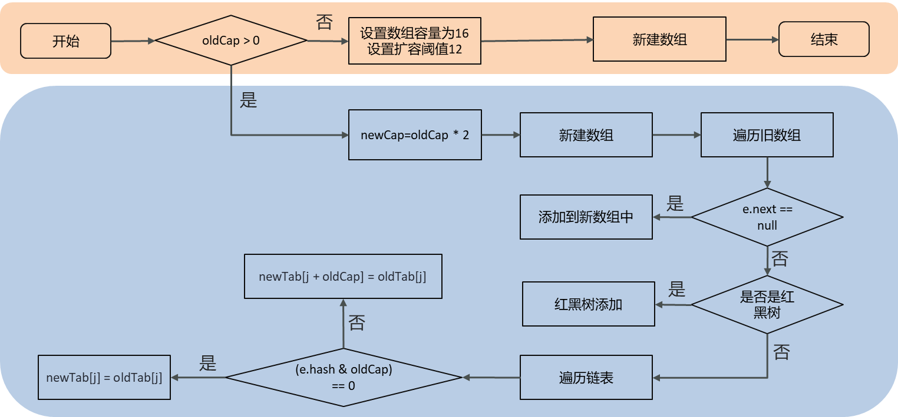

# 【集合篇04】：HashMap扩容机制，resize()源码解读

> 原创 于 2025-07-06 12:11:19 发布 · 公开 · 1k 阅读 · 8 · 24 · CC 4.0 BY-SA版权 版权声明：本文为博主原创文章，遵循 CC 4.0 BY-SA 版权协议，转载请附上原文出处链接和本声明。
> 文章链接：https://blog.csdn.net/lyh2004_08/article/details/149148936

**文章目录**

[TOC]


通过前文内容： [HashMap实现原理](https://blog.csdn.net/lyh2004_08/article/details/149144845) ，我们知道它通过哈希表实现 O(1) 的平均时间复杂度，也了解它在 JDK1.8 引入了红黑树来优化哈希冲突但还有一个核心操作，是保证 HashMap 高效运行的关键，那就是 **扩容（resize）** 

当 HashMap 中的元素越来越多，达到某个临界点时，哈希冲突的概率会急剧增加，导致链表或红黑树变得越来越庞大，从而影响性能为了解决这个问题，HashMap 会进行扩容，即创建一个更大的数组，并将所有元素重新分配到这个新数组中这个过程就由 `resize()` 方法完成

## 一、扩容的时机

在深入源码之前，我们首先要明确 `resize()` 方法在何时被调用：

1.  **初始化时：** 当我们使用 `new HashMap()` 创建一个实例时，内部的数组（ `table` ）其实是 `null` ，只有在第一次调用 `put` 方法添加元素时， `resize()` 才会被调用，完成数组的初始化，默认容量为 16

2.  **达到扩容阈值时：** 在不断向 HashMap 中添加元素后，如果 `HashMap` 的元素数量（ `size` ）超过了 **扩容阈值（threshold）** ， `resize()` 方法也会被调用，这个阈值通常是 `当前数组容量 * 加载因子` （ `capacity * loadFactor` ）， `loadFactor` 默认值为 `0.75` 

### 流程图解

 

---

## 二、 `resize()` 源码剖析：第一部分 - 容量与阈值计算

`resize()` 方法的逻辑可以分为两大部分： **计算新容量和新阈值** ，以及 **数据迁移** 我们先来看第一部分

```java
final Node<K,V>[] resize() {
    Node<K,V>[] oldTab = table;
    int oldCap = (oldTab == null) ? 0 : oldTab.length;
    int oldThr = threshold;
    int newCap, newThr = 0;

    // --- 核心计算逻辑开始 ---
    if (oldCap > 0) { // 情况一：数组已经初始化，进行正常扩容
        if (oldCap >= MAXIMUM_CAPACITY) {
            threshold = Integer.MAX_VALUE;
            return oldTab;
        }
        // 将新容量设置为老容量的2倍，并判断是否超过最大容量
        else if ((newCap = oldCap << 1) < MAXIMUM_CAPACITY &&
                 oldCap >= DEFAULT_INITIAL_CAPACITY)
            // 新的阈值也设置为老的2倍
            newThr = oldThr << 1; // double threshold
    }
    else if (oldThr > 0) { // 情况二：数组未初始化，但构造时指定了初始容量
        // 这种情况下，初始容量值被保存在 threshold 变量里
        newCap = oldThr;
    }
    else { // 情况三：数组未初始化，且构造时未指定容量（调用 new HashMap()）
        // 使用默认值
        newCap = DEFAULT_INITIAL_CAPACITY; // 16
        newThr = (int)(DEFAULT_LOAD_FACTOR * DEFAULT_INITIAL_CAPACITY); // 16 * 0.75 = 12
    }

    // --- 处理情况二中 newThr 未被赋值的问题 ---
    if (newThr == 0) {
        float ft = (float)newCap * loadFactor;
        newThr = (newCap < MAXIMUM_CAPACITY && ft < (float)MAXIMUM_CAPACITY ?
                  (int)ft : Integer.MAX_VALUE);
    }

    // --- 更新阈值并创建新数组 ---
    threshold = newThr;
    @SuppressWarnings({"rawtypes","unchecked"})
    Node<K,V>[] newTab = (Node<K,V>[])new Node[newCap];
    table = newTab;
    // ... 后续为数据迁移逻辑
}
```

这部分代码逻辑非常清晰，主要处理了三种情况：

> 

-  **情况一（ `oldCap > 0` ）：** 这是最常见的扩容场景，数组已经存在，直接将容量（ `newCap` ）和阈值（ `newThr` ）都扩大为原来的 **2 倍** 

-  **情况二（ `oldThr > 0` ）：** 对应 `new HashMap(initialCapacity)` 的场景，此时 `table` 还是 `null` ，但 `threshold` 字段被用来临时存储用户指定的 `initialCapacity` 所以，直接将 `newCap` 设置为这个值

-  **情况三（ `else` ）：** 对应 `new HashMap()` 的场景，此时 `table` 为 `null` ， `threshold` 为 0，直接使用系统默认的容量（16）和阈值（12）

在计算出新的容量 `newCap` 和新的阈值 `newThr` 后，就创建了一个新的、更大的数组 `newTab` ，并将其赋值给 `table` 

---

## 三、 `resize()` 源码剖析：第二部分 - 数据迁移

创建了新数组后，接下来的任务就是将旧数组（ `oldTab` ）中的所有元素迁移到新数组（ `newTab` ）中这部分是 `resize()` 的精髓所在

```java
if (oldTab != null) {
    // 遍历旧数组的每一个桶
    for (int j = 0; j < oldCap; ++j) {
        Node<K,V> e;
        if ((e = oldTab[j]) != null) {
            oldTab[j] = null; // 释放旧数组的引用，便于GC

            // 情况 A: 桶中只有一个节点
            if (e.next == null)
                newTab[e.hash & (newCap - 1)] = e;
          
            // 情况 B: 桶中是红黑树
            else if (e instanceof TreeNode)
                ((TreeNode<K,V>)e).split(this, newTab, j, oldCap);
          
            // 情况 C: 桶中是链表（最核心的优化点）
            else { 
                Node<K,V> loHead = null, loTail = null;
                Node<K,V> hiHead = null, hiTail = null;
                Node<K,V> next;
                do {
                    next = e.next;
                    // --- 精妙的判断逻辑 ---
                    if ((e.hash & oldCap) == 0) {
                        if (loTail == null)
                            loHead = e;
                        else
                            loTail.next = e;
                        loTail = e;
                    }
                    else {
                        if (hiTail == null)
                            hiHead = e;
                        else
                            hiTail.next = e;
                        hiTail = e;
                    }
                } while ((e = next) != null);

                // 将拆分后的低位链表放入新数组的原索引位置
                if (loTail != null) {
                    loTail.next = null;
                    newTab[j] = loHead;
                }
                // 将拆分后的高位链表放入新数组的 "原索引 + 老容量" 位置
                if (hiTail != null) {
                    hiTail.next = null;
                    newTab[j + oldCap] = hiHead;
                }
            }
        }
    }
}
return newTab;
```

### 数据迁移过程同样分情况处理

-  **A - 单个节点：** 如果桶里只有一个节点，直接用它的哈希值和新容量 `newCap` 计算出新的索引位置，然后放进去即可，计算方式是 `e.hash & (newCap - 1)` 

-  **B - 红黑树：** 如果是红黑树，则调用 `split()` 方法这个方法会负责将树中的节点重新分配到新数组的两个可能位置上，并可能在节点数过少时将树退化为链表

-  **C - 链表：** 这是最常见也是最巧妙的部分它并没有像 JDK1.7 那样对链表中的每个节点都重新计算一次哈希索引，而是利用了一个非常精妙的特性： **由于容量是 2 的幂次方，扩容后，一个桶中的元素只可能去往两个位置：要么留在原索引位置，要么移动到 `原索引 + 老容量` 的位置** 

### 核心优化点： `(e.hash & oldCap) == 0` 

这个判断是如何决定元素去向的呢？

-  `oldCap` 是旧数组的容量，它一定是 2 的幂（例如 16，二进制为 `10000` ）

-  `e.hash & oldCap` 这个位运算，实际上是在检查 `e.hash` 在 `oldCap` 的最高位上是 `0` 还是 `1` 

- 如果结果为 `0` ，说明该元素的哈希值在该位上是 `0` 扩容后，它的新索引与旧索引完全相同这些元素被串在一起，形成 **低位链表（lo-list）** 

- 如果结果不为 `0` ，说明该元素的哈希值在该位上是 `1` 扩容后，它的新索引就是 `旧索引 + oldCap` 这些元素被串在一起，形成 **高位链表（hi-list）** 

通过一次遍历，源码就巧妙地将一个长链表拆分成了两个子链表（ `loHead` 和 `hiHead` ），然后将这两个子链表分别放置到新数组的对应位置，极大地提高了扩容效率（但是对于链表元素到扩容后的数组中的分散性不如jdk1.7）

---

## 四、总结

通过对 `resize()` 源码的剖析，我们可以总结出HashMap 扩容的核心原理：

1.  **时机：** 首次 `put` 时进行初始化，或当元素数量超过 `容量 * 加载因子` 时进行扩容

2.  **容量变化：** 每次扩容，容量和阈值都变为原来的 **2 倍** 

3.  **数据迁移：** 创建一个 2 倍大的新数组，并遍历旧数组中的所有元素，将其重新分配到新数组中

4.  **迁移优化：** 迁移链表数据时，利用 `(e.hash & oldCap) == 0` 的位运算，巧妙地将一个链表拆分为两个子链表，分别放到新数组的 **原索引** 位置和 **原索引 + 旧容量** 的位置，避免了对每个节点进行重新计算哈希的开销

