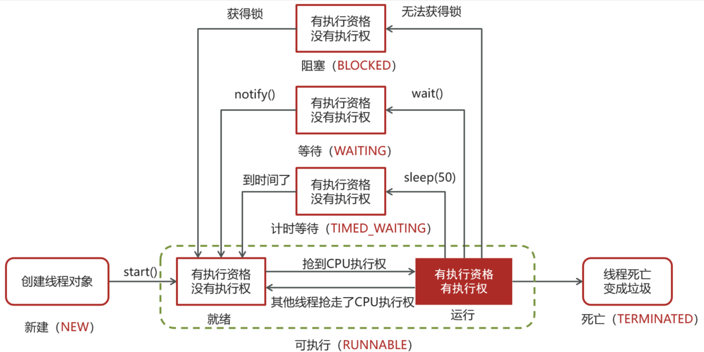

# 【多线程篇03】：一篇看懂线程的6种状态

> 原创 已于 2025-07-08 18:53:27 修改 · 公开 · 1.4k 阅读 · 50 · 30 · CC 4.0 BY-SA版权 版权声明：本文为博主原创文章，遵循 CC 4.0 BY-SA 版权协议，转载请附上原文出处链接和本声明。
> 文章链接：https://blog.csdn.net/lyh2004_08/article/details/149204383

**文章目录**

[TOC]


对于Java后端开发者来说，多线程是绕不开的核心技术，而理解线程的状态及其转换机制，是深入学习并发编程的第一步，也是面试中的高频考点
本文将基于JDK `Thread.State` 枚举，彻底搞懂Java线程的六种状态以及它们之间是如何流转的

## 一、 官方定义： `Thread.State` 枚举

Java在 `java.lang.Thread` 类中，以一个内部枚举 `State` 的形式，清晰地定义了线程在其生命周期中所拥有的六种状态，以下是源码定义，这是我们讨论一切的基础

```java
public enum State {
    /**
     * 新建状态：尚未启动的线程
     */
    NEW,

    /**
     * 可运行状态：正在JVM中执行，但可能在等待操作系统资源（如CPU）
     */
    RUNNABLE,

    /**
     * 阻塞状态：等待监视器锁（monitor lock）的线程
     */
    BLOCKED,

    /**
     * 无限等待状态：等待另一个线程执行特定操作
     * 例如：
     * - 调用 Object.wait() 且不带超时
     * - 调用 Thread.join() 且不带超时
     * - 调用 LockSupport.park()
     */
    WAITING,

    /**
     * 限时等待状态：在指定时间内等待另一个线程执行特定操作
     * 例如：
     * - 调用 Thread.sleep(long)
     * - 调用 Object.wait(long)
     * - 调用 Thread.join(long)
     * - 调用 LockSupport.parkNanos(long) / parkUntil(long)
     */
    TIMED_WAITING,

    /**
     * 终止状态：已完成执行的线程
     */
    TERMINATED;
}
```

---

## 二、 状态详解与转换关系

理解了六种状态的定义，接下来我们通过一个状态转换图来串联起这些状态，并详细解释每种转换是如何发生的
 

### 1. 新建 (NEW) -> 可运行 (RUNNABLE)

-  **状态描述** ：当使用 `new Thread()` 创建一个线程对象后，该线程就处于 `NEW` 状态，此时，它仅仅是一个Java对象，JVM尚未为其分配任何系统资源，也未与操作系统底层的线程关联

-  **转换触发** ：调用线程对象的 `start()` 方法

-  **细节** ： `start()` 方法是一个关键的“分水岭”，调用后，JVM会向操作系统申请创建一个对应的原生线程，并将其纳入操作系统的线程调度器管理，此时，线程状态变为 `RUNNABLE` ，注意，进入 `RUNNABLE` 并不意味着立刻执行，只是表示“可以被CPU执行了”，具体何时执行取决于操作系统的调度，

### 2. 可运行 (RUNNABLE) <-> 阻塞 (BLOCKED)

-  **状态描述** ： `BLOCKED` 状态与 `synchronized` 关键字（即监视器锁 Monitor）强相关

-  **`RUNNABLE` -> `BLOCKED`** ：

  -  **转换触发** ：线程尝试进入一个 `synchronized` 修饰的同步代码块或方法，但该代码块的监视器锁已被其他线程持有

  -  **细节** ：获取锁失败的线程会进入该锁的 **阻塞队列 (Entry Set)** ，状态变为 `BLOCKED` ，处于此状态的线程 **不会占用CPU时间** 

-  **`BLOCKED` -> `RUNNABLE`** ：

  -  **转换触发** ：持有该监视器锁的线程释放了锁（即退出了同步代码块）

  -  **细节** ：操作系统会从该锁的阻塞队列中，按照一定规则（可能是公平或非公平）唤醒一个或多个 `BLOCKED` 状态的线程，让它们重新去竞争锁，被唤醒的线程状态变回 `RUNNABLE` ，但只有成功竞争到锁的线程才能继续执行

### 3. 可运行 (RUNNABLE) <-> 等待 (WAITING / TIMED_WAITING)

这两个状态都表示线程在等待，区别在于有无时间限制

-  **`RUNNABLE` -> `WAITING`** 

  -  **转换触发** ：线程在 **持有锁** 的情况下，调用了不带超时的 `Object.wait()` 、 `Thread.join()` 或 `LockSupport.park()` 

  -  **`Object.wait()` 细节** ：这是最经典的情况，线程必须先持有对象的监视器锁，才能调用该对象的 `wait()` 方法，调用后，线程会 **立即释放持有的锁** ，并进入该对象的 **等待集合 (Wait Set)** ，状态变为 `WAITING` ，此状态同样不占用CPU

-  **`RUNNABLE` -> `TIMED_WAITING`** 

  -  **转换触发** ：与 `WAITING` 类似，但调用的是带超时参数的方法，如 `Thread.sleep(long)` 、 `Object.wait(long)` 、 `Thread.join(long)` 等

  -  **`Thread.sleep(long)` 细节** ：这是一个特殊情况，调用 `sleep` 方法会让线程进入 `TIMED_WAITING` 状态，但它 **并不会释放任何它已持有的锁** ，这是 `sleep` 和 `wait` 的一个核心区别

  -  **`Object.wait(long)` 细节** ：与 `wait()` 类似，调用后会 **释放锁** 并进入等待集合，但它有一个最长等待时间

-  **`WAITING / TIMED_WAITING` -> `RUNNABLE` / `BLOCKED`** 

  -  **转换触发** ：

    1. 对于 `WAITING` 状态的线程（由 `wait()` 导致），等待另一个线程在 **同一个对象** 上调用 `Object.notify()` 或 `Object.notifyAll()` 

    2. 对于 `TIMED_WAITING` 状态的线程，除了上述 `notify/notifyAll` 唤醒外，等待时间超时也会自动唤醒

  -  **【面试重点细节】** ：被唤醒的线程 **并不会立刻恢复到 `RUNNABLE` 状态** 它会从等待集合 (Wait Set) 移动到阻塞队列 (Entry Set)，状态变为 `BLOCKED` ，然后重新去竞争锁，只有当它再次成功获取到锁之后，才会从 `BLOCKED` 状态转换回 `RUNNABLE` 状态继续执行

### 4. 可运行 (RUNNABLE) -> 终止 (TERMINATED)

-  **状态描述** ：线程的使命终结

-  **转换触发** ：

  1. 线程的 `run()` 方法正常执行完毕，自然退出

  2.  `run()` 方法因未捕获的异常而意外终止

-  **细节** ：一旦线程进入 `TERMINATED` 状态，它的生命周期就结束了，不能再通过调用 `start()` 方法使其复活，此时，与操作系统底层的线程关联也会被取消

---

## 三、 总结与面试要点

在面试中，当被问及线程状态时，你可以按照以下逻辑进行回答，会显得条理非常清晰：

1.  **总述** ：首先点明Java线程有六种状态，它们定义在 `Thread.State` 枚举中，分别是： `NEW` 、 `RUNNABLE` 、 `BLOCKED` 、 `WAITING` 、 `TIMED_WAITING` 和 `TERMINATED` 

2.  **核心路径** ：描述一个线程从创建到消亡的“正常”路径： `NEW` -> ( `start()` ) -> `RUNNABLE` -> ( `run()` 方法结束) -> `TERMINATED` 
    

3.  **重点转换（并发场景）** ：

   -  **`BLOCKED` 状态** ：重点讲解它与 `synchronized` 锁竞争的关系， `RUNNABLE` 线程获取锁失败 -> `BLOCKED` ；持锁线程释放锁 -> `BLOCKED` 线程被唤醒，变为 `RUNNABLE` 去重新竞争

   -  **`WAITING` / `TIMED_WAITING` 状态** ：重点讲解它与 `Object.wait/notify` 机制的关系， `RUNNABLE` 线程持有锁并调用 `wait()` -> **释放锁** 并进入 `WAITING` ；其他线程调用 `notify()` -> `WAITING` 线程被唤醒，进入 `BLOCKED` 状态去竞争锁，成功后再变回 `RUNNABLE` 

   -  **对比 `sleep` 和 `wait`** ：这是一个必考的差异点， `sleep` 进入 `TIMED_WAITING` 但 **不释放锁** ，时间到了自动唤醒； `wait` 进入 `WAITING` / `TIMED_WAITING` **会释放锁** ，需要被 `notify/notifyAll` 或超时来唤醒
      `sleep` 进入 `TIMED_WAITING` 但 **不释放锁** ，时间到了自动唤醒； `wait` 进入 `WAITING` / `TIMED_WAITING` **会释放锁** ，需要被 `notify/notifyAll` 或超时来唤醒

