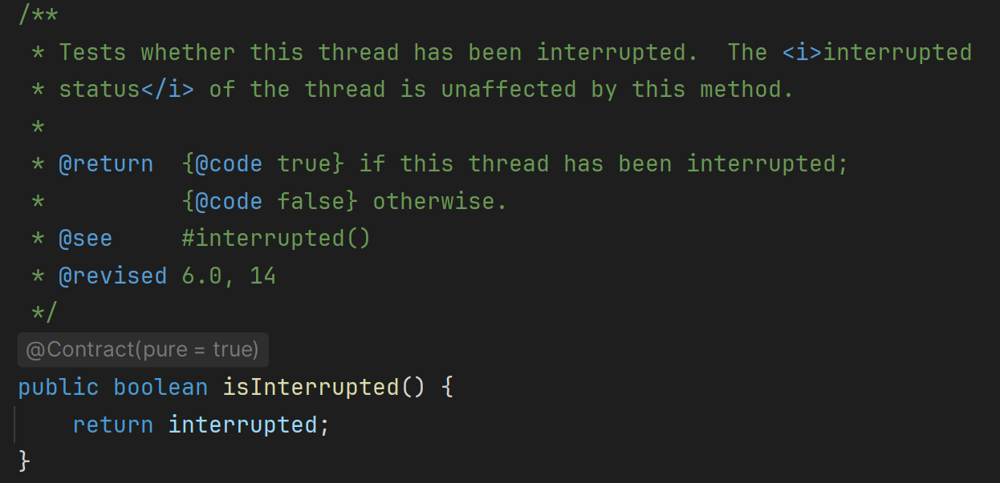
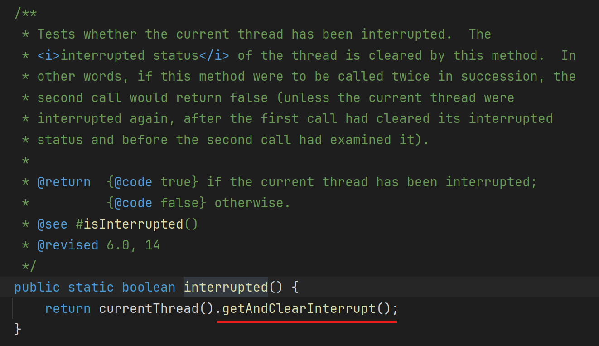
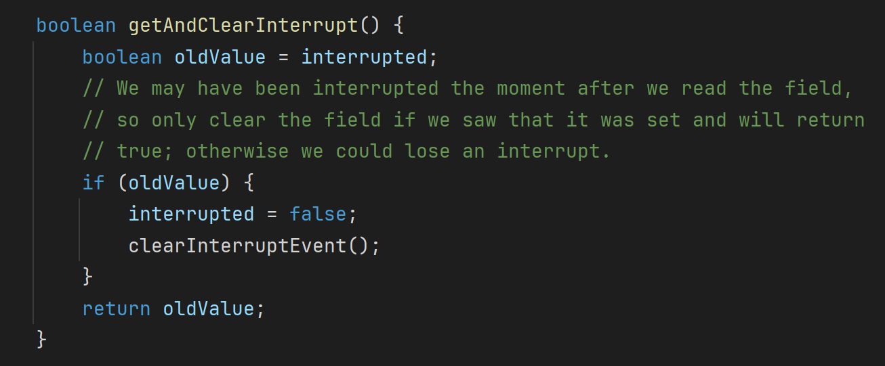

# 【多线程篇05】：详解interrupt()方法中断线程的机制

> 原创 已于 2025-07-12 11:13:20 修改 · 公开 · 1.1k 阅读 · 55 · 19 · CC 4.0 BY-SA版权 版权声明：本文为博主原创文章，遵循 CC 4.0 BY-SA 版权协议，转载请附上原文出处链接和本声明。
> 文章链接：https://blog.csdn.net/lyh2004_08/article/details/149290927

**文章目录**

[TOC]


## 一、 核心概念：中断不是命令，是信号

首先，我们必须明确：调用一个线程的 `interrupt()` 方法，并不会直接终止该线程。它做的事情仅仅是设置该线程的中断标志位（interrupted flag）为 `true` 

可以把这个中断标志位想象成每个线程对象内部的一个 `boolean` 变量。 `interrupt()` 方法就是去修改这个变量。至于线程接收到这个信号后该做什么，完全取决于线程自身的代码逻辑

为了配合这个机制， `Thread` 类提供了两个关键方法来检查中断状态：

1.  `public boolean isInterrupted()` 检查目标线程的中断标志位。这是一个实例方法，调用它不会改变中断标志位的状态

 

2. `public static boolean interrupted()` 检查当前线程的中断标志位，并且会 **清除** 该标志位（即将其重置为 `false` ）。这是一个静态方法，请注意它的副作用
 

 

搞清楚“中断只是一个信号旗”这个核心思想后，我们再来看它在不同场景下的具体表现

---

## 二、 场景一：中断一个正常运行的线程 ( `RUNNABLE` )

当一个线程正处于 `RUNNABLE` 状态，即它正在执行代码（没有调用 `sleep` , `wait` , `join` 等方法），此时对它调用 `interrupt()` 会发生什么？

> 行为：仅仅是将其内部的中断标志位设置为 `true` 
> 
> 影响：线程会继续执行，不会抛出任何异常，其 `Thread.State` 也不会改变

在这种情况下，中断机制的协作性就体现出来了。线程需要 **自己在代码中** 通过 `isInterrupted()` 或 `Thread.interrupted()` **主动检查中** 断状态，并决定如何响应。

代码示例：

```java
class WorkerThread extends Thread {
    @Override
    public void run() {
        // 通过检查中断标志位来决定是否继续循环，注意while条件
        while (!Thread.currentThread().isInterrupted()) {
            System.out.println("Worker is running...");
            // 模拟工作
            try {
                Thread.sleep(500); // 即使有sleep，逻辑上也是在循环中检查
            } catch (InterruptedException e) {
                // 如果在sleep时被中断，会进入这里
                System.out.println("Worker was interrupted during sleep!");
                // 捕获异常后，中断标志位会被清除。如果希望循环能正确退出，需要再次设置中断标志位
                Thread.currentThread().interrupt(); 
            }
        }
        System.out.println("Worker thread has stopped.");
    }
}

public class InterruptRunningDemo {
    public static void main(String[] args) throws InterruptedException {
        WorkerThread worker = new WorkerThread();
        worker.start();

        // 主线程休眠一会，让worker线程运行2秒
        Thread.sleep(2000);

        System.out.println("Main thread is interrupting worker thread...");
        worker.interrupt(); // 发送中断信号
    }
}
```

运行以上代码，输出：

```
Worker is running...
Worker is running...
Worker is running...
Worker is running...
Main thread is interrupting worker thread...
Worker was interrupted during sleep!
Worker thread has stopped.
```

在上面的例子中， `WorkerThread` 通过 `while (!isInterrupted())` 的方式来响应中断，实现了优雅的停止

---

## 三、 场景二：中断一个阻塞的线程 ( `WAITING` `TIMED_WAITING` )

当线程因为调用了 `Object.wait()` , `Thread.join()` , `Thread.sleep()` 等方法而处于 `WAITING` 或 `TIMED_WAITING` 状态时，对它调用 `interrupt()` 会发生什么

这是中断机制最常见的应用场景

> 行为：线程会立即从阻塞状态中唤醒
> 
> 影响：唤醒的同时，它不会正常返回，而是会抛出一个 `InterruptedException` 
> 
> 细节：在抛出 `InterruptedException` 的同时，JVM会自动清除线程的中断标志位（即将其重置为 `false` ）

代码示例：

```java
public class InterruptBlockedDemo {
    public static void main(String[] args) {
        Thread sleeper = new Thread(() -> {
            try {
                System.out.println("Sleeper is going to sleep for 10 seconds.");
                Thread.sleep(10000); // 线程将阻塞在这里
                System.out.println("Sleeper woke up normally.");
            } catch (InterruptedException e) {
                // 当sleep被中断时，会立即进入catch块
                System.out.println("Sleeper was interrupted!");
                System.out.println("Is sleeper interrupted? " + Thread.currentThread().isInterrupted());
            }
        });

        sleeper.start();

        // 主线程等待1秒后，中断sleeper线程
        try {
            Thread.sleep(1000);
        } catch (InterruptedException e) {
            e.printStackTrace();
        }
        
        System.out.println("Main thread is interrupting sleeper thread...");
        sleeper.interrupt();
    }
}
```

运行以上代码，输出：

```
Sleeper is going to sleep for 10 seconds.
Main thread is interrupting sleeper thread...
Sleeper was interrupted!
Is sleeper interrupted false
```

注意最后一行输出为 `false` ，这完美地证明了在捕获 `InterruptedException` 后，中断标志位已经被 **清除** 了

---

## 四、 总结与要点

1. 定性： `interrupt()` 不是强制终止，而是一种协作式的中断信号机制。它通过设置目标线程的内部中断标志位来工作

2. 分情况讨论：

   - 对于运行中 ( `RUNNABLE` ) 的线程：调用 `interrupt()` 仅设置中断标志位为 `true` ，线程继续运行。需要线程代码自身通过 `isInterrupted()` 来检查并响应中断

   - 对于阻塞中 ( `WAITING``TIMED_WAITING` ) 的线程（如 `sleep` , `wait` , `join` ）：调用 `interrupt()` 会使线程立即抛出 `InterruptedException` 并被唤醒。一个关键细节是，抛出异常的同时，中断标志位会被JVM自动清除（重置为 `false` ）

3. 最佳实践：当捕获到 `InterruptedException` 时，不应该“吞掉”它（即 `catch` 块为空）。如果不能处理，标准的做法是再次调用 `Thread.currentThread().interrupt()` 来恢复中断状态，以便让 **调用栈上层的代码能够知道发生了中断** 
   最佳实践：当捕获到 `InterruptedException` 时，不应该“吞掉”它（即 `catch` 块为空）。如果不能处理，标准的做法是再次调用 `Thread.currentThread().interrupt()` 来恢复中断状态，以便让 **调用栈上层的代码能够知道发生了中断** 

