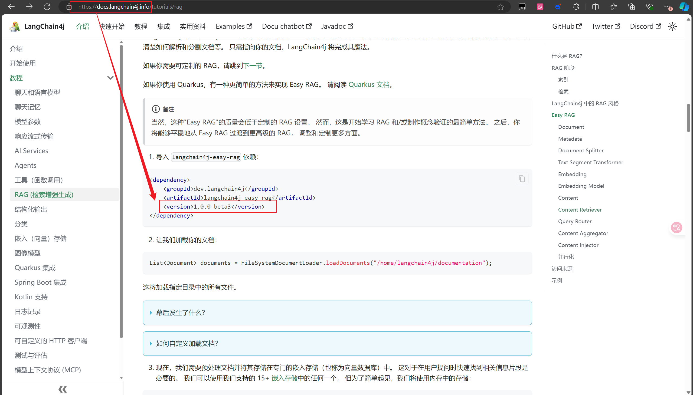
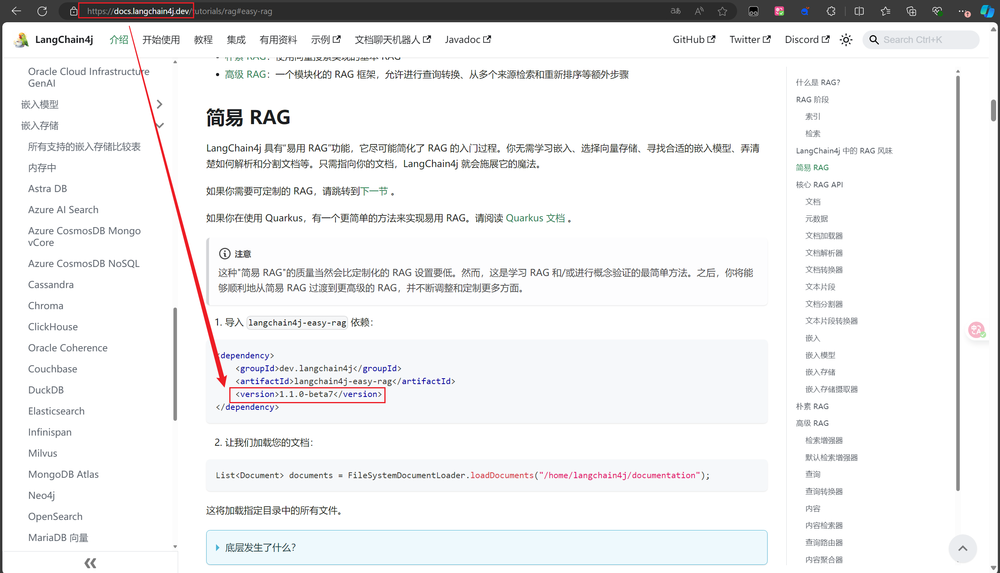
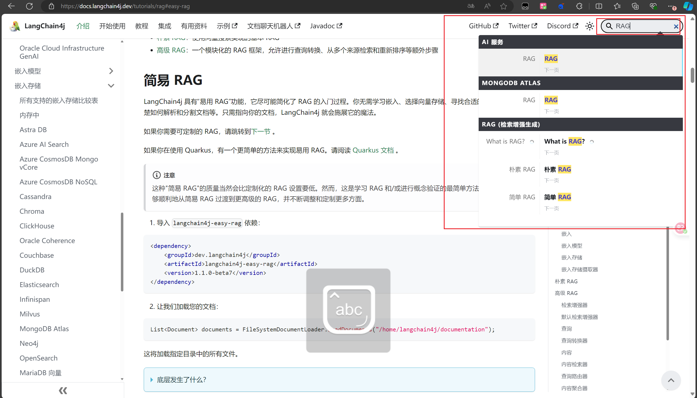

# 关于langchain4j的文档官网的一个版本问题

> 原创 于 2025-07-13 11:56:27 发布 · 公开 · 255 阅读 · 7 · 3 · CC 4.0 BY-SA版权 版权声明：本文为博主原创文章，遵循 CC 4.0 BY-SA 版权协议，转载请附上原文出处链接和本声明。
> 文章链接：https://blog.csdn.net/lyh2004_08/article/details/149258171

langchain4j 有两套文档：

[https://docs.langchain4j.dev/](https://docs.langchain4j.info/) 和 [https://docs.langchain4j.info/](https://docs.langchain4j.info/) 

前者是 **英文文档** ，后者是 **中文文档** 

当前最新的版本是： **1.1.0-beta7** 

但是在 **中文文档** 的 **easy RAG 依赖** 导入处的文档版本<span style="color:#be191c">不对</span>：

 

**<span style="color:#1c7331">正确的版本：</span>** 

 

如果 langchain4j 的起步依赖等版本使用 1.1.0-beta7 ，这里 **easy RAG** 的依赖版本使用低版本 1.0.0-beta3，就会在创建 EmbeddingStoreIngestor 的过程中报某些文本分割器的 **无参构造器找不到** 的 **错误** 

> ```java
> EmbeddingStoreIngestor ingestor = EmbeddingStoreIngestor.builder()
>         .embeddingStore(embeddingStore)
>         .embeddingModel(embeddingModel) // 向量化模型
>         .build();
> ```

推荐使用官方英文文档： [LangChain4j | LangChain4j](https://docs.langchain4j.dev/) 

不仅如此， [LangChain4j | LangChain](https://docs.langchain4j.dev/) 还支持相关知识点搜索，这也是中文文档没有的：

 

