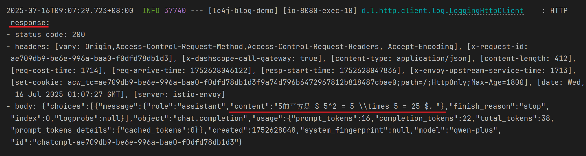

# 【langchain4j篇01】：5分钟上手langchain4j 1.1.0（SpringBoot整合使用）

> 原创 已于 2025-07-16 09:26:01 修改 · 公开 · 1.7k 阅读 · 44 · 17 · CC 4.0 BY-SA版权 版权声明：本文为博主原创文章，遵循 CC 4.0 BY-SA 版权协议，转载请附上原文出处链接和本声明。
> 文章链接：https://blog.csdn.net/lyh2004_08/article/details/149386001

**目录**

[TOC]


## 一、环境准备

首先和快速上手 Spring AI 框架一样的前置条件：先申请一个 **apikey** ，此部分步骤参考：[【SpringAI篇01】：5分钟教会你使用SpringAI （1.0.0稳定版）_spring-ai 1.0.0使用教程-CSDN博客](https://blog.csdn.net/lyh2004_08/article/details/148925217) 的 **前半部分** 即可

---

## 二、创建项目、导入依赖

1. 同样，langchain4j 对于 jdk 的要求最低也是 **jdk17** ，按照下图操作即可

 

2. 导入一个 spring 的 **web** 依赖：

 

3. 项目创建完毕，按照官网教程导入 langchain4j 的 **低级API** （后续还有 **高级API** ）的 **起步依赖** （当前最新版本）：

```XML
<dependency>
    <groupId>dev.langchain4j</groupId>
    <artifactId>langchain4j-open-ai-spring-boot-starter</artifactId>
    <version>1.1.0-beta7</version>
</dependency>
```

> 参考资料： [Spring Boot 集成 | LangChain4j --- Spring Boot Integration | LangChain4j](https://docs.langchain4j.dev/tutorials/spring-boot-integration) 
> 
>  

---

## 三、配置 application.yml

随后，在 application.yml 或 application.properties 中配置如下配置：

```XML
langchain4j:
  open-ai:
    chat-model:
      base-url: https://dashscope.aliyuncs.com/compatible-mode/v1 # 百炼平台的baseUrl
      api-key: ${langchain4j.api-key} # 你刚刚申请的apiKey
      model-name: qwen-plus # 你想使用的对话模型模型名
      log-requests: true # 是否打印请求日志
      log-responses: true # 是否打印响应日志
```

其中各项配置作用已在代码中表明。不过显然，langchain4j 与 SpringAI 一样，也都可以在创建model时自定义配置

---

## 四、注入Bean，开箱即用

由于前进做了相关模型的配置，langchain4j 的自动装配会为我们提供一个基于配置的默认 **OpenAiChatModel** ，我们直接创建一个Controller， **注入使用** 即可

```java
package xyz.qiquqiu.lc4blogdemo.controller;
 
import dev.langchain4j.model.openai.OpenAiChatModel;
import lombok.RequiredArgsConstructor;
import lombok.extern.slf4j.Slf4j;
import org.springframework.web.bind.annotation.RequestMapping;
import org.springframework.web.bind.annotation.RestController;
 
@Slf4j
@RestController
@RequiredArgsConstructor
public class ChatController {
 
    private final OpenAiChatModel chatModel;
 
    /**
     * 调用百炼的大模型进行聊天（阻塞式）
     * @param message 用户发送的消息，相当于提示词prompt
     * @return
     */
    @RequestMapping("/chat")
    public String chat(String message) {
        log.debug("用户说：{}", message);
        return chatModel.chat(message);
    }
}
```

随后，打开浏览器，访问 chat 接口，测试效果：

 

---

## 五、日志观察

由于我们配置了请求与响应时打印日志的配置：

 

所以我们可以结合 **控制台输出** ，清晰地看到请求响应的过程：

**<span style="color:#1c7331">请求日志：</span>** 

 

**<span style="color:#1c7331">响应日志：</span>** 

 

