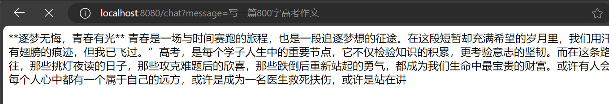
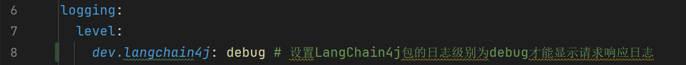
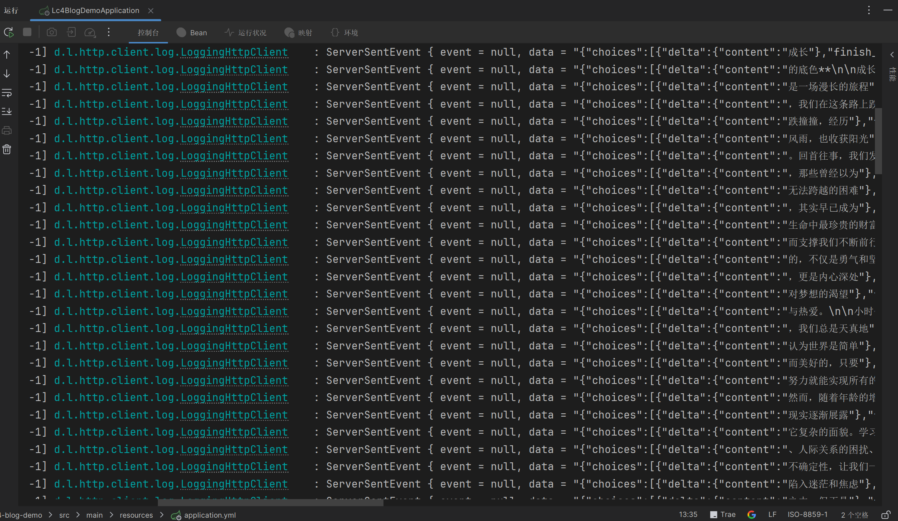
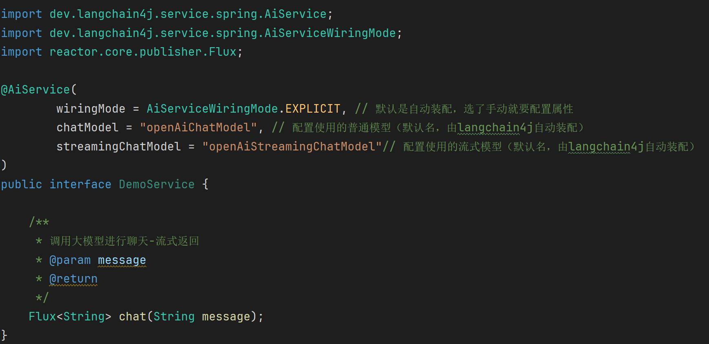
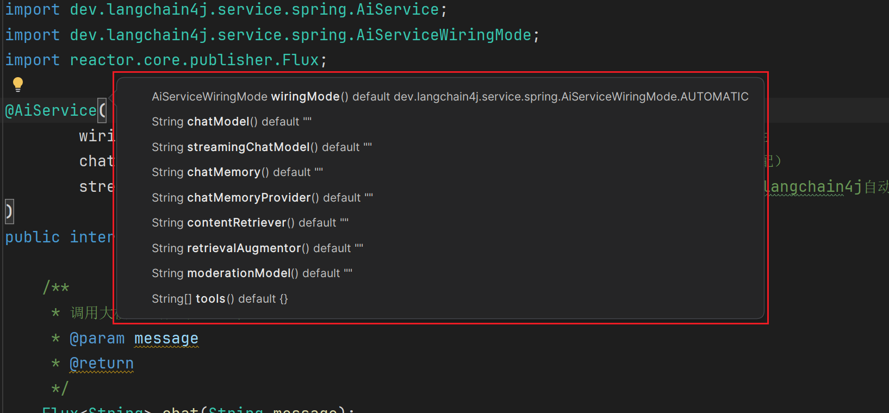
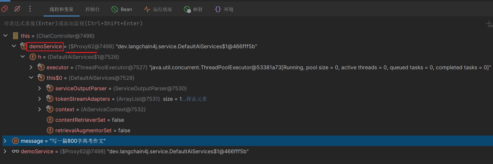

# 【langchain4j篇02】：配置流式响应及高级API的使用详解

> 原创 于 2025-07-17 08:15:00 发布 · 公开 · 1.3k 阅读 · 34 · 25 · CC 4.0 BY-SA版权 版权声明：本文为博主原创文章，遵循 CC 4.0 BY-SA 版权协议，转载请附上原文出处链接和本声明。
> 文章链接：https://blog.csdn.net/lyh2004_08/article/details/149391795

**目录**

[TOC]


上文我们快速入门了 [ **【langchain4j篇01】：5分钟上手langchain4j 1.1.0** ](https://blog.csdn.net/lyh2004_08/article/details/149386001) ，但是 OpenAiChatModel 只能实现阻塞式调用，下面结合 langchain4j 的 **高级API** 实现 **流式响应** 聊天

## 一、依赖导入

### 1. 导入高级API：AiServices相关依赖

```XML
<!-- LangChain4j声明式AiService起步依赖 -->
<dependency>
    <groupId>dev.langchain4j</groupId>
    <artifactId>langchain4j-spring-boot-starter</artifactId>
    <version>1.1.0-beta7</version>
</dependency>
```

### 2. 导入流式响应模型支持相关依赖

```XML
<!-- LangChain4j对流式模型的依赖 -->
<dependency>
    <groupId>dev.langchain4j</groupId>
    <artifactId>langchain4j-reactor</artifactId>
    <version>1.1.0-beta7</version>
</dependency>
```

### 3. 配置 **application.yml** 

```XML
langchain4j:
  open-ai:
    streaming-chat-model: # 流式聊天模型，与chat-model同级
      base-url: https://dashscope.aliyuncs.com/compatible-mode/v1
      api-key: ${langchain4j.api-key}
      model-name: qwen-max-latest
      log-requests: true
      log-responses: true
```

>  **注意：** 原先的普通聊天模型 **langchain4j.open-ai.chat-model** 与 streaming-chat-model同级且 **不冲突** 

---

## 二、创建 AiService 代理接口

### 1. 创建自定义Service接口

**langchain4j 的<span style="color:#ad720d">高级API</span>AiService 提供了声明式的使用方式** ，首先创建一个接口，添加 **@AiService** 注解，再将先前controller 层的 chat 方法，提取到该接口之中，同时将返回值类型改为 Flux<String> （流式响应）：

```java
package xyz.qiquqiu.lc4blogdemo.aiserverce;
 
import dev.langchain4j.service.spring.AiService;
import reactor.core.publisher.Flux;
 
@AiService
public interface DemoService {
 
    /**
     * 调用大模型进行聊天-流式返回
     * @param message 用户消息
     * @return 流式响应
     */
    Flux<String> chat(String message);
}
```

### 2. 在 controller 中调用

这么一个极简的接口就定义好了，接下来我们直接到 controller 中测试一把， **原理相关会在后文讲解** ：

```java
package xyz.qiquqiu.lc4blogdemo.controller;
 
import lombok.RequiredArgsConstructor;
import lombok.extern.slf4j.Slf4j;
import org.springframework.web.bind.annotation.RequestMapping;
import org.springframework.web.bind.annotation.RestController;
import reactor.core.publisher.Flux;
import xyz.qiquqiu.lc4blogdemo.aiserverce.DemoService;
 
@Slf4j
@RestController
@RequiredArgsConstructor
public class ChatController {
 
    private final DemoService demoService;
    // private final OpenAiChatModel chatModel;
 
    /**
     * 大模型聊天接口-流式响应
     * @param message 用户发送的消息，相当于提示词prompt
     * @return
     */
    @RequestMapping(value = "/chat", produces = "text/html;charset=utf-8")
    public Flux<String> chat(String message) {
        return demoService.chat(message);
    }
}
```

注意改动点：

- 注入刚刚创建的接口 **DemoService** ，而非 OpenAiChatModel 或者 StreamingChatModel

- 添加响应体内容解析格式，解决显示乱码： <u>produces = "text/html;charset=utf-8"</u> 

---

## 三、效果演示及原理简析

### 1. 效果演示

 

可以看到，已经成功实现流式输出

>  ***（补充）** <u>关于流式响应的日志开启</u>* 
> 
> 在打开上述的 log-response 为 true 之后，还要配置 langchain4j 包的日志等级为 DEBUG，如下图：
> 
>  

> 
> 然后就可以打印出持续的流式响应日志：
> 
>  

### 2. 扩展使用及原理简析

刚刚演示的只是 **@AiService** 注解最最简单的一种用法，实际上该注解有诸多属性，只不过由于我们配置了 **application.yml** 导致 ChatModel自动装配，且由于我们没有自定义其他同类型组件，这些组件名都是默认的，所以支持默认配置，实际上，刚才的 **@AiService** 注解就 **相当于这样** ：

 

- 其中，chatMode 属性和 streamingChatModel 属性，这里手动配置的都是默认值，所以效果就相当于之前的直接写一个 **@AiService** 

- 如果使用 @Bean **自定义** 一个流式响应类配置于此，就可走自定义的模型配置，替换调默认的 openAiStreamingChatModel

-  **注意** ，langchain4j 自动装配的流式响应类是 OpenAiStreamingChatModel 类型，虽然是 StreamingChatModel 子类，但是提供给我们的，开箱即用的 Bean 的默认名是 openAiStreamingChatModel 而非 streamingChatModel

> 该注解下还有更多 **高级组件** ，后文会一一讲解到：
> 
>  

关于实现的基本原理，显然，我们正在 controller 注入了 DemoService 接口的引用，但是却从未实例化，那么，创建对象的过程必然是由框架底层，通过 **@AiService** 注解，使用 **动态代理、反射** 创建的代理对象，来调用 chat 方法

打个断点，debug 运行，可以很清晰观察出，如下图所示的 **代理对象** ：

 

