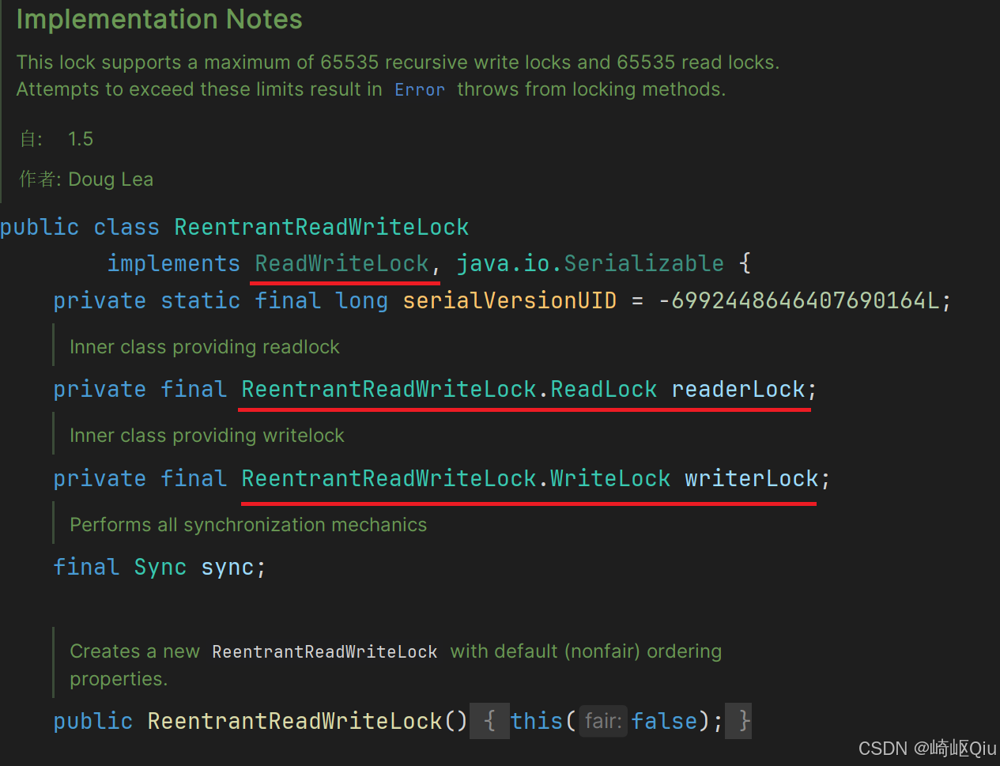

# 【多线程篇12】：一文看懂ReentrantReadWriteLock核心

> 原创 已于 2025-07-17 09:40:20 修改 · 公开 · 524 阅读 · 19 · 5 · CC 4.0 BY-SA版权 版权声明：本文为博主原创文章，遵循 CC 4.0 BY-SA 版权协议，转载请附上原文出处链接和本声明。
> 文章链接：https://blog.csdn.net/lyh2004_08/article/details/149414283

**文章目录**

[TOC]


## 1.ReentrantReadWriteLock是什么？

`ReentrantReadWriteLock` 是 JDK 提供的一个可重入的读写锁，它实现了 `ReadWriteLock` 接口。其核心设计目标是在保证线程安全的前提下，允许多个线程同时进行读操作，从而在特定场景下提升系统的并发性能

 

从 `ReadWriteLock` 接口定义可以看出，一个读写锁内部包含了两把具体的锁（内部类）：一把用于读操作（ `readLock()` ），另一把用于写操作（ `writeLock()` ）

---

## 2. 核心思想：读写分离与并发规则

为了理解 `ReentrantReadWriteLock` 的优势，我们需要对比它与普通排他锁（如 `ReentrantLock` ）在并发控制规则上的差异

-  **普通锁的并发规则：** 

  - 读-读互斥

  - 读-写互斥

  - 写-写互斥

  - （任何时候只允许一个线程访问临界区）

-  **读写锁的并发规则：** 

  -  **读-读不互斥（共享）** 

  - 读-写互斥

  - 写-写互斥

  - （允许多个线程同时读，但读和写、写和写之间仍是互斥的）

`ReentrantReadWriteLock` 的关键优化点就在于 **“读读不互斥”** 

---

## 3. 内部锁类型：共享锁与独占锁

`ReentrantReadWriteLock` 内部的两把锁性质不同，这正是实现读写分离的基础

-  **读锁（ReadLock）** ：通过 `readLock()` 方法获取。它是一种 **共享锁** ，可以被多个线程同时持有

-  **写锁（WriteLock）** ：通过 `writeLock()` 方法获取。它是一种 **独占锁** （或称排他锁），在任何时刻最多只能被一个线程持有

---

## 4. 公平性策略

与 `ReentrantLock` 类似， `ReentrantReadWriteLock` 也支持公平和非公平两种模式，默认为 **非公平锁** 。可以通过构造函数显式指定：

```java
// 默认构造器，创建非公平锁
public ReentrantReadWriteLock() {
    this(false);
}

// 传入 boolean 值，true 为公平锁，false 为非公平锁
public ReentrantReadWriteLock(boolean fair) {
    sync = fair ? new FairSync() : new NonfairSync();
    readerLock = new ReadLock(this);
    writerLock = new WriteLock(this);
}
```

-  **公平锁** ：线程获取锁的顺序与它们发出请求的顺序一致

-  **非公平锁** ：允许线程插队，可能导致某些线程长时间无法获取到锁，但通常有更高的吞吐量

---

## 5. 锁的升降级（细节）

-  **不支持锁升级（持有读锁，获取写锁）** 

  - 结论：在线程持有读锁的情况下，该线程 **不能** 再去获取写锁

  - 原因：获取写锁的前提是没有任何读锁或写锁被持有。当一个线程尝试获取写锁时，如果它发现当前存在读锁（即使是自己持有的），也会立即获取失败。这样设计是为了防止死锁

-  **支持锁降级（持有写锁，获取读锁）** 

  - 结论：在线程持有写锁的情况下，该线程 **可以** 继续获取读锁

  - 原因： `ReentrantReadWriteLock` 是可重入的。当一个线程持有写锁时，它拥有对临界区的完全独占访问权。此时，该线程再申请获取读锁是被允许的，因为这不会与任何其他线程产生冲突。获取读锁的条件是“写锁没有被其他线程占用”，当前线程持有写锁时，满足这个条件

---

## 6. 适用场景

根据其“读读共享、写写独占”的特性， `ReentrantReadWriteLock` 最适合用于 **“读多写少”** 的业务场景

在这样的场景下，大部分时间都是并发的读操作，使用 `ReentrantReadWriteLock` 可以允许多个读线程并行执行，大大提升系统吞吐量。如果使用普通的 `ReentrantLock` ，即使是读操作也必须串行执行，无法利用并发优势，导致性能瓶颈