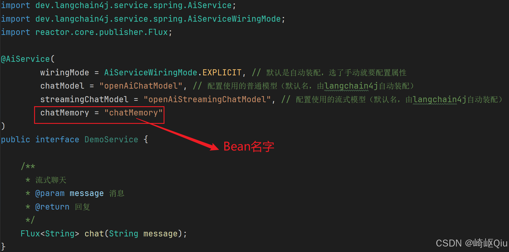
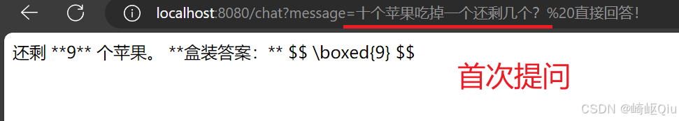
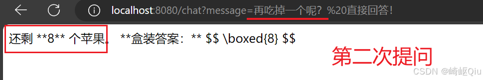
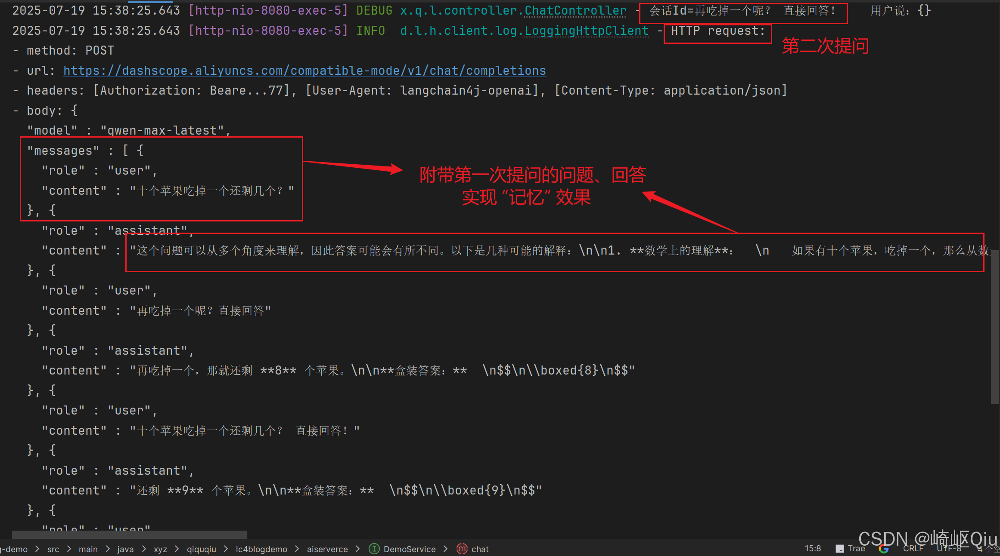
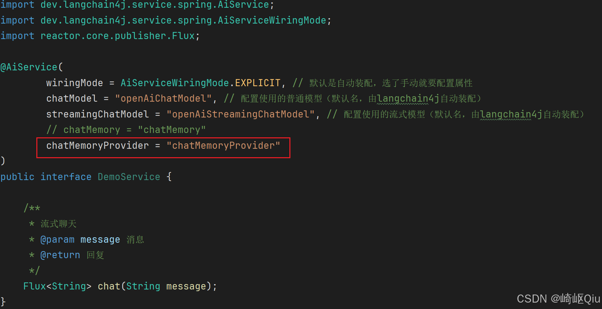
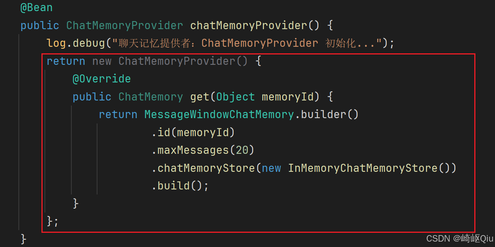
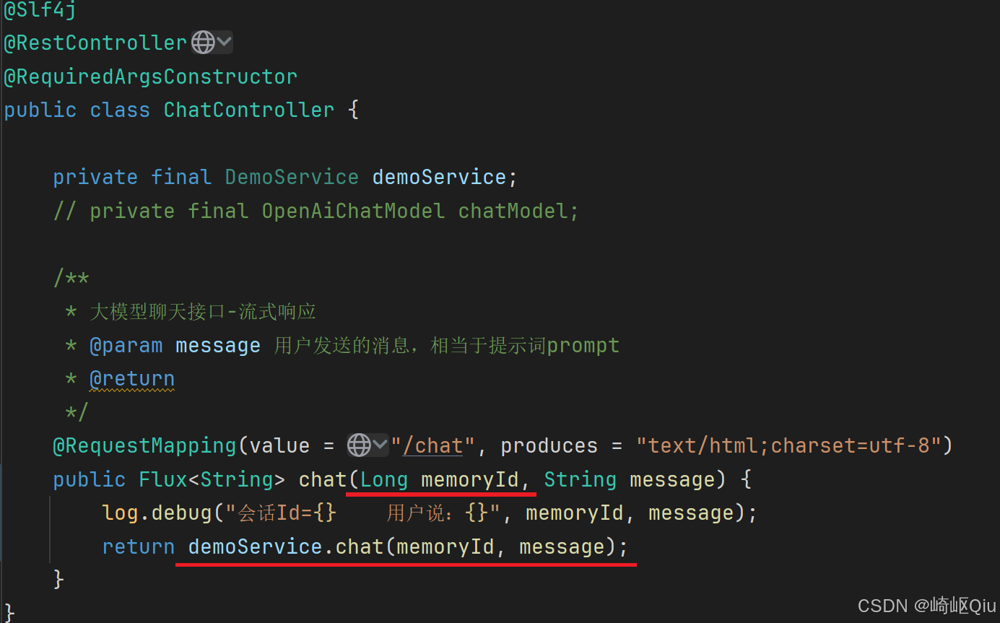
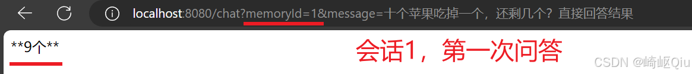
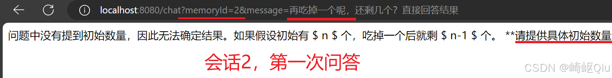
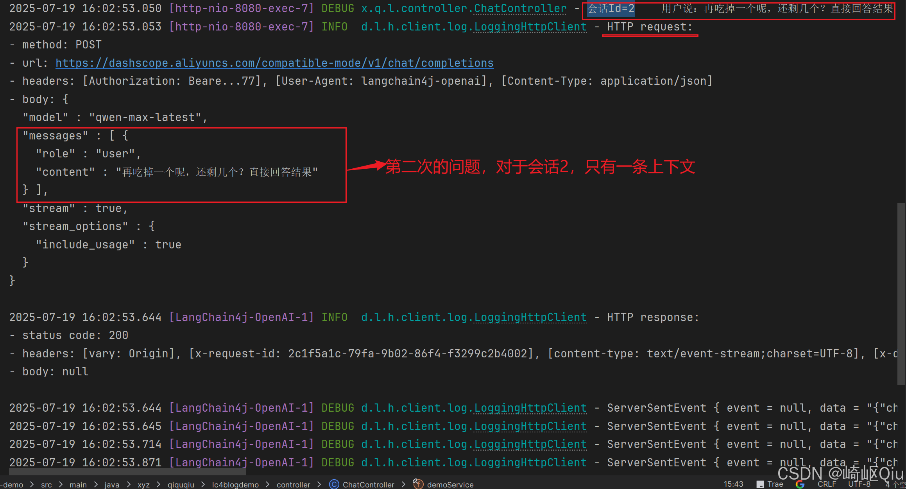

# 【langchain4j篇03】：会话上下文记忆与会话隔离实现

> 原创 于 2025-07-20 08:15:00 发布 · 公开 · 1k 阅读 · 33 · 16 · CC 4.0 BY-SA版权 版权声明：本文为博主原创文章，遵循 CC 4.0 BY-SA 版权协议，转载请附上原文出处链接和本声明。
> 文章链接：https://blog.csdn.net/lyh2004_08/article/details/149465275

**目录**

[TOC]


上文我们学会了 [【langchain4j篇02】：配置流式响应及高级API的使用](https://blog.csdn.net/lyh2004_08/article/details/149391795) ，接下来是下一个核心功能： **同一会话内的上下文会话记忆，以及不同会话之间的会话记忆隔离** 

## 一、对话的上下文记忆

这一步我们 **维持前文的依赖和配置即可** ，不需要导入新的依赖以及新的配置：

**pom.xml** 

```XML
<dependencies>
        <!-- LangChain4j之OpenAi模型的起步依赖 -->
        <dependency>
            <groupId>dev.langchain4j</groupId>
            <artifactId>langchain4j-open-ai-spring-boot-starter</artifactId>
            <version>1.1.0-beta7</version>
        </dependency>
        <!-- LangChain4j对流式模型的依赖 -->
        <dependency>
            <groupId>dev.langchain4j</groupId>
            <artifactId>langchain4j-reactor</artifactId>
            <version>1.1.0-beta7</version>
        </dependency>
        <!-- LangChain4j声明式AiService起步依赖 -->
        <dependency>
            <groupId>dev.langchain4j</groupId>
            <artifactId>langchain4j-spring-boot-starter</artifactId>
            <version>1.1.0-beta7</version>
        </dependency>
        <dependency>
            <groupId>org.springframework.boot</groupId>
            <artifactId>spring-boot-starter-web</artifactId>
        </dependency>
 
        <dependency>
            <groupId>org.projectlombok</groupId>
            <artifactId>lombok</artifactId>
            <optional>true</optional>
        </dependency>
        <dependency>
            <groupId>org.springframework.boot</groupId>
            <artifactId>spring-boot-starter-test</artifactId>
            <scope>test</scope>
        </dependency>
    </dependencies>
```

**application.yml** 

```XML
spring:
  application:
    name: lc4j-blog-demo
  profiles:
    active: dev
logging:
  level:
    dev.langchain4j: debug
    xyz.qiquqiu.lc4blogdemo: debug
langchain4j:
  open-ai:
#    chat-model:
#      base-url: https://dashscope.aliyuncs.com/compatible-mode/v1
#      api-key: ${langchain4j.api-key}
#      model-name: qwen-plus
#      log-requests: true
#      log-responses: true
    streaming-chat-model:
      base-url: https://dashscope.aliyuncs.com/compatible-mode/v1
      api-key: ${langchain4j.api-key}
      model-name: qwen-max-latest
      log-requests: true
      log-responses: true
```

### 1. 配置 ChatMemory 的 Bean

> 实现方式仍旧沿用 **AiService** 提供的 **高级API** ，直接配置需要的 **“会话记忆” 的 Bean** ，然后在 AiService 注解中指定属性即可

定义一个 **配置类** CommonConfig.java 用于配置 **会话记忆 ChatMemory** 的 Bean：

```java
package xyz.qiquqiu.lc4blogdemo.config;
 
import dev.langchain4j.memory.ChatMemory;
import dev.langchain4j.memory.chat.ChatMemoryProvider;
import dev.langchain4j.memory.chat.MessageWindowChatMemory;
import dev.langchain4j.store.memory.chat.InMemoryChatMemoryStore;
import lombok.extern.slf4j.Slf4j;
import org.springframework.context.annotation.Bean;
import org.springframework.context.annotation.Configuration;
 
@Slf4j
@Configuration
public class CommonConfig {
 
    /**
     * 聊天记忆组件
     * 默认有两个子实现，一个是基于MessageWindow，类似SpringAI
     * 一个基于TokenWindow，根据token数截取会话窗口
     */
    @Bean
    public ChatMemory chatMemory() {
        log.debug("聊天记忆：ChatMemory 初始化...");
        return MessageWindowChatMemory.builder()
                .maxMessages(20)
                .build();
    }
}
```

### 2. 为后续的代理对象设置 chatMemory 属性

在被代理的接口的 **@AiServcie** 中，增加 **chatMemory 属性** 即可：

 

完整代码：

```java
package xyz.qiquqiu.lc4blogdemo.aiserverce;
 
import dev.langchain4j.service.spring.AiService;
import dev.langchain4j.service.spring.AiServiceWiringMode;
import reactor.core.publisher.Flux;
 
@AiService(
        wiringMode = AiServiceWiringMode.EXPLICIT, // 默认是自动装配，选了手动就要配置属性
        chatModel = "openAiChatModel", // 配置使用的普通模型（默认名，由langchain4j自动装配）
        streamingChatModel = "openAiStreamingChatModel", // 配置使用的流式模型（默认名，由langchain4j自动装配）
        chatMemory = "chatMemory"
)
public interface DemoService {
 
    /**
     * 流式聊天
     * @param message 消息
     * @return 回复
     */
    Flux<String> chat(String message);
}
```

### 3. 测试上下文记忆

 

 

> 可以发现第二次对话中， **附带有第一次对话的“十个苹果”的“记忆”** 

检查控制台 **日志** 也可以发现：

 

---

## 二、会话间记忆隔离

上文虽然实现了对话之间的记忆功能，但是并不能实现会话的记忆隔离和管理， **无论多少个请求都视为一个会话** ，接下来实现 **根据会话 Id 隔离不同会话** 

###  **1. 配置 ChatMemoryProvider 的 Bean** 

同样也只需要配置一个 Bean 即可实现，还是在刚才的 **CommonConfig.java** 配置类中：

```java
package xyz.qiquqiu.lc4blogdemo.config;
 
import dev.langchain4j.memory.ChatMemory;
import dev.langchain4j.memory.chat.ChatMemoryProvider;
import dev.langchain4j.memory.chat.MessageWindowChatMemory;
import dev.langchain4j.store.memory.chat.InMemoryChatMemoryStore;
import lombok.extern.slf4j.Slf4j;
import org.springframework.context.annotation.Bean;
import org.springframework.context.annotation.Configuration;
 
@Slf4j
@Configuration
public class CommonConfig {
 
    /**
     * 实现“会话隔离”功能，必备的组件：ChatMemoryProvider
     */
    @Bean
    public ChatMemoryProvider chatMemoryProvider() {
        log.debug("聊天记忆提供者：ChatMemoryProvider 初始化...");
        return new ChatMemoryProvider() {
            @Override
            public ChatMemory get(Object memoryId) {
                return MessageWindowChatMemory.builder()
                        .id(memoryId)
                        .maxMessages(20)
                        .chatMemoryStore(new InMemoryChatMemoryStore())
                        .build();
            }
        };
    }
}
```

> 使用 **ChatMemoryProvider** 来提供 **根据 “memoryId” 获取 ChatMemory（某个会话记忆）实例** 的方法，从而实现不同会话的记忆隔离

### 2. 配置代理对象的 ChatMemoryProvider 属性

同样，需要 **AiService** 代理层设置属性：

 

> <span style="color:#be191c">注意</span>，配置了 **chatMemoryProvider** 属性后，就 **不再需要** chatMemory 属性了，因为在 ChatMemoryProvider 的 Bean 的配置中， **已经指定了根据不同的memoryId 来 “get” 到当前会话的实例** *（包含指定创建方式、记忆存储方式等，均可扩展）* 
> 
>  

### 3. 扩充接口参数，增加 memoryId

现在可以根据请求中的会话id，来进行会话的隔离，所以我们需要对接口做一些扩充， **指定会话id的请求参数** ，总体改造如下：

```java
package xyz.qiquqiu.lc4blogdemo.aiserverce;
 
import dev.langchain4j.service.MemoryId;
import dev.langchain4j.service.UserMessage;
import dev.langchain4j.service.spring.AiService;
import dev.langchain4j.service.spring.AiServiceWiringMode;
import reactor.core.publisher.Flux;
 
@AiService(
        wiringMode = AiServiceWiringMode.EXPLICIT, // 默认是自动装配，选了手动就要配置属性
        chatModel = "openAiChatModel", // 配置使用的普通模型（默认名，由langchain4j自动装配）
        streamingChatModel = "openAiStreamingChatModel", // 配置使用的流式模型（默认名，由langchain4j自动装配）
        // chatMemory = "chatMemory"
        chatMemoryProvider = "chatMemoryProvider"
)
public interface DemoService {
 
    /**
     * 大模型聊天接口-流式响应
     * @param memoryId 会话Id
     * @param message 用户发送的消息，相当于提示词prompt
     * @return
     */
    Flux<String> chat(@MemoryId Long memoryId, @UserMessage String message);
}
```

>  **<span style="color:#be191c">注意点</span>** 
> 
> 

- 使用 **@MemoryId** 注解，指定将来作为“会话记忆id”的请求参数

- 使用 **@UserMessage** 注解，指定将来作为“用户消息”的请求参数

- @MemoryId 注解的会话id，允许是 **Object 类型** ，不一定非是 Long（从 ChatMemoryProvider 的配置中应当也可以看出来）

同理改造 **Controller 层接口** ：

 

### 4. 测试会话记忆隔离

重启项目，在请求中附带 **memoryId** 字段

 

 

> 显然，会话2， **并不具有会话1的关于“初始10个苹果”的记忆** ，隔离效果达到了

检查一下日志输出，并未附带非本次会话的上下文内容：

 

