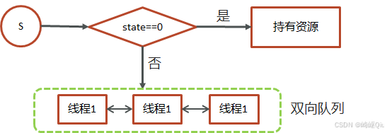

# 【多线程篇18】：一文搞懂AQS核心原理

> 原创 已于 2025-07-20 11:31:31 修改 · 公开 · 843 阅读 · 18 · 23 · CC 4.0 BY-SA版权 版权声明：本文为博主原创文章，遵循 CC 4.0 BY-SA 版权协议，转载请附上原文出处链接和本声明。
> 文章链接：https://blog.csdn.net/lyh2004_08/article/details/149480328

**文章目录**

[TOC]

JUC（Java Util Concurrency）是面试中的高频考点，而AQS则是理解JUC核心同步工具（如 `ReentrantLock` ）的基石。本文将系统梳理AQS的核心概念与工作机制

## 1.AQS是什么？

-  **全称** ： `AbstractQueuedSynchronizer` ，抽象队列同步器

-  **定义** ：它是Java并发包中一个用来构建 **阻塞式锁** 和相关 **同步器** 的基础框架。像我们熟悉的 `ReentrantLock` 、 `Semaphore` 、 `CountDownLatch` 等工具，其底层都依赖于AQS实现

---

## 2. AQS的核心工作机制

AQS的实现主要围绕两大核心和一项关键操作：

1.  **一个状态（State）** 

2.  **一个队列（FIFO Wait Queue）** 

3.  **一次原子操作（CAS）** 

下面我们逐一拆解

### 2.1 核心要素一： `state` 状态

AQS内部维护了一个被 `volatile` 关键字修饰的 `int` 类型变量 `state` ，它代表了共享资源的状态

-  `state` 的值由具体实现类来定义其含义。对于锁而言，通常：

  -  `state = 0` ：表示资源未被锁定（无锁状态）

  -  `state = 1` ：表示资源已被锁定（有锁状态）

-  `volatile` 关键字保证了 `state` 在多线程之间的内存可见性，即一个线程修改了 `state` ，其他线程能立刻看到最新的值

 

### 2.2 核心要素二：FIFO等待队列

当一个线程尝试获取资源失败（例如，尝试获取锁时发现 `state` 已经是1），它不会持续空转消耗CPU，而是会被放入一个等待队列中

-  **队列特性** ：这是一个先进先出（FIFO）的双向链表队列

-  **关键指针** ：

  -  `head` ：指向队列的头节点，代表当前持有锁或下一个有资格获取锁的节点

  -  `tail` ：指向队列的尾节点

-  **功能** ：这个队列负责管理所有等待获取资源的线程，保证了线程获取锁的顺序性。它类似于 `synchronized` 内置锁（Monitor）中的 `EntryList` 

### 2.3 关键操作：CAS保证原子性

设想一个场景：多个线程同时发现 `state` 为0，都想去获取锁，如何保证只有一个线程成功？

AQS使用 **CAS（Compare-And-Swap）** 自旋操作来保证修改 `state` 的原子性

-  **工作流程** ：当一个线程要修改 `state` 时，它会执行一个CAS操作。该操作会比较内存中 `state` 的当前值是否与它期望的值（比如0）相符，如果相符，就将其更新为新值（比如1）。这个“比较并交换”的过程是原子性的

-  **结果** ：

  -  **成功** ：只有一个线程的CAS操作能成功，该线程成功获取锁

  -  **失败** ：其他线程的CAS操作会失败，它们将进入上文提到的FIFO队列中排队等待

---

## 3. 整体工作流程（以获取锁为例）

1.  **线程A尝试获取锁** ：它使用CAS尝试将 `state` 从0修改为1

2.  **获取成功** ：CAS操作成功，线程A成功获取锁， `state` 变为1

3.  **线程B和C尝试获取锁** ：它们也尝试使用CAS修改 `state` ，但此时 `state` 已经是1，不满足CAS的期望值0，操作失败

4.  **入队等待** ：线程B和C获取锁失败后，会被构造成节点（Node）加入到AQS的FIFO等待队列尾部，并进入阻塞状态，等待被唤醒

5.  **释放与唤醒** ：当线程A执行完毕并释放锁时，它会将 `state` 重新置为0，并唤醒FIFO队列中的头节点（ `head` 节点的后继节点），被唤醒的线程将再次尝试获取锁

---

## 4. AQS的公平性

AQS本身同时支持公平和非公平两种模式， **具体由其实现类来决定** 

-  **非公平锁** ：

  -  **机制** ：当一个新线程来临时，它会先尝试通过CAS“插队”抢占锁。如果抢占失败，它才会乖乖地进入等待队列

  -  **优点** ：吞吐量较大，因为减少了线程上下文切换的开销

  -  **例子** ： `ReentrantLock` 默认就是非公平锁

-  **公平锁** ：

  -  **机制** ：新来的线程会先检查等待队列中是否有其他线程。如果有，它会直接进入队列尾部排队，绝不插队。只有队列的 `head` 节点才有资格获取锁

  -  **优点** ：所有线程按申请顺序获取锁，不会出现饥饿现象

---

## 总结

1.  **AQS是什么** ： `AbstractQueuedSynchronizer` ，一个构建锁和同步器的 **基础框架** 

2.  **核心三要素** ：

   - 一个 `volatile int state` 变量，表示 **资源状态** 

   - 一个 **FIFO双向队列** ，管理等待的线程

   - 使用 **CAS** 操作原子性地修改 `state` 

3.  **工作流程** ：线程通过CAS抢占 `state` ，失败者进入FIFO队列等待

- 使用 **CAS** 操作原子性地修改 `state` 

1.  **工作流程** ：线程通过CAS抢占 `state` ，失败者进入FIFO队列等待

2.  **典型实现** ： `ReentrantLock` 就是基于AQS实现的，并且它默认是 **非公平锁** 

