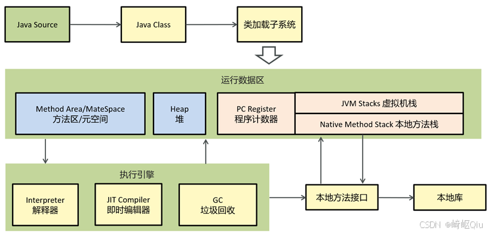

# 【JVM篇01】：JVM基本结构概览与图解

> 原创 于 2025-07-25 08:00:00 发布 · 公开 · 1.2k 阅读 · 30 · 9 · CC 4.0 BY-SA版权 版权声明：本文为博主原创文章，遵循 CC 4.0 BY-SA 版权协议，转载请附上原文出处链接和本声明。
> 文章链接：https://blog.csdn.net/lyh2004_08/article/details/149594864

**文章目录**

[TOC]

JVM（Java Virtual Machine）的本质是一个可以执行Java字节码（ `.class` 文件）的虚拟计算机。它的存在是Java“一次编写，到处运行”（Write Once, Run Anywhere）的关键
 

根据上图，我们可以将JVM的构成划分为以下几个主要部分：

## 1. 类加载子系统 (Class Loader Subsystem)

-  **作用** ：这是JVM的入口。它的核心任务是根据类的全限定名（例如 `java.lang.String` ）来查找并加载对应的 `.class` 文件，然后在JVM内部创建该类的 `java.lang.Class` 对象

-  **流程** ： `Java Source` (.java文件) 首先被Java编译器（ `javac` ）编译成 `Java Class` (.class文件)。当程序运行时，类加载子系统会将这些.class文件加载到运行时数据区

## 2. 运行时数据区 (Runtime Data Areas)

这是JVM的内存模型，是整个JVM最核心的部分。根据《Java虚拟机规范》，这块区域可以划分为 **线程私有** 和 **线程共享** 两大部分

---

### 线程共享区域 (Thread-Shared)

所有线程共享这些数据区域。数据在JVM进程的整个生命周期中存在，直到JVM退出

-  **堆 (Heap)** 

  -  **核心作用** ：JVM管理的内存中最大的一块。 **几乎所有的对象实例和数组都在这里分配内存** 

  -  **细节** ：堆是垃圾回收器（GC）进行管理的主要区域。为了高效回收，堆内部通常还会进行细分（比如新生代、老年代），这个我们后续深入GC时再详细讲。面试时，这是绝对的重点

-  **方法区 (Method Area)** 

  -  **核心作用** ：用于存储已被虚拟机加载的 **类信息、常量、静态变量、即时编译器（JIT）编译后的代码缓存** 等数据

  -  **重要细节 (关于元空间 Metaspace)** ：

    - 方法区是《Java虚拟机规范》中定义的一个 **逻辑概念** 

    - 在JDK 7及以前，它的一个典型实现叫 **永久代 (Permanent Generation, PermGen)** ，这部分内存在堆中分配

    - 从JDK 8开始，永久代被彻底移除，取而代之的是 **元空间 (Metaspace)** 。最大的区别是， **元空间使用的是本地内存（Native Memory），而不是JVM堆内存** 。这解决了之前永久代大小受限、容易导致 `OutOfMemoryError` 的问题。你的图中标注了 `Metaspace` ，说明这是一个与时俱进的现代JVM结构图

---

### 线程私有区域 (Thread-Private)

每个线程创建时，都会拥有自己独立的一套私有区域。它们的生命周期与线程相同

-  **虚拟机栈 (JVM Stacks)** 

  -  **核心作用** ：描述Java **方法执行** 的内存模型。每个线程在创建时都会创建一个虚拟机栈

  -  **细节** ：每当一个方法被调用，JVM会为其创建一个 **栈帧 (Stack Frame)** 并压入虚拟机栈。方法执行完毕后，对应的栈帧就会出栈。栈帧中存储了 **局部变量表、操作数栈、动态链接、方法出口** 等信息。我们平时说的“栈内存”通常就是指这里。如果线程请求的栈深度大于虚拟机所允许的深度，将抛出 `StackOverflowError` 

-  **本地方法栈 (Native Method Stack)** 

  -  **核心作用** ：与虚拟机栈非常相似，区别在于它为虚拟机使用到的 **本地方法 (Native Method)** 服务。本地方法是指由非Java语言（如C、C++）实现的方法

  -  **细节** ：在HotSpot虚拟机（我们最常用的JVM实现）中，实际上是将本地方法栈和虚拟机栈合二为一了

-  **程序计数器 (PC Register)** 

  -  **核心作用** ：一块较小的内存空间，可以看作是当前线程所执行的 **字节码的行号指示器** 

  -  **细节** ：字节码解释器工作时就是通过改变这个计数器的值来选取下一条需要执行的字节码指令。它是 **唯一一个在《Java虚拟机规范》中没有规定任何 `OutOfMemoryError` 情况的区域** 。如果线程正在执行的是一个 `native` 方法，那么这个计数器的值为空（Undefined）

---

## 3. 执行引擎 (Execution Engine)

-  **作用** ：执行引擎是JVM的核心执行单元。它负责将加载到内存中的字节码指令解释或编译为对应平台上的本地机器指令并执行

-  **包含组件** ：

  -  **解释器 (Interpreter)** ：逐行读取、解释并执行字节码指令。优点是启动快，缺点是执行效率较低

  -  **即时编译器 (JIT Compiler)** ：为了解决解释器的效率问题，JIT会将“热点代码”（被频繁执行的方法或代码块）编译成与本地平台相关的机器码，并进行各种层次的优化。后续再执行这些代码时，直接运行编译后的机器码，大大提高了执行效率

  -  **垃圾回收 (GC)** ：GC可以看作是执行引擎的一部分（因为它需要执行垃圾回收的逻辑），它负责自动回收堆和方法区中不再被引用的对象，释放内存空间

---

## 4. 本地方法接口 (Native Method Interface, JNI)

-  **作用** ：一个标准的编程接口，它允许Java代码与其他语言（主要是C/C++）写的代码进行交互。当Java程序需要调用 `本地库` 中的方法时，就通过JNI来实现

---

## 总结概览

- “详细讲讲堆内存的划分？” (引出GC)

- “对象在JVM中是如何创建和布局的？” (引出对象创建过程和内存布局)

- “ `new Object()` 这句代码在JVM层面发生了什么？” (串联起类加载、内存分配等知识)

- “方法区和元空间有什么区别？” (考察知识的新旧程度)

