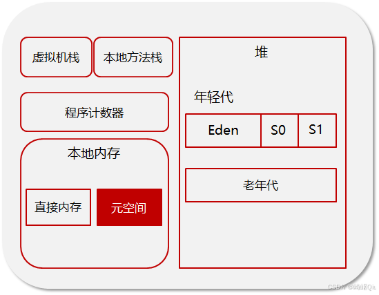
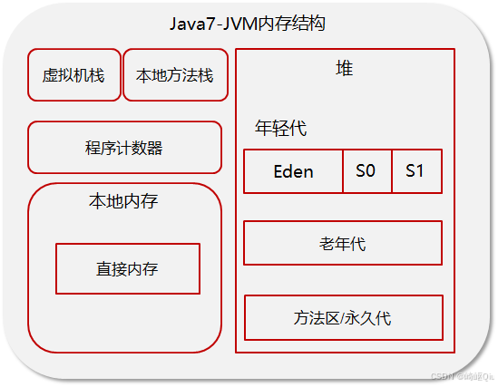
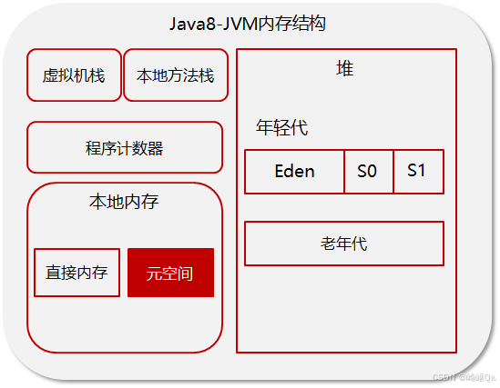

# 【JVM篇03】：Java1.7和1.8的JVM内存结构对比详解

> 原创 于 2025-07-26 08:00:00 发布 · 公开 · 957 阅读 · 33 · 28 · CC 4.0 BY-SA版权 版权声明：本文为博主原创文章，遵循 CC 4.0 BY-SA 版权协议，转载请附上原文出处链接和本声明。
> 文章链接：https://blog.csdn.net/lyh2004_08/article/details/149644120

**文章目录**

[TOC]

随着Java版本的迭代，特别是从Java 1.7到Java 1.8，JVM的内存结构也发生了一些重要的变化。本文将结合资料，详细梳理JVM的内部构成，并着重对比1.7和1.8版本之间的核心差异

## 一、JVM内存结构概览

根据Java虚拟机规范，JVM在执行Java程序时，会将其管理的内存划分为若干个不同的数据区域。这些区域可以分为两大类： **线程共享区域** 和 **线程私有区域** 

-  **线程共享区域** ：随着虚拟机的启动而创建，所有线程共享这些数据区域。主要包括：

  -  **堆（Heap）** 

  -  **方法区（Method Area）** 

-  **线程私有区域** ：生命周期与线程相同，每个线程都拥有自己独立的部分。主要包括：

  -  **虚拟机栈（VM Stack）** 

  -  **本地方法栈（Native Method Stack）** 

  -  **程序计数器（Program Counter Register）** 

 

下面，我们将对每个区域进行详细的解读

---

## 二、线程私有区域详解

### 1. 程序计数器 (Program Counter Register)

程序计数器是一块较小的内存空间，可以看作是当前线程所执行的字节码的行号指示器。 在多线程环境中，CPU会不停地切换线程，程序计数器就负责记录每个线程执行到的位置，以便线程切换回来后能继续执行

-  **特点** ：

  - 它是唯一一个在Java虚拟机规范中没有规定任何 `OutOfMemoryError` 情况的区域

  - 如果线程正在执行的是一个Java方法，这个计数器记录的是正在执行的虚拟机字节码指令的地址；如果正在执行的是本地（Native）方法，这个计数器值则为空（Undefined）

### 2. Java虚拟机栈 (Java Virtual Machine Stack)

Java虚拟机栈也是线程私有的，其生命周期与线程相同。 它描述的是Java方法执行的线程内存模型：每个方法被执行的时候，Java虚拟机都会同步创建一个 **栈帧（Stack Frame）** 用于存储局部变量表、操作数栈、动态连接、方法出口等信息。 我们常说的“栈内存”通常就是指虚拟机栈

-  **局部变量表** ：存放了编译期可知的各种Java基本数据类型和对象引用

-  **常见异常** ：

  -  `StackOverflowError` ：如果线程请求的栈深度大于虚拟机所允许的深度，将抛出此异常

  -  `OutOfMemoryError` ：如果Java虚拟机栈容量可以动态扩展，当栈扩展时无法申请到足够的内存会抛出此异常

### 3. 本地方法栈 (Native Method Stack)

本地方法栈与虚拟机栈所发挥的作用非常相似，其区别是虚拟机栈为虚拟机执行Java方法（也就是字节码）服务，而本地方法栈则是为虚拟机使用到的本地（Native）方法服务

---

## 三、线程共享区域详解

### 1. 堆 (Heap)

Java堆是虚拟机所管理的内存中最大的一块，被所有线程共享。 此内存区域的唯一目的就是存放对象实例，Java世界里“几乎”所有的对象实例都在这里分配内存。 同时，它也是垃圾收集器管理的只要区域，因此也被称作“GC堆”

-  **特点** ：

  - 从内存分配的角度看，线程共享的Java堆中可能划分出多个线程私有的分配缓冲区（TLAB），以提升对象分配的效率

  - 是 `OutOfMemoryError` 最常发生的区域

### 2. 方法区 (Method Area)

方法区也是所有线程共享的内存区域，它用于存储已被虚拟机加载的类型信息、常量、静态变量、即时编译器编译后的代码缓存等数据

---

## 四、核心对比：Java 1.7 vs Java 1.8

JVM内存结构在从1.7到1.8的演进中，最显著的变化就发生在 **方法区** 的实现上

### Java 1.7及以前：永久代 (Permanent Generation)

在Java 1.7及更早的版本中，方法区通常是由 **永久代（PermGen）** 来实现的。 永久代是 **HotSpot** 虚拟机选择的一种实现方式，它直接使用堆的一部分内存来承载方法区的功能

-  **缺点** ：

  1.  **内存限制** ：永久代有大小限制（可通过 `-XX:MaxPermSize` 设置），当加载的类过多或者运行时产生的类过多时，很容易导致 `java.lang.OutOfMemoryError: PermGen space` 异常

  2.  **GC效率低** ：永久代的垃圾回收（主要针对废弃常量和无用的类）条件苛刻，效率不高

 

---

### Java 1.8及以后：元空间 (Metaspace)

为了解决永久代存在的问题，从Java 1.8开始，HotSpot 虚拟机移除了永久代，取而代之的是 **元空间（Metaspace）** 

-  **核心变化** ：

  1.  **存储位置** ：元空间不再位于虚拟机设置的内存中（即不再是堆的一部分），而是直接使用 **本地内存（Native Memory）** 

  2.  **大小限制** ：默认情况下，元空间的大小仅受本地内存的限制

  3.  **字符串常量池位置** ：在Java 1.7中，字符串常量池和静态变量等已经从永久代移到了Java堆中。 到了1.8，随着永久代的彻底移除，这些内容自然地留在了堆里

 

### 为什么用元空间替代永久代？

> 官方给出的主要原因是，为永久代设置大小是非常困难的。 在某些场景下，如果动态加载的类过多，很容易出现 `PermGen space` 错误
> 
> 使用元空间，并将其置于本地内存中，使得这部分内存不再受JVM内存大小的限制，从而大大降低了OOM的风险，提升了应用的稳定性

---

## 五、总结

| 特性/区域 | Java 1.7 (HotSpot) | Java 1.8 (HotSpot) |
|:---:|:---:|:---:|
|  **方法区实现**  |  **永久代 (Permanent Generation)**  |  **元空间 (Metaspace)**  |
|  **存储位置**  | 位于JVM管理的 **堆内存** 中 | 使用 **本地内存（Native Memory）**  |
|  **内存限制**  | 受JVM堆大小限制，需通过 `-XX:MaxPermSize` 设置，容易OOM | 默认仅受本地内存限制，降低了OOM风险 |
|  **字符串常量池**  | 存放在 **Java堆** 中 | 存放在 **Java堆** 中 |