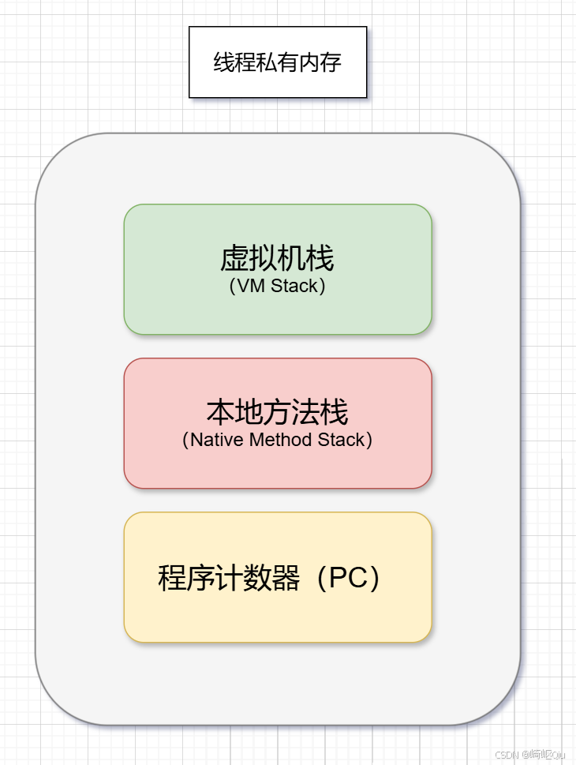

# 【JVM篇04】：线程私有内存与虚拟机栈详解

> 原创 于 2025-07-26 08:15:00 发布 · 公开 · 1.1k 阅读 · 16 · 17 · CC 4.0 BY-SA版权 版权声明：本文为博主原创文章，遵循 CC 4.0 BY-SA 版权协议，转载请附上原文出处链接和本声明。
> 文章链接：https://blog.csdn.net/lyh2004_08/article/details/149644356

**文章目录**

[TOC]


## 一、线程私有内存概览

当JVM创建一个线程时，会为其分配一块独有的内存区域。这块区域的生命周期与线程相同，随线程的创建而生，随线程的销毁而亡。它主要由以下三个部分组成：

 

> 

-  **虚拟机栈 (VM Stack)** ：存储Java方法调用的基本数据结构

-  **本地方法栈 (Native Method Stack)** ：为Native方法调用服务

-  **程序计数器 (PC)** ：记录当前线程执行的字节码行号

下面，将次序讲解虚拟机栈、本地方法栈以及程序计数器，并重点剖析 **虚拟机栈** 

虚拟机栈是理解Java方法如何运行的关键。我们可以通过以下几个 **核心问题** 来彻底掌握它：

### 1. 什么是虚拟机栈？

虚拟机栈是每个线程运行时所需的内存空间，它像一个“账本”，记录着方法的调用与执行过程

-  **栈与栈帧** ：每个线程的虚拟机栈由多个 **栈帧（Stack Frame） **组成。每当一个Java方法被调用时，JVM就会创建一个对应的栈帧，并将其** 压入（push） **栈顶。当方法执行完毕后，该栈帧就会被** 弹出（pop）** 

-  **活动栈帧** ：在任何时刻，一个线程的虚拟机栈中只有一个 **活动栈帧（Active Stack Frame）** ，它位于栈顶，对应着当前正在执行的那个方法

### 2. 垃圾回收(GC)是否涉及栈内存？

**答案是否定的。** 垃圾回收（GC）主要针对的是所有线程共享的 **堆内存（Heap）** 

栈内存的生命周期是确定且清晰的：方法调用开始，栈帧入栈；方法调用结束，栈帧出栈。栈帧所占用的内存会立即被释放，这个过程是自动的，不需要GC的介入

### 3. 栈内存分配得越大越好吗？

**未必。** 虽然我们可以通过 `-Xss` 参数来设置单个线程的栈大小，但盲目增大并非好事

-  **默认大小** ：在HotSpot虚拟机中，默认的栈大小通常是1024k（1MB）

-  **内存权衡** ：JVM的总内存是有限的。如果给每个线程分配的栈内存过大，那么在总内存固定的情况下，能够创建的 **线程数量就会变少** 。因此，需要根据应用场景在“单线程栈深度”和“可创建线程总数”之间做出权衡

### 4. 方法内的局部变量是否线程安全？

这是面试中的高频问题，答案是： **视情况而定** 。关键在于变量是否“ **逃逸** ”了方法的作用范围

-  **情况一：线程安全** 
  如果一个局部变量是基本数据类型，或者它是一个对象引用，但这个对象完全是在方法内部创建和使用的，没有以任何形式（如作为返回值、方法参数）传递到方法外部，那么它就是 **线程安全** 的。因为每个线程都有自己独立的栈，这个变量不会被其他线程访问到

   **线程安全的局部变量** 

  ```java
  public class ThreadSafeExample {

      // 该方法是线程安全的
      public void safeAction() {
          // sb是局部变量，完全在方法内部使用，没有逃逸
          StringBuilder sb = new StringBuilder();
          sb.append("Hello, ");
          sb.append("World!");
          System.out.println(sb.toString());
      }

      public static void main(String[] args) {
          ThreadSafeExample example = new ThreadSafeExample();
          // 多个线程调用safeAction()不会产生冲突
          new Thread(() -> example.safeAction()).start();
          new Thread(() -> example.safeAction()).start();
      }
  }
  ```

  在上面的代码中， `safeAction` 方法里的 `sb` 变量就是一个局部变量，它在方法内创建，并且没有返回或传递出去。因此，即使多个线程同时调用 `safeAction` ，每个线程都会在自己的栈中创建一个独立的 `StringBuilder` 对象，互不干扰

-  **情况二：需要考虑线程安全** 
  如果局部变量引用了一个 **外部对象** （比如通过方法参数传入），或者将方法内创建的对象的引用 **返回或传递** 了出去，导致其他线程也能访问到这个对象，那么就需要考虑线程安全问题。此时，线程安全问题的根源不在于栈内的引用变量本身，而在于这个引用所指向的 **堆上的对象** 被多个线程共享和修改

   **线程不安全的情况** 

  ```java
  public class ThreadUnsafeExample {

      // listBuilder作为参数传入，逃逸了
      public void unsafeAction(StringBuilder listBuilder) {
          // 多个线程会同时修改同一个StringBuilder对象
          listBuilder.append("item ");
      }

      public static void main(String[] args) {
          // 这个StringBuilder对象在堆中，被多个线程共享
          StringBuilder sharedBuilder = new StringBuilder();

          ThreadUnsafeExample example = new ThreadUnsafeExample();

          // 两个线程操作同一个sharedBuilder对象
          Thread t1 = new Thread(() -> {
              for (int i = 0; i < 100; i++) {
                  example.unsafeAction(sharedBuilder);
              }
          });

          Thread t2 = new Thread(() -> {
              for (int i = 0; i < 100; i++) {
                  example.unsafeAction(sharedBuilder);
              }
          });

          t1.start();
          t2.start();
          // ... 等待线程结束，最终sharedBuilder的内容是不确定的
      }
  }
  ```

### 5. 什么情况下会导致栈内存溢出？

栈相关的异常主要有两种：

1.  **`java.lang.StackOverflowError`** ：栈溢出错误

   -  **原因** ：当线程请求的栈深度超过了虚拟机所允许的最大深度时抛出。最典型的问题就是 **无限递归调用** 或者 **过深的循环/方法调用链** ，导致栈帧过多，撑爆了栈内存

   -  **递归导致的StackOverflowError** 

     ```java
     public class StackOverflowDemo {
         private static int count = 0;

         public static void recursiveMethod() {
             System.out.println("call: " + (++count));
             recursiveMethod(); // 没有出口的递归调用
         }

         public static void main(String[] args) {
             try {
                 recursiveMethod();
             } catch (Throwable e) {
                 System.out.println("Stack depth: " + count);
                 e.printStackTrace();
             }
         }
     }
     ```

2.  **`java.lang.OutOfMemoryError`** ：内存不足错误

   -  **原因** ：这种情况相对少见，通常发生在虚拟机试图创建新线程，但由于总内存不足，无法为新线程分配足够的栈空间时。它指的是 **整个虚拟机的内存** （而非仅仅栈空间）不足以支持新的线程栈的创建

---

## 二、堆与栈的核心区别总结

| 对比维度 |  **虚拟机栈 (Stack)**  |  **堆 (Heap)**  |
|:---:|:---:|:---:|
|  **存储内容**  | 存储基本数据类型变量、对象引用和方法调用信息（栈帧） | 存储 **几乎所有** 的对象实例和数组 |
|  **内存管理**  | 方法结束时自动弹出栈帧释放内存， **不涉及GC**  | 由**垃圾回收器(GC)**自动管理和回收内存 |
|  **共享性**  |  **线程私有** ，每个线程有自己独立的栈 |  **所有线程共享** ，是并发访问的重点区域 |
|  **常见异常**  |  **`StackOverflowError`** (栈深度溢出) |  **`OutOfMemoryError`** (没有足够空间创建新对象) |


---

## 三、其他线程私有区域简介

-  **本地方法栈 (Native Method Stack)** 
  它与虚拟机栈非常相似，区别在于虚拟机栈为执行 **Java方法** 服务，而本地方法栈为执行 **本地（Native）方法** 服务。Native方法通常是由C/C++等语言编写的

-  **程序计数器 (Program Counter Register)** 
  可以看作是当前线程所执行字节码的“ **行号指示器** ”。它占用内存非常小，并且是JVM规范中 **唯一没有规定任何 `OutOfMemoryError`** 的区域，因为它的工作就是简单、纯粹地计数，可参考： [【JVM篇02】：小而强的程序计数器（PC）](https://blog.csdn.net/lyh2004_08/article/details/149594988) 

