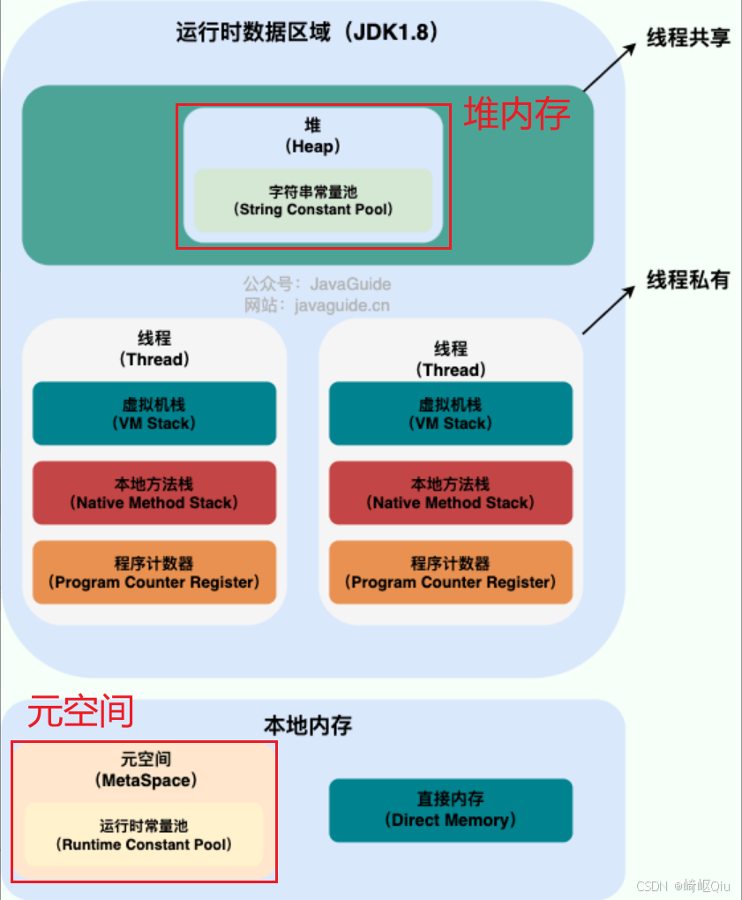

# 【JVM篇05】：Java8的元空间在哪？堆里又有什么？一文搞懂

> 原创 于 2025-07-27 08:00:00 发布 · 公开 · 829 阅读 · 24 · 18 · CC 4.0 BY-SA版权 版权声明：本文为博主原创文章，遵循 CC 4.0 BY-SA 版权协议，转载请附上原文出处链接和本声明。
> 文章链接：https://blog.csdn.net/lyh2004_08/article/details/149669883

**文章目录**

[TOC]


## 核心辨析：堆 vs. 元空间

在Java 8中，我们首先要建立一个最核心的认知： **堆（Heap）和元空间（Metaspace）是两块完全独立的内存区域** 

-  **堆（Heap）** ：位于 **Java虚拟机（JVM）管理的内存** 中。它的主要职责是存放程序运行时创建的 **对象实例** 

-  **元空间（Metaspace）** ：位于 **本地内存（Native Memory）** 中，即物理机内存， **不直接受JVM管理** 。它本质上是JVM规范中 **方法区（Method Area）** 的一种实现

> 具体的JVM结构，参考 [ *JavaGuide Java内存区域详解（重点）* ](https://javaguide.cn/java/jvm/memory-area.html#%E8%BF%90%E8%A1%8C%E6%97%B6%E6%95%B0%E6%8D%AE%E5%8C%BA%E5%9F%9F) 的模型图解：
> 
>  

本文详细对比剖析 **元空间** 与 **堆** 的区别和各自的包含内容，关于 **线程私有内存** 及 **虚拟机栈** 详解

---

## 深入剖析一：Java 8 堆内存里有什么？

Java堆是GC（垃圾收集器）的主要工作区域，也是我们平时打交道最多的内存区域。在Java 8中，它主要包含以下几类内容：

**1. 对象实例（Object Instances）和数组（Arrays）** 

这是堆最基本、最核心的功能。我们通过 `new` 关键字创建的所有对象（例如 `new User()` ）和数组（例如 `new int[10]` ）都会被分配在堆内存中

**2. 字符串常量池（String Constant Pool）** 

从 JDK 1. **7** 开始，字符串常量池就从永久代（方法区的旧实现） **迁移到了堆内存中** 。Java 8沿用了这一设计

-  **作用** ：它是一个用于缓存字符串字面量的哈希表。当我们使用字面量方式创建字符串时，JVM会利用这个池来复用相同的字符串对象，以节省内存

-  **代码演示** ：

  ```java
  public class StringPoolDemo {
      public static void main(String[] args) {
          // s1和s2都指向堆中字符串常量池的同一个"Java"对象
          String s1 = "Java";
          String s2 = "Java";
          System.out.println(s1 == s2); // 输出: true

          // "new"总是在堆中创建一个新的String对象，s3的引用指向这个新对象
          String s3 = new String("Java");
          System.out.println(s1 == s3); // 输出: false

          // intern()方法会检查常量池，如果存在"Java"，则返回池中的引用
          String s4 = s3.intern();
          System.out.println(s1 == s4); // 输出: true
      }
  }
  ```

**3. 静态变量（Static Variables）** 

同样是从 JDK 1.7 开始，类的静态变量（Static Variables）也从永久代 **迁移到了堆内存中** 。它们与该类的 `java.lang.Class` 对象关联在一起，而 `Class` 对象本身也存放在堆中

-  **理解** ：当一个类被加载时，它的 `Class` 对象会被创建并存入堆中。这个类所有的静态变量，作为 `Class` 对象的一部分数据，也随之存放在堆里

---

## 深入剖析二：Java 8 元空间里有什么？

元空间作为方法区的实现，存储的是 **“描述信息”或“元数据”** ，而不是程序运行中的“业务数据”

**1. 类的元数据（Class Metadata）** 

这是元空间最核心的内容。它存储了JVM加载的每一个类的“说明书”，包括：

- 类的完整结构信息：类名、父类、接口、访问修饰符等

- 字段信息：每个字段的名称、类型、修饰符

- 方法信息：每个方法的名称、返回类型、参数列表、修饰符

-  **方法的字节码** ：即编译后的Java代码

**2. 运行时常量池（Runtime Constant Pool）** 

运行时常量池是 **方法区的一部分** ，因此在Java 8中，它自然位于 **元空间** 内

-  **来源** ：当JVM加载一个 `.class` 文件时，会将该文件中的 **Class常量池** （一个静态的、描述性的结构）载入到内存中，形成运行时的版本，即运行时常量池

-  **内容** ：主要存放两类信息：

  -  **字面量（Literals）** ：如文本字符串、 `final` 常量值等。 **请注意** ，对于字符串，这里存放的是 **字面量本身或者一个符号引用** ，而不是堆中 `String` 对象的最终引用

  -  **符号引用（Symbolic References）** ：在编译时，一个类并不知道它所引用的其他类或方法的实际内存地址。因此，它会用一个符号（比如类的全限定名 `java/lang/String` ）来代替。这些符号引用就存放在运行时常量池中。当程序实际运行时，JVM会通过这些符号找到真正的内存地址（这个过程叫动态链接）

---

## 串联与总结：清晰对比

我们用一个表格来总结堆与元空间的区别，并梳理各个概念的归属地

| 特性 / 概念 | 堆（Heap） | 元空间（Metaspace） |
|:---:|:---:|:---:|
|  **物理位置**  |  **JVM管理内存**  |  **本地内存（Native Memory）**  |
|  **核心存储内容**  | 对象实例、数组 | 类的元数据（结构、方法、字节码等） |
|  **字符串常量池**  |  **位于堆中**  | 不包含 |
|  **运行时常量池**  | 不包含 |  **位于元空间中** （作为方法区的一部分） |
|  **静态变量**  |  **位于堆中** （与类的Class对象一起） | 不包含 |
|  **与GC的关系**  | GC的主要工作区域 | 也会被回收（主要是类的卸载），会触发Full GC |
|  **内存溢出错误**  |  `java.lang.OutOfMemoryError: Java heap space`  |  `java.lang.OutOfMemoryError: Metaspace`  |
|  **JVM规范**  | JVM规范明确定义 | JVM规范中 **方法区（Method Area）** 的具体实现 |


---

## 结论

1.  **根本区别** ：元空间在本地内存，是方法区的实现，存元数据；堆在JVM内存，存对象实例

2.  **关键归属** ： **字符串常量池** 和 **静态变量** 在 **堆** 里； **运行时常量池** 在 **元空间** 里

3.  **演进历史** ：要清楚这些变化是从 JDK 1.7 开始，并在 Java 8 中得以延续的

