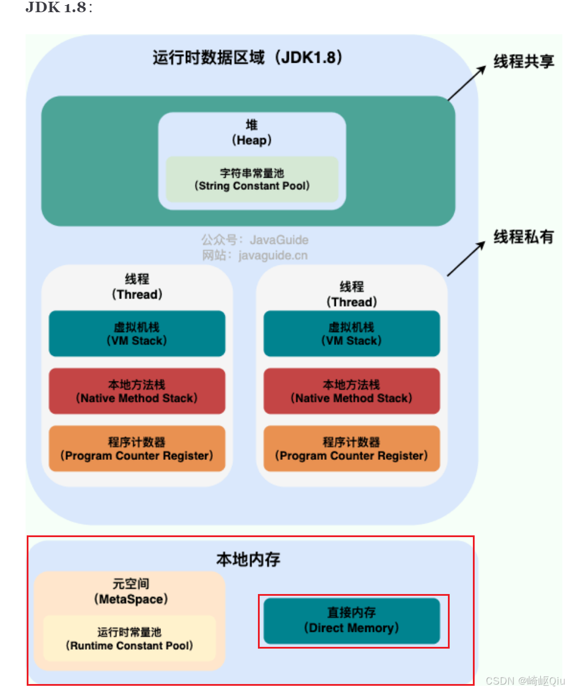

# 【JVM篇06】：JVM的直接内存及其与nio提升io效率的联系详解

> 原创 于 2025-07-27 08:15:00 发布 · 公开 · 1k 阅读 · 26 · 22 · CC 4.0 BY-SA版权 版权声明：本文为博主原创文章，遵循 CC 4.0 BY-SA 版权协议，转载请附上原文出处链接和本声明。
> 文章链接：https://blog.csdn.net/lyh2004_08/article/details/149670109

**文章目录**

[TOC]

本文将深入探讨下一个 **JVM** 关键概念—— **直接内存** ，并详细剖析它究竟是如何通过“减少拷贝”来实现 **NIO** 高性能的

## 一、 什么是JVM直接内存 (Direct Memory)？

首先，我们必须建立一个清晰的认知：

**直接内存（Direct Memory）** 并 **不是** JVM运行时数据区（如堆、栈、方法区）的一部分。它是Java程序在运行时，通过 `Unsafe` 或 `ByteBuffer` 等API直接向操作系统（OS）申请的一块堆外（Off-Heap）内存空间

其位于jvm内存中的结构参考下图：

> 具体的 JVM 结构，参考 [ *JavaGuide Java内存区域详解（重点）* ](https://javaguide.cn/java/jvm/memory-area.html#%E8%BF%90%E8%A1%8C%E6%97%B6%E6%95%B0%E6%8D%AE%E5%8C%BA%E5%9F%9F) 的模型图解：
> 
>  

**核心特性：** 

-  **申请方式** ：最常见的标准方式是通过 `java.nio.ByteBuffer.allocateDirect(int capacity)` 来申请

-  **内存归属** ：这块内存由操作系统直接管理，而非JVM。因此，它的大小不受JVM堆内存限制（即 `-Xmx` 参数）

-  **大小限制** ：虽然不受 `-Xmx` 影响，但它依然受限于本机的物理内存。可以通过 `-XX:MaxDirectMemorySize=<size>` 参数来显式指定其最大值。若不指定，在JDK 8及之前版本中，默认与 `-Xmx` 的最大堆内存值相同

-  **回收机制** ：直接内存的回收比较特殊。它依赖于一个精巧的设计：当创建 `DirectByteBuffer` 对象时，它自身是一个存在于JVM堆内的普通Java对象。这个对象内部会关联一个 `Cleaner` 对象（一种基于虚引用 `PhantomReference` 的实现）。当堆内的 `DirectByteBuffer` 对象在GC中被回收时，与之关联的 `Cleaner` 会被触发，从而调用底层的 `freeMemory` 方法（最终调用操作系统的 `free` 函数）来释放对应的堆外直接内存

>  **注意细节** ：
> 
> 这种回收方式是被动的，依赖于GC何时回收堆内的 `DirectByteBuffer` 对象
> 
> 如果直接内存使用过多而迟迟没有触发GC，可能会导致 `OOM: Direct buffer memory` 异常
> 
> 这也是为什么在大量使用直接内存时，有时需要通过 `System.gc()` 来建议JVM进行垃圾回收

---

## 二、 效率提升的核心：剖析NIO数据拷贝路径的本质区别

这是本文的重点。NIO 之所以性能优于传统BIO，其关键之一就在于对缓冲区的运用，尤其是直接内存

为了理解其优势，我们必须对比分析在使用 **堆内存** 和 **直接内存** 时，一次典型的I/O操作（例如，从网络Socket读取数据）的数据流动路径

### 场景设定：从网络读取数据到Java程序中

-  **内核空间 (Kernel Space)** ：操作系统内核管理的内存区域，负责与硬件（如网卡、磁盘）交互

-  **用户空间 (User Space)** ：应用程序（如我们的JVM）可以访问的内存区域

### 1. 传统方式：使用堆内存 ( `HeapByteBuffer` )

当我们使用 `ByteBuffer.allocate(capacity)` 创建缓冲区时，这个缓冲区本质上是JVM堆内的一个 **`byte[]` 数组** 。数据流转路径如下：

1.  **硬件 -> 内核缓冲区** ：操作系统通过DMA（Direct Memory Access）将网卡接收到的数据包拷贝到内核的Socket缓冲区中。 **这一步不消耗CPU** 

2.  **内核缓冲区 -> JVM堆内存** ：当Java程序调用 `socketChannel.read(heapBuffer)` 时，操作系统需要进行一次 **CPU拷贝** ，将数据从 **内核空间** 的Socket缓冲区，复制到 **用户空间** 的JVM堆内存（即 `heapBuffer` 底层的 `byte[]` 数组）中

3.  **后续处理** ：Java程序现在可以在堆内存中直接访问和处理这份数据

**瓶颈分析** ：

上述步骤二，是性能损耗的关键。数据必须从内核态完整地复制到用户态的堆中。如果数据量很大，或者I/O操作非常频繁，这次CPU拷贝的开销会变得非常显著。更糟糕的是，如果程序处理完数据后需要将其写回（例如一个代理服务器），那么数据还需要再从JVM堆内存拷贝回内核的Socket缓冲区， **又多了一次CPU拷贝** 

**路径总结** ： `网卡 -> 内核缓冲区 -> (CPU拷贝) -> JVM堆 -> (CPU拷贝) -> 内核缓冲区 -> 网卡` 

### 2. 优化方式：使用直接内存 ( `DirectByteBuffer` )

当我们使用 `ByteBuffer.allocateDirect(capacity)` 创建缓冲区时，JVM会在 **堆外** 申请一块内存。这个 `DirectByteBuffer` 对象本身在堆内，但它持有一个 **指向堆外内存的地址** 。数据流转路径变为：

1.  **硬件 -> 内核缓冲区** ：这一步与堆内存方式完全相同，数据由DMA拷贝到内核缓冲区

2.  **内核缓冲区 ->** **JVM直接内存** ：当Java程序调用 `socketChannel.read(directBuffer)` 时，奇妙的事情发生了。因为 `DirectByteBuffer` 所指向的内存地址对于操作系统而言是可知的，JVM会通知操作系统直接将数据从内核Socket缓冲区拷贝到这块直接内存中

**效率提升的关键点到底在哪里？** 

很多人会误以为这一步没有拷贝。 **这是不准确的，数据从内核缓冲区到直接内存仍然存在一次拷贝** 

真正的优化在于：

-  **减少了一次不必要的跨空间拷贝** ：这块 **直接内存** 虽然在JVM进程的用户空间内，但它可以被看作是内核空间和用户空间共享的 **“中间地带”** 。操作系统可以直接向这个区域写入数据，而 **无需再将其拷贝一份到JVM的“私有领地”——堆内存中** 。
  对于需要将数据再次写出的场景，这个优势尤为明显，因为数据可以直接从这块内存发送到内核缓冲区， **避免了“JVM堆 -> 内核缓冲区”这第二次CPU拷贝** 

-  **更底层的操作** ：一些操作系统（如Linux）支持更高效的I/O操作，可以直接在两个文件描述符之间传输数据（例如 `sendfile` 系统调用）， `DirectByteBuffer` 更容易与这些底层机制集成，实现更高层次的“零拷贝”

**路径总结** ： `网卡 -> 内核缓冲区 -> (CPU拷贝) -> 直接内存 -> (CPU拷贝) -> 内核缓冲区 -> 网卡` 

**对比结论：哪一步被优化了？** 

对比两种方式，使用直接内存 **消除** 了数据在 **JVM堆内存** 和 **内核缓冲区** 之间的来回复制。数据流转的路径更短，CPU的负担更轻，这正是NIO效率提升的根本原因

---

## 三、 直接内存的“零拷贝”到底是什么？

在Java NIO的语境下，“零拷贝”（Zero-Copy）通常是一个广义的概念，它不一定指完全没有CPU拷贝，而是指 **避免了CPU在内核空间和用户空间之间进行不必要的数据拷贝** 

-  **`DirectByteBuffer` 实现的“零拷贝”** ：主要指 **减少了用户空间（JVM堆）和内核空间之间的拷贝次数** 

-  **真正的操作系统级零拷贝** ：这通常指 `sendfile` 这类系统调用。Java NIO的 `FileChannel.transferTo()` 或 `FileChannel.transferFrom()` 方法在底层就可能使用了操作系统的 `sendfile` 机制，它可以让数据直接从磁盘文件的内核缓冲区，传输到网卡Socket的内核缓冲区，全程数据都没有进入用户空间，这实现了CPU层面的零拷贝。 `DirectByteBuffer` 是实现这种高级功能的基础

---

## 四、 总结

什么是直接内存？和堆内存有什么区别？

> 直接内存是堆外内存，由操作系统管理，通过 `ByteBuffer.allocateDirect()` 申请。它不受JVM堆大小限制，但回收依赖GC触发 `Cleaner` 机制。堆内存是JVM直接管理的，用于存放Java对象实例，受 `-Xmx` 控制，由GC直接管理

NIO为什么使用直接内存会更快？快在哪里？

> 快在减少了数据拷贝。使用堆内存时，数据需要先从系统内核缓冲区拷贝到JVM堆，处理完再从JVM堆拷贝回内核缓冲区，有两次多余的CPU拷贝。而使用直接内存，数据可以直接在内核缓冲区和直接内存之间进行拷贝， **避免了数据在JVM堆内存中的中转** ，减少了CPU开销和内存占用，从而提升了I/O效率

直接内存有什么缺点或使用时需要注意什么？

> 

1.  **分配和回收成本高** ：申请和释放直接内存都涉及到系统调用，比在堆上创建对象更慢

2.  **内存管理复杂** ：堆外内存不易排查问题，可能因回收不及时导致 `OOM: Direct buffer memory` 

3.  **不适合小而短命的缓冲区** ：如果I/O吞吐量不是瓶颈，且缓冲区小、生命周期短，使用堆内存的成本更低

**结论** ：直接内存是NIO实现高性能I/O的利器。它通过优化数据拷贝路径，为Java在网络编程、文件操作等领域提供了与C/C++相媲美的性能