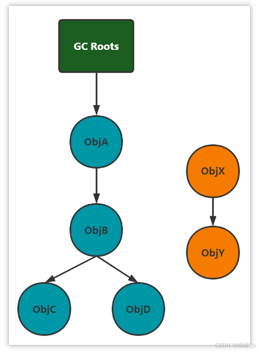

# 【JVM篇09】：对象被垃圾回收的时机判断

> 原创 于 2025-07-29 08:00:00 发布 · 公开 · 1.2k 阅读 · 41 · 16 · CC 4.0 BY-SA版权 版权声明：本文为博主原创文章，遵循 CC 4.0 BY-SA 版权协议，转载请附上原文出处链接和本声明。
> 文章链接：https://blog.csdn.net/lyh2004_08/article/details/149728072

**文章目录**

[TOC]


在JVM的垃圾回收（Garbage Collection, GC）机制中，首要任务是准确地识别出哪些对象是“垃圾”（即不再被任何活动部分使用的对象），哪些是“存活”的。只有被正确识别为垃圾的对象，才会被后续的垃圾回收算法清理，从而释放内存空间

目前，主要存在两种判断对象是否存活的算法： **引用计数法** 和 **可达性分析算法** 

## 1. 引用计数法

这是一种相对简单直观的算法，但并非现代主流JVM的选择

-  **核心思想** ：
  为每个在堆中创建的对象关联一个引用计数器。当有一个引用指向该对象时，其计数器加1；当指向该对象的引用失效（例如，被赋值为 `null` ）时，其计数器减1。任何时刻，当一个对象的引用计数器值为0时，该对象就被认为是“死亡”的，可以被回收

-  **优点** ：

  -  **实时性高** ：对象的回收时机非常明确，无需等待整个GC周期的启动。一旦计数器变为0，理论上就可以立即回收

  -  **无应用暂停** ：更新计数器是分散在程序运行中的，通常不会像某些GC算法那样需要长时间地“Stop-The-World”（STW）

-  **致命缺点：无法解决循环引用** 
  这是导致主流JVM（如HotSpot）不采用此算法的核心原因。当两个或多个对象相互引用，但再无任何外部引用指向它们时，它们的引用计数器永远不会变为0，从而导致这些对象无法被回收，造成 **内存泄漏** 

   **面试示例代码：** 

  ```java
  public class ReferenceCountingGC {
      public Object instance = null;

      public static void main(String[] args) {
          ReferenceCountingGC a = new ReferenceCountingGC();
          ReferenceCountingGC b = new ReferenceCountingGC();

          // a和b相互引用
          a.instance = b;
          b.instance = a;

          // 断开外部引用
          a = null;
          b = null;

          // 此时a和b指向的对象能否被回收？
          // 在引用计数法下，答案是不能
          // 因为它们各自的instance字段还在互相引用，计数器不为0
          // 但在可达性分析算法下，可以被回收
      }
  }
  ```

  在上述代码中，当 `a = null` 和 `b = null` 执行后，栈帧中的 `a` 和 `b` 引用消失，但堆中两个 `ReferenceCountingGC` 对象内部的 `instance` 字段依然互相指向对方。它们的引用计数都为1，因此永远不会被回收

---

## 2. 可达性分析算法

这是当前所有主流Java虚拟机（如HotSpot）所采用的对象存活判断算法

-  **核心思想** ：
  该算法将对象间的引用关系看作一张图。它从一系列固定的、被称为 **“GC Roots”** 的根对象作为起始节点，开始向下搜索。搜索所走过的路径称为 **引用链** 。如果一个对象到任何GC Roots之间都不存在任何引用链相连，那么这个对象就被判定为是“不可达”的，即为可回收的垃圾对象

   

-  **哪些对象可以作为GC Roots？** 
  GC Roots是那些在程序运行中必然存活的对象，它们是可达性分析的起点。在Java中，固定的GC Roots主要包括以下几类：

  1.  **虚拟机栈（栈帧中的本地变量表）中引用的对象** ：

     -  **细节** ：指的是当前正在执行的方法的栈帧中，其本地变量表里存储的引用所指向的对象

     -  **示例** ： `public void test() { Object o = new Object(); }` 在 `test` 方法执行期间， `o` 就是一个GC Root，它引用的 `new Object()` 就是存活的。方法执行完毕，栈帧出栈， `o` 这个GC Root消失

  2.  **方法区中类静态属性引用的对象** ：

     -  **细节** ：由类的 `static` 关键字修饰的字段所引用的对象。这类对象的生命周期与类的生命周期相同，通常很长

     -  **示例** ： `public static User admin = new User();` 只要 `User` 这个类没有被卸载， `admin` 这个GC Root就一直存在，其引用的 `User` 对象也就一直存活

  3.  **方法区中常量引用的对象** ：

     -  **细节** ：由 `static final` 修饰的字段，如果引用的是一个对象（而非基本类型或字符串字面量），那么这个引用所指向的对象就是GC Root

     -  **示例** ： `public static final Config config = new Config();` `config` 引用的 `Config` 对象是存活的

  4.  **本地方法栈中JNI（Java Native Interface）引用的对象** ：

     -  **细节** ：当Java代码通过JNI调用本地方法（如C/C++代码）时，本地代码可能会持有Java对象的引用。这些被JNI引用的对象也必须被视为存活，因此它们也是GC Roots

  5.  **其他** ：

     - 被 `synchronized` 关键字持有的锁对象

     - JVM内部的引用，如类加载器、系统类等

---

## 3. 对象的“死亡”宣告： `finalize()` 方法

一个对象在可达性分析中被判定为“不可达”，是否意味着它立即被回收？ **答案是否定的** 

一个对象真正被回收，至少要经历两次标记过程

1.  **第一次标记** ：在可达性分析后，如果发现一个对象没有与任何GC Roots相连的引用链，它将被 **第一次标记** 

2.  **`finalize()` 筛选** ：随后，JVM会进行一个筛选，判断该对象是否有必要执行 `finalize()` 方法。筛选条件是：

   - 该对象是否重写了 `Object` 类的 `finalize()` 方法

   - 该对象的 `finalize()` 方法是否 **从未被调用过** 

   如果满足条件，该对象会被放入一个名为 `F-Queue` 的队列中，并由一条低优先级的 `Finalizer` 线程去执行它的 `finalize()` 方法

3.  **对象的“自救”** ：
    `finalize()` 方法是对象在被回收前最后的“求生”机会。在 `finalize()` 方法体内，对象可以执行任何操作，包括将自己（ `this` ）重新赋值给某个类变量或其他对象的成员变量，从而重新与引用链上的任何一个对象建立关联

4.  **第二次标记** ：
   稍后，GC将对 `F-Queue` 中的对象进行 **第二次小规模的标记** 。如果在 `finalize()` 方法中，对象成功地“拯救”了自己（即重新与GC Roots建立了连接），那么在这次标记中它将被移除“即将回收”的集合。如果它没有“拯救”自己，那么它就会被真正地判定为死亡，等待下一次GC时被回收

**重要细节与提醒：** 

-  **`finalize()` 只会被系统调用一次** ：对于任何一个对象，其 `finalize()` 方法最多只会被JVM调用一次。如果对象在第一次被标记时通过 `finalize()` 方法成功自救，那么当它下一次再次变为不可达时，它的 `finalize()` 方法将不会再被执行，会直接被回收

-  **`finalize()` 已被废弃** ：从Java 9开始， `finalize()` 方法已被正式标记为 `@Deprecated(since="9")` 。官方强烈不推荐使用它，因为它存在诸多问题：执行时机不确定、运行代价高昂、可能与其他系统资源（如文件句柄）的关闭产生混淆，甚至在极端情况下导致程序崩溃。现代Java中，清理资源应使用 `try-with-resources` 语句或 `java.lang.ref.Cleaner` （自Java 9引入）

---

## 总结

1.  **引出两种算法** ：引用计数法和可达性分析法

2.  **详述引用计数法** ：解释其原理，并立刻指出其 **无法解决循环引用** 的致命缺陷，并强调现代JVM **不使用** 它

3.  **详述可达性分析法** ：解释其原理（GC Roots、引用链），这是回答的 **核心** 

4.  **列举核心的GC Roots** ：清晰地列出虚拟机栈、方法区静态属性、方法区常量、本地方法栈这四种，能展现你扎实的基础

5.  **补充 `finalize()` 过程** ：作为加分项，说明一个对象从不可达到真正被回收的完整流程，并点出 `finalize()` 的“自救”机制和“只执行一次”的特性。最后，提及其已被废弃的现状，展示你对Java技术演进的了解

