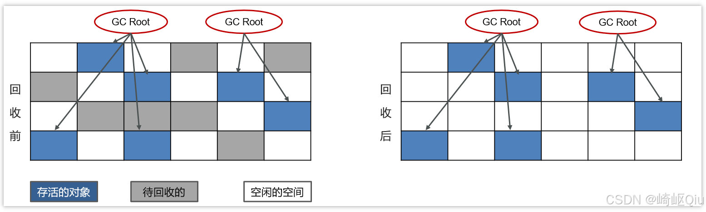
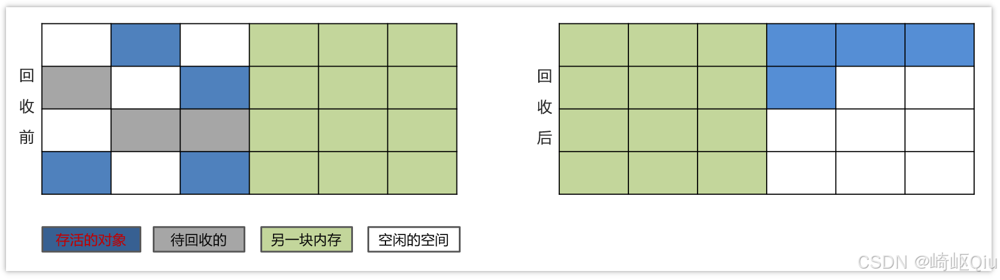
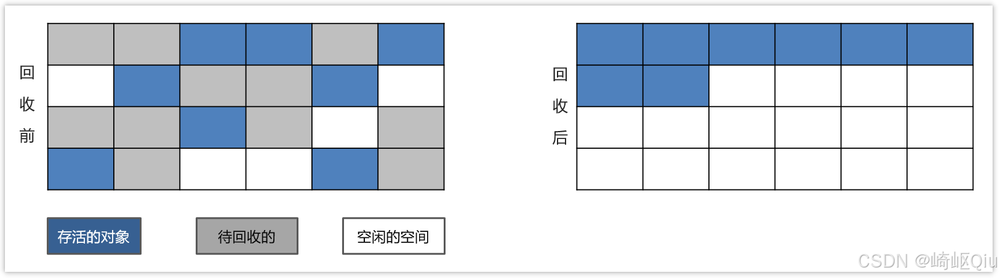

# 【JVM篇10】：三种垃圾回收算法对比详解

> 原创 于 2025-07-30 07:30:00 发布 · 公开 · 1.5k 阅读 · 36 · 22 · CC 4.0 BY-SA版权 版权声明：本文为博主原创文章，遵循 CC 4.0 BY-SA 版权协议，转载请附上原文出处链接和本声明。
> 文章链接：https://blog.csdn.net/lyh2004_08/article/details/149759347

**文章目录**

[TOC]

在通过 **可达性分析等算法** 识别出所有存活对象和垃圾对象后，垃圾收集器（GC：Garbage Collector）就需要执行回收操作来释放垃圾对象所占用的内存。以下是三种最基础、最经典的 **垃圾回收算法** 

## 1. 标记-清除算法

标记-清除算法是最基础的收集算法，正如其名，它分为“标记”和“清除”两个阶段

-  **核心思想** ：

  1.  **标记阶段** ：首先，从GC Roots开始，遍历所有可达对象，并为这些存活的对象打上一个“标记”

  2.  **清除阶段** ：然后，再次遍历整个堆内存。在此过程中，将所有 **未被标记** 的对象（即垃圾对象）所占用的内存直接回收

-  **过程** ：

   

  1.  **初始状态** ：内存中对象杂乱无章地排列

  2.  **标记后** ：所有从GC Roots可达的存活对象被标记

  3.  **清除后** ：所有未被标记的垃圾对象被回收，其内存变为空闲

-  **优点** ：

  -  **实现简单** ：算法思想直观，易于实现

  -  **空间利用率高** ：不需要额外的空间来进行回收操作，它是在原始堆上直接进行的

-  **缺点（非常重要）** ：

  1.  **执行效率不稳定** ：如果堆中包含大量对象，并且其中大部分是需要回收的，那么标记和清除两个过程的执行效率都会随着对象数量的增长而降低

  2.  **内存碎片化** ：这是该算法最致命的缺点。清除之后，会产生大量不连续的内存碎片。虽然空闲内存的总量可能很大，但由于它们不连续，当程序需要分配一个较大的对象时，可能找不到一块足够大的连续内存空间，从而不得不提前触发下一次垃圾收集动作，甚至导致 `OutOfMemoryError` 

---

## 2. 复制算法

为了解决标记-清除算法带来的内存碎片化问题，复制算法应运而生

-  **核心思想** ：
  它将可用的内存按容量划分为大小相等的两块，比如称为“From空间”和“To空间”。每次只使用其中的一块（From空间）。当这一块的内存用完了，就触发GC。GC会将From空间中所有仍然存活的对象， **按顺序复制** 到另一块未使用的To空间中，然后一次性地清理掉整个From空间。之后，From空间和To空间的 **角色互换** ，下次GC时再从新的From空间复制到新的To空间

-  **过程** ：

   

  1.  **GC前** ：对象在From空间（Eden）分配，To空间（Survivor）是空的

1.  **GC时** ：将From空间中的存活对象复制到To空间

2.  **GC后** ：From空间被完全清空，所有存活对象都紧凑地排列在To空间的起始位置。然后From和To角色互换

-  **优点** ：

  1.  **无内存碎片** ：每次回收都是对整个半区进行内存整理，存活对象被复制到新空间后是连续存放的，不会产生碎片

  2.  **实现简单，运行高效** ：在对象存活率较低的情况下，效率非常高。因为只需要复制少量存活对象，而不需要处理大量垃圾对象。分配内存时也极其简单，只需移动“堆顶指针”，按顺序分配即可

-  **缺点** ：

  1.  **空间代价高昂** ：算法的代价是将可用内存缩小为了原来的一半， **空间浪费严重** 

  2.  **对存活率敏感** ：如果对象存活率很高， **复制操作的开销** 就会变得非常大，效率会急剧下降

-  **实际应用（重要）** ：
  现代虚拟机（如HotSpot）的 **<u>新生代</u>** 普遍采用复制算法。因为研究表明，新生代中的对象98%以上是“朝生夕死”的，存活率极低。因此，在新生代使用复制算法，只需要付出少量存活对象的复制成本就可以完成收集

  >  **细节优化** ：HotSpot虚拟机中的新生代并非简单的1:1划分。而是将内存分为一块较大的 **Eden空间** 和两块较小的 **Survivor空间** （分别称为From和To，或S0和S1）。默认比例是 **Eden:S0:S1 = 8:1:1** 
  > 
  > 每次分配只使用Eden和其中一块Survivor。GC时，将Eden和正在使用的Survivor中的存活对象一次性复制到另一块空闲的Survivor空间上
  > 
  > 这样，平时可用的内存空间是整个新生代容量的90%（80% Eden + 10% Survivor），空间浪费问题得到了极大的缓解

---

## 3. 标记-整理算法

标记-整理算法结合了“标记-清除”和“复制”算法的优点，旨在解决前两者的弊端。它特别适用于对象存活率高的场景（如老年代）

-  **核心思想** ：
  它的标记过程与“标记-清除”算法完全一样，但后续步骤不是直接对可回收对象进行清理，而是多了一个“整理”步骤

  1.  **标记阶段** ：与标记-清除算法一致，从GC Roots开始标记所有存活对象

  2.  **整理阶段** ：将所有被标记的存活对象，向内存空间的一端移动，并紧凑地排列。然后，直接清理掉边界以外的内存区域

-  **过程** ：

   

  1.  **初始状态** ：内存中对象杂乱排列

  2.  **标记后** ：存活对象被标记

  3.  **整理后** ：所有存活对象被移动到内存的一端，形成连续的已用空间，另一端则成为连续的空闲空间

-  **优点** ：

  -  **无内存碎片** ：解决了标记-清除算法的碎片化问题，使得内存分配可以简单地使用“指针碰撞”技术

  -  **无空间浪费** ：不像复制算法那样需要牺牲一半的内存空间

-  **缺点** ：

  -  **执行效率较低** ：标记和清除的效率问题依然存在。更重要的是，“整理”阶段需要 **移动大量对象** ，并且在移动后，还需要 **更新** 所有 **引用** 这些对象的指针，这是一个非常耗时的操作，需要暂停用户应用程序（STW: Stop The World）

-  **实际应用** ：
  由于老年代（Old Generation）中的对象存活率高，且GC频率远低于新生代，因此不适合使用复制算法（复制开销大），而标记-清除算法的碎片问题又难以接受。所以， **标记-整理算法通常用于 <u>老年代</u> 的垃圾收集** 

---

## 总结与面试要点

| 算法 | 优点 | 缺点 | 适用场景 |
|:---|:---|:---|:---|
|  **标记-清除**  | 实现简单，无空间开销 |  **效率不高，内存碎片化（致命）**  | 作为其他算法的基础，或在特定GC器中与其它算法结合使用 |
|  **复制**  |  **无内存碎片，效率高（存活率低时）**  |  **空间浪费严重（可用内存减半）** ，存活率高时效率低 |  **新生代**  |
|  **标记-整理**  |  **无内存碎片，无空间浪费**  |  **效率低，移动和更新引用开销大**  |  **老年代**  |

**面试回答策略** ：

1.  **清晰阐述三种算法的核心思想和执行步骤** 。画图辅助说明是很好的方式

2.  **精准说出每种算法的优缺点** ，特别是它们的“致命缺点”，这是面试官考察你是否理解深刻的关键

3.  **将理论与实践结合** ：一定要说明这些基础算法在现代JVM分代收集（Generational Collection）中的具体应用。即“ **分代假说** ”：

   -  **新生代** ：对象存活率低 -> 采用 **复制算法** 

   -  **老年代** ：对象存活率高 -> 采用 **标记-清除** 或 **标记-整理** 算法（或它们的混合形式）

