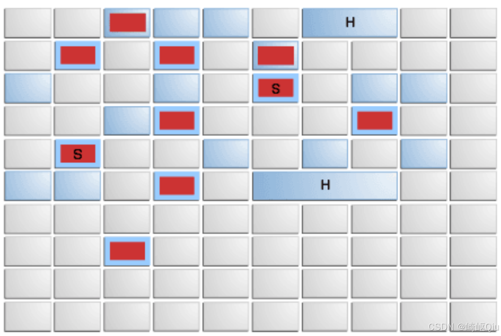

# 【JVM篇13】：兼顾吞吐量和低停顿的G1垃圾回收器

> 原创 于 2025-08-01 11:38:41 发布 · 公开 · 1.3k 阅读 · 30 · 27 · CC 4.0 BY-SA版权 版权声明：本文为博主原创文章，遵循 CC 4.0 BY-SA 版权协议，转载请附上原文出处链接和本声明。
> 文章链接：https://blog.csdn.net/lyh2004_08/article/details/149830177

**文章目录**

[TOC]

G1（Garbage-First）垃圾收集器是HotSpot JVM中一个里程碑式的改进，旨在取代CMS收集器，解决其内存碎片和 `Concurrent Mode Failure` 等问题，并提供更可预测的停顿时间。自JDK 9起，G1已成为HotSpot JVM的默认垃圾收集器

## 1. G1概述与核心设计理念

G1收集器适用于配备多核处理器及大容量内存的机器，其核心目标是：在满足用户设定的 **GC停顿时间目标** 的同时，保持较高的 **吞吐量** 

-  **分代与分区结合** ：G1虽然保留了分代收集的概念（新生代和老年代），但在物理内存布局上，它将整个Java堆划分为多个大小相等的独立 **区域（Region）** 。每个Region都可以动态地充当新生代的Eden区、Survivor区，或者老年代的Old区
   

-  **Humongous区域** ：为了处理 **大对象** （Humongous Object），G1引入了特殊的Humongous区域。当对象大小超过Region大小的一半时，它将被直接分配到Humongous区域，这些区域属于老年代。这样做是为了避免大对象在新生代频繁复制带来的开销，并减少内存碎片

-  **复制算法** ：G1在Region之间进行垃圾回收时，核心采用了 **复制算法** 。这意味着存活对象会被从一个或多个源Region复制到新的Region中，从而实现内存的整理和无碎片化

-  **“Garbage-First”** ：G1的名称“Garbage-First”来源于其独特的工作方式。它会跟踪每个Region中垃圾的多少，并在进行垃圾收集时，优先选择那些 **垃圾最多、回收效率最高** 的Region进行回收，从而尽可能多地释放内存空间

-  **兼顾响应时间与吞吐量** ：通过将大块的堆内存划分为小Region，并进行增量式的、并行的回收，G1能够将长时间的GC停顿分解为多次短时间的停顿，从而提供更可预测的停顿时间，兼顾了应用的响应速度和整体吞吐量

-  **并发与并行** ：G1在某些阶段（如并发标记）能够与用户线程并发执行，而在其他阶段（如Young GC、Remark、Evacuation）则会并行利用多线程进行STW（Stop-The-World）暂停

---

## 2. G1的工作模式与GC周期

G1的垃圾收集周期主要分为两个阶段： **Young-Only Phase（年轻代收集阶段） **和** Space-Reclamation Phase（空间回收阶段，包含混合收集）** 

### 2.1 Young Collection (年轻代垃圾回收)

这是G1中最频繁发生的GC类型，主要针对新生代区域（Eden和Survivor）进行回收

-  **对象分配** ：新创建的对象首先会被分配到Eden区

-  **触发时机** ：当Eden区空间不足时，会触发一次Young GC

-  **回收过程** ：

  1.  **STW** ：Young GC是 **Stop-The-World** 的，会暂停所有用户线程

  2.  **标记与复制** ：G1会扫描Eden区和当前的From Survivor区中的存活对象

  3.  **对象晋升** ：将这些存活对象通过复制算法，复制到新的To Survivor区。如果对象年龄达到阈值（默认15次， `-XX:MaxTenuringThreshold` ）或者Survivor区空间不足，对象会晋升到老年代

  4.  **清空** ：复制完成后，Eden区和From Survivor区被清空。From和To Survivor区角色互换

  5.  **RSet更新** ：为了解决跨代引用问题，G1引入了 **Remembered Set (RSet)** 。每个Region都有一个RSet，记录了从其他Region指向本Region的引用。在Young GC时，通过RSet可以快速识别老年代对新生代的引用，避免扫描整个老年代。RSet的更新通过 **写屏障（Write Barrier） **和** Dirty Card Queue** 机制来实现，确保跨代引用的正确性

### 2.2 Young Collection + Concurrent Mark (年轻代垃圾回收 + 并发标记)

当老年代的内存占用达到一定阈值（ `Initiating Heap Occupancy Percent` ，默认45%）时，G1会启动并发标记周期，为后续的Mixed GC做准备。这个阶段主要包括以下步骤：

1.  **初始标记** ：

   -  **STW** ：这是一个短暂停顿的阶段

   -  **任务** ：标记所有从GC Roots直接可达的对象。这个阶段通常与一次Young GC同时发生，以减少STW时间

2.  **并发标记** ：

   -  **并发执行** ：这个阶段与用户线程 **并发执行** ，不会暂停应用程序

   -  **任务** ：从初始标记的存活对象开始，遍历整个对象图，找出所有存活对象。这是最耗时的阶段

   -  **SATB（Snapshot-At-The-Beginning）** ：G1使用SATB算法来解决并发标记期间对象引用关系变化导致的漏标问题。它在初始标记时创建堆的“快照”，确保在标记开始时存活的对象都被视为存活。这可能导致一些“浮动垃圾”，即在并发标记期间变为不可达的对象，它们会在下一次GC中被回收

3.  **重新标记** ：

   -  **STW** ：一个短暂停顿阶段

   -  **任务** ：处理在并发标记阶段因用户线程活动而发生变化的引用，修正标记结果，并回收完全空的Region

4.  **并发清理** ：

   -  **并发执行** ：与用户线程并发执行

   -  **任务** ：G1会计算每个Region的回收价值（即垃圾的多少），并根据回收价值对Region进行排序。同时，回收完全空的Region

### 2.3 Mixed Collection (混合垃圾回收)

在并发标记阶段结束后，G1进入混合收集阶段

-  **选择性回收** ：G1会根据用户设定的停顿时间目标（ `-XX:MaxGCPauseMillis` ，默认200ms）和Region的回收价值，选择 **所有新生代Region** 以及 **部分老年代Region** 组成**Collection Set (CSet)**进行回收。这就是“Garbage-First”的体现，优先回收垃圾最多的老年代Region

-  **复制与整理** ：G1会复制CSet中所有存活的对象到新的空闲Region中，然后清空这些被回收的Region。这个过程是STW的

-  **Full GC** ：如果G1在并发标记阶段，或者在Mixed GC期间，内存分配速度过快，导致无法找到足够的空闲Region来存放新对象或复制的存活对象，就会触发 **Full GC** 。G1的Full GC是单线程的，会进行全堆的标记-整理，停顿时间非常长，应尽量避免

---

## 3. Humongous Objects (巨型对象)

-  **定义** ：任何大小超过Region一半的对象都被视为“巨型对象”

-  **分配** ：巨型对象直接在老年代的Humongous Region中分配，并且会占据连续的Region空间

-  **回收** ：巨型对象在GC过程中不会被移动（不参与Evacuation），只会在并发标记结束后的Cleanup阶段或Full GC时，如果变为不可达才会被回收

---

## 4. G1的重要参数

-  `-XX:+UseG1GC` ：启用G1垃圾收集器

-  `-XX:MaxGCPauseMillis` ：设置期望的最大GC停顿时间，G1会尽量在此目标内完成回收。默认200毫秒

-  `-XX:G1HeapRegionSize` ：设置G1 Region的大小。默认根据堆大小自动计算，目标是大约2048个Region，大小范围1MB到32MB

-  `-XX:InitiatingHeapOccupancyPercent` ：设置老年代空间使用率达到多少百分比时触发并发标记周期。默认45%

-  `-XX:MaxTenuringThreshold` ：设置对象在新生代中晋升到老年代的年龄阈值。默认15

-  `-XX:ParallelGCThreads` ：设置GC并行阶段使用的线程数

-  `-XX:ConcGCThreads` ：设置GC并发阶段使用的线程数

---

## 5. G1的优缺点

-  **优点** ：

  -  **可预测的停顿时间** ：通过Region划分和可控的CSet选择，能够很好地控制每次GC的停顿时间，满足高响应时间的应用需求

  -  **无内存碎片** ：整体基于标记-整理，局部基于复制，有效避免了内存碎片问题

  -  **兼顾吞吐量和延迟** ：在保证低停顿的同时，也能提供较高的吞吐量

  -  **处理大堆** ：适用于大容量内存（GB级别甚至TB级别）的应用

-  **缺点** ：

  -  **额外的内存开销** ：需要维护RSet、SATB等额外的数据结构，会占用额外的内存空间（最高可达20%）

  -  **CPU开销** ：并发阶段会占用CPU资源，可能导致应用程序总吞吐量略有下降

  -  **复杂性** ：相比传统的分代收集器，G1内部机制更复杂

---

## 6. G1与传统收集器的对比

G1是CMS的替代者，它通过将堆划分为Region，并进行增量式、并行的回收，显著缩短了GC的停顿时间。相较于Parallel GC，G1在低延迟方面表现更优，且能有效避免内存碎片化问题

> 详细资料参考Oracle官网： [《HotSpot 虚拟机垃圾回收调优指南》 — HotSpot Virtual Machine Garbage Collection Tuning Guide](https://docs.oracle.com/en/java/javase/17/gctuning/garbage-first-g1-garbage-collector1.html#GUID-0394E76A-1A8F-425E-A0D0-B48A3DC82B42) 