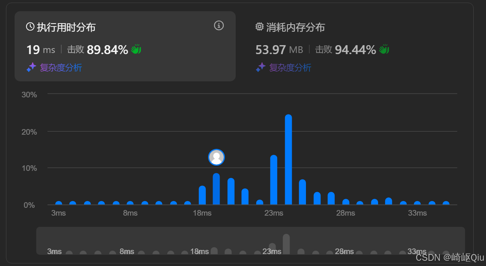

# leetcode525：连续数组(前缀和解法)

> 原创 于 2025-08-06 07:30:00 发布 · 公开 · 990 阅读 · 22 · 16 · CC 4.0 BY-SA版权 版权声明：本文为博主原创文章，遵循 CC 4.0 BY-SA 版权协议，转载请附上原文出处链接和本声明。
> 文章链接：https://blog.csdn.net/lyh2004_08/article/details/149951061

**文章目录**

[TOC]


[LeetCode 525 (连续数组)](https://leetcode.cn/problems/contiguous-array/description/) ，【难度：中等；通过率：55.2%】，这道题的巧妙之处在于，它需要我们先对问题进行一次思维的转变，然后才能套用我们熟悉的算法模型

## 一、 题目描述

给定一个二进制数组 `nums` ，找到含有相同数量的 `0` 和 `1` 的最长连续子数组，并返回该子数组的长度

**示例:** 

```
输入: nums = [0,1]
输出: 2
解释: [0, 1] 是具有相同数量 0 和 1 的最长连续子数组

输入: nums = [0,1,0]
输出: 2
解释: [0, 1] (或 [1, 0]) 是具有相同数量 0 和 1 的最长连续子数组
```

---

## 二、 核心思路 - “0”变“-1”

题目的要求是“相同数量的 0 和 1”。直接处理计数会比较复杂。这里有一个非常关键的思想转换：

**如果我们将数组中所有的 `0` 都看作 `-1` ，那么“0 和 1 数量相等”就等价于“子数组所有元素之和为 0”。** 

为什么呢？假设一个子数组中有 `k` 个 `1` 和 `k` 个 `0` 。经过转换后，这个子数组就变成了 `k` 个 `1` 和 `k` 个 `-1` 。它们的和自然就是 `k * 1 + k * (-1) = 0` 

通过这个转换，问题就从“找到含有相同数量 0 和 1 的最长连续子数组”，变成了“ **找到和为 0 的最长连续子数组** ”。这是一个我们非常熟悉的前缀和问题！

---

## 三、 从“子数组和”到“前缀和”

现在问题是找到和为 0 的最长子数组。我们知道，一个从索引 `i` 到 `j` 的子数组的和 `sum(i, j)` 可以通过前缀和数组 `P` 来计算：

`sum(i, j) = P[j] - P[i-1]` 

我们希望 `sum(i, j) == 0` ，这也就意味着 `P[j] == P[i-1]` 

所以，问题再次被转换为： **找到两个索引 `i-1` 和 `j` ，使得它们对应的前缀和相等，并求出所有这种情况中 `j - (i-1)` 的最大值。** 

---

## 四、哈希表的妙用

为了高效地找到之前出现过的相同的前缀和，哈希表是我们的不二之选

-  **Key** : 前缀和的值

-  **Value** : 该前缀和 **第一次** 出现的索引

我们只需要记录第一次出现的索引，因为对于一个固定的终点 `j` ，起点 `i-1` 的索引越小，子数组的长度 `j - (i-1)` 就越大

**一个关键的初始化** ：我们需要在哈希表中预先放入 `map.put(0, -1)` 。这有什么用呢？它用于处理那些从数组开头 `index=0` 开始的子数组。例如，如果 `nums = [0, 1]` ，转换后为 `[-1, 1]` 

- 当 `i=0` 时，前缀和为 `-1` 

- 当 `i=1` 时，前缀和为 `-1 + 1 = 0` 。此时，我们在哈希表中查找 `0` ，找到了它在索引 `-1` 处。子数组长度为 `1 - (-1) = 2` ，这正是正确答案

---

## 五、 代码实现

这就是我们将上述所有思路融合在一起的最终代码

```java
class Solution {
    public int findMaxLength(int[] nums) {
        // 1. 使用 HashMap 存储 <前缀和, 第一次出现的索引>
        HashMap<Integer, Integer> map = new HashMap<>();
      
        // 2. 关键初始化：处理从数组开头开始的子数组
        map.put(0, -1);
      
        int maxLength = 0;
        int currentSum = 0; // 动态计算的前缀和

        // 3. 一次遍历完成所有操作
        for (int i = 0; i < nums.length; i++) {
            // a. 将 0 视为 -1，动态更新前缀和
            currentSum += (nums[i] == 1 ? 1 : -1);

            // b. 检查当前前缀和是否已存在于 map 中
            if (map.containsKey(currentSum)) {
                // 如果存在，说明找到了一个和为 0 的子数组
                // 长度为 i - map.get(currentSum)
                maxLength = Math.max(maxLength, i - map.get(currentSum));
            } else {
                // c. 如果是第一次出现，记录其索引
                map.put(currentSum, i);
            }
        }

        return maxLength;
    }
}
```

### 执行用时情况

 

---

## 六、 关键点与复杂度分析

-  **思想转换** ：将“数量相等”问题转化为“和为 0”问题是解题的钥匙

-  **前缀和 + 哈希表** ：这是解决各类子数组和问题的标准、高效模式，必须熟练掌握

-  **边界处理** ： `map.put(0, -1)` 的初始化是确保算法正确性的关键细节

-  **时间复杂度** ： **O(N)** 我们只需要对数组进行一次遍历，哈希表的插入和查找操作平均时间复杂度为 O(1)

-  **空间复杂度** ： **O(N)** 在最坏的情况下（例如，数组中全是 1），每个前缀和都不同，哈希表需要存储 N 个条目

