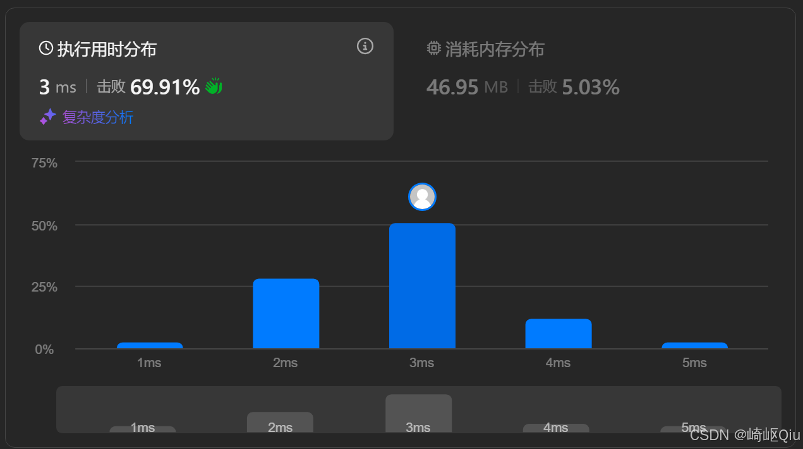

# leetcode1052：爱生气的书店老板（定长滑动窗口）

> 原创 已于 2025-08-07 23:58:42 修改 · 公开 · 1.5k 阅读 · 52 · 40 · CC 4.0 BY-SA版权 版权声明：本文为博主原创文章，遵循 CC 4.0 BY-SA 版权协议，转载请附上原文出处链接和本声明。
> 文章链接：https://blog.csdn.net/lyh2004_08/article/details/149987013

**文章目录**

[TOC]


[LeetCode 1052 (爱生气的书店老板)](https://leetcode.cn/problems/grumpy-bookstore-owner/) ，【难度：中；通过率：60.6%】，这道题的背景故事很有趣，但其核心是考察我们如何在一个数组中，通过一次“特殊技能”，找到一个能带来最大收益的连续子区间

## 一、 题目描述

有一个书店老板，他的书店开了 `n` 分钟。每分钟都有一些顾客 `customers[i]` 进入，而老板在第 `i` 分钟的情绪由 `grumpy[i]` 表示：如果 `grumpy[i] = 1` ，那么老板在第 `i` 分钟是生气的；如果 `grumpy[i] = 0` ，则是不生气的

当老板不生气时，所有顾客都会满意；当老板生气时，所有顾客都会不满意

老板有一个秘密技巧：他可以选择一个长度为 `minutes` 的连续时间段，并在这段时间内不生气

请你返回在这 `n` 分钟内，老板最多能让多少顾客满意

**示例:** 

```
输入：customers = [1,0,1,2,1,1,7,5], grumpy = [0,1,0,1,0,1,0,1], minutes = 3
输出：16
解释：
书店老板在最后 3 分钟保持冷静
感到满意的最大客户数量 = 1 + 1 + 1 + 1 + 7 + 5 = 16
```

---

## 二、 核心思路 - 问题的分解与滑动窗口

这个问题可以分解为两部分来思考：

1.  **确定满意的顾客** ：无论老板是否使用技能，只要他本来就不生气 ( `grumpy[i] == 0` )，这些分钟的顾客就 **一定** 是满意的。我们可以先把这部分顾客数量加起来，作为我们的“基础满意度”

2.  **额外满意的顾客** ：老板的技能可以让他连续 `minutes` 分钟不生气。这个技能的 **唯一价值** ，就是挽回那些在他 **原本会生气** 的分钟里流失的顾客。我们的目标，就是找到一个长度为 `minutes` 的时间窗口，在这个窗口内，老板原本会生气所导致的“损失”最大，然后通过技能把这些“损失”挽回。换句话说，我们要找到一个长度为 `minutes` 的窗口，使得窗口内所有 `grumpy[i] == 1` 对应的 `customers[i]` 之 **和** 最大

这个“找到长度为 `minutes` 的、和最大的连续子数组”的问题，正是 **滑动窗口** 算法的经典应用场景

---

## 三、 算法步骤

1.  **计算基础满意度** ：

   - 遍历一次 `customers` 和 `grumpy` 数组

   - 将所有 `grumpy[i] == 0` 的 `customers[i]` 累加起来，得到 `totalSatisfied` 

2.  **寻找最大可挽回的顾客数 (滑动窗口)** ：

   - 我们只关心那些老板生气时的顾客数。可以认为，如果 `grumpy[i] == 0` ，那么这分钟能挽回的顾客数为 0；如果 `grumpy[i] == 1` ，能挽回的顾客数就是 `customers[i]` 

   -  **初始化窗口** ：计算前 `minutes` 分钟内，可以被挽回的顾客总数，记为 `currentWindowIncrease` 。这个值就是我们的第一个窗口的收益。同时，用一个变量 `maxIncrease` 来记录目前为止发现的最大收益

   -  **滑动窗口** ：从第 `minutes` 分钟开始，向右滑动窗口

     -  **窗口右移** ：每次循环，窗口向右移动一格。这意味着新的元素 `customers[i]` (当 `grumpy[i]==1` 时) 进入了窗口

     -  **窗口左移** ：同时，旧的元素 `customers[i - minutes]` (当 `grumpy[i - minutes]==1` 时) 离开了窗口

     -  **更新窗口收益** ： `currentWindowIncrease = currentWindowIncrease + (新进入的收益) - (旧离开的收益)` 

     -  **更新最大收益** ： `maxIncrease = Math.max(maxIncrease, currentWindowIncrease)` 

3.  **计算最终结果** ：

   - 最终结果就是 `totalSatisfied + maxIncrease` 

---

## 四、 代码实现和详细注释

```java
class Solution {
    public int maxSatisfied(int[] customers, int[] grumpy, int minutes) {
        // ans: 存储不使用技能时的基础满意顾客数
        // len: 数组长度
        // addAns: 存储通过技能可以额外增加的最大满意顾客数，初始化为 -1 便于后续取最大值
        // tempSum: 存储当前滑动窗口内可以额外挽回的顾客数
        // l: 滑动窗口的左边界
        int ans = 0, len = customers.length, addAns = -1, tempSum = 0, l = 0;
        
        // 步骤 1: 计算不使用技能时的基础满意顾客数
        // 遍历所有分钟，如果老板不生气 (grumpy[i] == 0)，则将顾客数累加到 ans
        // 如果老板生气 (grumpy[i] == 1)，则这部分顾客无法满意，不计入基础 ans
        for (int i = 0; i < len; i++) {
            ans += grumpy[i] == 1 ? 0 : customers[i];
        }

        // 步骤 2: 初始化第一个滑动窗口的额外收益
        // 计算前 minutes 分钟内，如果老板生气 (grumpy[i] == 1)，这些顾客可以被挽回
        for (int i = 0; i < minutes; i++) {
            tempSum += grumpy[i] == 1 ? customers[i] : 0;
        }
        
        // 步骤 3: 滑动窗口，寻找最大可挽回的顾客数
        // r: 滑动窗口的右边界
        // l: 滑动窗口的左边界，与 r 同步右移
        for (int r = minutes; r < len; r++, l++) {
            // 在窗口滑动之前，先将当前窗口 (l 到 r-1) 的收益与 addAns 比较，更新最大值
            // 这一步是为了确保第一个窗口 (0 到 minutes-1) 的收益也被考虑在内，以及后续每个完整窗口的收益
            addAns = Math.max(addAns, tempSum);

            // 窗口左边界 l 向右移动，减去滑出窗口的元素可能带来的收益
            // 只有当 grumpy[l] == 1 时，customers[l] 才是可挽回的收益，否则为 0
            tempSum -= grumpy[l] == 1 ? customers[l] : 0;
            
            // 窗口右边界 r 向右移动，加上新进入窗口的元素可能带来的收益
            // 只有当 grumpy[r] == 1 时，customers[r] 才是可挽回的收益，否则为 0
            tempSum += grumpy[r] == 1 ? customers[r] : 0;
        }
        
        // 步骤 4: 循环结束后，tempSum 中保存的是最后一个窗口的收益
        // 需要将其与 addAns 再次比较，以确保最后一个窗口的收益也被纳入考虑
        addAns = Math.max(addAns, tempSum);
        
        // 步骤 5: 返回最终结果 = 基础满意顾客数 + 最大额外挽回顾客数
        return ans + addAns;
    }
}
```

运行结果：
 

---

## 五、 关键点与复杂度分析

-  **问题分解** ：将问题分解为“确定部分”和“可变部分”是解题的关键

-  **滑动窗口** ：这是解决“固定长度连续子数组最值”问题的标准、高效模板。核心在于每次窗口滑动时，只进行 O(1) 的计算（加一个新元素，减一个旧元素），而不是重新计算整个窗口的和

-  **时间复杂度** ： **O(N)** 我们对数组进行了两次独立的遍历（一次计算基础满意度，一次滑动窗口），总的时间复杂度是 O(N) + O(N) = O(N)

-  **空间复杂度** ： **O(1)** 我们只使用了几个额外的变量来存储结果和中间值，没有使用与输入规模相关的额外空间

