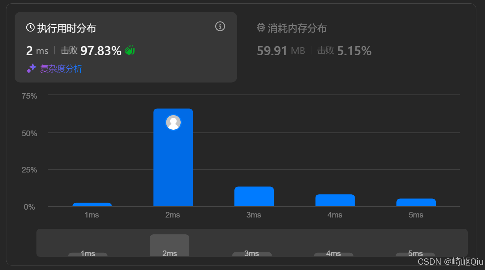

# leetcode1343：大小为K的子数组（定长滑动窗口）

> 原创 于 2025-08-07 07:45:00 发布 · 公开 · 892 阅读 · 24 · 19 · CC 4.0 BY-SA版权 版权声明：本文为博主原创文章，遵循 CC 4.0 BY-SA 版权协议，转载请附上原文出处链接和本声明。
> 文章链接：https://blog.csdn.net/lyh2004_08/article/details/149988053

**文章目录**

[TOC]


[LeetCode 1343 - 大小为 K 且平均值大于等于阈值的子数组数目](https://leetcode.cn/problems/number-of-sub-arrays-of-size-k-and-average-greater-than-or-equal-to-threshold/) ，【难度：中等；通过率：71.2%】，上一题的“ [LeetCode 1052 (爱生气的书店老板)](https://blog.csdn.net/lyh2004_08/article/details/149987013) ”是利用滑动窗口求最值，而本例是利用滑动窗口统计数目，它要求我们统计一个数组中，所有满足特定条件的、固定大小的 **子数组** 的数量。这再次展示了滑动窗口算法在处理此类问题上的高效性

## 一、 题目描述

给你一个整数数组 `arr` 和两个整数 `k` 和 `threshold` 

请你返回长度为 `k` 且平均值大于等于 `threshold` （阈值）的子数组数目

**示例:** 

```
输入：arr = [2,2,2,2,5,5,5,8], k = 3, threshold = 4
输出：3
解释：
子数组 [2,5,5] 的平均值为 (2+5+5)/3 = 4
子数组 [5,5,5] 的平均值为 (5+5+5)/3 = 5
子数组 [5,5,8] 的平均值为 (5+5+8)/3 = 6

输入：arr = [11,13,17,23,29,31,7,5,2,3], k = 3, threshold = 5
输出：6
```

---

## 二、 核心思路 - 从“平均值”到“总和”的转换

题目的条件是“平均值大于等于 `threshold` ”。即：

`(arr[i] + ... + arr[i+k-1]) / k >= threshold` 

直接处理浮点数除法可能会引入精度问题，而且效率不高。我们可以对这个不等式进行一个简单的数学转换：

`(arr[i] + ... + arr[i+k-1]) >= threshold * k` 

这样，问题就从“判断子数组的平均值”转换为了“ **判断子数组的总和** ”。我们只需要找到所有长度为 `k` 的子数组，计算它们的总和，并判断这个总和是否大于等于 `threshold * k` 即可

这个问题——“遍历所有固定长度的子数组并计算其总和”——正是 **滑动窗口** 算法的完美应用场景

---

## 三、 算法步骤

1.  **计算目标和** ：首先计算出子数组需要达到的最小总和 `targetSum = threshold * k` 

2.  **初始化窗口** ：计算第一个窗口（即数组的前 `k` 个元素）的总和 `windowSum` 

3.  **判断第一个窗口** ：检查 `windowSum` 是否大于等于 `targetSum` 。如果是，则计数器 `count` 加 1

4.  **滑动窗口** ：

   - 从第 `k` 个元素开始，向右滑动窗口直到数组末尾

   -  **窗口右移** ：每次循环，窗口向右移动一格。新的元素 `arr[i]` 进入窗口，所以 `windowSum += arr[i]` 

   -  **窗口左移** ：同时，旧的元素 `arr[i - k]` 离开了窗口，所以 `windowSum -= arr[i - k]` 

   -  **判断新窗口** ：每次更新 `windowSum` 后，都检查它是否大于等于 `targetSum` 。如果是，则 `count` 加 1

5.  **返回结果** ：循环结束后，返回最终的 `count` 

---

## 四、 代码实现与注释

```java
class Solution {
    public int numOfSubarrays(int[] arr, int k, int threshold) {
        // len: 数组的长度
        // l:   滑动窗口的左边界
        // ans: 存储满足条件的子数组的数量
        // sum: 存储当前滑动窗口内元素的总和
        int len = arr.length, l = 0, ans = 0, sum = 0;

        // 步骤 1: 初始化第一个窗口 (即索引从 0 到 k-1 的子数组)
        // 计算这个初始窗口内所有元素的总和
        for (int i = 0; i < k; i++) {
            sum += arr[i];
        }

        // 步骤 2: 判断第一个窗口是否满足条件
        // 如果当前窗口的平均值 (sum / k) 大于等于 threshold，则 ans 加 1，否则 ans 保持 0
        ans = sum / k >= threshold ? 1 : 0;

        // 步骤 3: 滑动窗口
        // r: 滑动窗口的右边界，从 k 开始遍历到数组末尾
        // 每次循环，窗口向右移动一格
        for (int r = k; r < arr.length; r++) {
            // 窗口左移：减去滑出窗口的元素 (arr[l])
            // l++ 使左边界向右移动一格，为下一次循环做准备
            sum -= arr[l++];
            
            // 窗口右移：加上新进入窗口的元素 (arr[r])
            sum += arr[r];

            // 判断当前新的窗口是否满足条件
            // 如果平均值 (sum / k) 大于等于 threshold，则 ans 加 1，否则 ans 保持不变
            ans = sum / k >= threshold ? ans + 1 : ans;
        }

        // 返回最终统计到的满足条件的子数组数量
        return ans;
    }

```

运行结果：
 

---

## 五、 关键点与复杂度分析

-  **问题转换** ：将“平均值”问题转换为“总和”问题是解题的第一步，这避免了浮点数运算，简化了逻辑

-  **滑动窗口模板** ：该解法是滑动窗口的标准模板应用。通过 O(1) 的更新操作（一加一减）来维护窗口的总和，从而高效地遍历所有固定大小的子数组

-  **数据类型** ：使用 `long` 来存储 `targetSum` 和 `windowSum` 是一个很好的编程习惯，可以防止当 `k` 、 `threshold` 或数组元素较大时可能发生的整数溢出

-  **时间复杂度** ： **O(N)** 。我们只需要对数组进行一次遍历来构建和滑动窗口

-  **空间复杂度** ： **O(1)** 。我们只使用了常数个额外变量，与输入数组的规模无关

---

## 六、 两题对比：LC1052，LC1343

这两道题都是滑动窗口的经典应用，但它们在细节和目标上有所不同，通过对比可以加深我们对滑动窗口思想的理解

|  | LeetCode 1052 (爱生气的书店老板) | LeetCode 1343 (大小为 K 的子数组) |
|:---|:---|:---|
|  **问题目标**  |  **求最值** 
- 找到一个窗口，使其“收益”最大。 |  **计数** 
- 统计所有满足条件的窗口的数量。 |
|  **问题分解**  |  **需要** 
- 分解为“基础满意度”和“额外收益”两部分。 |  **不需要** (或说很简单)
- 直接处理整个数组即可。 |
|  **数据预处理**  |  **需要** 
- 将 `grumpy` 数组的 `0/1` 状态转化为实际的“可挽回顾客数”。 |  **需要** 
- 将“平均值”条件转换为“总和”条件。 |
|  **窗口内的计算**  | 计算窗口内 `grumpy[i]==1` 的 `customers[i]` 的 **总和** 。 | 计算窗口内所有 `arr[i]` 的 **总和** 。 |
|  **核心逻辑**  | 维护一个 `maxIncrease` 变量，在每次窗口滑动后 `Math.max()` 更新。 | 维护一个 `count` 变量，在每次窗口滑动后 `if` 判断并累加。 |
|  **共同点**  | - 都处理固定大小 ( `k` 或 `minutes` ) 的连续子数组。
- 都使用滑动窗口将时间复杂度优化到 O(N)。
- 空间复杂度都为 O(1)。 |  |


**总结：** 

-  **LC1052 (爱生气的书店老板)** 更侧重于 **优化和求最值** 。它需要你找到那 **一个** 能带来最大改变的窗口

-  **LC1343 (大小为 K 的子数组)** 更侧重于 **统计和计数** 。它需要你检查 **每一个** 窗口是否满足条件

尽管目标不同，但解决它们的核心工具都是 **滑动窗口** 。通过这两道题的练习，我们可以看到滑动窗口思想的灵活性：它既可以用来寻找最优的子数组，也可以用来统计所有满足条件的子数组