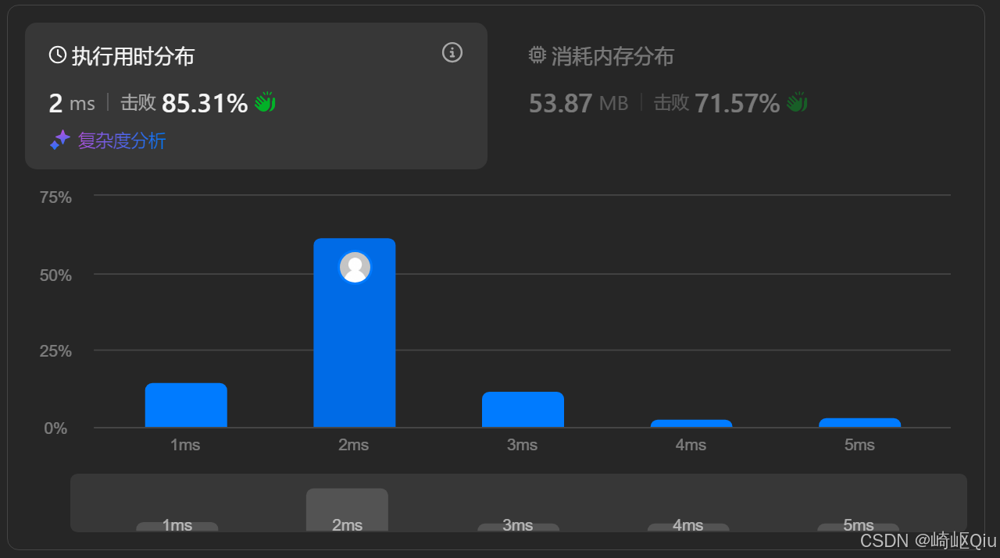

# leetcode1423：可获得的最大点数（定长滑动窗口）

> 原创 于 2025-08-08 07:30:00 发布 · 公开 · 1k 阅读 · 11 · 15 · CC 4.0 BY-SA版权 版权声明：本文为博主原创文章，遵循 CC 4.0 BY-SA 版权协议，转载请附上原文出处链接和本声明。
> 文章链接：https://blog.csdn.net/lyh2004_08/article/details/150033091

**文章目录**

[TOC]


[LeetCode 1423：可获得的最大点数](https://leetcode.cn/problems/maximum-points-you-can-obtain-from-cards/description/) ，【难度：中等；通过率：58.8%】，这道题表面上看似乎需要复杂的动态规划或搜索，但如果我们换一个角度思考，和前两道题一样，它就是一个我们非常熟悉的 **定长滑动窗口** 问题

## 一、 题目描述

几张卡牌 **排成一行** ，每张卡牌都有一个对应的点数。点数由整数数组 `cardPoints` 给出

每次行动，你可以从行的开头或者末尾拿一张卡牌，最终你必须正好拿 `k` 张卡牌

你的点数就是你拿到手中的所有卡牌的点数之和

返回你能获得的最大点数

**示例:** 

```
输入：cardPoints = [1,2,3,4,5,6,1], k = 3
输出：12
解释：第一次行动，不管拿哪张牌，你的点数总是 1 。但是，先拿最右边的卡牌将会最大化你的可获得点数。最优策略是拿右边的三张牌，最终点数为 1 + 6 + 5 = 12

输入：cardPoints = [9,7,7,9,7,7,9], k = 7
输出：55
解释：你必须拿起所有卡牌，可以获得的点数为所有卡牌的点数之和
```

---

## 二、 核心思路 - 逆向思维

直接思考“从两端取 k 张牌”的情况会比较复杂，因为每次都有两种选择。让我们换个角度看问题：

**从两端取 `k` 张牌， <u>剩下</u> 的不就是中间 `n - k` 张连续的牌吗？** 

我们希望拿到的 `k` 张牌的点数之和 **最大** ，这不就等价于，我们剩下的 `n - k` 张牌的点数之和 **最小** 吗？因为 `(所有牌的总和) - (剩下的牌的和) = (拿到的牌的和)` ，而所有牌的总和是固定的

所以，问题被巧妙地转换为了：

**在数组 `cardPoints` 中，找到一个长度为 `n - k` 的连续子数组，使其和最小。** 

而“寻找固定长度的最小和（或最大和） **连续子数组** ”，正是 **滑动窗口** 算法的经典应用场景！

---

## 三、 思考步骤

1.  **计算总和** ：首先，遍历整个数组，计算出所有卡牌的总点数 `totalSum` 

2.  **确定窗口大小** ：我们要找的是剩下的牌，所以窗口大小为 `windowSize = n - k` 

3.  **初始化窗口** ：计算第一个窗口（即数组的前 `windowSize` 个元素）的和 `windowSum` 。这个和就是我们当前找到的“最小和” `minSum` 

4.  **滑动窗口** ：

   - 从第 `windowSize` 个元素开始，向右滑动窗口直到数组末尾

   -  **窗口更新** ：每次循环，窗口向右移动一格。新的元素 `arr[i]` 进入窗口，旧的元素 `arr[i - windowSize]` 离开窗口。高效地更新 `windowSum` ： `windowSum = windowSum + arr[i] - arr[i - windowSize]` 

   -  **更新最小和** ：每次更新 `windowSum` 后，都与当前的 `minSum` 比较，并更新 `minSum = Math.min(minSum, windowSum)` 

5.  **计算最终结果** ：循环结束后，我们已经找到了长度为 `n - k` 的子数组的最小和 `minSum` 。最终的最大点数就是 `totalSum - minSum` 

---

## 四、 代码实现

```java
class Solution {
    public int maxScore(int[] cardPoints, int k) {
        int n = cardPoints.length;
        int windowSize = n - k; // 我们要找的中间剩余部分的长度
        long totalSum = 0;      // 数组总和，使用 long 防止溢出

        // 1. 计算数组总和
        for (int point : cardPoints) {
            totalSum += point;
        }

        // 如果 k 等于 n，说明要拿走所有牌，直接返回总和
        if (k == n) {
            return (int) totalSum;
        }

        long windowSum = 0; // 滑动窗口内的和

        // 2. 初始化第一个窗口
        for (int i = 0; i < windowSize; i++) {
            windowSum += cardPoints[i];
        }

        long minWindowSum = windowSum; // 初始化最小窗口和

        // 3. 滑动窗口，寻找最小和
        for (int i = windowSize; i < n; i++) {
            // 窗口向右滑动一格：加上新元素，减去旧元素
            windowSum += cardPoints[i] - cardPoints[i - windowSize];
          
            // 更新我们找到的最小窗口和
            minWindowSum = Math.min(minWindowSum, windowSum);
        }

        // 4. 最终结果 = 总和 - 剩余部分的最小和
        return (int) (totalSum - minWindowSum);
    }
}
```

运行结果：

 

---

## 五、两道题的表格对比

|  |  [LeetCode 1343 (大小为 K 的子数组)](https://blog.csdn.net/lyh2004_08/article/details/149988053)  | LeetCode 1423 (可获得的最大点数) |
|:---|:---|:---|
|  **问题类型**  | 统计满足特定条件的 **固定长度子数组** 数量 | 寻找满足特定条件的最优 **固定长度子数组** (通过转换) |
|  **核心思想**  |  **滑动窗口**  |  **逆向思维 + 滑动窗口**  |
|  **问题转换**  | 将“平均值 `>= threshold` ”转换为“总和 `>= threshold * k` ”。 | 将“两端取 `k` 张牌最大和”转换为“中间留 `n-k` 张牌最小和”。 |
|  **算法步骤**  | 1. 计算 `targetSum` 。
2. 初始化第一个 `k` 长度窗口和。
3. 循环滑动窗口，每次 `+新 -旧` 。
4. 每次滑动后判断并计数。 | 1. 计算 `totalSum` 。
2. 确定窗口大小 `n-k` 。
3. 初始化第一个 `n-k` 长度窗口和 `minWindowSum` 。
4. 循环滑动窗口，每次 `+新 -旧` 。
5. 每次滑动后更新 `minWindowSum` 。
6. 结果为 `totalSum - minWindowSum` 。 |
|  **数据结构**  | 无额外复杂数据结构 (常数个变量) | 无额外复杂数据结构 (常数个变量) |
|  **时间复杂度**  | O(N) | O(N) |
|  **空间复杂度**  | O(1) | O(1) |
|  **应用场景**  | 查找满足条件的 **固定长度** 子数组的 **数量**  | 涉及从两端操作，或需要将问题转化为固定长度子数组最值问题 |


## 六、 关键点总结与复杂度分析

-  **逆向思维** ：这是解决本题最优雅、最高效的钥匙。将“两端取最大”转化为“中间留最小”

-  **滑动窗口** ：将问题转化为滑动窗口模型后，算法的实现就变得非常标准和高效

-  **边界情况** ：需要注意 `k == n` 的情况，此时剩余的窗口大小为 0，可以直接返回总和

-  **时间复杂度** ： **O(N)** 只需要对数组进行几次线性遍历

-  **空间复杂度** ： **O(1)** 只使用了常数个额外变量

