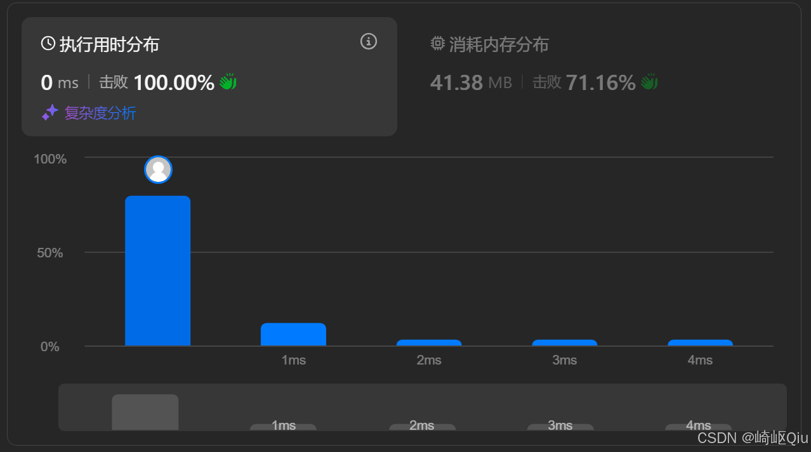

# leetcode1652：拆炸弹（环形+定长滑动窗口）

> 原创 于 2025-08-09 07:30:00 发布 · 公开 · 846 阅读 · 30 · 9 · CC 4.0 BY-SA版权 版权声明：本文为博主原创文章，遵循 CC 4.0 BY-SA 版权协议，转载请附上原文出处链接和本声明。
> 文章链接：https://blog.csdn.net/lyh2004_08/article/details/150080121

**文章目录**

[TOC]


[1652. 拆炸弹 - 力扣（LeetCode）](https://leetcode.cn/problems/defuse-the-bomb/) ，【难度：简单；通过率：71.4%】，这道题是经典滑动窗口问题的一个变体，它将窗口操作放在了一个 **“环形数组”** 上，比较考验我们对窗口滑动细节的理解和对边界的处理

## 一、 题目描述

你有一个炸弹需要拆除，密码在一个环形数组 `code` 中。数组的长度为 `n` 。另有一个密钥 `k` 

为了找到正确的密码，你需要替换数组中的每个数字。替换规则如下：

- 如果 `k > 0` ，将第 `i` 个数字替换为它 **之后** `k` 个数字的总和

- 如果 `k < 0` ，将第 `i` 个数字替换为它 **之前** `k` 个数字的总和

- 如果 `k == 0` ，将第 `i` 个数字替换为 `0` 

> 

- 由于 `code` 是循环的， `code[n-1]` 下一个元素是 `code[0]` ，且 `code[0]` 前一个元素是 `code[n-1]` 

- 即数组是环形的，当计算 `i + j` 或 `i - j` 时，索引可能超出数组范围，需要进行环形处理

**示例:** 

```
输入: code = [5,7,1,4], k = 3
输出: [12,10,16,13]
解释:
第 0 个数字 5 被替换为 7 + 1 + 4 = 12
第 1 个数字 7 被替换为 1 + 4 + 5 = 10
```

---

## 二、 核心思路：环形滑动窗口

这道题的本质是，对于每一个位置 `i` ，我们都需要计算一个固定长度（ `abs(k)` ）的窗口内元素的和。当我们从计算 `i` 的结果移动到计算 `i+1` 的结果时，这个窗口也相应地“滑动”了一格。这正是 **滑动窗口** 算法的典型应用场景

本题的特殊之处在于 **“环形数组”** 。这意味着窗口的滑动可能会“从数组末尾绕回到开头”，或者反之

我们的整体策略是：

1.  **处理特殊情况** ：当 `k == 0` 时，所有结果都是 0，直接处理并返回

2.  **确定初始窗口** ：首先，计算出第一个位置（ `ans[0]` ）对应的窗口和

   - 如果 `k > 0` ， `ans[0]` 的窗口是 `code[1]` 到 `code[k]` 

   - 如果 `k < 0` ， `ans[0]` 的窗口是 `code[n-1]` 到 `code[n - abs(k)]` 

3.  **滑动窗口** ：从 `ans[1]` 开始，我们通过 O(1) 的操作来更新窗口和，而不是重新计算

   - 窗口每向右滑动一格，就意味着有一个“旧元素”离开窗口，一个“新元素”进入窗口

   - 我们只需 `sum = sum - old_element + new_element` 

4.  **处理环形索引** ：所有索引的计算都必须通过取模运算 `% n` 来处理，确保它们始终在 `[0, n-1]` 的范围内

---

## 三、 代码实现与深度解析

【0ms参考代码】含详尽注释

```java
class Solution {
    private int len; // 存储数组长度，方便 movePtr 使用

    /**
     * 辅助函数：在环形数组中移动指针
     * @param ptr   当前指针位置
     * @param direc 移动方向：0 表示向前 (减)，1 表示向后 (加)
     * @param t     移动的步数 (始终为正值)
     * @return 移动后的新指针位置
     */
    private int movePtr(int ptr, int direc, int t) {
        // direc == 0 (向前移动 t 步): (ptr - t) % len。为了防止负数结果，加上 len 再取模
        // direc == 1 (向后移动 t 步): (ptr + t) % len
        return direc == 0 ? (ptr - t + len) % len : (ptr + t) % len;
    }

    public int[] decrypt(int[] code, int k) {
        // 1. 处理 k == 0 的特殊情况
        if (k == 0) {
            Arrays.fill(code, 0); // 将原数组所有元素替换为 0
            return code;
        }

        int currentSum = 0; // 记录当前窗口的和
        int l, r;           // 窗口的左右边界指针
        int index = 0;      // 结果数组的当前填充位置
        len = code.length;  // 获取数组长度
        int[] ans = new int[len]; // 存储最终结果

        // 2. 确定第一个窗口的初始左右边界 l 和 r
        if (k > 0) {
            // 如果 k > 0，窗口是当前元素 code[index] 之后 k 个数字
            // 对于 index = 0，窗口是 code[1] 到 code[k]
            // l 指向窗口的第一个元素 (code[1])
            l = movePtr(0, 1, 1); // 从 0 向后移动 1 步
            // r 指向窗口的最后一个元素 (code[k])
            // 注意：r 在循环中会先移动 k 次，所以初始 r 应该在 l 的位置
            // 初始时，r 与 l 同步，然后在循环中移动 k 次来确定初始窗口
        } else { // k < 0
            // 如果 k < 0，窗口是当前元素 code[index] 之前 abs(k) 个数字
            // 对于 index = 0，窗口是 code[n - abs(k)] 到 code[n - 1]
            // l 指向窗口的第一个元素 (code[n - abs(k)])
            l = movePtr(0, 0, -k); // 从 0 向前移动 abs(k) 步 (即 -k)
        }
        
        // r 初始与 l 同步，将在接下来的循环中向右移动 k 次以确定初始窗口
        r = l; 
        
        // 3. 计算第一个窗口（对应 ans[0]）的和
        for (int i = 0; i < Math.abs(k); i++) {
            currentSum += code[r];
            r = movePtr(r, 1, 1); // r 向右移动，指向下一个待加入的元素
        }

        // 4. 滑动窗口，计算 ans[1] 到 ans[n-1]
        // 循环 len 次，为 ans 数组的每个位置填充结果
        while (true) {
            if (index == len) {
                break; // 所有结果都已计算并填充
            }
            
            // 填充当前 index 对应的结果
            ans[index++] = currentSum;

            // 滑动窗口：减去滑出的元素，加上滑入的元素
            currentSum -= code[l]; // l 指向当前窗口最左边的元素，它将滑出
            currentSum += code[r]; // r 指向当前窗口最右边的下一个元素，它将滑入

            // 移动窗口的左右边界指针
            l = movePtr(l, 1, 1); // l 向右移动一格
            r = movePtr(r, 1, 1); // r 向右移动一格
        }

        return ans;
    }
}
```

- 由于这是一个环形的结构，移动时候要考虑到边界的细节，为了统一处理这种移动操作，所以定一个辅助方法 `movePtr` 来统一化、简化操作

提交结果：

 

---

## 四、 关键点与复杂度分析

-  **环形索引处理** ：这是本题的核心技巧。使用 `(index % n)` 可以处理正向越界。为了防止负数索引，我们使用 `(index + n) % n` 的技巧，这是一个非常稳健的处理方式。例如 `(-1 + 4) % 4 = 3` 

-  **窗口边界的确定** ：准确地找出每次滑动时“离开”和“进入”的元素是关键

  - 当 `k > 0` 时， `ans[i]` 的窗口是 `[i+1, ..., i+k]` 。当计算 `ans[i+1]` 时，窗口变为 `[i+2, ..., i+k+1]` 。离开的是 `code[i+1]` ，进入的是 `code[i+k+1]` 

  - 当 `k < 0` 时， `ans[i]` 的窗口是 `[i-abs(k), ..., i-1]` 。当计算 `ans[i+1]` 时，窗口变为 `[i+1-abs(k), ..., i]` 。离开的是 `code[i-abs(k)]` ，进入的是 `code[i]` 

-  **时间复杂度** ： **O(N)** 只对数组进行了常数次遍历（初始化窗口一次，滑动一次）

-  **空间复杂度** ： **O(N)** 或 **O(1)** ， 如果把返回的 `ans` 数组计入空间，则为 O(N)；如果不计入，则只使用了常数个额外变量，为 O(1)

