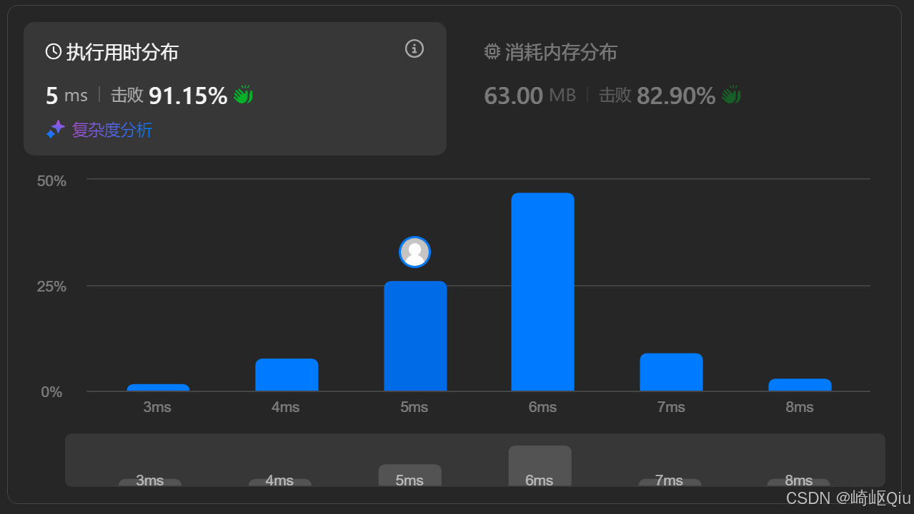

# leetcode2090：半径为K的子数组平均值（定长滑动窗口）

> 原创 于 2025-08-09 08:37:27 发布 · 公开 · 1.1k 阅读 · 13 · 12 · CC 4.0 BY-SA版权 版权声明：本文为博主原创文章，遵循 CC 4.0 BY-SA 版权协议，转载请附上原文出处链接和本声明。
> 文章链接：https://blog.csdn.net/lyh2004_08/article/details/150101341

**文章目录**

[TOC]


**[LeetCode 2090. 半径为 k 的子数组平均值](https://leetcode.cn/problems/k-radius-subarray-averages/description/)** ，【难度：中；通过率：45.7%】，这道题要求我们计算一个“移动平均值”，和上一题“ [leetcode1652：拆炸弹（环形+定长滑动窗口）](https://blog.csdn.net/lyh2004_08/article/details/150080121) ”思路类似，主要需要注意的仍旧是处理 **边界条件** 

## 一、 题目描述

给你一个下标从 **0** 开始的数组 `nums` ，数组中有 `n` 个整数，另给你一个整数 `k` 

**`k` 半径子数组** 的 **平均值** 是指：以 `i` 为中心，半径为 `k` 的子数组（即从 `i-k` 到 `i+k` 的所有元素）的整数平均值。如果 `i` 的任一边没有 `k` 个元素，那么 `k` 半径子数组平均值视为 `-1` 

你需要计算一个长度为 `n` 的数组 `avgs` ，其中 `avgs[i]` 是 `nums` 中以 `i` 为中心的子数组的平均值

**示例:** 


```
输入: nums = [7,4,3,9,1,8,5,2,6], k = 3
输出: [-1,-1,-1,5,4,4,-1,-1,-1]
```

解释：

- avg[0]、avg[1] 和 avg[2] 是 -1 ，因为在这几个下标前的元素数量都不足 k 个

- 中心为下标 3 且半径为 3 的子数组的元素总和是：7 + 4 + 3 + 9 + 1 + 8 + 5 = 37
  使用截断式 整数除法，avg[3] = 37 / 7 = 5

- 中心为下标 4 的子数组，avg[4] = (4 + 3 + 9 + 1 + 8 + 5 + 2) / 7 = 4

- 中心为下标 5 的子数组，avg[5] = (3 + 9 + 1 + 8 + 5 + 2 + 6) / 7 = 4

- avg[6]、avg[7] 和 avg[8] 是 -1 ，因为在这几个下标后的元素数量都不足 k 个

---

## 二、 核心思路：定长滑动窗口

这个问题的核心在于，对于每个有效的中心点 `i` ，我们都需要计算一个 **固定长度** 为 `2k + 1` 的子数组的和。这正是 **定长滑动窗口** 算法的用武之地

我们的策略如下：

1.  **确定有效中心点范围** ：一个索引 `i` 要能成为窗口中心，必须满足 `i-k >= 0` 且 `i+k < n` 。这意味着 `i` 的范围是 `[k, n - 1 - k]` 。所有在这个范围之外的索引，其平均值都为 `-1` 

2.  **处理边界情况** ：如果窗口大小 `2k + 1` 大于整个数组的长度 `n` ，那么没有任何一个位置能形成完整的窗口，可以直接返回一个全为 `-1` 的数组

3.  **初始化第一个窗口** ：计算出第一个有效窗口（中心在 `k` ，范围是 `[0, 2k]` ）的总和

4.  **滑动窗口** ：从中心点 `k+1` 开始，窗口向右滑动。每次滑动，我们通过 O(1) 的操作来更新窗口和：

   -  `sum = sum - (滑出窗口的左侧元素) + (滑入窗口的右侧元素)` 

5.  **计算平均值** ：在每次滑动后，用更新后的 `sum` 计算平均值并存入结果数组

6.  **防止溢出** ：由于 `sum` 可能很大，使用 `long` 类型来存储是明智的选择

---

## 三、 代码实现与深度解析

```java
class Solution {
    public int[] getAverages(int[] nums, int k) {
        int n = nums.length;
        int windowSize = 2 * k + 1; // 窗口的固定大小
        int[] avgs = new int[n];
        Arrays.fill(avgs, -1); // 1. 预先将所有结果填充为 -1

        // 2. 处理边界情况：窗口大小超过数组长度
        if (windowSize > n) {
            return avgs;
        }

        long currentSum = 0L; // 使用 long 防止整数溢出

        // 3. 初始化第一个有效窗口（中心在 k，范围是 [0, 2k]）
        for (int i = 0; i < windowSize; i++) {
            currentSum += nums[i];
        }
        // 计算第一个有效中心的平均值
        avgs[k] = (int) (currentSum / windowSize);

        // 4. 开始滑动窗口
        // 窗口的中心从 k+1 移动到 n-1-k
        for (int i = k + 1; i <= n - 1 - k; i++) {
            // 窗口向右滑动一格
            // i 是新中心，i-k-1 是滑出窗口的元素索引
            // i+k 是滑入窗口的元素索引
            int leftElementIndex = i - k - 1;
            int rightElementIndex = i + k;
          
            currentSum = currentSum - nums[leftElementIndex] + nums[rightElementIndex];
          
            // 计算新中心的平均值
            avgs[i] = (int) (currentSum / windowSize);
        }

        return avgs;
    }
}
```

提交结果：

 

---

## 四、 关键点与复杂度分析

-  **窗口大小** ： `2k + 1` 是本题滑动窗口的固定大小

-  **有效中心范围** ： `[k, n - 1 - k]` 是能够形成完整窗口的中心点索引范围。理解这个范围是正确处理边界的关键

-  **O(1) 更新** ： `currentSum = currentSum - old + new;` 是滑动窗口算法效率的核心，它避免了每次都重新计算整个窗口的和

-  **时间复杂度** ： **O(N)** 只需要遍历一次数组来初始化和滑动窗口

-  **空间复杂度** ： **O(N)** 或 **O(1)** 如果计入返回的 `avgs` 数组，则为 O(N)；如果不计入，则只使用了常数个额外变量，为 O(1)

