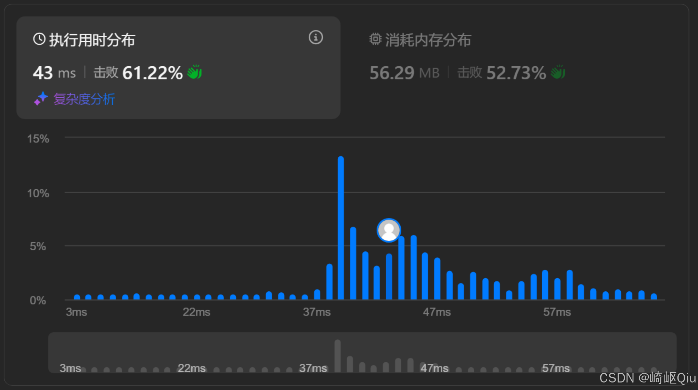

# leetcode2461：长度为K子数组中的最大和（定长滑动窗口+哈希去重）

> 原创 已于 2025-08-10 22:45:10 修改 · 公开 · 353 阅读 · 5 · 6 · CC 4.0 BY-SA版权 版权声明：本文为博主原创文章，遵循 CC 4.0 BY-SA 版权协议，转载请附上原文出处链接和本声明。
> 文章链接：https://blog.csdn.net/lyh2004_08/article/details/150118579

**文章目录**

[TOC]


[LeetCode 2461 长度为K子数组中的最大和](https://leetcode.cn/problems/maximum-sum-of-distinct-subarrays-with-length-k/description/) ，【难度：中；通过率：45.1%】，这道题不仅要求我们处理一个固定长度的窗口，还增加了一个额外的约束：窗口内的元素必须是 **唯一** 的（提前触发关键词： **哈希表** ）

## 一、 题目描述

给你一个整数数组 `nums` 和一个整数 `k` 。请你返回 `nums` 中长度为 `k` 的 **所有不同元素** 子数组的和的 **最大值** 

如果不存在满足条件的子数组，返回 `0` 

**示例:** 

**示例 1：** 

```
输入：nums = [1,5,4,2,9,9,9], k = 3
输出：15

解释：nums 中长度为 3 的子数组是：
- [1,5,4] 满足全部条件，和为 10 
- [5,4,2] 满足全部条件，和为 11 
- [4,2,9] 满足全部条件，和为 15 
- [2,9,9] 不满足全部条件，因为元素 9 出现重复
- [9,9,9] 不满足全部条件，因为元素 9 出现重复
因为 15 是满足全部条件的所有子数组中的最大子数组和，所以返回 15 
```

**示例 2：** 

```
输入：nums = [4,4,4], k = 3
输出：0

解释：nums 中长度为 3 的子数组是：
- [4,4,4] 不满足全部条件，因为元素 4 出现重复
因为不存在满足全部条件的子数组，所以返回 0 
```

---

## 二、 核心思路：滑动窗口+哈希表

面对“固定长度 `k` 的子数组”和“元素各不相同”这两个核心要求，我们可以制定如下策略流程：

1.  **滑动窗口** ：这是处理“固定长度连续子数组”问题的标准高效模板。我们可以维护一个大小为 `k` 的窗口，在 O(N) 的时间内遍历所有可能的子数组。同时，我们需要维护窗口内元素的 **总和 `sum`** 

2.  **哈希表 (HashMap)** ：这是解决“元素唯一性”或“元素频率”问题的显然选择。我们可以用一个 `HashMap<Integer, Integer>` 来记录当前窗口内每个数字出现的次数

   -  **判断窗口是否有效** ：当窗口内所有元素都不同时，哈希表中键的数量 `map.size()` 应该恰好等于窗口大小 `k` 。这就是我们判断一个子数组是否满足条件的依据

---

## 三、 代码实现与深度解析

【参考解法】：定长滑动窗口 + 哈希表去重

```java
class Solution {
    public long maximumSubarraySum(int[] nums, int k) {
        // 使用 Map 维护窗口中每个数字的出现次数
        Map<Integer, Integer> freqMap = new HashMap<>();
        int n = nums.length;
        long maxSum = 0;
        long currentSum = 0;

        // 1: 初始化第一个窗口
        for (int i = 0; i < k; i++) {
            currentSum += nums[i];
            freqMap.put(nums[i], freqMap.getOrDefault(nums[i], 0) + 1);
        }

        // 检查第一个窗口是否满足条件
        if (freqMap.size() == k) {
            maxSum = Math.max(maxSum, currentSum);
        }

        // 2: 开始滑动窗口
        // r 是窗口的右边界（新进入的字符索引）
        for (int r = k; r < n; r++) {
            // l 是窗口的左边界（刚离开的字符索引）
            int l = r - k;

            // 2.1: 更新窗口和
            currentSum += nums[r];
            currentSum -= nums[l];

            // 2.2: 更新哈希表，移除滑出窗口的元素
            int leftElement = nums[l];
            int leftCount = freqMap.get(leftElement);
            if (leftCount == 1) {
                // 如果该元素只出现一次，直接从 map 中移除
                freqMap.remove(leftElement);
            } else {
                // 否则，将其计数减 1
                freqMap.put(leftElement, leftCount - 1);
            }

            // 2.3: 更新哈希表，加入滑入窗口的元素
            int rightElement = nums[r];
            freqMap.put(rightElement, freqMap.getOrDefault(rightElement, 0) + 1);

            // 3: 检查新窗口是否满足条件，并更新最大和
            if (freqMap.size() == k) {
                maxSum = Math.max(maxSum, currentSum);
            }
        }

        return maxSum;
    }
}
```

提交结果：

 

---

## 四、 关键点与复杂度分析

-  **组合拳** ：本题的关键在于将滑动窗口（负责维护和）与哈希表（负责维护唯一性）两种数据结构和思想结合起来，协同工作

-  **哈希表操作** ：在更新哈希表时，对于离开窗口的元素，需要正确地处理其计数值。当计数值减为 0 时，必须将其从哈希表中 `remove` ，这样 `map.size()` 才能准确地反映窗口内不同元素的数量

-  **`long` 类型** ：由于 `nums[i]` 和 `k` 的范围较大，子数组的和可能会超过 `Integer` 的最大值，因此使用 `long` 来存储 `sum` 和 `ans` 是一个必须注意的细节

-  **时间复杂度** ： **O(N)** 只遍历一次数组，每次滑动窗口，对哈希表的操作（ `get` , `put` , `remove` ）平均时间复杂度为 O(1)

-  **空间复杂度** ： **O(k)** 在最坏情况下，哈希表需要存储 `k` 个不同的元素

## 五、 小结

LeetCode2461 是一道非常高质量的滑动窗口题目。当窗口问题带有除了求和、求最值之外的额外约束（如本题的“元素唯一”）时，可以引入 **哈希表、集合** 等辅助数据结构来高效地判断这些 **约束** 

### 下一题

本题与 leetcode2841 思路 **基本一模一样** ，并且解决约束的方式也可以使用 `HashMap` ，参考博文： **[leetcode2841：几乎唯一子数组的最大和（定长滑动窗口+与LC2461详细对比）](https://blog.csdn.net/lyh2004_08/article/details/150163210) **做两题的深入** 对比理解** 