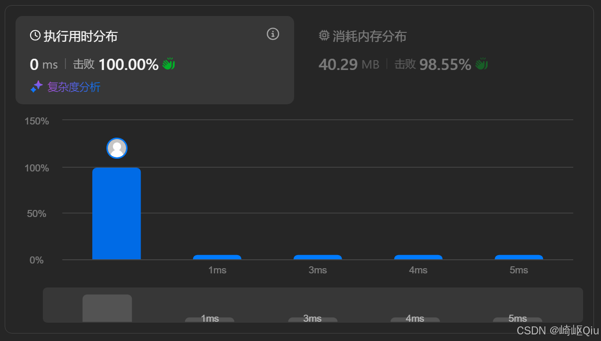

# leetcode24：两两交换链表中的节点（双指针+递归）

> 原创 于 2025-08-11 07:45:00 发布 · 公开 · 841 阅读 · 10 · 30 · CC 4.0 BY-SA版权 版权声明：本文为博主原创文章，遵循 CC 4.0 BY-SA 版权协议，转载请附上原文出处链接和本声明。
> 文章链接：https://blog.csdn.net/lyh2004_08/article/details/150165905

**文章目录**

[TOC]


[LeetCode 24：两两交换链表中的节点](https://leetcode.cn/problems/swap-nodes-in-pairs/) ，【难度：中等；通过率：74.6%】， **链表** 基本练习+ **双指针** 练习（当然递归也可以）

## 一、 题目描述

给你一个链表，两两交换其中相邻的节点，并返回交换后链表的头节点。你必须在不修改节点内部的值的情况下完成本题（即，只能进行节点交换）

**示例:** 
 

```
输入：head = [1,2,3,4]
输出：[2,1,4,3]
```

---

## 解法一：迭代法

迭代法是最直观的思路，通过循环，一次处理一对节点，逐步完成整个链表的交换

### 核心思路

为了方便操作，尤其是处理头两个节点的交换，我们通常会引入一个 **虚拟头节点 (dummy head)** 。 然后我们使用一个 `pre` 指针，它始终指向待交换节点对的前一个节点。在循环中，我们依次对 `pre` 后面的两个节点进行交换

**具体步骤：** 

1. 创建一个虚拟头节点 `dummy` ，并使其 `next` 指针指向原始头节点 `head` 

2. 创建一个 `pre` 指针，初始时指向 `dummy` 

3. 进入循环，条件是 `pre` 后面至少还有两个节点 ( `pre.next != null && pre.next.next != null` )

4. 在循环中，定义 `left` 和 `right` 指针，分别指向要交换的两个节点

5. 执行交换：

   -  `pre` 的 `next` 指向 `right` 

   -  `left` 的 `next` 指向 `right` 原来的 `next` 

   -  `right` 的 `next` 指向 `left` 

6. 移动 `pre` 指针到下一组待交换节点的前面，即移动到交换前的 `left` 节点位置，准备下一轮交换

### 代码实现

```java
class Solution {
    public ListNode swapPairs(ListNode head) {
        // 1. 处理 0 个或 1 个节点的边界情况
        if (head == null || head.next == null) {
            return head;
        }
      
        // 2. 创建虚拟头节点，简化操作
        ListNode dummyHead = new ListNode(0);
        dummyHead.next = head;
      
        ListNode pre = dummyHead;

        // 3. 循环交换节点对
        while (pre.next != null && pre.next.next != null) {
            // 定义要交换的两个节点
            ListNode left = pre.next;
            ListNode right = pre.next.next;

            // 执行交换
            pre.next = right;
            left.next = right.next;
            right.next = left;

            // 4. 移动 pre 指针，为下一轮做准备
            pre = left;
        }
      
        // 5. 返回新链表的头节点
        return dummyHead.next;
    }
}
```

提交结果：

 

### 优缺点分析

-  **优点** ：空间复杂度为 O(1)， **不使用额外的递归栈空间** ，效率高

-  **缺点** ：相比递归，代码量稍多，指针操作要细心

---

## 解法二：递归法 - 优雅的“分而治之”

递归将问题分解为更小的、结构相同的子问题，代码通常更简洁

### 核心思路

`swapPairs(head)` 函数的职责是：接收一个子链表的头节点 `head` ，将这个子链表两两交换后，返回 **新的头节点** 

1.  **终止条件 (Base Case)** ：如果传入的链表为空，或者只有一个节点，那么无法进行交换，直接返回 `head` 即可

2.  **本层操作** ：

   - 我们需要交换的是 `head` 和 `head.next` 这两个节点

   - 设 `head` 是节点1， `head.next` 是节点2。交换后，节点2将成为新的头

3.  **递归调用** ：

   - 节点1（原 `head` ）的 `next` 指针，应该指向 **后面剩余部分链表交换后的新头节点** 。这个新头节点恰好就是 `swapPairs(head.next.next)` 的返回值

   - 所以，我们执行 `head.next = swapPairs(head.next.next);` 

   - 然后，节点2（原 `head.next` ）的 `next` 指针指向节点1

4.  **返回值** ：返回本层交换后的新头节点，即节点2

### 代码实现

```java
class Solution {
    public ListNode swapPairs(ListNode head) {
        // 1. 终止条件：链表为空或只有一个节点
        if (head == null || head.next == null) {
            return head;
        }

        // 2. 获取要交换的两个节点
        ListNode firstNode = head;
        ListNode secondNode = head.next;

        // 3. 递归处理后续节点，并连接
        firstNode.next = swapPairs(secondNode.next);
      
        // 4. 交换当前这对节点
        secondNode.next = firstNode;

        // 5. 返回本轮交换后的新头节点
        return secondNode;
    }
}
```

提交结果：

 

### 优缺点分析

-  **优点** ：代码简洁，逻辑清晰，很好地体现了分治思想

-  **缺点** ：需要使用递归栈，空间复杂度为 O(N)，N是链表长度

---

## 四、 总结与对比

|  | 解法一 (迭代法) | 解法二 (递归法) |
|:---|:---|:---|
|  **核心思路**  | 循环遍历，使用 `pre` 指针逐对操作 | 分而治之，先交换后续部分，再连接当前这对节点 |
|  **时间复杂度**  | O(N) | O(N) |
|  **空间复杂度**  |  **O(1)**  |  **O(N)** (递归栈开销) |
|  **代码可读性**  | 中等，指针操作需要细心 | 高，代码简洁，逻辑优雅 |
|  **关键技巧**  |  **虚拟头节点**  |  **函数定义** 和 **终止条件**  |