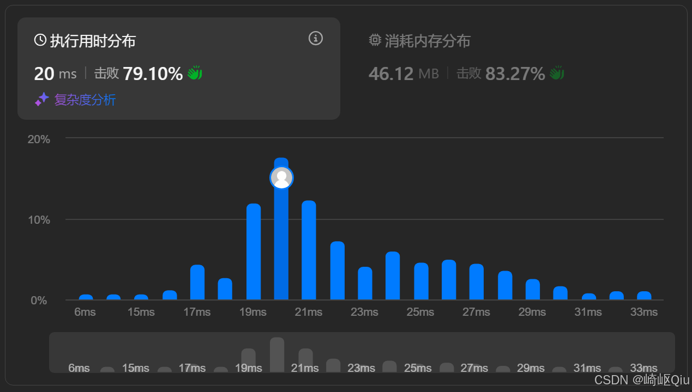

# leetcode2841：几乎唯一子数组的最大和（定长滑动窗口+与LC2461详细对比）

> 原创 于 2025-08-11 07:45:00 发布 · 公开 · 1k 阅读 · 16 · 23 · CC 4.0 BY-SA版权 版权声明：本文为博主原创文章，遵循 CC 4.0 BY-SA 版权协议，转载请附上原文出处链接和本声明。
> 文章链接：https://blog.csdn.net/lyh2004_08/article/details/150163210

**文章目录**

[TOC]


[LeetCode 2841：几乎唯一子数组的最大和](https://leetcode.cn/problems/maximum-sum-of-almost-unique-subarray/) ，【难度：中等；通过率：45.8%】，这道题是定长滑动窗口的“进阶版”，它不仅要求我们维护窗口内的和，还需要我们实时追踪窗口内 **“不同元素的数量”** ；本题和上一题： [leetcode2461：长度为K子数组中的最大和（定长滑动窗口+哈希去重）](https://blog.csdn.net/lyh2004_08/article/details/150118579) 一样，有一些额外的 **约束** ，而这些约束可以很轻易使用其他数据结构（如 `HashMap` ）来处理

## 一、 题目描述

给你一个整数数组 `nums` 和两个整数 `m` 和 `k` 

返回 `nums` 中长度为 `k` 的 “几乎唯一” 子数组的 **最大和** ，如果不存在几乎唯一子数组，请你返回 `0` 

如果 nums 的一个子数组有至少 m 个互不相同的元素，我们称它是 “几乎唯一” 子数组

**示例 1:** 

```
输入：nums = [2,6,7,3,1,7], m = 3, k = 4
输出：18
解释：和最大的是 [2, 6, 7, 3]，不同元素为 4 个 (>=m=3)，和为 18
```

**示例 2:** 

```
输入：nums = [5,9,9,2,4,5,4], m = 1, k = 3
输出：23
解释：和最大的是 [5, 9, 9]，不同元素为 2 个 (>=m=1)，和为 23
```

---

## 二、 核心思路：滑动窗口+哈希表

当看到“长度为 `k` 的子数组”时，我们应该立刻想到 **滑动窗口** 。当看到“ **不同** 元素的数目”时，我们应该 **立刻** 想到用 **哈希表 (HashMap)** 来辅助计数。将两者结合，就是解决本题的最佳思路

我们需要在窗口滑动的过程中，高效地维护两个状态：

1.  **窗口内所有元素的总和 ( `sum` )** 

2.  **窗口内不同元素的数量** (通过 `HashMap` 的大小 `map.size()` 来体现)

**算法流程：** 

1.  **初始化** ：构建第一个大小为 `k` 的窗口。计算出它的 `sum` ，并用 `HashMap` 统计其中每个数字的出现频率

2.  **首次检查** ：检查第一个窗口是否满足“几乎唯一”的条件 ( `map.size() >= m` )，如果满足，则更新最大和 `ans` 

3.  **滑动窗口** ：开始循环，让窗口向右滑动。在每一步滑动中：

   1.  **元素移出** ：将窗口最左侧的元素 `leftVal` 移出。更新 `sum` ( `sum -= leftVal` )，并在 `HashMap` 中将其频率减 1。如果频率减到 0，则从 `HashMap` 中移除该键

   2.  **元素移入** ：将新的元素 `rightVal` 移入窗口。更新 `sum` ( `sum += rightVal` )，并在 `HashMap` 中将其频率加 1

   3.  **再次检查** ：检查当前新窗口是否满足“几乎唯一”的条件 ( `map.size() >= m` )。如果满足，则用当前的 `sum` 更新 `ans` 

4.  **返回结果** ：循环结束后， `ans` 中存储的就是最终答案

---

## 三、 代码实现与深度解析

【参考代码】

```java
class Solution {
    public long maxSum(List<Integer> nums, int m, int k) {
        // 使用 HashMap 存储窗口内每个数字的出现次数
        HashMap<Integer, Integer> windowCounts = new HashMap<>(); // 值--->窗口中出现的次数
      
        long currentSum = 0;
        long maxSum = 0;

        // 1: 初始化第一个大小为 k 的窗口
        for (int i = 0; i < k; i++) {
            int num = nums.get(i);
            currentSum += num;
            windowCounts.put(num, windowCounts.getOrDefault(num, 0) + 1);
        }

        // 2: 对第一个窗口进行检查
        if (windowCounts.size() >= m) {
            maxSum = currentSum;
        }

        // 3: 开始滑动窗口
        // r 是新进入窗口的元素索引
        for (int r = k; r < nums.size(); r++) {
            // l 是刚离开窗口的元素索引
            int l = r - k;
          
            int leftVal = nums.get(l);
            int rightVal = nums.get(r);

            // 3.1: 元素移出窗口，更新 sum 和 HashMap
            currentSum -= leftVal;
            int leftCount = windowCounts.get(leftVal);
            if (leftCount == 1) {
                // 如果该元素在窗口中只出现一次，移除它
                windowCounts.remove(leftVal);
            } else {
                // 否则，只将其计数减 1
                windowCounts.put(leftVal, leftCount - 1);
            }

            // 3.2: 元素移入窗口，更新 sum 和 HashMap
            currentSum += rightVal;
            windowCounts.put(rightVal, windowCounts.getOrDefault(rightVal, 0) + 1);

            // 3.3: 检查新窗口是否满足条件，并更新 maxSum
            if (windowCounts.size() >= m) {
                maxSum = Math.max(maxSum, currentSum);
            }
        }
      
        return maxSum;
    }
}
```

提交结果：

 

---

## 四、 关键点与复杂度分析

-  **滑动窗口 + 哈希表模式** ：这是解决需要追踪窗口内元素频率、种类等复杂状态的利器，是一个非常重要的算法模式

-  **`long` 类型防溢出** ：在处理可能很大的和时，使用 `long` 

-  **高效的哈希表更新** ：正确地处理元素的增减，特别是当元素计数变为 0 时要从哈希表中移除，这是保证 `map.size()` 准确性的核心

-  **时间复杂度** ： **O(N)** 我们只需要遍历一次数组。 `HashMap` 的操作（ `get` , `put` , `remove` ）平均时间复杂度为 O(1)

-  **空间复杂度** ： **O(k)** 在最坏情况下，窗口内的 `k` 个元素都互不相同， `HashMap` 需要存储 `k` 个键值对

---

## 五、本题目与 LC2461 的对比

- 本题 (几乎唯一子数组的最大和)

  -  **目标** ：找长度为 `k` 的子数组，其 **不同元素数量至少为 `m`** ，并求这些子数组中的最大和。

  -  **约束** ： `distinct_count >= m` 

- LC2461 (长度为 K 子数组中的最大和)

  -  **目标** ：找长度为 `k` 的子数组，其 **所有元素都互不相同** ，并求这些子数组中的最大和。

  -  **约束** ： `distinct_count == k` 

### 表格呈现

|  | LeetCode 2841 (几乎唯一子数组) |  [LeetCode 2461 (长度为K子数组中的最大和)](https://blog.csdn.net/lyh2004_08/article/details/150118579)  |
|:---|:---|:---|
|  **问题目标**  | 求满足 **“至少 m 个不同元素”** 的 k-长子数组的最大和 | 求满足 **“所有元素都不同”** 的 k-长子数组的最大和 |
|  **核心约束**  |  `distinct_count >= m`  |  `distinct_count == k`  |
|  **算法核心**  | 维护窗口内元素的 **频率计数** ，通过 `map.size()` 判断约 | 维护窗口内元素的 **频率计数** ，通过 `map.size()` 判断约束 |
|  **哈希表作用**  |  `HashMap<Integer, Integer>` 存储 `<元素, 出现次数>`  |  `HashMap<Integer, Integer>` 存储 `<元素, 出现次数>`  |
|  **窗口有效性判断**  |  `if (windowCounts.size() >= m)`  |  `if (windowCounts.size() == k)`  |
|  **共同点**  | 都是“定长滑动窗口 + 哈希表”模式，都需要维护窗口内的 `sum` 和 `distinct_count`  |  |
|  **代码实现差异**  |  **完全相同** 。两道题的滑动窗口和哈希表更新逻辑可以复用，唯一的区别在于最后判断窗口是否有效的 `if` 条件 |  |


> 两题时间、空间复杂度都一样，不再赘述

### 更多思考

正是因为这两道题的逻辑高度相似，我们甚至可以 **抽象出一个通用的代码模板** 来解决它们

```java
class GeneralSolution {
    /**
     * 通用模板解决 LC2841 和 LC2461
     * @param nums 输入数组
     * @param m    不同元素的最小数量 (对于 LC2461，m = k)
     * @param k    窗口大小
     * @return     满足条件的最大和
     */
    public long solve(int[] nums, int m, int k) {
        HashMap<Integer, Integer> windowCounts = new HashMap<>();
        long currentSum = 0;
        long maxSum = 0;

        // 处理数组长度不足 k 的边界情况
        if (nums.length < k) {
            return 0;
        }

        // 1. 初始化第一个窗口
        for (int i = 0; i < k; i++) {
            currentSum += nums[i];
            windowCounts.put(nums[i], windowCounts.getOrDefault(nums[i], 0) + 1);
        }

        // 2. 检查第一个窗口
        // 唯一的代码逻辑差异之处
        if (windowCounts.size() >= m) { // LC2841
        // if (windowCounts.size() == k) { // LC2461 (m=k)
            maxSum = currentSum;
        }

        // 3. 滑动窗口
        for (int r = k; r < nums.length; r++) {
            int l = r - k;
            int leftVal = nums[l];
            int rightVal = nums[r];

            // 更新 sum
            currentSum += rightVal - leftVal;
            
            // 更新哈希表
            windowCounts.put(rightVal, windowCounts.getOrDefault(rightVal, 0) + 1);
            int leftCount = windowCounts.get(leftVal);
            if (leftCount == 1) {
                windowCounts.remove(leftVal);
            } else {
                windowCounts.put(leftVal, leftCount - 1);
            }

            // 4. 检查新窗口
            // 唯一的差异处（和上面第一次初始化一样的）
            if (windowCounts.size() >= m) { // LC2841
            // if (windowCounts.size() == k) { // LC2461 (m=k)
                maxSum = Math.max(maxSum, currentSum);
            }
        }
        
        return maxSum;
    }
}
```