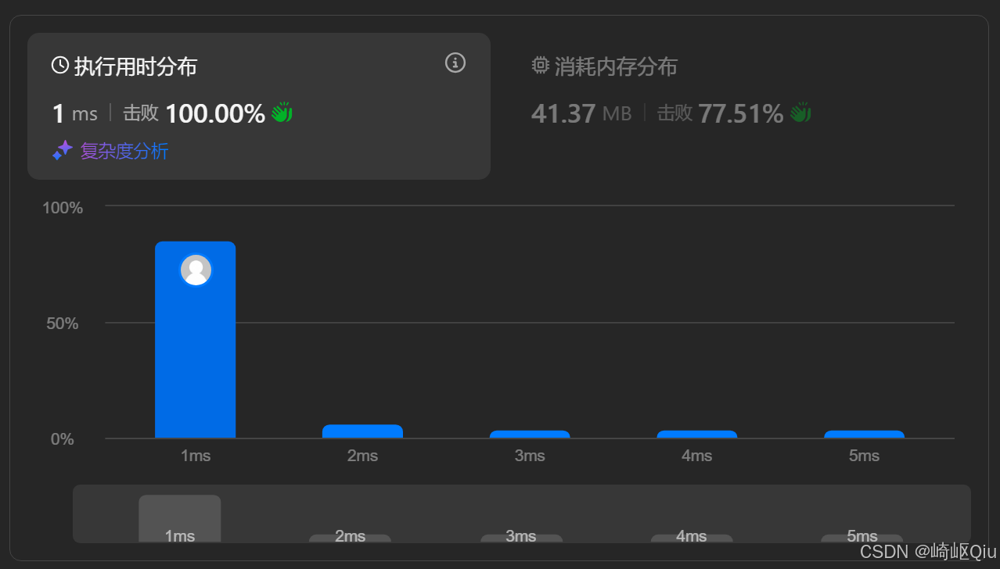

# leetcode3258：统计满足K约束的子字符串数量Ⅰ（变长滑动窗口详解）

> 原创 已于 2025-08-18 22:49:26 修改 · 公开 · 969 阅读 · 35 · 7 · CC 4.0 BY-SA版权 版权声明：本文为博主原创文章，遵循 CC 4.0 BY-SA 版权协议，转载请附上原文出处链接和本声明。
> 文章链接：https://blog.csdn.net/lyh2004_08/article/details/150289200

**文章目录**

[TOC]


[LeetCode 3258 统计满足 K 约束的子字符串](https://leetcode.cn/problems/count-substrings-that-satisfy-k-constraint-i/description/) ，【难度：简答；通过率：83.8%】，这道题不再是简单地寻找最长/最短或最优值的窗口，而是要求我们 **统计所有** 满足条件的 **子数组** 的数量。这需要我们对滑动窗口的理解更进一步，核心思路没变，只是不能死板套一个固定的窗口来无脑遍历了

## 一、 题目描述

给你一个二进制字符串 `s` 和一个整数 `k` 

如果一个子字符串中 0 的数目 **至多** 为 `k` **且** 1 的数目 **至多** 为 `k` ，则称其为满足 K 约束的子字符串

请你返回 `s` 中满足 K 约束的子字符串的数目（子字符串 是字符串中连续的 非空字符序列）

**示例:** 

**示例 1:** 

```
输入：s = "10101", k = 1
输出：12

解释：
s 的所有子字符串中，除了 "1010"、"10101" 和 "0101" 外，其余子字符串都满足 k 约束
```

**示例 2:** 

```
输入：s = "1010101", k = 2
输出：25

解释：
s 的所有子字符串中，除了长度大于 5 的子字符串外，其余子字符串都满足 k 约束
```

---

## 二、 核心思路：变长滑动窗口 + 计数原理

这道题的核心是统计所有满足条件的 **子数组** 。如果我们暴力枚举所有子数组，时间复杂度会是 O( **N²** )，无法接受。因此，我们自然地想到了 **滑动窗口** 

但是，滑动窗口如何用来“ **计数** ”呢？这里有一个非常重要且显然的原理：

>  **如果一个以 `r` 为右端点的窗口 `[l, r]` 是满足条件的，那么所有以 `r` 为右端点、且被 `[l, r]` 包含的子数组，也一定满足条件。** 

例如，如果 `s = "01101"` ， `k=2` ，当我们的窗口是 `[0, 1, 1]` ( `l=0, r=2` ) 时，它是满足条件的。那么，以 `r=2` （即第三个 ‘1’）结尾的、满足条件的子数组有哪些？

-  `[1]` (从 `r=2` 开始)

-  `[1, 1]` (从 `r=1` 开始)

-  `[0, 1, 1]` (从 `r=0` 开始)
  总共有 `r - l + 1 = 2 - 0 + 1 = 3` 个

基于这个原理，我们的算法流程就清晰了：

1. 用右指针 `r` 遍历字符串， **不断扩大窗口** 

2. 在每一步，我们 **检查当前窗口** `[l, r]` 是否满足条件 ( `0` 的数量 `<=k` 且 `1` 的数量 `<=k` )

3. 如果 **不满足** ，我们就从 **左边收缩窗口** （ `l++` ），直到窗口 **重新满足** 条件为止

4. 当窗口 `[l, r]` 满足条件后，我们就知道，所有以 `r` 结尾的、长度不超过 `r-l+1` 的子数组都满足条件。我们将这个数量 `r - l + 1` **累加** 到最终结果 `ans` 中

---

## 三、 代码实现与深度解析

【最佳实践】

```java
class Solution {
    public int countKConstraintSubstrings(String s, int k) {
        int ans = 0;
        int left = 0; // 滑动窗口的左边界
      
        // cnt[0] 记录 '0' 的数量, cnt[1] 记录 '1' 的数量
        int[] counts = new int[2]; 
      
        // right 是滑动窗口的右边界
        for (int right = 0; right < s.length(); right++) {
            // 步骤 1: 右边界进入窗口，更新状态
            counts[s.charAt(right) - '0']++;

            // 步骤 2: 检查窗口是否合法。如果不合法，则收缩左边界
            // 只要 '0' 或 '1' 的数量超过 k，窗口就不合法
            while (counts[0] > k && counts[1] > k) {
                // 将左边界的字符移出窗口
                counts[s.charAt(left) - '0']--;
                left++; // 收缩窗口
            }

            // 步骤 3: 此时的窗口 [left, right] 是一个满足条件的窗口
            // 所有以 right 结尾的子数组，只要其左边界不小于 left，就都是合法的
            // 这样的子数组有 (right - left + 1) 个
            ans += (right - left + 1);
        }
      
        return ans;
    }
}
```

提交结果：

 

---

## 四、 关键点与复杂度分析

-  **计数原理** ： `ans += (right - left + 1)` 是本题的精髓，它将滑动窗口从一个“查找”工具，变成了一个“计数”工具

-  **窗口的收缩条件** ： `while (counts[0] > k && counts[1] > k)` 准确地反映了题目的约束条件。 **只有均不满足** ，才需要收缩，因为这两个约束是“ **满足任一** ”即可

-  **时间复杂度** ： **O(N)** 虽然有 `while` 循环嵌套在 `for` 循环中，但每个元素最多被左指针 `left` 和右指针 `right` **各访问一次** 。因此，总的时间复杂度是线性的

-  **空间复杂度** ： **O(1)** 我们只使用了大小为 2 的 `counts` 数组，空间开销是常数级别的

