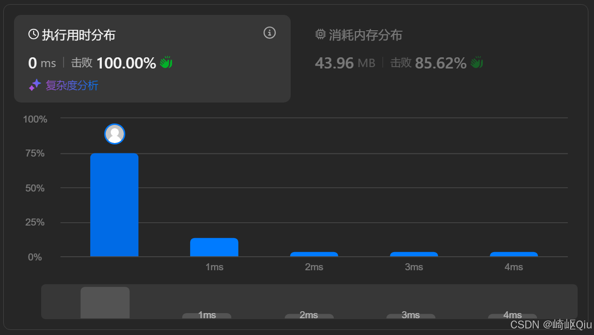

# leetcode26：删除有序数组中的重复项Ⅰ（快慢指针解法）

> 原创 已于 2025-08-23 16:47:35 修改 · 公开 · 682 阅读 · 18 · 8 · CC 4.0 BY-SA版权 版权声明：本文为博主原创文章，遵循 CC 4.0 BY-SA 版权协议，转载请附上原文出处链接和本声明。
> 文章链接：https://blog.csdn.net/lyh2004_08/article/details/150643180

**文章目录**

[TOC]


[leetcode26. 删除有序数组中的重复项](https://leetcode.cn/problems/remove-duplicates-from-sorted-array/description/) ，【难度：简单；通过率：58.2%】，这道题是双指针之 **快慢指针模式** 的经典入门，它要求我们在一个 **有序数组** 中 **原地** 删除重复项，使每个元素只出现 **一次** 

## 一、 题目描述

给你一个 **升序排列** 的数组 `nums` ，请你 **原地** 删除重复出现的元素，使得每个元素 **只出现一次** ，返回删除后数组的新长度。元素的 **相对顺序** 应该保持一致

更规范地说，如果在删除重复项之后有 `k` 个元素，那么 `nums` 的前 `k` 个元素应该保存最终结果

**示例:** 

**示例 1:** 

```
输入：nums = [1,1,2]
输出：2, nums = [1,2,_]
解释：函数应该返回新长度 k = 2, 并且原数组的前两个元素被修改为 1, 2
```

**示例 2:** 

```
输入：nums = [0,0,1,1,1,2,2,3,3,4]
输出：5, nums = [0,1,2,3,4,_,_,_,_,_]
解释：函数应该返回新长度 k = 5, 并且原数组的前五个元素被修改为 0, 1, 2, 3, 4
```

---

## 二、 核心思路：快慢指针

解决此类在 **有序数组** 上进行 **原地修改** 的问题， **快慢指针** 是最高效且最常用的方法

我们将数组逻辑上分为两部分：

-  **`[0...slow-1]`** ：这是我们已经处理好的、去重后的新数组

-  **`[slow...fast-1]`** ：这是 `fast` 指针已经扫描过，但包含重复项的区域（由于是“ **原地操作** ”，这些元素将被 **覆盖** ）

-  **`[fast...n-1]`** ：这是待 `fast` 指针探索的未知区域

**指针职责：** 

-  **`fast` (快指针)** ：作为“读取”指针，它负责 **遍历** 整个原始数组，寻找可以保留的元素

-  **`slow` (慢指针)** ：作为“写入”指针，它 **指向新数组** 的下一个空闲位置，等待接收下一个唯一的元素。同时， `slow` 的值也代表了新数组的当前长度

---

## 三、 代码实现与深度解析

参考代码

```java
class Solution {
    public int removeDuplicates(int[] nums) {
        // 边界条件处理：如果数组为空或只有一个元素，无需去重，直接返回其长度
        // 题目约束 nums.length >= 1，所以这里只考虑 nums.length == 1 的情况
        // 如果数组长度为0，按题目约束不会出现，但如果考虑，则应返回0
        if (nums.length == 0) { // 额外添加的空数组判断，更严谨
            return 0;
        }

        // 初始化快慢指针
        // slow 指针：指向下一个要写入的唯一元素的位置
        // 数组的第一个元素 nums[0] 总是唯一的，所以新数组的有效长度至少为 1
        // slow 从 1 开始，意味着 nums[0] 已经被保留
        int slow = 1; 
      
        // fast 指针：从数组的第二个元素开始遍历 (索引 1)
        // 它的任务是探索数组中的每一个元素
        for (int fast = 1; fast < nums.length; fast++) {
            // 核心判断：如果 fast 指向的元素与它前一个元素不同
            // 这说明 nums[fast] 是一个新的、唯一的元素
            if (nums[fast] != nums[fast - 1]) {
                // 将唯一的元素复制到 slow 指针的位置
                nums[slow] = nums[fast];
                // slow 指针前进一格，为下一个唯一元素腾出位置
                slow++;
            }
            // 如果 nums[fast] 与 nums[fast - 1] 相同，说明是重复元素，
            // 此时 slow 不动，fast 继续前进，相当于“跳过”了这个重复元素
        }
      
        // 循环结束后，slow 的值就是去重后数组的新长度 k
        return slow;
    }
}
```

提交结果：

 

---

## 四、 关键点与复杂度分析

-  **原地修改** ：该算法不使用任何额外的数组空间，直接在输入数组上进行修改，满足 O(1) 额外空间复杂度的要求

-  **数组有序性** ：算法的核心依赖于输入数组是 **有序** 的。这使得我们只需 **比较相邻元素** 即可判断重复

-  **相对顺序保持** ：由于 `fast` 指针是顺序遍历的，并且只有唯一的元素才会被复制到 `slow` 的位置，因此去重后的元素相对顺序得到了保持

-  **时间复杂度** ： **O(N)** 快指针 `fast` 遍历了整个数组一次，每个元素最多被访问一次

-  **空间复杂度** ： **O(1)** 只使用了常数个额外变量（ `slow` , `fast` ），没有使用与输入规模相关的额外空间

## 五、 总结与拓展

本题是快慢指针模式的经典入门题，本质上就是双指针法，为每个指针(引用)赋予不同的身份和作用，实现一种快慢遍历、填充的效果

**拓展思考：** 

这道题是LeetCode80 (删除有序数组中的重复项 II) 的前置题。如果题目要求你“每个元素最多出现两次”，该如何修改你的快慢指针逻辑呢？

参考博客：

>  [LeetCode 80 快慢指针法详解，以及基于LC 26、LC 80总结出的此类题通用模板](https://blog.csdn.net/lyh2004_08/article/details/150643349) 