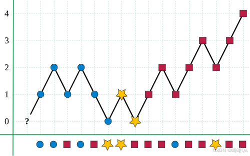
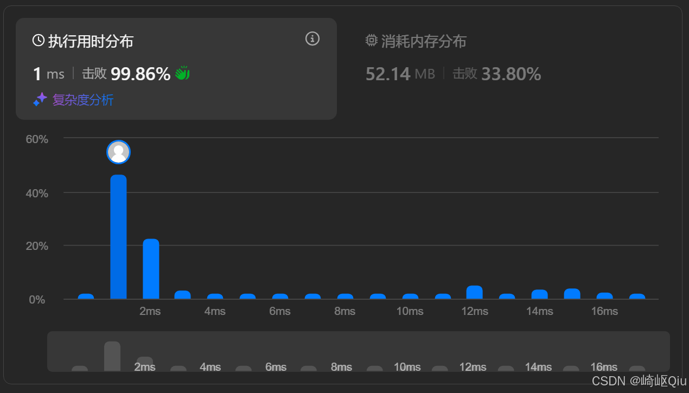
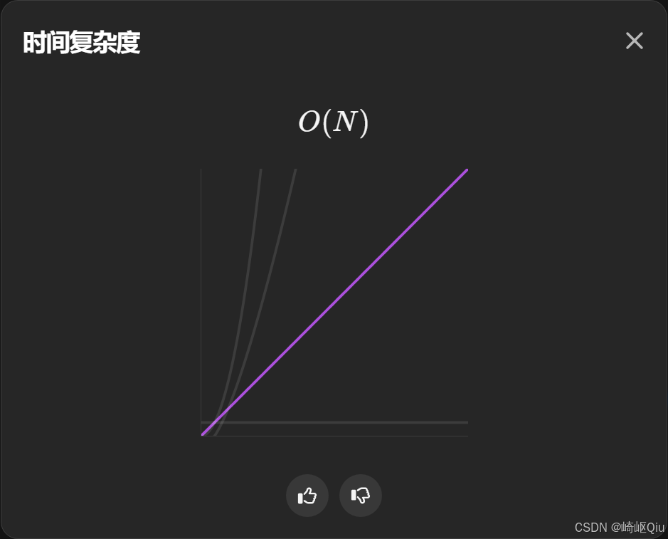
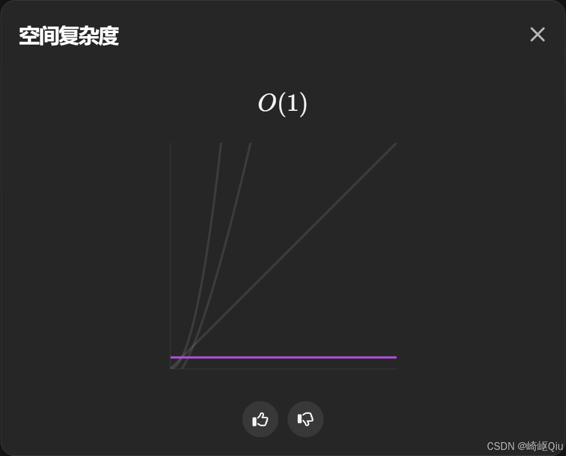

# leetcode169：多数元素（基于摩尔投票的 O(1) 进阶解法）

> 原创 已于 2025-08-24 07:36:10 修改 · 公开 · 1.2k 阅读 · 30 · 13 · CC 4.0 BY-SA版权 版权声明：本文为博主原创文章，遵循 CC 4.0 BY-SA 版权协议，转载请附上原文出处链接和本声明。
> 文章链接：https://blog.csdn.net/lyh2004_08/article/details/150692890

**文章目录**

[TOC]


[LeetCode 169，寻找数组中的多数元素](https://leetcode.cn/problems/majority-element/?envType=study-plan-v2&envId=top-interview-150) ，【难度：简单；通过率：67.0%】，本题目有多种解法，最常见最直观的就是使用 **哈希表** 遍历，统计数量，其次还有将数组 **排序** ，然后基于中位数寻找答案

但是若要达到题目进阶的要求：空间复杂度 **O(1)** ，且实现复杂度 **O(n)** ，就必须使用以下这种思路： **摩尔投票算法** 

## 一、 题目描述

给定一个大小为 `n` 的数组 `nums` ，返回其中的多数元素

多数元素是指在数组中出现次数 **大于 `⌊n / 2⌋`** 的元素

你可以假设数组是非空的，并且给定的数组总是存在多数元素

**示例 1:** 

```
输入: nums = [3,2,3]
输出: 3
```

**示例 2:** 

```
输入: nums = [2,2,1,1,1,2,2]
输出: 2
```

---

## 二、 传统解法及其局限性

在学习摩尔投票算法之前，我们先回顾一下常见的思路，并分析它们的优缺点：

1.  **哈希表** ：

   -  **思路** ：遍历数组，用哈希表记录每个元素出现的次数。然后再次遍历哈希表，找出出现次数大于 `⌊n / 2⌋` 的元素

   -  **时间复杂度** ：O(N) (遍历数组和哈希表操作均为 O(1) 平均)

   -  **空间复杂度** ： **O(N)** (最坏情况下，所有元素都不同，哈希表需要存储 N 个元素)

2.  **排序** ：

   -  **思路** ：将数组排序。由于多数元素出现次数超过一半，排序后它必然会出现在数组的中间位置 `nums[n/2]` 

   -  **时间复杂度** ： **O(N log N)** (取决于排序算法，如快速排序)

   -  **空间复杂度** ：O(1) (如果使用原地排序算法，如堆排序) 或 O(N) (如果使用归并排序等)

这两种方法都能解决问题，但 **都无法同时满足 O(N) 时间和 O(1) 空间的要求** 

---

## 三、 摩尔投票算法

摩尔投票算法是一种巧妙的 **“抵消”** 策略，它能够在一次遍历中找到多数元素的候选者，并以线性时间复杂度O(N) 和常数空间复杂度 O(1) 完成任务

### 算法原理

想象一场“选举”：我们有一个候选人 `candidate` 和一个投票计数器 `votes` 

1.  **初始化** ：选择数组的第一个元素作为 `candidate` ，并将其 `votes` 初始化为 1

2.  **遍历数组** ：从第二个元素开始，遍历数组中的每一个元素 `current` 

   -  **如果 `votes` 为 0** ：这意味着当前的 `candidate` 已经被之前的元素“抵消”完了。此时，我们将 `current` 设为 **新的** `candidate` ，并重置 `votes = 1` 

   -  **如果 `current` 与 `candidate` 相同** ：表示投 **赞成票** ， `votes++` 

   -  **如果 `current` 与 `candidate` 不同** ：表示投 **反对票** ， `votes--` 

3.  **最终结果** ：遍历结束后， `candidate` 的值就是数组中的多数元素

### 为什么它可行？

摩尔投票算法的有效性基于一个核心思路： **如果一个元素出现的次数大于 `⌊n / 2⌋` ，那么它在与所有非多数元素的“一对一抵消”后，最终一定会剩下至少一票** 

我们可以将这个过程想象成一场淘汰赛（或者以任何合理的场景 **模拟** ，如本题本身就是符合的一个场景）：

> 

-  **多数元素阵营的成员遇到自己的同伴，力量（ `votes` ）增强** 

-  **多数元素阵营的成员遇到非多数元素，双方“同归于尽”（ `votes` 减 1）** 

-  **当 `votes` 归零时，当前的 `candidate` 被淘汰，新的元素上位成为 `candidate`** 

**由于多数元素的数量严格大于其他所有元素的总和，无论这些元素如何排列，多数元素阵营最终总能“存活”下来，其 `votes` 计数不会在最终归零，并且 `candidate` 会是那个多数元素** 

下图可以帮助我们直观理解这个过程， **不同颜色就代表不同阵营** ， **横轴代表遍历的过程** ，由纵轴 **数量的消长** 可以清晰理解这种思路的原理：

 

>  **关于第二遍验证 (LeetCode 169 不需要)** 
> 
> 注意：摩尔投票算法在第一遍遍历后找到的只是一个“候选者”。在一般情况下，如果题目不保证多数元素一定存在，我们还需要进行 **第二遍遍历** 来验证这个候选者是否真的出现了超过 `⌊n / 2⌋` 次
> 
> 但是，LeetCode169 题明确指出：“你可以假设数组是非空的，并且给定的数组 **总是存在** 多数元素” ，这个前提条件使得我们无需进行第二遍验证，直接返回第一遍遍历得到的 `candidate` 即可

---

## 四、 最佳实践：代码实现与深度解析

基于摩尔投票思路的最佳实践

```java
class Solution {
    /**
     * 基于“摩尔投票”的思路，实现 O(n) 时间复杂度，O(1) 空间复杂度的算法
     * 从第一个数开始，设置其为候选者，票数 count=1
     * 遇到相同的数，票数加1；遇到不同的数，票数减1
     * 当票数减到0时，重新将当前数设为候选者，并重置票数 count=1
     * 由于多数元素出现次数超过一半，最终剩下的候选者一定是多数元素
     */
    public int majorityElement(int[] nums) {
        // 1. 初始化：第一个元素作为候选者，票数设为 1
        int candidate = nums[0];
        int votes = 1;

        // 2. 遍历数组 (从第二个元素开始)
        for (int i = 1; i < nums.length; i++) {
            // 如果当前票数大于 0，则继续投票或抵消
            if (votes > 0) {
                if (candidate == nums[i]) {
                    // 遇到相同的数（支持者），票数增加
                    votes++;
                } else {
                    // 遇到不同的数（反对者），票数减少
                    votes--;
                }
            } else {
                // 如果票数归零，说明之前的候选者被抵消完，
                // 重新选择当前元素作为新的候选者，并重置票数
                candidate = nums[i];
                votes = 1;
            }
        }

        // 3. 返回最终的候选者（题目保证多数元素存在，无需二次验证）
        return candidate;
    }
}
```

**提交结果：** 

 

 

 

---

## 五、 关键点与复杂度分析

-  **时间复杂度** ： **O(N)** 算法只需要一次遍历数组

-  **空间复杂度** ： **O(1)** 只使用了 `candidate` 和 `votes` 两个常数级别的额外变量

-  **前提条件** ：该算法在题目保证多数元素一定存在时，才能直接返回结果。如果多数元素不一定存在，则需要进行第二遍遍历来验证

