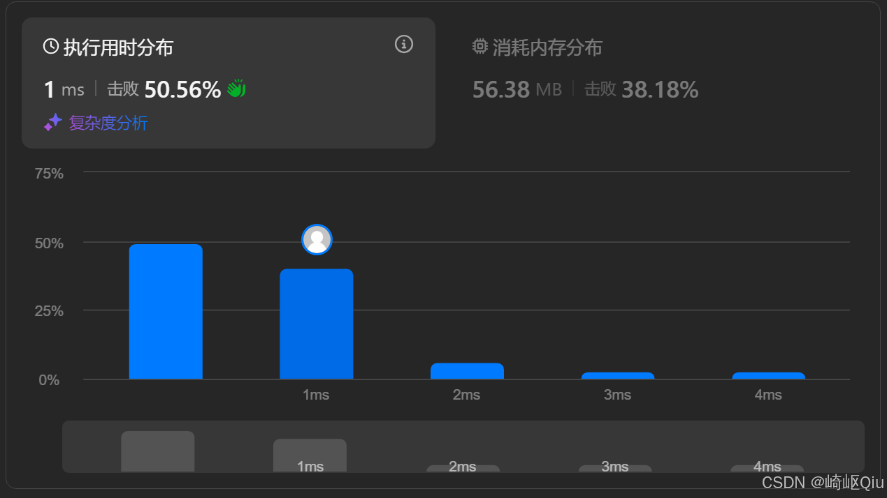
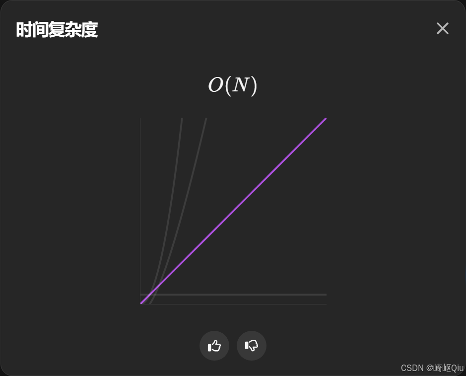
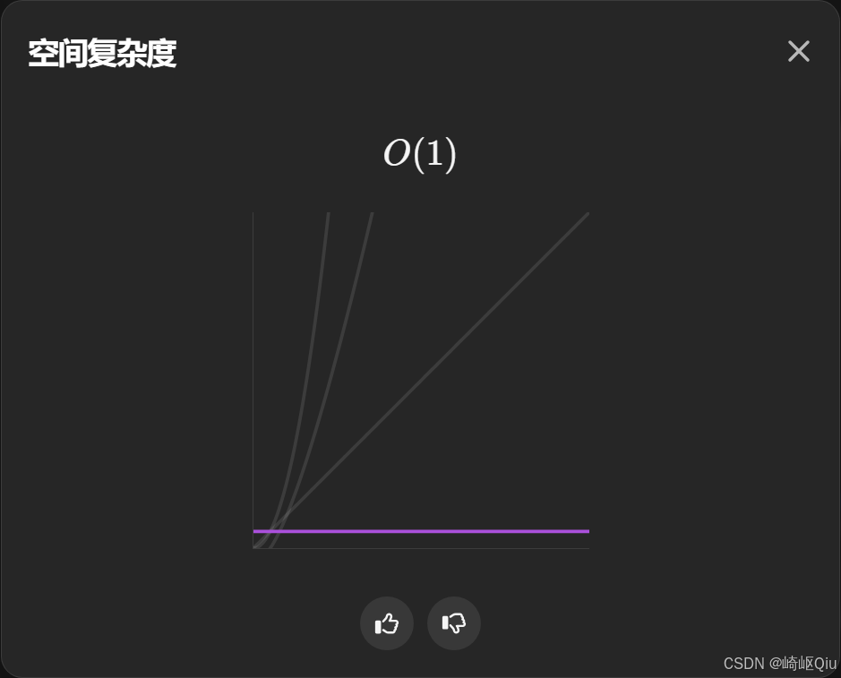

# leetcode189：轮转数组（原地后移数组的最佳实践解法）

> 原创 于 2025-08-24 09:09:59 发布 · 公开 · 736 阅读 · 19 · 24 · CC 4.0 BY-SA版权 版权声明：本文为博主原创文章，遵循 CC 4.0 BY-SA 版权协议，转载请附上原文出处链接和本声明。
> 文章链接：https://blog.csdn.net/lyh2004_08/article/details/150694920

**文章目录**

[TOC]


[LeetCode 189，轮转数组](https://leetcode.cn/problems/rotate-array/?envType=study-plan-v2&envId=top-interview-150) ，【难度：中；通过率：47.1%】，这道题要求我们将 **数组元素向右移动 `k` 个位置** ，非原地算法解决这个问题的方法有很多，我们本文着重探讨最佳实践的解法，即 **原地完成** ， **空间复杂度为 O(1)** 的方法： **翻转法** 

## 一、 题目描述

给定一个整数数组 `nums` ，将数组中的元素向右轮转 `k` 个位置，其中 `k` 是非负数

**示例:** 

**示例 1:** 

```
输入: nums = [1,2,3,4,5,6,7], k = 3
输出: [5,6,7,1,2,3,4]
解释:
向右轮转 1 步: [7,1,2,3,4,5,6]
向右轮转 2 步: [6,7,1,2,3,4,5]
向右轮转 3 步: [5,6,7,1,2,3,4]
```

**示例 2:** 

```
输入: nums = [-1,-100,3,99], k = 2
输出: [3,99,-1,-100]
```

---

## 二、 传统解法及其局限性

在学习最佳实践之前，我们先看看一些直观的解法：

1.  **使用额外数组** ：

   -  **思路** ：创建一个新数组，将原数组 `nums[i]` 的元素放到新数组的 `(i + k) % n` 位置。最后将新数组复制回原数组

   -  **优点** ：逻辑简单，易于理解

   -  **缺点** ：使用了 O(N) 的额外空间，不满足原地操作的要求

2.  **暴力轮转** ：

   -  **思路** ：执行 `k` 次循环，每次循环将整个数组向右移动一位

   -  **优点** ：原地操作，空间复杂度 O(1)

   -  **缺点** ：时间复杂度为 O(N*K)，当 `N` 和 `K` 很大时会超时

---

## 三、 最佳实践：三次翻转法

解决方法固然不止一种，但是最佳实践，也就是时间复杂度O(N)，空间复杂度O(1) 的解法很具有技巧性： **三次翻转法** 

这个方法的思想非常巧妙， **通过三次局部或整体的翻转，就能达到全局轮转的效果** 

### 核心思路

假设数组长度为 `n` ，要向右轮转 `k` 个位置

1.  **翻转整个数组** ：将原数组 `[0, n-1]` 区间的元素全部翻转。这一步的目的是将需要移动到前面的 `k` 个尾部元素，整体移动到了数组的头部，同时也将需要移动到后面的 `n-k` 个头部元素，移动到了数组的尾部。只是它们各自内部的顺序是颠倒的

2.  **翻转前 k 个元素** ：对翻转后数组的 `[0, k-1]` 区间进行翻转。这一步将之前移动到头部的 `k` 个元素（原数组的尾部元素）恢复到正确的顺序

3.  **翻转剩余 n-k 个元素** ：对翻转后数组的 `[k, n-1]` 区间进行翻转。这一步将之前移动到尾部的 `n-k` 个元素（原数组的头部元素）也恢复到正确的顺序

### 示例演示

让我们用一个例子来直观感受这个过程：
数组 `[1, 2, 3, 4, 5]` ， `k=2` (数组长度 `n=5` ， `k % n = 2` )

-  **原数组** ： `1 2 3 | 4 5` (竖线为逻辑分割)

-  **1. 翻转整个数组** ： `5 4 | 3 2 1` 

  -  *效果* ：原尾部 `[4, 5]` 跑到了前面，变成了 `[5, 4]` ；原头部 `[1, 2, 3]` 跑到了后面，变成了 `[3, 2, 1]` 

-  **2. 翻转前 k=2 个元素** ： `4 5 | 3 2 1` 

  -  *效果* ： `[5, 4]` 变回了 `[4, 5]` ，顺序正确了！

-  **3. 翻转剩余 n-k=3 个元素** ： `4 5 | 1 2 3` 

  -  *效果* ： `[3, 2, 1]` 变回了 `[1, 2, 3]` ，顺序也正确了！

-  **最终结果** ： `[4, 5, 1, 2, 3]` ，完美实现了向右轮转 2 位的效果

思路提炼出来了，那么代码就很好写了。其中显然的是，我们三次用到了一个“翻转”功能的方法，所以从复用性角度，我们最好提取出来一个辅助函数，然后主方法只需要三次调用之即可

---

## 四、 代码实现与深度解析

翻转法的最佳实践代码：

```java
class Solution {
    /**
     * 主函数：使用三次翻转法原地轮转数组
     * @param nums 待轮转的数组
     * @param k    轮转的步数
     */
    public void rotate(int[] nums, int k) {
        int n = nums.length;
        if (n == 1) {
            return;
        }
      
        // 步骤 0: 处理 k，使其落在 [0, n-1] 区间
        // k 可能大于 n，取模可以去除完整的轮转周期
        k %= n;

        // 步骤 1: 将原数组整体翻转
        reverse(nums, 0, n - 1);
      
        // 步骤 2: 将数组前 k 个元素的区间翻转
        reverse(nums, 0, k - 1);
      
        // 步骤 3: 将数组后 n-k 个元素的区间翻转
        reverse(nums, k, n - 1);
    }

    /**
     * 辅助方法：翻转数组中 [start, end] 区间的元素
     * 使用双指针从两端向中间交换
     * @param nums  数组
     * @param start 起始索引（包含）
     * @param end   结束索引（包含）
     */
    private void reverse(int[] nums, int start, int end) {
        while (start < end) {
            int temp = nums[start];
            nums[start] = nums[end];
            nums[end] = temp;
            start++;
            end--;
        }
    }
}
```

**提交结果：** 

 

 

 

---

## 五、 关键点与复杂度分析

-  **`k` 的处理** ： `k %= n;` 是一个非常重要的 **预处理步骤** ，它能正确处理 `k` 大于数组长度的情况，避免不必要的计算和潜在的错误

-  **辅助函数的抽象** ：“翻转”是一个重复的操作，将其抽象成一个独立的 `reverse` 方法，使得主逻辑 `rotate` **非常清晰** 

-  **时间复杂度** ： **O(N)** 第一次翻转扫描 N 个元素，第二次翻转扫描 k 个元素，第三次翻转扫描 n-k 个元素。总的操作次数约为 2N，因此是 **线性时间复杂度** 

-  **空间复杂度** ： **O(1)** 没有使用任何与数组大小相关的额外空间，所有操作都是在 **原数组** 上完成的

## 六、 总结

“三次翻转法”是解一个经典且高效的技巧，它通过一种 **看似** “破坏再重建”的方式，巧妙地达到了目标，最好可以直接记住，当成一种通用的基本技巧