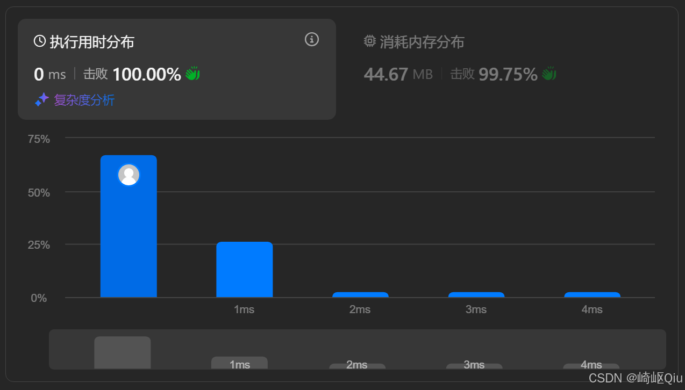

# leetcode122：买卖股票的最佳时机Ⅱ（多次交易的贪心策略）

> 原创 于 2025-08-25 08:45:00 发布 · 926 阅读 · 15 · 22 · CC 4.0 BY-SA版权 版权声明：本文为博主原创文章，遵循 CC 4.0 BY-SA 版权协议，转载请附上原文出处链接和本声明。
> 文章链接：https://blog.csdn.net/lyh2004_08/article/details/150720257

**文章目录**

[TOC]


在上一篇中，我们解决了 [只允许“一次买卖”的股票问题 (LeetCode 121)](https://blog.csdn.net/lyh2004_08/article/details/150719828) 。接下来继续进阶版—— [LeetCode 122，允许我们进行 **多次** 买卖操作](https://leetcode.cn/problems/best-time-to-buy-and-sell-stock-ii/description/?envType=study-plan-v2&envId=top-interview-150) ，【难度：中等；通过率：75.3%】，这道题同样可以通过巧妙的 **贪心算法** 来解决，并且与 LC121 的思路基本相似，甚至可以在之前代码的基础上， **稍加修改** 即可

## 一、 题目描述

给定一个数组 `prices` ，其中 `prices[i]` 是第 `i` 天的股票价格

你可以尽可能多地完成交易（多次买卖股票）。但是，你不能同时参与多笔交易（你必须在再次购买前出售掉之前的股票）

设计一个算法来计算你所能获取的最大利润

**示例 1:** 

```
输入：prices = [7,1,5,3,6,4]
输出：7
解释：在第 2 天（股票价格 = 1）的时候买入，在第 3 天（股票价格 = 5）的时候卖出, 这笔交易所能获得利润 = 5-1 = 4 
     随后，在第 4 天（股票价格 = 3）的时候买入，在第 5 天（股票价格 = 6）的时候卖出, 这笔交易所能获得利润 = 6-3 = 3 
     总利润为 4 + 3 = 7 
```

**示例 2:** 

```
输入：prices = [1,2,3,4,5]
输出：4
解释：在第 1 天（股票价格 = 1）的时候买入，在第 5 天（股票价格 = 5）的时候卖出, 总利润 = 5-1 = 4 
     注意：你也可以在第 1 天买入，第 2 天卖出，第 2 天买入，第 3 天卖出，依此类推，
     这样总利润 = (2-1) + (3-2) + (4-3) + (5-4) = 4 
```

---

## 二、 核心思路：贪心策略- 累加所有正向差价

允许多次交易，是这道题与 LC121 的根本区别。这意味着我们可以 **随时买入，随时卖出** ，只要能赚到一点点利润，就可以立刻完成一笔交易，然后再开始下一笔

基于这个特性，我们可以得出非常简洁的贪心策略：

>  **只要今天的价格比昨天的价格高，我们就认为可以在昨天买入，今天卖出，从而获得这笔利润。我们将所有这样的正向利润累加起来，就是最大总利润。** 

为什么这样可行呢？
考虑一个价格序列 `... A, B, C ...` ，其中 `A < B < C` 

- 如果我们在 `A` 买入，在 `C` 卖出，利润是 `C - A` 

- 如果我们在 `A` 买入，在 `B` 卖出，再在 `B` 买入，在 `C` 卖出，利润是 `(B - A) + (C - B)` 
  展开来看， `(B - A) + (C - B) = B - A + C - B = C - A` 
  这说明， `C - A` 等价于累加所有中间的正向差价 `(B - A) + (C - B)` 。因此，我们只需要累加所有相邻日期的正向差价即可

---

## 三、 最佳实践：代码实现与深度解析

**（1）基于 [上一题-力扣 121](https://blog.csdn.net/lyh2004_08/article/details/150719828) 的代码直接 <u>改造</u> 而来的直观解法：** 

```java
class Solution {
    public int maxProfit(int[] prices) {
        int totalProfit = 0; // 记录总利润
        // prevMin 记录当前遍历到的元素之前（包括当前元素）的最低价格
        // 初始时，将第一天的价格作为最低买入价
        int prevMin = prices[0]; 
      
        // 从第二天开始遍历，因为至少需要两天才能完成一次买卖
        for (int i = 1; i < prices.length; i++) {
            // 计算如果以 prevMin 买入，今天 prices[i] 卖出，能获得的利润
            int currentTradeProfit = prices[i] - prevMin;
          
            // 如果能获利 (currentTradeProfit > 0)
            if (currentTradeProfit > 0) {
                // 将这笔利润累加到总利润中
                totalProfit += currentTradeProfit;
              
                // 关键一步：既然我们已经通过在 prevMin 买入，prices[i] 卖出赚了一笔，
                // 那么为了捕捉 prices[i] 之后可能出现的上涨，
                // 我们“假装”在 prices[i] 这一天又买入了股票
                // 这样，对于 prices[i+1] 来说，prices[i] 就成为了它之前的最低买入价
                // 这确保了我们能捕捉到所有连续上涨的利润
                prevMin = prices[i];
            } else {
                // 如果今天不获利（甚至亏损），说明 prices[i] 比 prevMin 更低，
                // 那么更新 prevMin 为 prices[i]，为后续可能的交易寻找更低的买入点
                prevMin = Math.min(prevMin, prices[i]);
            }
        }
      
        return totalProfit;
    }
}
```

**（2）另一种更简洁的贪心实现（最佳解法✅）：** 

上述实现通过 `prevMin` 的巧妙更新来累加利润。实际上，对于 LC122 来说，最简洁的贪心实现是直接 **累加所有相邻** 的正向差价，也就是我们在上述 [题目分析](#____32) 阶段最开始分析出的思路

```java
class Solution {
    public int maxProfit(int[] prices) {
        int totalProfit = 0;
        for (int i = 1; i < prices.length; i++) {
            // 如果今天的价格比昨天的价格高，就认为可以赚取这部分差价
            // 相当于昨天买入，今天卖出
            if (prices[i] > prices[i - 1]) {
                totalProfit += (prices[i] - prices[i - 1]);
            }
        }
        return totalProfit;
    }
}
```

> 这两种实现都是正确的，并且都体现了贪心思想
> 
> 

- 如果基于 **（1）** 的代码，通过 `prevMin` 的维护，则是在模拟一系列“ **波谷买入，波峰卖出** ”的交易

- 如果基于 **（2）** 的代码，是累计所有 **相邻** 的正向差价

提交结果：

 

---

## 四、 关键点与复杂度分析

-  **贪心策略** ：核心在于可以累加所有能够获得的正向利润

-  **一次遍历** ：算法只需一次遍历数组

-  **时间复杂度** ： **O(N)** 其中 N 是 `prices` 数组的长度

-  **空间复杂度** ： **O(1)** 只使用了几个常数级别的额外变量

---

## 五、 LC121，LC122 对比分析

这两道题是股票系列的基础，它们的核心区别在于“ **交易次数** 的限制”

|  | LeetCode 121 (一次买卖) | LeetCode 122 (多次买卖) |
|:---|:---|:---|
|  **交易次数**  |  **最多一次** 买卖 |  **可以多次** 买卖 (但不能同时持有两支股票) |
|  **目标**  | 获得 **最大单笔利润**  | 获得 **最大总利润**  |
|  **核心贪心策略**  | 维护 **历史最低买入价 `prevMin`** ，用当前价减去 `prevMin` ，取最大值 | 累加所有 **正向差价** (即 `prices[i] - prices[i-1] > 0` 的部分) |
|  **`prevMin` 更新**  |  `prevMin = Math.min(prevMin, prices[i]);` (无论是否获利，都更新为全局最低) |  `prevMin = prices[i];` (获利后，将当前价作为新的买入起点)
或直接比较 `prices[i]` 与 `prices[i-1]`  |
|  **利润累加方式**  |  `ans = Math.max(ans, todayProfit);` ( **取最大值** ) |  `ans += todayProfit;` ( **累加** 所有正向利润) |
|  **时间复杂度**  | O(N) | O(N) |
|  **空间复杂度**  | O(1) | O(1) |


**总结与提炼：** 

-  **LC121** “一次买卖”的最优策略：找到一个最低点买入，最高点卖出

-  **LC122** “多次买卖”的本质：只要能赚到钱，就立刻完成交易。这等价于累加所有上涨阶段的利润

