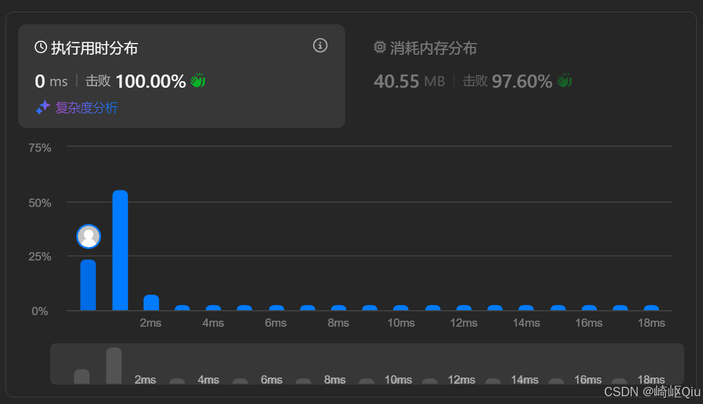

# leetcode274：H指数（计数排序）从 O(N²) 到 O(N) 的思维上升

> 原创 于 2025-08-27 09:54:30 发布 · 公开 · 1.6k 阅读 · 27 · 29 · CC 4.0 BY-SA版权 版权声明：本文为博主原创文章，遵循 CC 4.0 BY-SA 版权协议，转载请附上原文出处链接和本声明。
> 文章链接：https://blog.csdn.net/lyh2004_08/article/details/150917897

**文章目录**

[TOC]


[274. H 指数 - 力扣（LeetCode）](https://leetcode.cn/problems/h-index/?envType=study-plan-v2&envId=top-interview-150) ，【难度：中等；通过率： **46.5%** 】，这道题的难点不在于需要多复杂的算法，而在于如何真正 **理解题意** ，这个题意有些绕，先理解题意，写出来 **O(N²)** 的解法/思路，我们再考虑下一步优化为 **O(N)** 

## 一、 题目描述

给你一个整数数组 `citations` ，表示研究者的 `n` 篇论文被引用的次数。研究者的 **h 指数** 是指他有 `h` 篇论文分别被引用了 **至少** `h` 次

请计算并返回该研究者的 h 指数

**示例:** 

```
输入: citations = [3,0,6,1,5]
输出: 3

解释:
研究者有 5 篇论文，引用次数分别为 [3,0,6,1,5]
由于研究者有 3 篇论文的引用次数至少为 3 (分别是 3, 6, 5)，
其余 2 篇论文的引用次数不多于 3 (分别是 0, 1)，
所以她的 h 指数是 3
```

---

## 二、 思维一：解析 H 指数的定义

我们首先要做的，就是把这个有点绕的定义彻底搞明白

>  **H 指数** ：一个整数 `h` ，满足 **至少** 有 `h` 篇论文的引用次数 **至少** 为 `h` 。题目要求我们找到这个 `h` 的 **最大值** 

让我们用一个具体的例子来验证。对于 `citations = [3,0,6,1,5]` ，我们来检查 `h=3` 是否满足条件：

1.  **第一个条件** ：“至少有 `h` 篇论文”，这里 `h=3` 

2.  **第二个条件** ：“引用次数至少为 `h` ”，这里 `h=3` 

合起来就是：“ **至少有 3 篇论文，它们的引用次数都至少为 3** ”

我们来数一下： `[3, 6, 5]` 这三篇论文的引用次数都 `>= 3` 。我们找到了 3 篇，满足了“至少 3 篇”的要求。所以， `h=3` 是一个有效的h 指数

我们再试试 `h=4` ：“至少有 4 篇论文，它们的引用次数都至少为 4”
我们数一下：只有 `[6, 5]` 这两篇论文的引用次数 `>= 4` 。我们只找到了 2 篇，不满足“至少 4 篇”的要求。所以 `h=4` 不是一个有效的 h 指数

既然 `h=4` 不行，更大的 `h=5` 、 `h=6` **肯定也不行** 。因此， `h=3` 就是最大的那个，也就是最终答案

---

## 三、 思维二：从暴力验证到 O(N²) 解法

通过上面的分析，我们发现可以把问题转化为：

>  **寻找一个最大的 `h` ，使得 `(引用次数 >= h 的论文数量) >= h`** 

一个最朴素的想法是：

1.  `h` 的可能取值范围是什么？最多有 `n` 篇论文，所以 `h` 不可能超过 `n` 。 `h` 的 **取值范围是 `[0, n]`** 

2. 我们可以 **从大到小** （从 `n` 到 `0` ）来 **猜测** `h` 的值

3. 对于每一个猜测的 `h` ，我们 **都遍历一次** `citations` 数组，统计出有多少篇论文的引用次数 `>= h` 

4. 如果这个统计数量也 `>= h` ，那么我们就找到了答案，因为我们是从大到小猜的，第一个满足条件的一定是最大的

这个思路可以写成如下的伪代码：

```
n = citations.length
for h from n down to 0:
  count = 0
  for c in citations:
    if c >= h:
      count++
  if count >= h:
    return h
```

这个解法是正确的，但它的时间复杂度是 **O(N²)** ，因为外层循环 `h` 最多 N 次，内层循环遍历 `citations` 又是 N 次。对于这道题，通常会超时

---

## 四、 思维三：空间换时间，计数排序

O(N²) 的瓶颈在于，对于每个猜测的 `h` ，我们都重复地遍历了整个 `citations` 数组。如何能 **快速地知道** “有多少篇论文的引用次数不小于 `h` ”呢？

这就是 **计数** 思想发挥作用的地方。我们可以预处理 `citations` 数组，用一个 **计数器数组** 来记录信息

**关键 1：我们关心的引用次数有边界吗？** 
是的。因为 `h` 最大只能是 `n` ，所以一篇论文被引用了 `n` 次、 `n+1` 次，还是 1000 次，对于判断 `h` 是否满足条件来说，效果是完全一样的。例如，要判断 `h=5` 是否成立，一篇引用了 1000 次的论文和一篇引用了 5 次的论文，都同样满足 `c >= 5` 的条件
所以，我们可以将所有引用次数大于 `n` 的论文，都视作引用了 `n` 次。这极大地缩小了我们需要关心的引用次数范围，即 `[0, n]` 

**构建计数器数组** 
我们可以创建一个大小为 `n+1` 的数组 `counts` ，其中 `counts[i]` 记录了引用次数 **恰好** 为 `i` 的论文有多少篇

```java
int n = citations.length;
int[] counts = new int[n + 1];
for (int c : citations) {
    if (c > n) {
        counts[n]++;
    } else {
        counts[c]++;
    }
}
// 这可以简化为一行：
// counts[Math.min(c, n)]++;
```

**关键 2：后缀和的妙用** 
现在我们有了 `counts` 数组。当我们想知道“引用次数 **至少** 为 `i` 的论文数量”时，我们只需要计算 `counts[i] + counts[i+1] + ... + counts[n]` 即可。这是一个 **后缀和** 

结合“从大到小猜测 `h` ”的思路，我们可以非常高效地得到答案：

1. 从 `i = n` 开始向下遍历

2. 维护一个变量 `total` ，表示引用次数 **至少** 为 `i` 的论文总数

3. 当 `i` 从 `n` 变为 `n-1` 时， `total` 的变化是 `total_new = total_old + counts[n-1]` 

4. 在每一步，我们都检查 `total >= i` 是否成立。第一个成立的 `i` 就是答案

这个过程完美地将时间复杂度降到了 O(N)

---

## 五、 最佳实践：代码实现与深度解析

一种最佳实践代码：

```java
class Solution {
    public int hIndex(int[] citations) {
        int n = citations.length;
      
        // 步骤 1: 创建计数器数组，利用关键洞察 1 进行计数
        // counts[i] 存储引用次数为 i 的论文篇数
        // 所有引用次数 > n 的论文，都当作 n 次来统计
        int[] counts = new int[n + 1];
        for (int c : citations) {
            counts[Math.min(c, n)]++;
        }

        // 步骤 2: 从大到小遍历 h 的可能值，并利用后缀和思想
        int total = 0; // total 记录引用次数 >= i 的论文总数
        for (int i = n; i >= 0; i--) {
            // 累加当前引用次数的论文数，得到后缀和
            total += counts[i];
          
            // 检查是否满足 h 指数的定义
            // total: 论文数量
            // i: 引用次数
            // total >= i  =>  有 total 篇论文的引用次数 >= i
            if (total >= i) {
                // 因为 i 是从大到小遍历的，第一个满足条件的 i 就是最大的 h
                return i;
            }
        }
      
        return 0; // 正常情况下不会执行到这里
    }
}
```

提交结果：

 

---

## 六、 复杂度分析

-  **时间复杂度** ： **O(N)** 第一个 `for` 循环遍历 `citations` 数组，耗时 O(N)。第二个 `for` 循环遍历 `counts` 数组，耗时 O(N)。总时间复杂度为 O(N + N) = O(N)

-  **空间复杂度** ： **O(N)** 我们使用了一个大小为 `n+1` 的 `counts` 数组

