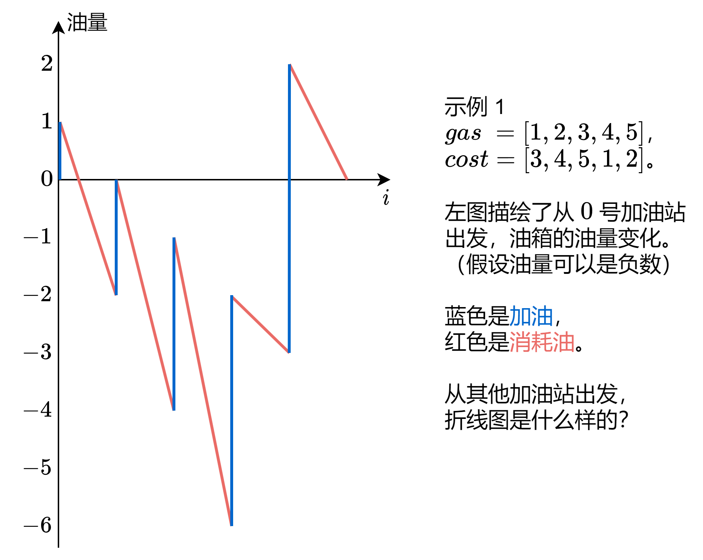
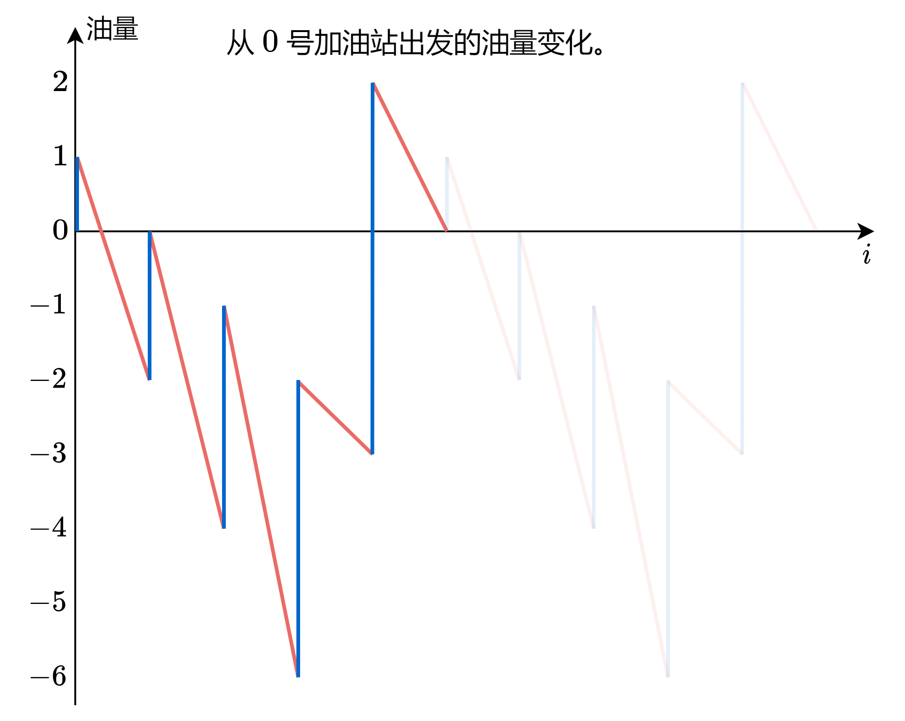
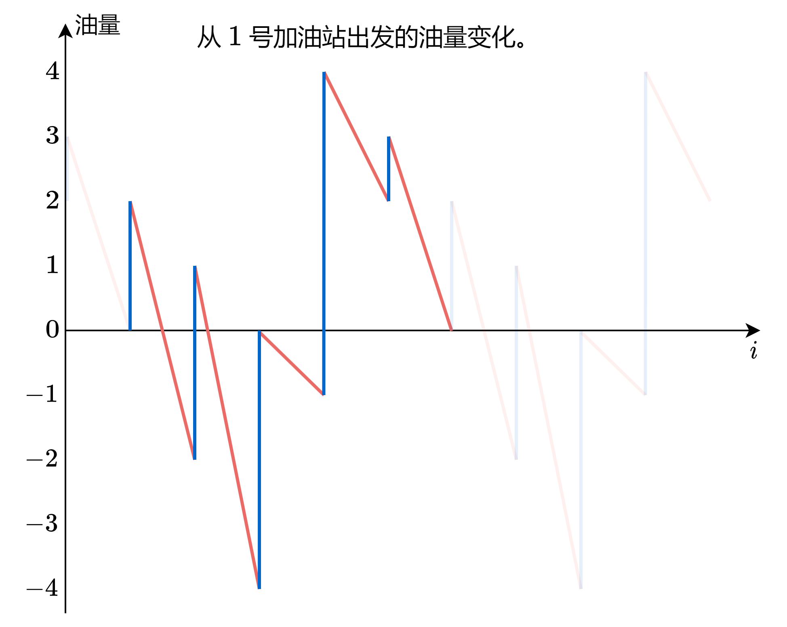
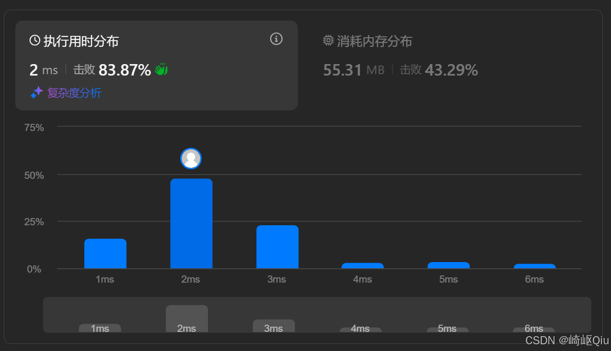

# leetcode134：加油站（图解贪心）

> 原创 于 2025-08-28 08:59:14 发布 · 公开 · 809 阅读 · 24 · 27 · CC 4.0 BY-SA版权 版权声明：本文为博主原创文章，遵循 CC 4.0 BY-SA 版权协议，转载请附上原文出处链接和本声明。
> 文章链接：https://blog.csdn.net/lyh2004_08/article/details/150943424

**文章目录**

[TOC]


[LeetCode 134，加油站问题](https://leetcode.cn/problems/gas-station/?envType=study-plan-v2&envId=top-interview-150) ，【难度：中等；通过率：47.3%】

## 一、 题目描述

在一条环路上有 `n` 个加油站，其中第 `i` 个加油站有汽油 `gas[i]` 升

你有一辆油箱容量无限的的汽车，从第 `i` 个加油站开往第 `i+1` 个加油站需要消耗 `cost[i]` 升汽油。你从其中的一个加油站出发，开始时油箱为空

给定两个整数数组 `gas` 和 `cost` ，如果你可以按顺序绕环路行驶一周，则返回出发时加油站的编号，否则返回 -1。如果存在解，则保证它是唯一的

**示例:** 

```
输入: gas = [1,2,3,4,5], cost = [3,4,5,1,2]
输出: 3

解释:
从 3 号加油站出发，初始汽油为 gas[3] = 4 升
-> 到 4 号站，剩余 4 - 1 + 5 = 8 升
-> 到 0 号站，剩余 8 - 2 + 1 = 7 升
-> 到 1 号站，剩余 7 - 3 + 2 = 6 升
-> 到 2 号站，剩余 6 - 4 + 3 = 5 升
-> 回到 3 号站，剩余 5 - 5 = 0 升，正好耗尽。可以绕行一周
```

---

## 二、 核心思路：从暴力到图解

**暴力解法** ：最容易想到的方法是，依次尝试从每个加油站 `i` 出发，模拟一圈，看是否能成功。如果能，就返回 `i` 。这种方法的时间复杂度是 **O(N²)** ，通常会超时

> 下面是这种 **暴力解法代码** （提交 **不通过** ， **超时** ）
> 
> ```java
> public int canCompleteCircuit(int[] gas, int[] cost) {
>     int len = gas.length;
> 
>     for (int i = 0; i < len; i++) { // 尝试每个加油站作为起点 i
>         int currentGas = 0; // 每次尝试新起点，油箱清零
>         int visited = 0; // 记录从起点出发，成功访问了多少个站
> 
>         int currentStationIndex = i; // 从 i 站开始
> 
>         while (visited < len) { // 只要还没走完所有 len 个站
>             // 1.到达 currentStationIndex 站，加 gas[currentStationIndex] 的油
>             currentGas += gas[currentStationIndex];
> 
>             // 2.准备从 currentStationIndex 站开往下一个站 (currentStationIndex + 1) % len
>             // 消耗 cost[currentStationIndex] 的油
>             currentGas -= cost[currentStationIndex];
> 
>             // 3.检查油量是否足够到达下一个站
>             if (currentGas < 0) {
>                 // 油不够，说明以 i 为起点失败，退出内层循环
>                 break;
>             }
> 
>             // 4.油量足够，成功到达下一个站
>             currentStationIndex = (currentStationIndex + 1) % len; // 更新当前所在站的索引
>             visited++; // 成功访问的站数加一
>         }
> 
>         // 5.检查是否成功走完了所有 len 个站
>         if (visited == len) {
>             return i; // 如果成功，返回这个起点 i
>         }
>     }
> 
>     // 遍历所有可能的起点，都没有成功，返回 -1
>     return -1;
> }
> ```

**基于灵神的图解解法** ：O(N) 的解法基于两个关键的贪心洞察，参考灵神画图题解： [https://leetcode.cn/problems/gas-station/solutions/2933132/yong-zhe-xian-tu-zhi-guan-li-jie-pythonj-qccr](https://leetcode.cn/problems/gas-station/solutions/2933132/yong-zhe-xian-tu-zhi-guan-li-jie-pythonj-qccr) 

 

 

 

**…** 

从上述若干图像可以得知这么一些关键信息：

- 无论是从（除了最终答案之外的）哪个点作为起点，模拟一下完整路径的各个点位油量，最终的油量最低点都是一样的

- 且我们计算从 0 号加油站出发的油量变化，然后从中找到油量最低时所处的加油站（3 号加油站），即为答案

由此，问题转化为寻找一个函数的最小值

但是，为什么 **无论是从（除了最终答案之外的）哪个点作为起点，模拟一下完整路径的各个点位油量，最终的油量最低点都是一样的** 呢？

**原理简单分析：** 

无论你从哪个加油站 `k` 出发，新的油量变化曲线，本质上只是从 0 号站出发的原始曲线经过 **“切割”** 和 **“垂直平移”** 得到的，其 **相对的“形状”** （在哪里增加多少，在哪里减少多少，是一定的）是 **完全不变** 的

1.  **定义“净收益”** ：我们关心的是每一站能给我们带来的油量变化，即 `diff[i] = gas[i] - cost[i]` 

2.  **构造油量曲线** ：我们从 0 号站出发，一路累加 `diff` 数组，得到一个“剩余油量”的序列 `currentGas` 。这可以看作是一条油量变化的折线图

3.  **寻找最佳起点** ：

   - 如果这条曲线始终在 x 轴（油量为0）的上方，那么从 0 号站出发就是可行的

   - 如果曲线有部分在 x 轴下方，说明从 0 号站出发会在某些点没油。这条曲线的 **最低点** ，代表了从 0 号站出发 **“欠油” 最严重** 的地方

   - 假设这个最低点出现在 `i` 号站之后（即到达 `i+1` 站之前），那么为了让这个最低点“不欠油”（即油量 `>= 0` ），我们需要把整条油量曲线向上平移，使得这个最低点恰好落在 x 轴上

   - 如何实现这个“平移”呢？ **选择最低点的下一个点 `i+1` 作为新的出发点** ，就等效于将整条油量曲线向上平移了 `|最低点的油量值|` 。这样，新的出发点油量为 0，而之前的最低点也被抬高到了 0，保证了全程油量非负

>  **这个解法的正确性依赖于一个前提：** 只要总油量 `sum(gas)` 大于等于 `sum(cost)` ，那么解就一定存在且唯一

---

## 三、 代码实现与深度解析

基于上述思路的代码：

```java
class Solution {
    public int canCompleteCircuit(int[] gas, int[] cost) {
        int ans = 0; // 收集答案：最低点的索引
        int minGas = 0; // 过程中最低油量记录
        int curGas = 0; // 实时油量
        for (int i = 0; i < gas.length; i++) {
            curGas += gas[i] - cost[i]; // 累加过本站后的油量
            if (curGas < minGas) { // 油量小于记录的最低油量，更新最低点索引
                minGas = curGas;
                ans = i + 1; // 收集最新答案
            }
        }
        if (curGas < 0) {
            // 一定不够一圈
            return -1;
        }
        return ans;
    }
}
```

提交结果：

 

---

## 四、 关键点与复杂度分析

-  **时间复杂度** ： **O(N)** 我们只需要一次遍历数组

-  **空间复杂度** ： **O(1)** 只使用了常数个额外变量

-  **贪心选择** ：每当油量不足时，就果断地将起点移到下一个位置，这是算法的核心贪心策略

