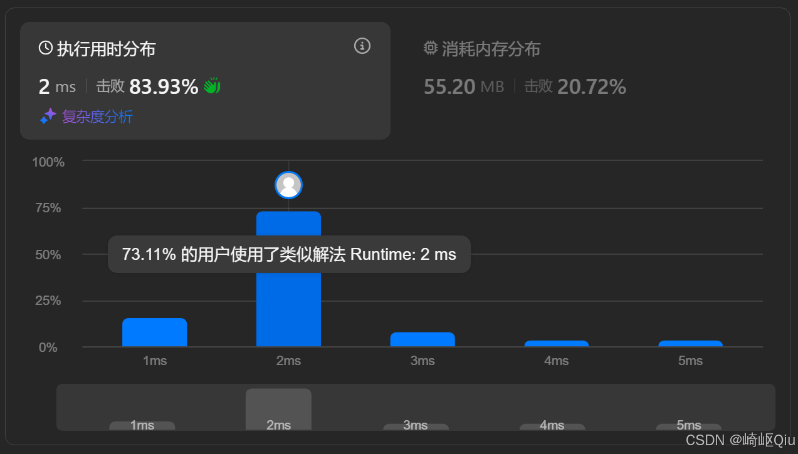

# leetcode238：除自身以外的数组的乘积（前缀和思想）

> 原创 已于 2025-08-28 09:29:11 修改 · 公开 · 1.1k 阅读 · 22 · 6 · CC 4.0 BY-SA版权 版权声明：本文为博主原创文章，遵循 CC 4.0 BY-SA 版权协议，转载请附上原文出处链接和本声明。
> 文章链接：https://blog.csdn.net/lyh2004_08/article/details/150943932

**文章目录**

[TOC]


[LeetCode-238. 除自身以外数组的乘积](https://leetcode.cn/problems/product-of-array-except-self/description/?envType=study-plan-v2&envId=top-interview-150) ，【难度：中等；通过率：77.8%】，这道题的特殊在于，它要求我们在 O(N) 的时间复杂度内完成，并且 **不能使用除法** 。这迫使我们必须寻找一种更巧妙的构建结果的方式，那么结合 **前缀和** 思想，我们可以引出类似的 **前缀积与后缀积** 思想

## 一、 题目描述

给你一个整数数组 `nums` ，返回一个数组 `answer` ，其中 `answer[i]` 等于 `nums` 中除 `nums[i]` 之外其余各元素的乘积

**要求：** 

- 题目数据保证数组 `nums` 之中任意元素的全部前缀元素和后缀的乘积都在 32 位 整数范围内

- 请不要使用除法，且在 O(n) 时间复杂度内完成此题

**示例 1:** 

```
输入: nums = [1,2,3,4]
输出: [24,12,8,6]
```

**示例 2:** 

```
输入: nums = [-1,1,0,-3,3]
输出: [0,0,9,0,0]
```

---

## 二、 核心思路：前缀积与后缀积的“分治”思想

既然不能使用除法（即不能先求出总乘积再除以 `nums[i]` ），我们就必须换一种方式来构建 `answer[i]` 

我们可以把 `answer[i]` 的构成拆解为两个部分：

1.  `nums[i]` **<u>左侧</u> 所有元素的乘积** (前缀积)

2.  `nums[i]` **<u>右侧</u> 所有元素的乘积** (后缀积)

到了这一步，思路就非常直观且清晰了： `answer[i]` 就等于这两部分的乘积

**`answer[i] = (nums[0] * ... * nums[i-1]) * (nums[i+1] * ... * nums[n-1])`** 

为了高效地得到每一位的“前缀积”和“后缀积”，我们可以预先计算并存储它们

---

## 三、 代码实现与深度解析

一种可以通过的代码（注意，前缀积后缀积数组有多种实现方式，主要就是索引的意义的区别，这里的索引意义代表前/后缀的数的 **个数** ）：

```java
class Solution {
    public int[] productExceptSelf(int[] nums) {
        int len = nums.length;
      
        // 1.初始化前缀积和后缀积数组
        // preMul[i] 存储 nums[0]...nums[i-1] 的乘积
        int[] preMul = new int[len + 1];
        preMul[0] = 1; // 基础情况，nums[0] 左侧没有元素，乘积为 1
      
        // sufMul[i] 存储 nums[len-1]...nums[len-i] 的乘积 (从后往前)
        int[] sufMul = new int[len + 1];
        sufMul[0] = 1; // 基础情况，nums[len-1] 右侧没有元素，乘积为 1
      
        // 2.计算前缀积和后缀积
        for (int i = 1; i <= len; i++) {
            // 计算前缀积
            preMul[i] = preMul[i - 1] * nums[i - 1];
          
            // 计算后缀积 (从数组末尾开始)
            // sufMul[i] 存储的是 nums 数组末尾 i 个元素的乘积
            sufMul[i] = sufMul[i - 1] * nums[len - i];
        }
      
        // 3.组合结果
        int[] ans = new int[len];
        // 特殊处理第一个元素，它只有后缀积
        ans[0] = sufMul[len - 1]; 
      
        for (int i = 1; i < len; i++) {
            // ans[i] = (nums[0]...nums[i-1]的积) * (nums[i+1]...nums[len-1]的积)
            // preMul[i] 对应前者
            // sufMul[len - i - 1] 对应后者
            ans[i] = preMul[i] * sufMul[len - i - 1];
        }
      
        return ans;
    }
}
```

提交结果：

 

**代码逻辑剖析：** 

1.  **初始化** ： `preMul` 和 `sufMul` 数组的大小都设为 `len + 1` ，并将 `[0]` 位置设为 1。这是用于处理边界情况（如 `nums[0]` 的前缀积和 `nums[len-1]` 的后缀积），使得循环逻辑更统一

2.  **计算** ：

   -  `preMul[i]` 存储的是 `nums` 数组前 `i` 个元素 ( `nums[0]` 到 `nums[i-1]` ) 的乘积

   -  `sufMul[i]` 的计算放在上一个 `for` 循环中一并进行，它存储的是 `nums` 数组 **末尾 `i` 个元素** ( `nums[len-i]` 到 `nums[len-1]` ) 的乘积

3.  **组合** ：

   - 对于 `ans[i]` ，我们需要 `nums[i]` 左边的乘积和右边的乘积

   - 左边的乘积正好是 `preMul[i]` 

   - 右边的乘积是 `nums[i+1]` 到 `nums[len-1]` ，这正好是 `nums` 数组末尾的 `len - 1 - i` 个元素。根据我们 `sufMul` 的定义，这部分乘积就存储在 `sufMul[len - 1 - i]` 中

   - 通过 `ans[i] = preMul[i] * sufMul[len - i - 1];` ，我们成功地将两部分组合起来，得到了最终结果

---

## 四、 关键点与复杂度分析

-  **核心思想** ：将问题分解为前缀和后缀的乘积，是绕过“不能使用除法”限制的关键

-  **空间换时间** ：我们使用了两个额外的数组来预计算结果，这是一种典型的“空间换时间”策略，使得最终组合结果时可以在 O(1) 时间内获取所需的前后缀积

-  **时间复杂度** ： **O(N)** 代码中有两个独立的循环，一个用于计算前缀/后缀积，另一个用于组合结果，总的时间复杂度是线性的

-  **空间复杂度** ： **O(N)** 使用了 `preMul` 和 `sufMul` 两个额外的数组，它们的长度与输入数组 `nums` 的长度成正比

**进阶思考：** 

你可以在 **O(1) 的额外空间复杂度** 内完成这个题目吗？（ 出于对空间复杂度分析的目的，输出数组 不被视为 额外空间。）